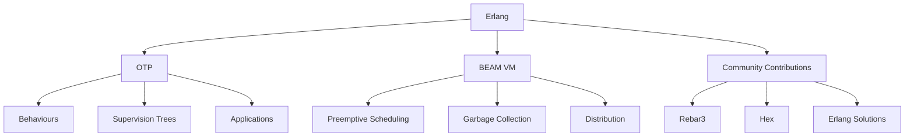

## 1.4 History of Erlang and Its Ecosystem

Erlang is a programming language with a rich history and a unique ecosystem that has significantly influenced the world of functional and concurrent programming. In this section, we will delve into the origins of Erlang, its evolution over the years, and its role in modern software development. We will also explore the Open Telecom Platform (OTP), the BEAM virtual machine, and the vibrant community that has grown around Erlang.

### Origins and Evolution of Erlang

Erlang was born out of necessity in the late 1980s at Ericsson, a Swedish telecommunications company. The company faced challenges in building reliable and scalable telecommunication systems. Traditional programming languages at the time were not well-suited for handling the concurrency and fault tolerance required in telecom applications. To address these challenges, a team led by Joe Armstrong, Robert Virding, and Mike Williams developed Erlang.

#### The Birth of Erlang

Erlang was designed with several key principles in mind:

- **Concurrency**: Erlang was built to handle thousands of concurrent processes efficiently. This was crucial for telecom systems that needed to manage numerous simultaneous connections.
- **Fault Tolerance**: The language embraced the "let it crash" philosophy, allowing systems to recover gracefully from errors.
- **Distributed Systems**: Erlang was designed to support distributed computing, enabling systems to run across multiple nodes.
- **Hot Code Swapping**: This feature allowed for updates to be made to a running system without downtime, a critical requirement for telecom applications.

Erlang's first major application was the AXD301 switch, which demonstrated the language's capabilities in a real-world setting. The success of this project led to Erlang's adoption within Ericsson and eventually its release as open-source software in 1998.

#### Key Milestones in Erlang's History

- **1986**: Erlang's development begins at Ericsson.
- **1991**: The first version of Erlang is released internally at Ericsson.
- **1998**: Erlang is released as open-source software, opening the door for wider adoption.
- **2006**: The release of Erlang/OTP R11B, which included significant improvements and optimizations.
- **2014**: WhatsApp, a messaging platform built on Erlang, is acquired by Facebook, showcasing Erlang's scalability and reliability.
- **2020**: Erlang celebrates its 20th anniversary as an open-source language, with a vibrant community and ecosystem.

### The Open Telecom Platform (OTP)

The Open Telecom Platform (OTP) is a collection of libraries and design principles that extend Erlang's capabilities. OTP provides a framework for building robust, fault-tolerant applications and is a cornerstone of the Erlang ecosystem.

#### Significance of OTP

OTP introduces several key components that are essential for building scalable applications:

- **Behaviours**: These are design patterns that encapsulate common programming tasks, such as servers (`gen_server`), state machines (`gen_statem`), and event handlers (`gen_event`).
- **Supervision Trees**: OTP provides a hierarchical structure for managing processes, allowing for automatic restarts and fault recovery.
- **Applications**: OTP applications are self-contained units of code that can be started, stopped, and configured independently.

OTP's design principles have been instrumental in Erlang's success, enabling developers to build complex systems with ease.

### The BEAM Virtual Machine

The BEAM virtual machine is the runtime environment for Erlang applications. It is responsible for executing Erlang code and managing processes, memory, and communication.

#### Role of the BEAM VM

The BEAM VM is designed to support Erlang's concurrency model, allowing for lightweight processes that can be created and managed efficiently. Key features of the BEAM VM include:

- **Preemptive Scheduling**: The VM uses a preemptive scheduler to ensure that all processes get a fair share of CPU time.
- **Garbage Collection**: BEAM employs a per-process garbage collector, minimizing pauses and ensuring smooth operation.
- **Distribution**: The VM supports distributed computing, allowing processes to communicate across nodes seamlessly.

The BEAM VM's architecture is a critical factor in Erlang's ability to handle large-scale, concurrent applications.

### Contributions to the Erlang Community

Over the years, the Erlang community has grown and contributed significantly to the language's development and ecosystem. Several key contributions include:

- **Rebar3**: A build tool that simplifies the management of Erlang projects and dependencies.
- **Hex**: A package manager for Erlang and Elixir, facilitating the sharing and distribution of libraries.
- **Erlang Solutions**: A company that provides support, training, and consulting services for Erlang projects.

The community has also organized conferences, such as the Erlang User Conference and Code BEAM, fostering collaboration and knowledge sharing.

### Companies and Projects Using Erlang

Erlang's unique features have made it a popular choice for companies and projects that require high concurrency and reliability. Some notable examples include:

- **WhatsApp**: The messaging platform uses Erlang to handle millions of concurrent connections with minimal hardware.
- **RabbitMQ**: A widely-used message broker built on Erlang, known for its robustness and scalability.
- **Riak**: A distributed database that leverages Erlang's fault tolerance and distribution capabilities.
- **Ericsson**: The company continues to use Erlang in its telecom products, benefiting from its reliability and performance.

These success stories highlight Erlang's strengths and its impact on modern software development.

### Visualizing Erlang's Ecosystem

To better understand Erlang's ecosystem, let's visualize its key components and their relationships using a Mermaid.js diagram.

**Diagram Description**: This diagram illustrates the core components of the Erlang ecosystem, including the OTP framework, the BEAM VM, and community contributions. Each component plays a vital role in Erlang's functionality and success.

### Summary

Erlang's history is a testament to its innovative design and the vision of its creators. From its origins at Ericsson to its role in modern software development, Erlang has proven to be a powerful tool for building reliable, concurrent systems. The Open Telecom Platform and the BEAM virtual machine are integral parts of Erlang's ecosystem, providing the foundation for its success. With a vibrant community and a track record of successful projects, Erlang continues to be a valuable asset in the world of functional programming.

### Embrace the Journey

As we explore Erlang's design patterns and capabilities, remember that this is just the beginning. The language's rich history and ecosystem offer endless opportunities for learning and growth. Keep experimenting, stay curious, and enjoy the journey!

## Quiz: History of Erlang and Its Ecosystem



### When was Erlang first released as open-source software?

- [ ] 1986
- [ ] 1991
- [x] 1998
- [ ] 2006

> **Explanation:** Erlang was released as open-source software in 1998, allowing for wider adoption and community contributions.

### What is the primary purpose of the BEAM virtual machine?

- [x] To execute Erlang code and manage processes
- [ ] To compile Erlang code to machine language
- [ ] To provide a graphical user interface for Erlang applications
- [ ] To store Erlang libraries and dependencies

> **Explanation:** The BEAM VM is responsible for executing Erlang code and managing processes, memory, and communication.

### Which company originally developed Erlang?

- [ ] WhatsApp
- [x] Ericsson
- [ ] Facebook
- [ ] RabbitMQ

> **Explanation:** Erlang was developed by Ericsson to address challenges in building reliable and scalable telecommunication systems.

### What is the "let it crash" philosophy in Erlang?

- [x] A design principle that allows systems to recover gracefully from errors
- [ ] A debugging technique for identifying crash causes
- [ ] A method for optimizing performance in Erlang applications
- [ ] A strategy for testing Erlang applications

> **Explanation:** The "let it crash" philosophy allows systems to recover gracefully from errors, enhancing fault tolerance.

### What is the role of OTP in Erlang?

- [x] To provide a framework for building robust, fault-tolerant applications
- [ ] To compile Erlang code to machine language
- [ ] To manage Erlang libraries and dependencies
- [ ] To provide a graphical user interface for Erlang applications

> **Explanation:** OTP is a collection of libraries and design principles that extend Erlang's capabilities for building robust applications.

### Which of the following is a key feature of the BEAM VM?

- [x] Preemptive Scheduling
- [ ] Static Typing
- [ ] Object-Oriented Programming
- [ ] Manual Memory Management

> **Explanation:** The BEAM VM uses preemptive scheduling to ensure that all processes get a fair share of CPU time.

### What is a supervision tree in OTP?

- [x] A hierarchical structure for managing processes and fault recovery
- [ ] A method for optimizing performance in Erlang applications
- [ ] A debugging tool for identifying process issues
- [ ] A strategy for testing Erlang applications

> **Explanation:** A supervision tree is a hierarchical structure in OTP for managing processes and ensuring fault recovery.

### Which messaging platform is built on Erlang?

- [ ] Facebook Messenger
- [x] WhatsApp
- [ ] Slack
- [ ] Telegram

> **Explanation:** WhatsApp is a messaging platform built on Erlang, known for its scalability and reliability.

### What is Rebar3 in the Erlang ecosystem?

- [x] A build tool for managing Erlang projects and dependencies
- [ ] A graphical user interface for Erlang applications
- [ ] A package manager for Erlang and Elixir
- [ ] A debugging tool for Erlang applications

> **Explanation:** Rebar3 is a build tool that simplifies the management of Erlang projects and dependencies.

### True or False: Erlang was designed to support distributed computing.

- [x] True
- [ ] False

> **Explanation:** Erlang was designed to support distributed computing, enabling systems to run across multiple nodes.


