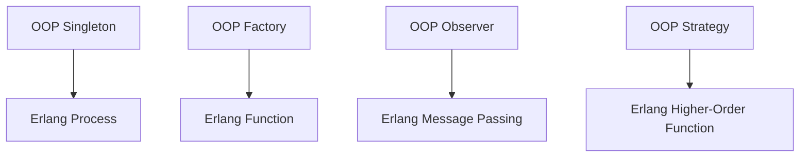

## 1.5 Comparing Object-Oriented and Functional Design Patterns

In the world of software development, design patterns serve as reusable solutions to common problems. While object-oriented programming (OOP) and functional programming (FP) both utilize design patterns, the way these patterns manifest can differ significantly due to the paradigms' inherent characteristics. In this section, we will explore these differences, focusing on how design patterns are adapted and transformed in Erlang's functional and concurrent programming environment.

### Fundamental Differences Between OOP and Functional Programming

To understand how design patterns differ between OOP and FP, we must first outline the core distinctions between these paradigms.

#### Object-Oriented Programming (OOP)

- **Encapsulation**: OOP encapsulates data and behavior within objects. This promotes modularity and reusability.
- **Inheritance**: Allows new classes to inherit properties and methods from existing ones, facilitating code reuse and polymorphism.
- **Polymorphism**: Enables objects to be treated as instances of their parent class, allowing for dynamic method invocation.
- **State Management**: Objects maintain state, which can change over time, leading to mutable data structures.

#### Functional Programming (FP)

- **Immutability**: FP emphasizes immutable data structures, reducing side effects and making code more predictable.
- **First-Class Functions**: Functions are treated as first-class citizens, allowing them to be passed as arguments, returned from other functions, and assigned to variables.
- **Higher-Order Functions**: Functions that take other functions as arguments or return them as results, enabling powerful abstractions.
- **Statelessness**: FP encourages stateless functions, which depend only on their input parameters and produce consistent outputs.

### Reinterpreting OOP Design Patterns in Erlang

Erlang, as a functional language, reinterprets many traditional OOP design patterns to fit its paradigm. Let's explore some of these adaptations.

#### Singleton Pattern

In OOP, the Singleton pattern ensures a class has only one instance and provides a global point of access to it. In Erlang, this pattern is often unnecessary due to the language's process model. Instead, a process can be used to maintain a single instance of a resource.

```erlang
-module(singleton).
-export([start_link/0, get_value/0, set_value/1]).

start_link() ->
    spawn(fun loop/0).

loop() ->
    receive
        {get, Caller} ->
            Caller ! {ok, self()},
            loop();
        {set, Value} ->
            loop_with_value(Value)
    end.

loop_with_value(Value) ->
    receive
        {get, Caller} ->
            Caller ! {ok, Value},
            loop_with_value(Value);
        {set, NewValue} ->
            loop_with_value(NewValue)
    end.

get_value() ->
    singleton ! {get, self()},
    receive
        {ok, Value} -> Value
    end.

set_value(Value) ->
    singleton ! {set, Value}.
```

**Explanation**: In this example, a process is used to maintain a single instance of a value, effectively acting as a singleton.

#### Factory Pattern

The Factory pattern in OOP is used to create objects without specifying the exact class of object that will be created. In Erlang, this can be achieved using functions that return different types of processes or data structures based on input parameters.

```erlang
-module(factory).
-export([create/1]).

create(Type) ->
    case Type of
        type1 -> spawn(fun() -> process_type1() end);
        type2 -> spawn(fun() -> process_type2() end)
    end.

process_type1() ->
    % Implementation for type1 process
    ok.

process_type2() ->
    % Implementation for type2 process
    ok.
```

**Explanation**: The `create/1` function acts as a factory, spawning different processes based on the input type.

### Patterns Unique to Functional Programming and Erlang

Functional programming introduces patterns that are unique to its paradigm, often leveraging immutability and higher-order functions.

#### Map-Reduce Pattern

The Map-Reduce pattern is a powerful tool for processing large data sets in parallel. It is inherently functional, as it involves mapping a function over a data set and then reducing the results.

```erlang
-module(map_reduce).
-export([map/2, reduce/2]).

map(Fun, List) ->
    [Fun(X) || X <- List].

reduce(Fun, List) ->
    lists:foldl(Fun, 0, List).
```

**Explanation**: The `map/2` function applies a given function to each element of a list, while `reduce/2` aggregates the results using a folding function.

#### Pipeline Pattern

The Pipeline pattern is a functional approach to chaining operations, where the output of one function becomes the input of the next.

```erlang
-module(pipeline).
-export([pipeline/2]).

pipeline(Data, Functions) ->
    lists:foldl(fun(F, Acc) -> F(Acc) end, Data, Functions).
```

**Explanation**: The `pipeline/2` function takes an initial data value and a list of functions, applying each function in sequence to transform the data.

### Implications of These Differences on Software Design

The differences between OOP and FP design patterns have significant implications for software design, particularly in Erlang.

- **Concurrency**: Erlang's process model and message-passing capabilities make it well-suited for concurrent applications, often simplifying patterns that involve shared state or synchronization in OOP.
- **Scalability**: Functional patterns, such as Map-Reduce, naturally lend themselves to parallel execution, enhancing scalability.
- **Maintainability**: Immutability and statelessness reduce side effects, making functional code easier to reason about and maintain.
- **Flexibility**: Higher-order functions and first-class functions provide powerful abstractions, enabling flexible and reusable code.

### Visualizing the Differences

To better understand these differences, let's visualize how some common design patterns are adapted from OOP to FP in Erlang.



**Diagram Description**: This diagram illustrates how traditional OOP patterns like Singleton, Factory, Observer, and Strategy are transformed into their functional equivalents in Erlang.

### Try It Yourself

Experiment with the provided code examples by modifying the functions or adding new patterns. For instance, try implementing a new process type in the Factory pattern or adding additional transformations in the Pipeline pattern.

### References and Links

- [Erlang Programming Language](https://www.erlang.org/)
- [Functional Programming Concepts](https://en.wikipedia.org/wiki/Functional_programming)
- [Object-Oriented Programming Concepts](https://en.wikipedia.org/wiki/Object-oriented_programming)

### Knowledge Check

- What are the key differences between OOP and FP?
- How does Erlang's process model influence design patterns?
- Can you identify a pattern unique to functional programming?

### Embrace the Journey

Remember, understanding design patterns in different paradigms is a journey. As you explore these concepts, you'll gain insights into how to leverage Erlang's strengths in building robust, scalable applications. Keep experimenting, stay curious, and enjoy the journey!

## Quiz: Comparing Object-Oriented and Functional Design Patterns



### What is a key characteristic of functional programming?

- [x] Immutability
- [ ] Encapsulation
- [ ] Inheritance
- [ ] Polymorphism

> **Explanation:** Functional programming emphasizes immutability, where data structures cannot be modified after creation.

### How is the Singleton pattern typically implemented in Erlang?

- [x] Using a process to maintain a single instance
- [ ] Using a global variable
- [ ] Using a class
- [ ] Using a module

> **Explanation:** In Erlang, a process can be used to maintain a single instance of a resource, effectively acting as a singleton.

### What is a higher-order function?

- [x] A function that takes other functions as arguments or returns them as results
- [ ] A function that is encapsulated within a class
- [ ] A function that inherits from another function
- [ ] A function that maintains state

> **Explanation:** Higher-order functions are a key feature of functional programming, allowing functions to be passed as arguments or returned as results.

### Which pattern is unique to functional programming?

- [x] Map-Reduce
- [ ] Singleton
- [ ] Factory
- [ ] Observer

> **Explanation:** The Map-Reduce pattern is unique to functional programming, leveraging parallel processing of data.

### What is the primary benefit of immutability in functional programming?

- [x] Reduces side effects and makes code more predictable
- [ ] Allows objects to maintain state
- [ ] Facilitates inheritance
- [ ] Enables polymorphism

> **Explanation:** Immutability reduces side effects, making functional code more predictable and easier to reason about.

### How does Erlang handle concurrency?

- [x] Through lightweight processes and message passing
- [ ] Through threads and locks
- [ ] Through global variables
- [ ] Through inheritance

> **Explanation:** Erlang uses lightweight processes and message passing to handle concurrency, avoiding the complexities of threads and locks.

### What is a pipeline pattern?

- [x] A pattern where the output of one function becomes the input of the next
- [ ] A pattern where functions are encapsulated within objects
- [ ] A pattern where functions inherit from each other
- [ ] A pattern where functions maintain state

> **Explanation:** The pipeline pattern involves chaining functions together, where the output of one function becomes the input of the next.

### How does Erlang's process model influence design patterns?

- [x] Simplifies patterns involving shared state or synchronization
- [ ] Complicates patterns involving shared state or synchronization
- [ ] Eliminates the need for design patterns
- [ ] Requires global variables for state management

> **Explanation:** Erlang's process model simplifies patterns involving shared state or synchronization, as processes are isolated and communicate via message passing.

### What is the benefit of higher-order functions?

- [x] They provide powerful abstractions and enable flexible code
- [ ] They encapsulate data within objects
- [ ] They facilitate inheritance
- [ ] They maintain state

> **Explanation:** Higher-order functions provide powerful abstractions, enabling flexible and reusable code.

### True or False: In Erlang, functions are first-class citizens.

- [x] True
- [ ] False

> **Explanation:** In Erlang, functions are first-class citizens, meaning they can be passed as arguments, returned from other functions, and assigned to variables.


