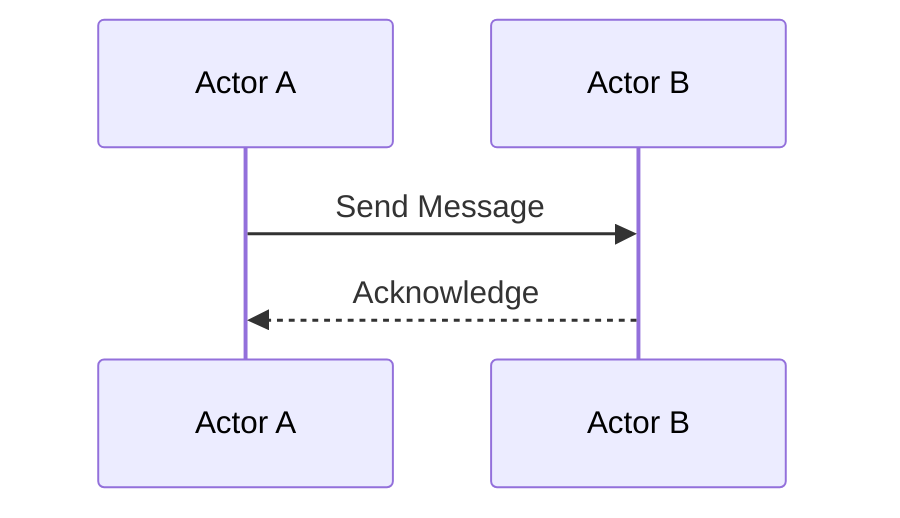
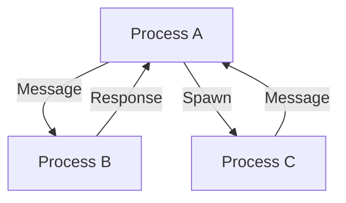

## 1.7 Overview of Erlang's Features Relevant to Design Patterns

Erlang is a powerful language designed for building robust, scalable, and fault-tolerant systems. Its unique features, rooted in functional programming and concurrent processing, significantly influence the way design patterns are implemented. In this section, we will explore these features, setting the stage for understanding how they impact the adaptation and application of design patterns in Erlang.

### Functional Programming in Erlang

Erlang is a functional programming language, which means it emphasizes immutability, higher-order functions, and pattern matching. These features are crucial for implementing design patterns in a way that leverages Erlang's strengths.

#### Immutability

In Erlang, data is immutable. Once a variable is bound to a value, it cannot be changed. This immutability simplifies reasoning about code, as there are no side effects from changing state. Immutability is particularly beneficial in concurrent environments, as it eliminates the need for locks or other synchronization mechanisms to manage shared state.

```erlang
% Example of immutability in Erlang
X = 5,
% Attempting to reassign X will result in an error
% X = 10. % This will cause a runtime error
```

#### Higher-Order Functions

Erlang treats functions as first-class citizens, allowing them to be passed as arguments, returned from other functions, and stored in data structures. This capability is essential for implementing patterns like Strategy or Command, where behavior can be encapsulated and passed around.

```erlang
% Example of a higher-order function
apply_function(F, X) -> F(X).

% Usage
Result = apply_function(fun(X) -> X * 2 end, 5).
% Result is 10
```

#### Pattern Matching

Pattern matching is a powerful feature in Erlang that allows for concise and expressive code. It is used extensively in function definitions, case expressions, and receive blocks. Pattern matching simplifies the implementation of patterns like Visitor or Interpreter, where different actions are taken based on the structure of data.

```erlang
% Example of pattern matching
factorial(0) -> 1;
factorial(N) when N > 0 -> N * factorial(N - 1).
```

### Concurrency in Erlang

Erlang's concurrency model is one of its most distinctive features, built around lightweight processes and asynchronous message passing. This model is a natural fit for implementing concurrent design patterns.

#### Lightweight Processes

Erlang processes are extremely lightweight, allowing thousands or even millions of them to run concurrently. Each process has its own memory and is managed by the BEAM virtual machine. This model supports patterns like the Actor Model, where each actor is an independent process.

```erlang
% Spawning a new process
Pid = spawn(fun() -> io:format("Hello from a new process!~n") end).
```

#### Asynchronous Message Passing

Processes in Erlang communicate through message passing, which is asynchronous and non-blocking. This mechanism is central to patterns like Observer or Publish/Subscribe, where processes need to notify others about changes without waiting for a response.

```erlang
% Sending and receiving messages
Pid ! {self(), "Hello"},
receive
    {Pid, Msg} -> io:format("Received message: ~p~n", [Msg])
end.
```

### The Actor Model

The Actor Model is a conceptual model for handling concurrency, where "actors" are the fundamental units of computation. In Erlang, each process can be seen as an actor that can send and receive messages, create new actors, and change its behavior based on received messages. This model simplifies the implementation of concurrent patterns by encapsulating state and behavior within actors.



### OTP (Open Telecom Platform)

OTP is a set of libraries and design principles for building applications in Erlang. It provides a framework for building robust systems with components like supervisors and generic servers.

#### Supervisors

Supervisors are processes that monitor other processes, known as workers. They implement fault-tolerance patterns by restarting failed processes according to a specified strategy. This approach aligns with the "Let It Crash" philosophy, where processes are allowed to fail and recover automatically.

```erlang
% Example of a simple supervisor
-module(simple_sup).
-behaviour(supervisor).

init([]) ->
    {ok, {{one_for_one, 5, 10},
          [{worker, {my_worker, start_link, []}, permanent, 5000, worker, [my_worker]}]}}.
```

#### Generic Servers (`gen_server`)

`gen_server` is a generic server behavior that abstracts the common patterns of a server process, such as handling requests, maintaining state, and managing timeouts. It simplifies the implementation of server-related patterns by providing a standard structure.

```erlang
% Example of a gen_server
-module(my_server).
-behaviour(gen_server).

init([]) -> {ok, #state{}}.

handle_call({get, Key}, _From, State) ->
    {reply, maps:get(Key, State), State}.
```

### Impact on Design Patterns

Erlang's features significantly influence the implementation of traditional design patterns. For instance, the Singleton pattern is often unnecessary due to Erlang's process model, where a single process can naturally act as a singleton. Similarly, patterns like Observer or Publish/Subscribe are straightforward to implement using message passing.

#### Example: Implementing the Observer Pattern

In Erlang, the Observer pattern can be implemented using processes and message passing. Observers are processes that register with a subject process to receive updates.

```erlang
% Subject process
subject() ->
    receive
        {register, Observer} ->
            % Add Observer to list
            subject();
        {notify, Message} ->
            % Notify all observers
            subject()
    end.

% Observer process
observer() ->
    receive
        {update, Message} ->
            io:format("Received update: ~p~n", [Message]),
            observer()
    end.
```

### Preparing for Subsequent Sections

Understanding Erlang's features is crucial for effectively applying design patterns. As we delve into specific patterns in later sections, we will see how these features enable or modify traditional patterns, providing unique solutions to common problems.

### Try It Yourself

Experiment with the code examples provided. Try modifying the `subject` and `observer` processes to handle different types of messages or to implement additional functionality. Consider how you might use pattern matching to simplify message handling.

### Visualizing Erlang's Concurrency Model



This diagram illustrates how processes in Erlang communicate through message passing, highlighting the asynchronous nature of interactions.

### Key Takeaways

- Erlang's functional programming features, such as immutability and higher-order functions, provide a solid foundation for implementing design patterns.
- The concurrency model, based on lightweight processes and message passing, is well-suited for concurrent patterns.
- The Actor Model and OTP components like supervisors and `gen_server` simplify the implementation of robust, fault-tolerant systems.
- Erlang's unique features often modify or eliminate the need for certain traditional design patterns.

## Quiz: Overview of Erlang's Features Relevant to Design Patterns



### Which feature of Erlang eliminates the need for locks in concurrent programming?

- [x] Immutability
- [ ] Pattern Matching
- [ ] Higher-Order Functions
- [ ] Supervisors

> **Explanation:** Immutability ensures that data cannot be changed, eliminating the need for locks to manage shared state.

### What is the primary communication mechanism between Erlang processes?

- [ ] Shared Memory
- [x] Message Passing
- [ ] Function Calls
- [ ] Global Variables

> **Explanation:** Erlang processes communicate through asynchronous message passing, which is central to its concurrency model.

### Which OTP component is responsible for monitoring and restarting processes?

- [ ] gen_server
- [x] Supervisor
- [ ] gen_event
- [ ] Application

> **Explanation:** Supervisors monitor worker processes and restart them according to a specified strategy.

### In Erlang, what is the role of pattern matching?

- [x] Simplifying code by matching data structures
- [ ] Managing process state
- [ ] Synchronizing processes
- [ ] Encrypting messages

> **Explanation:** Pattern matching allows for concise and expressive code by matching data structures directly.

### How does Erlang's process model relate to the Singleton pattern?

- [x] A single process can naturally act as a singleton
- [ ] Processes require explicit synchronization
- [ ] Processes cannot be used as singletons
- [ ] Singleton pattern is not applicable in Erlang

> **Explanation:** Erlang's process model allows a single process to act as a singleton, managing state and behavior.

### What is a key benefit of using higher-order functions in Erlang?

- [x] Encapsulating behavior for flexible code
- [ ] Managing process communication
- [ ] Simplifying pattern matching
- [ ] Reducing memory usage

> **Explanation:** Higher-order functions allow behavior to be encapsulated and passed around, enabling flexible code design.

### Which Erlang feature is central to implementing the Actor Model?

- [ ] Immutability
- [x] Lightweight Processes
- [ ] Pattern Matching
- [ ] Supervisors

> **Explanation:** Lightweight processes are central to the Actor Model, allowing each actor to be an independent process.

### What is the "Let It Crash" philosophy in Erlang?

- [x] Allowing processes to fail and recover automatically
- [ ] Preventing all process failures
- [ ] Using locks to manage state
- [ ] Avoiding process communication

> **Explanation:** The "Let It Crash" philosophy involves allowing processes to fail and recover automatically through supervision.

### Which feature of Erlang simplifies the implementation of the Observer pattern?

- [x] Asynchronous Message Passing
- [ ] Immutability
- [ ] Higher-Order Functions
- [ ] Pattern Matching

> **Explanation:** Asynchronous message passing allows processes to notify others about changes without waiting for a response.

### True or False: Erlang's concurrency model is based on shared memory.

- [ ] True
- [x] False

> **Explanation:** Erlang's concurrency model is based on message passing, not shared memory.



Remember, this is just the beginning. As you progress through this guide, you'll discover how Erlang's features enable the creation of robust, scalable applications. Keep experimenting, stay curious, and enjoy the journey!
