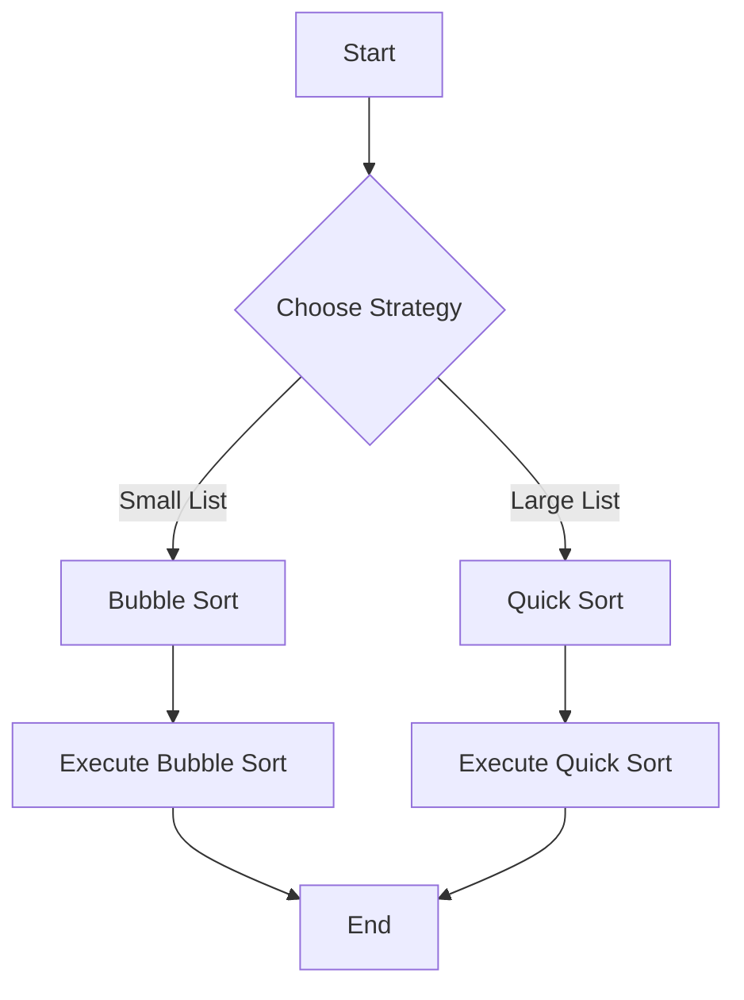

## 10.1 Strategy Pattern with Higher-Order Functions

In this section, we delve into the Strategy Pattern, a behavioral design pattern that enables selecting an algorithm's behavior at runtime. By leveraging Erlang's higher-order functions, we can encapsulate algorithms and dynamically choose among them, enhancing flexibility and decoupling in our code.

### Understanding the Strategy Pattern

#### Definition and Intent

The Strategy Pattern defines a family of algorithms, encapsulates each one, and makes them interchangeable. This pattern allows the algorithm to vary independently from clients that use it. The primary intent is to enable a client to choose an algorithm from a family of algorithms at runtime, promoting flexibility and reusability.

#### Key Participants

- **Context**: Maintains a reference to a Strategy object and is configured with a ConcreteStrategy object.
- **Strategy**: Declares an interface common to all supported algorithms.
- **ConcreteStrategy**: Implements the algorithm using the Strategy interface.

### Implementing the Strategy Pattern in Erlang

Erlang's functional nature and support for higher-order functions make it an ideal language for implementing the Strategy Pattern. Higher-order functions allow us to pass functions as arguments, return them as values, and store them in data structures, providing a powerful mechanism to encapsulate and switch between algorithms.

#### Higher-Order Functions in Erlang

Higher-order functions are functions that can take other functions as arguments or return them as results. This feature is central to implementing the Strategy Pattern in Erlang.

```erlang
% Define a higher-order function that takes a strategy function as an argument
-module(strategy_example).
-export([execute_strategy/2]).

execute_strategy(Strategy, Data) ->
    Strategy(Data).
```

In the above example, `execute_strategy/2` is a higher-order function that takes a `Strategy` function and `Data` as arguments, applying the strategy to the data.

#### Example: Sorting Algorithms

Let's consider a scenario where we need to sort a list of numbers. We can define multiple sorting algorithms and use the Strategy Pattern to select one at runtime.

```erlang
% Define different sorting strategies
-module(sorting_strategies).
-export([bubble_sort/1, quick_sort/1, execute_sort/2]).

% Bubble Sort Algorithm
bubble_sort(List) ->
    lists:sort(List).

% Quick Sort Algorithm
quick_sort([]) -> [];
quick_sort([Pivot | Rest]) ->
    quick_sort([X || X <- Rest, X < Pivot]) ++ [Pivot] ++ quick_sort([X || X <- Rest, X >= Pivot]).

% Execute the chosen sorting strategy
execute_sort(SortStrategy, List) ->
    SortStrategy(List).
```

In this example, `bubble_sort/1` and `quick_sort/1` are two different sorting strategies. The `execute_sort/2` function allows us to pass a sorting strategy and a list to sort, dynamically selecting the algorithm at runtime.

### Benefits of Using the Strategy Pattern

#### Flexibility

The Strategy Pattern provides the flexibility to change the algorithm used by a system at runtime. This is particularly useful in scenarios where the best algorithm to use depends on the context or input data.

#### Decoupling

By encapsulating algorithms in separate functions, the Strategy Pattern decouples the algorithm implementation from the client code. This separation of concerns makes the codebase easier to maintain and extend.

#### Reusability

Encapsulated strategies can be reused across different parts of an application or even in different projects, promoting code reuse and reducing duplication.

### Dynamic Strategy Selection

One of the key advantages of the Strategy Pattern is the ability to select strategies dynamically. Let's extend our sorting example to demonstrate this capability.

```erlang
% Dynamic strategy selection based on input
-module(dynamic_strategy).
-export([choose_sort_strategy/1, sort_numbers/2]).

% Choose a sorting strategy based on the list size
choose_sort_strategy(List) when length(List) < 10 ->
    fun sorting_strategies:bubble_sort/1;
choose_sort_strategy(_) ->
    fun sorting_strategies:quick_sort/1.

% Sort numbers using the chosen strategy
sort_numbers(List) ->
    Strategy = choose_sort_strategy(List),
    sorting_strategies:execute_sort(Strategy, List).
```

In this example, `choose_sort_strategy/1` selects a sorting strategy based on the size of the list. If the list is small, it uses `bubble_sort/1`; otherwise, it uses `quick_sort/1`. The `sort_numbers/2` function applies the chosen strategy to the list.

### Visualizing the Strategy Pattern

To better understand the Strategy Pattern, let's visualize the flow of selecting and executing a strategy using a flowchart.



**Figure 1**: Flowchart illustrating the dynamic selection of sorting strategies based on list size.

### Erlang-Specific Considerations

#### Immutability

Erlang's immutable data structures ensure that strategies do not inadvertently modify shared state, making it easier to reason about the behavior of different algorithms.

#### Concurrency

Erlang's lightweight processes can be leveraged to execute different strategies concurrently, enhancing performance in scenarios where multiple strategies need to be evaluated.

### Try It Yourself

Experiment with the provided code examples by modifying the sorting strategies or adding new ones. Try implementing additional algorithms, such as merge sort or insertion sort, and integrate them into the dynamic strategy selection process.

### Knowledge Check

- Explain how higher-order functions facilitate the implementation of the Strategy Pattern in Erlang.
- Describe a scenario where dynamically selecting an algorithm at runtime would be beneficial.
- Discuss the advantages of decoupling algorithms from client code.

### Summary

The Strategy Pattern, when combined with Erlang's higher-order functions, provides a powerful mechanism for dynamically selecting algorithms at runtime. This approach enhances flexibility, decouples code, and promotes reusability, making it an essential tool in the functional programmer's toolkit.

## Quiz: Strategy Pattern with Higher-Order Functions



### What is the primary intent of the Strategy Pattern?

- [x] To enable selecting an algorithm from a family of algorithms at runtime
- [ ] To encapsulate data structures
- [ ] To provide a single interface for multiple classes
- [ ] To manage object creation

> **Explanation:** The Strategy Pattern allows the algorithm to vary independently from clients that use it, enabling runtime selection.

### How does Erlang's immutability benefit the Strategy Pattern?

- [x] It prevents strategies from modifying shared state
- [ ] It allows for faster execution of strategies
- [ ] It simplifies the syntax of strategy functions
- [ ] It enables dynamic loading of strategies

> **Explanation:** Immutability ensures that strategies do not inadvertently modify shared state, making it easier to reason about their behavior.

### Which Erlang feature is central to implementing the Strategy Pattern?

- [x] Higher-order functions
- [ ] Pattern matching
- [ ] Recursion
- [ ] Process linking

> **Explanation:** Higher-order functions allow passing functions as arguments, which is central to implementing the Strategy Pattern.

### What is a key benefit of using the Strategy Pattern?

- [x] Flexibility in changing algorithms at runtime
- [ ] Reduced memory usage
- [ ] Simplified error handling
- [ ] Enhanced security

> **Explanation:** The Strategy Pattern provides flexibility by allowing the algorithm to be changed at runtime.

### In the provided example, how is the sorting strategy selected?

- [x] Based on the size of the list
- [ ] Based on the type of data
- [ ] Based on user input
- [ ] Randomly

> **Explanation:** The sorting strategy is selected based on the size of the list, with different strategies for small and large lists.

### What is the role of the `execute_strategy/2` function?

- [x] To apply the chosen strategy to the data
- [ ] To define a new strategy
- [ ] To modify the input data
- [ ] To log the execution of the strategy

> **Explanation:** The `execute_strategy/2` function applies the chosen strategy to the provided data.

### Which of the following is a benefit of decoupling algorithms from client code?

- [x] Easier maintenance and extension
- [ ] Faster execution
- [ ] Reduced code size
- [ ] Improved security

> **Explanation:** Decoupling algorithms from client code makes the codebase easier to maintain and extend.

### What is a higher-order function?

- [x] A function that takes other functions as arguments or returns them as results
- [ ] A function that operates on high-level data structures
- [ ] A function that is defined at a higher scope
- [ ] A function that is executed at a higher priority

> **Explanation:** Higher-order functions can take other functions as arguments or return them as results, enabling dynamic behavior.

### True or False: The Strategy Pattern can only be used with sorting algorithms.

- [ ] True
- [x] False

> **Explanation:** The Strategy Pattern can be used with any family of algorithms, not just sorting algorithms.

### Which of the following is NOT a participant in the Strategy Pattern?

- [ ] Context
- [ ] Strategy
- [ ] ConcreteStrategy
- [x] Observer

> **Explanation:** The Observer is not a participant in the Strategy Pattern; it is part of the Observer Pattern.



Remember, this is just the beginning. As you progress, you'll build more complex and interactive applications using the Strategy Pattern. Keep experimenting, stay curious, and enjoy the journey!
