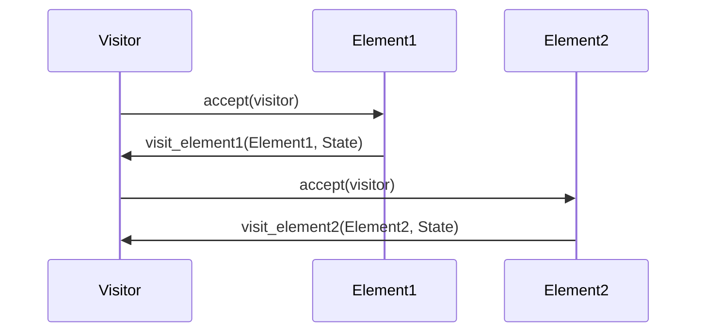

## 10.10 Visitor Pattern via Behaviors

The Visitor Pattern is a behavioral design pattern that allows you to separate algorithms from the objects on which they operate. This separation is particularly useful in Erlang, where behaviors can be leveraged to define operations that can be performed on elements of an object structure without modifying the elements themselves. This section will guide you through understanding the Visitor Pattern, implementing it using Erlang behaviors, and exploring its benefits in functional and concurrent programming.

### Understanding the Visitor Pattern

**Definition**: The Visitor Pattern allows you to add new operations to existing object structures without modifying the structures. It achieves this by defining a new visitor class that implements a set of operations for each class of objects in the structure.

**Intent**: The primary intent of the Visitor Pattern is to separate an algorithm from the object structure it operates on, allowing you to add new operations without changing the classes of the elements on which it operates.

**Key Participants**:
- **Visitor**: An interface or abstract class that declares a visit operation for each type of element in the object structure.
- **ConcreteVisitor**: Implements the operations defined in the Visitor interface.
- **Element**: An interface or abstract class that declares an accept operation that takes a visitor as an argument.
- **ConcreteElement**: Implements the accept operation, which calls the appropriate visit operation on the visitor.

### Implementing Visitor Pattern in Erlang

In Erlang, behaviors can be used to implement the Visitor Pattern by defining a set of callback functions that represent the operations to be performed on each element type.

#### Step-by-Step Implementation

1. **Define the Visitor Behavior**: Create a behavior module that specifies the callback functions for each element type.

```erlang
-module(visitor_behavior).
-behavior(gen_server).

-export([visit_element1/2, visit_element2/2]).

-callback visit_element1(Element, State) -> any().
-callback visit_element2(Element, State) -> any().
```

2. **Implement Concrete Visitors**: Create modules that implement the visitor behavior, defining the operations for each element type.

```erlang
-module(concrete_visitor).
-behavior(visitor_behavior).

-export([visit_element1/2, visit_element2/2]).

visit_element1(Element, State) ->
    io:format("Visiting Element1: ~p with state ~p~n", [Element, State]),
    State.

visit_element2(Element, State) ->
    io:format("Visiting Element2: ~p with state ~p~n", [Element, State]),
    State.
```

3. **Define Elements**: Create modules for each element type that implement an `accept` function, which takes a visitor as an argument.

```erlang
-module(element1).

-export([accept/2]).

accept(Visitor, State) ->
    Visitor:visit_element1(?MODULE, State).
```

```erlang
-module(element2).

-export([accept/2]).

accept(Visitor, State) ->
    Visitor:visit_element2(?MODULE, State).
```

4. **Use the Visitor**: Create a function that traverses the object structure and applies the visitor to each element.

```erlang
-module(visitor_example).

-export([run/0]).

run() ->
    Elements = [element1, element2],
    Visitor = concrete_visitor,
    lists:foreach(fun(Element) -> Element:accept(Visitor, #{}) end, Elements).
```

### Benefits of Using the Visitor Pattern

- **Separation of Concerns**: By separating the algorithm from the object structure, you can add new operations without modifying the existing structure.
- **Open/Closed Principle**: The Visitor Pattern adheres to the open/closed principle, allowing you to extend functionality without altering existing code.
- **Flexibility**: New operations can be added easily by creating new visitor classes.
- **Maintainability**: Changes to operations are localized to the visitor classes, making the codebase easier to maintain.

### Visualizing the Visitor Pattern

To better understand the Visitor Pattern, let's visualize the interaction between visitors and elements using a sequence diagram.



**Diagram Description**: The sequence diagram illustrates how the visitor interacts with different elements. The `accept` method on each element calls the corresponding `visit` method on the visitor, passing itself as an argument.

### Try It Yourself

Encourage experimentation by modifying the code examples. Try adding a new element type and a corresponding visit operation in the visitor behavior. Observe how easily you can extend the functionality without altering the existing elements.

### Design Considerations

- **When to Use**: Use the Visitor Pattern when you need to perform operations on a complex object structure and want to keep the operations separate from the object structure.
- **Pitfalls**: Be cautious of the pattern's complexity when the object structure is highly dynamic or when new element types are frequently added.

### Erlang Unique Features

Erlang's functional nature and support for behaviors make it particularly well-suited for implementing the Visitor Pattern. The use of behaviors allows for clear separation of operations and object structures, enhancing code clarity and maintainability.

### Differences and Similarities

The Visitor Pattern is often confused with the Strategy Pattern. While both patterns involve encapsulating algorithms, the Visitor Pattern is specifically designed for operations on object structures, whereas the Strategy Pattern focuses on interchangeable algorithms.

### Knowledge Check

- **Question**: What is the primary intent of the Visitor Pattern?
- **Question**: How do behaviors facilitate the implementation of the Visitor Pattern in Erlang?
- **Question**: What are the benefits of separating algorithms from object structures?

### Conclusion

The Visitor Pattern, when implemented using Erlang behaviors, provides a powerful mechanism for separating operations from object structures. This separation enhances flexibility, maintainability, and adherence to the open/closed principle. As you continue your journey in Erlang programming, remember to leverage the Visitor Pattern to create robust and scalable applications.

## Quiz: Visitor Pattern via Behaviors



### What is the primary intent of the Visitor Pattern?

- [x] To separate algorithms from the object structures they operate on
- [ ] To encapsulate object creation logic
- [ ] To provide a way to access the elements of an aggregate object sequentially
- [ ] To define a family of algorithms, encapsulate each one, and make them interchangeable

> **Explanation:** The Visitor Pattern's primary intent is to separate algorithms from the object structures they operate on, allowing new operations to be added without modifying the structures.

### How do behaviors facilitate the implementation of the Visitor Pattern in Erlang?

- [x] By defining a set of callback functions for operations on each element type
- [ ] By providing a way to encapsulate object creation logic
- [ ] By allowing objects to be composed into tree structures
- [ ] By enabling objects to change their behavior when their internal state changes

> **Explanation:** Behaviors in Erlang facilitate the Visitor Pattern by defining a set of callback functions that represent operations for each element type, allowing separation of algorithms from object structures.

### What is a key benefit of using the Visitor Pattern?

- [x] It allows new operations to be added without modifying existing object structures
- [ ] It simplifies object creation
- [ ] It enables objects to change their behavior based on their state
- [ ] It provides a way to access the elements of an aggregate object sequentially

> **Explanation:** A key benefit of the Visitor Pattern is that it allows new operations to be added without modifying existing object structures, adhering to the open/closed principle.

### Which of the following is a participant in the Visitor Pattern?

- [x] Visitor
- [ ] Singleton
- [ ] Factory
- [ ] Proxy

> **Explanation:** The Visitor is a participant in the Visitor Pattern, responsible for defining operations on elements of an object structure.

### What is the role of the `accept` method in the Visitor Pattern?

- [x] To allow an element to accept a visitor and call the appropriate visit method
- [ ] To create a new instance of an object
- [ ] To provide a way to access elements of an aggregate object
- [ ] To encapsulate a request as an object

> **Explanation:** The `accept` method in the Visitor Pattern allows an element to accept a visitor and call the appropriate visit method, facilitating the separation of operations from object structures.

### In Erlang, how can you define operations for each element type in the Visitor Pattern?

- [x] By using behaviors to define callback functions
- [ ] By using gen_server processes
- [ ] By using ETS tables
- [ ] By using list comprehensions

> **Explanation:** In Erlang, behaviors can be used to define callback functions that represent operations for each element type in the Visitor Pattern.

### What is a potential pitfall of the Visitor Pattern?

- [x] Increased complexity when the object structure is highly dynamic
- [ ] Difficulty in creating new instances of objects
- [ ] Limited flexibility in changing object behavior
- [ ] Lack of support for concurrent operations

> **Explanation:** A potential pitfall of the Visitor Pattern is increased complexity when the object structure is highly dynamic or when new element types are frequently added.

### Which pattern is often confused with the Visitor Pattern?

- [x] Strategy Pattern
- [ ] Singleton Pattern
- [ ] Factory Pattern
- [ ] Observer Pattern

> **Explanation:** The Visitor Pattern is often confused with the Strategy Pattern, as both involve encapsulating algorithms, but they serve different purposes.

### What is a unique feature of Erlang that makes it well-suited for the Visitor Pattern?

- [x] Support for behaviors
- [ ] Object-oriented programming
- [ ] Dynamic typing
- [ ] Built-in support for inheritance

> **Explanation:** Erlang's support for behaviors makes it well-suited for the Visitor Pattern, allowing for clear separation of operations and object structures.

### True or False: The Visitor Pattern allows you to modify existing object structures to add new operations.

- [ ] True
- [x] False

> **Explanation:** False. The Visitor Pattern allows you to add new operations without modifying existing object structures, adhering to the open/closed principle.



Remember, this is just the beginning of your journey with the Visitor Pattern in Erlang. As you progress, you'll discover more ways to leverage this pattern to build flexible and maintainable applications. Keep experimenting, stay curious, and enjoy the journey!
