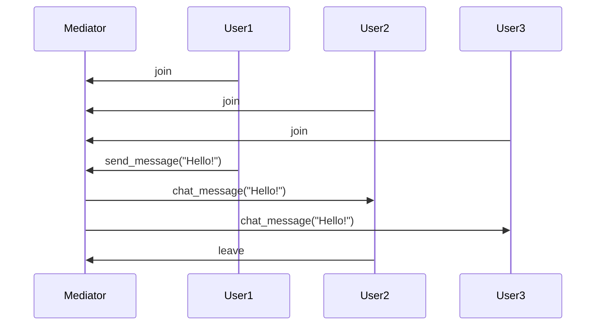

## 10.11 Mediator Pattern with Central Process Coordination

In this section, we delve into the Mediator Pattern, a behavioral design pattern that facilitates communication between different components in a system by introducing a central mediator. This pattern is particularly useful in Erlang, where processes are the fundamental units of concurrency. By employing a mediator, we can reduce the direct dependencies between processes, leading to a more modular and maintainable system.

### Understanding the Mediator Pattern

The Mediator Pattern is a design pattern that defines an object (the mediator) that encapsulates how a set of objects interact. Instead of objects communicating directly with each other, they communicate through the mediator. This reduces the dependencies between communicating objects, promoting loose coupling and enhancing flexibility.

#### Intent

The primary intent of the Mediator Pattern is to centralize complex communications and control logic between objects in a system. By doing so, it simplifies the interactions and dependencies between objects, making the system easier to manage and extend.

#### Key Participants

- **Mediator**: The central process that coordinates communication between other processes.
- **Colleague Processes**: The processes that interact with each other through the mediator.

### Mediator Pattern in Erlang

In Erlang, the Mediator Pattern can be implemented using a central process that acts as the mediator. This process manages communication between other processes, ensuring that they do not need to be aware of each other's existence. This approach is particularly beneficial in systems where processes need to coordinate complex interactions or share state.

#### Erlang Unique Features

Erlang's concurrency model, based on lightweight processes and message passing, naturally lends itself to the implementation of the Mediator Pattern. The language's robust error handling and "let it crash" philosophy further enhance the pattern's effectiveness by allowing the mediator to manage process failures gracefully.

### Implementing the Mediator Pattern in Erlang

Let's explore how to implement the Mediator Pattern in Erlang with a practical example. We'll create a simple chat room application where the mediator process manages communication between user processes.

#### Sample Code Snippet

```erlang
-module(chat_mediator).
-export([start/0, join/2, send_message/2, leave/1]).

% Start the mediator process
start() ->
    spawn(fun() -> mediator_loop([]) end).

% Join a user to the chat room
join(MediatorPid, UserPid) ->
    MediatorPid ! {join, UserPid}.

% Send a message from a user
send_message(MediatorPid, Message) ->
    MediatorPid ! {message, self(), Message}.

% Leave the chat room
leave(MediatorPid) ->
    MediatorPid ! {leave, self()}.

% Mediator process loop
mediator_loop(Users) ->
    receive
        {join, UserPid} ->
            NewUsers = [UserPid | Users],
            mediator_loop(NewUsers);
        {leave, UserPid} ->
            NewUsers = lists:delete(UserPid, Users),
            mediator_loop(NewUsers);
        {message, FromPid, Message} ->
            io:format("User ~p sent: ~s~n", [FromPid, Message]),
            lists:foreach(fun(UserPid) ->
                UserPid ! {chat_message, FromPid, Message}
            end, Users),
            mediator_loop(Users)
    end.
```

#### Explanation

- **Mediator Process**: The `mediator_loop/1` function acts as the mediator, maintaining a list of user processes and handling messages to join, leave, or send messages.
- **Joining and Leaving**: Users can join or leave the chat room by sending messages to the mediator process.
- **Message Broadcasting**: When a user sends a message, the mediator broadcasts it to all other users.

### Visualizing the Mediator Pattern

Below is a diagram illustrating the interaction between the mediator and user processes:



**Diagram Description**: This sequence diagram shows how users join the chat room, send messages, and leave, with the mediator coordinating all interactions.

### Benefits of the Mediator Pattern

- **Reduced Coupling**: Processes do not need to know about each other, reducing dependencies and making the system more modular.
- **Centralized Control**: The mediator centralizes communication logic, simplifying the management of complex interactions.
- **Scalability**: New processes can be added without affecting existing ones, as they only need to communicate with the mediator.

### Use Cases for the Mediator Pattern

The Mediator Pattern is well-suited for scenarios where multiple processes need to coordinate their actions without being tightly coupled. Some common use cases include:

- **Chat Rooms**: As demonstrated in the example, chat rooms can use a mediator to manage user interactions.
- **Collaborative Editing**: In applications where multiple users edit a document simultaneously, a mediator can coordinate changes and updates.
- **Event Systems**: Systems that need to manage events from multiple sources can use a mediator to centralize event handling.

### Design Considerations

When implementing the Mediator Pattern, consider the following:

- **Performance**: The mediator can become a bottleneck if it handles too many processes or messages. Consider load balancing or distributing the mediator's responsibilities if necessary.
- **Fault Tolerance**: Ensure the mediator can handle process failures gracefully, possibly by restarting failed processes or redistributing tasks.
- **Complexity**: While the mediator simplifies process interactions, it can also introduce complexity in the mediator's logic. Keep the mediator's responsibilities focused and well-defined.

### Differences and Similarities with Other Patterns

The Mediator Pattern is often compared to the Observer Pattern. While both patterns centralize communication, the Mediator Pattern involves direct communication through a central process, whereas the Observer Pattern involves notifying observers of changes.

### Try It Yourself

To gain a deeper understanding of the Mediator Pattern, try modifying the chat room example:

- **Add User Names**: Modify the code to include user names in messages.
- **Private Messages**: Implement a feature to send private messages between users.
- **User List**: Add functionality to list all users currently in the chat room.

### Conclusion

The Mediator Pattern is a powerful tool for managing process interactions in Erlang. By centralizing communication through a mediator process, we can reduce coupling, enhance scalability, and simplify the management of complex systems. As you continue to explore Erlang's concurrency model, consider how the Mediator Pattern can be applied to your projects to improve modularity and maintainability.

## Quiz: Mediator Pattern with Central Process Coordination



### What is the primary intent of the Mediator Pattern?

- [x] To centralize complex communications and control logic between objects.
- [ ] To create a one-to-one communication channel between objects.
- [ ] To increase the coupling between objects.
- [ ] To replace all direct communication between objects with indirect communication.

> **Explanation:** The Mediator Pattern centralizes communication and control logic, reducing dependencies and simplifying interactions.

### In Erlang, what is the mediator in the Mediator Pattern typically implemented as?

- [x] A central process.
- [ ] A module.
- [ ] A function.
- [ ] A record.

> **Explanation:** In Erlang, the mediator is typically implemented as a central process that manages communication between other processes.

### Which of the following is a benefit of using the Mediator Pattern?

- [x] Reduced coupling between processes.
- [ ] Increased complexity in process interactions.
- [ ] Direct communication between all processes.
- [ ] Dependency on a single process for all logic.

> **Explanation:** The Mediator Pattern reduces coupling by centralizing communication, making the system more modular.

### What is a potential drawback of the Mediator Pattern?

- [x] The mediator can become a bottleneck.
- [ ] It increases the number of direct dependencies.
- [ ] It eliminates the need for communication between processes.
- [ ] It simplifies all aspects of process interaction.

> **Explanation:** The mediator can become a bottleneck if it handles too many processes or messages.

### In the provided chat room example, what does the `mediator_loop/1` function do?

- [x] Acts as the mediator, maintaining a list of user processes and handling messages.
- [ ] Sends messages directly between users.
- [ ] Manages user authentication.
- [ ] Handles network communication.

> **Explanation:** The `mediator_loop/1` function acts as the mediator, maintaining a list of user processes and handling messages.

### How does the Mediator Pattern enhance scalability?

- [x] By allowing new processes to be added without affecting existing ones.
- [ ] By increasing the number of direct dependencies.
- [ ] By requiring all processes to communicate directly.
- [ ] By eliminating the need for a central process.

> **Explanation:** The Mediator Pattern enhances scalability by allowing new processes to be added without affecting existing ones, as they only need to communicate with the mediator.

### Which of the following is a common use case for the Mediator Pattern?

- [x] Chat rooms.
- [ ] Direct file access.
- [ ] Single-threaded applications.
- [ ] Static web pages.

> **Explanation:** Chat rooms are a common use case for the Mediator Pattern, where the mediator manages user interactions.

### What is a key difference between the Mediator and Observer Patterns?

- [x] The Mediator Pattern involves direct communication through a central process, while the Observer Pattern involves notifying observers of changes.
- [ ] The Mediator Pattern increases coupling, while the Observer Pattern reduces it.
- [ ] The Mediator Pattern is used for static data, while the Observer Pattern is used for dynamic data.
- [ ] The Mediator Pattern is only applicable to single-threaded applications.

> **Explanation:** The Mediator Pattern involves direct communication through a central process, while the Observer Pattern involves notifying observers of changes.

### What is the role of the `join/2` function in the chat room example?

- [x] It allows a user to join the chat room by sending a message to the mediator.
- [ ] It sends a message directly to another user.
- [ ] It removes a user from the chat room.
- [ ] It broadcasts a message to all users.

> **Explanation:** The `join/2` function allows a user to join the chat room by sending a message to the mediator.

### True or False: The Mediator Pattern eliminates the need for communication between processes.

- [ ] True
- [x] False

> **Explanation:** False. The Mediator Pattern does not eliminate communication but centralizes it through a mediator process.



Remember, the journey of mastering design patterns in Erlang is ongoing. Keep experimenting, stay curious, and enjoy the process of building robust and scalable applications!
