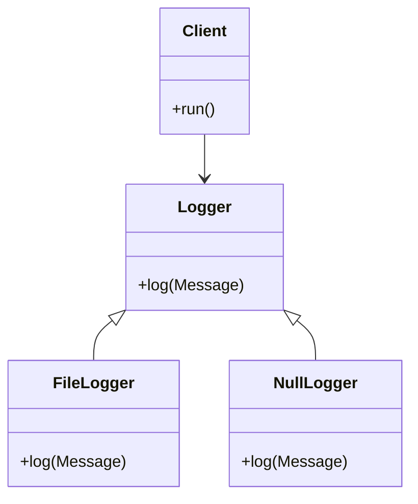

## 10.12 Null Object Pattern with Default Implementations

In this section, we delve into the Null Object Pattern, a behavioral design pattern that provides a way to handle null references by using default implementations. This pattern is particularly useful in Erlang, where functional programming and concurrency models can benefit from reducing error handling and null checks.

### Understanding the Null Object Pattern

The Null Object Pattern is a design pattern that uses an object with a defined neutral behavior as a substitute for a null reference. This object, known as the "Null Object," implements the same interface as the real object but performs no operation or returns a default value. The primary goal is to eliminate the need for null checks and simplify code by providing a default behavior.

#### Intent

- **Avoid Null Checks**: Reduce the need for explicit null checks in your code.
- **Simplify Error Handling**: Provide a default behavior that prevents errors from propagating.
- **Enhance Code Readability**: Make code more readable and maintainable by removing conditional logic related to null handling.

### Key Participants

- **Abstract Object**: Defines the interface or abstract class that both the real object and the null object implement.
- **Real Object**: The actual object that performs the intended operations.
- **Null Object**: A default implementation that performs no operation or returns a default value.

### Applicability

Use the Null Object Pattern when:

- You want to avoid null checks and simplify error handling.
- You have a well-defined default behavior that can be used in place of a null reference.
- You want to enhance code readability and maintainability.

### Sample Code Snippet

Let's explore how to implement the Null Object Pattern in Erlang using a simple example. We'll create a logging system where the logger can either log messages to a file or do nothing (null object).

```erlang
-module(logger).
-export([log/1]).

% Define the interface
-behaviour(logger).

% Real Object: File Logger
-module(file_logger).
-behaviour(logger).
-export([log/1]).

log(Message) ->
    % Simulate logging to a file
    io:format("Logging to file: ~s~n", [Message]).

% Null Object: No Operation Logger
-module(null_logger).
-behaviour(logger).
-export([log/1]).

log(_Message) ->
    % Do nothing
    ok.

% Client Code
-module(client).
-export([run/0]).

run() ->
    % Use the real logger
    Logger1 = file_logger,
    Logger1:log("This is a log message."),

    % Use the null logger
    Logger2 = null_logger,
    Logger2:log("This message will not be logged.").
```

### Design Considerations

- **When to Use**: Use the Null Object Pattern when you have a clear default behavior that can replace null checks.
- **Avoid Overuse**: Do not overuse this pattern as it can lead to hidden errors if the null behavior is not well-defined.
- **Performance**: Consider the performance implications of using null objects, especially in high-performance systems.

### Erlang Unique Features

Erlang's functional programming paradigm and concurrency model make it well-suited for the Null Object Pattern. The use of processes and message passing allows for clean separation of concerns and simplifies the implementation of default behaviors.

### Differences and Similarities

The Null Object Pattern is similar to other patterns that provide default behavior, such as the Strategy Pattern. However, it is distinct in that it specifically targets null references and provides a neutral behavior.

### Visualizing the Null Object Pattern

To better understand the Null Object Pattern, let's visualize the interaction between the real object, null object, and client code.



**Diagram Description**: This class diagram illustrates the relationship between the `Logger` interface, `FileLogger` (real object), `NullLogger` (null object), and the `Client` that uses them.

### Try It Yourself

Experiment with the code example by modifying the `log/1` function in the `null_logger` module to print a message instead of doing nothing. Observe how this changes the behavior of the client code.

### References and Links

- [Erlang Documentation](https://www.erlang.org/docs)
- [Functional Programming Concepts](https://en.wikipedia.org/wiki/Functional_programming)
- [Design Patterns: Elements of Reusable Object-Oriented Software](https://en.wikipedia.org/wiki/Design_Patterns)

### Knowledge Check

- How does the Null Object Pattern simplify error handling?
- What are the key participants in the Null Object Pattern?
- When is it appropriate to use the Null Object Pattern?

### Embrace the Journey

Remember, the Null Object Pattern is just one of many tools in your design pattern toolkit. As you continue to explore Erlang and its powerful features, you'll discover new ways to build robust and scalable applications. Keep experimenting, stay curious, and enjoy the journey!

## Quiz: Null Object Pattern with Default Implementations



### What is the primary goal of the Null Object Pattern?

- [x] To eliminate the need for null checks and simplify code
- [ ] To enhance performance by reducing memory usage
- [ ] To provide a complex error handling mechanism
- [ ] To replace all objects with null objects

> **Explanation:** The primary goal of the Null Object Pattern is to eliminate the need for null checks and simplify code by providing a default behavior.

### Which of the following is a key participant in the Null Object Pattern?

- [x] Null Object
- [ ] Singleton
- [ ] Factory
- [ ] Adapter

> **Explanation:** The Null Object is a key participant in the Null Object Pattern, providing a default implementation that performs no operation.

### When should you use the Null Object Pattern?

- [x] When you want to avoid null checks and simplify error handling
- [ ] When you need to enhance performance
- [ ] When you want to increase code complexity
- [ ] When you need to implement a caching mechanism

> **Explanation:** Use the Null Object Pattern when you want to avoid null checks and simplify error handling by providing a default behavior.

### What is a potential pitfall of the Null Object Pattern?

- [x] Hidden errors if the null behavior is not well-defined
- [ ] Increased memory usage
- [ ] Decreased code readability
- [ ] Complex implementation

> **Explanation:** A potential pitfall of the Null Object Pattern is hidden errors if the null behavior is not well-defined.

### How does Erlang's functional programming paradigm benefit the Null Object Pattern?

- [x] It allows for clean separation of concerns and simplifies implementation
- [ ] It increases the complexity of the pattern
- [ ] It reduces the flexibility of the pattern
- [ ] It makes the pattern less efficient

> **Explanation:** Erlang's functional programming paradigm allows for clean separation of concerns and simplifies the implementation of default behaviors.

### What is the role of the `NullLogger` in the provided code example?

- [x] To provide a default implementation that does nothing
- [ ] To log messages to a file
- [ ] To handle errors in the logging process
- [ ] To replace the `FileLogger`

> **Explanation:** The `NullLogger` provides a default implementation that does nothing, serving as a null object.

### How can you modify the `null_logger` module to change its behavior?

- [x] By altering the `log/1` function to print a message
- [ ] By adding new functions to the module
- [ ] By changing the module name
- [ ] By importing another module

> **Explanation:** You can modify the `null_logger` module by altering the `log/1` function to print a message instead of doing nothing.

### What is the benefit of using a class diagram to visualize the Null Object Pattern?

- [x] It helps illustrate the relationship between objects and interfaces
- [ ] It increases the complexity of understanding the pattern
- [ ] It provides a detailed implementation guide
- [ ] It replaces the need for code examples

> **Explanation:** A class diagram helps illustrate the relationship between objects and interfaces, making it easier to understand the Null Object Pattern.

### True or False: The Null Object Pattern is only applicable in object-oriented programming.

- [ ] True
- [x] False

> **Explanation:** False. The Null Object Pattern can be applied in functional programming languages like Erlang, where it provides default implementations to avoid null checks.

### What is a common similarity between the Null Object Pattern and the Strategy Pattern?

- [x] Both provide default behavior
- [ ] Both are used for caching mechanisms
- [ ] Both enhance performance
- [ ] Both are used for error handling

> **Explanation:** Both the Null Object Pattern and the Strategy Pattern provide default behavior, although they serve different purposes.


