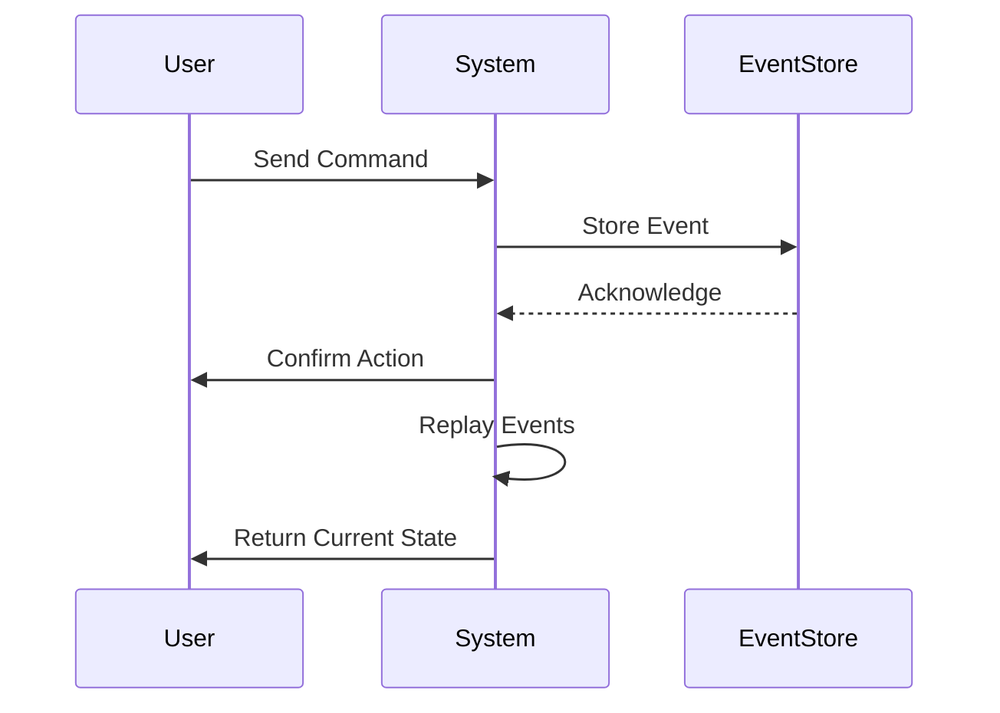

## 10.14 Event Sourcing Pattern in Erlang

In this section, we delve into the Event Sourcing pattern, a powerful design approach that captures all changes to an application's state as a sequence of events. This pattern is particularly useful in Erlang due to its functional and concurrent nature, which aligns well with the principles of event-driven architectures.

### What is Event Sourcing?

Event Sourcing is a design pattern where state changes in an application are stored as a sequence of events. Instead of storing the current state of an entity, we store a history of events that have led to the current state. This approach provides a complete audit trail and allows us to reconstruct past states by replaying the events.

#### Key Concepts

- **Event**: A record of a state change. Each event is immutable and represents a specific change in the system.
- **Event Store**: A database or storage system where events are persisted.
- **Event Replay**: The process of reconstructing the current state by replaying stored events.
- **Command**: An action that triggers an event. Commands are not stored but are used to generate events.

### Why Use Event Sourcing in Erlang?

Erlang's strengths in handling concurrency and its functional programming paradigm make it an ideal choice for implementing event sourcing. The language's immutable data structures and message-passing capabilities align well with the principles of event-driven systems.

#### Benefits

- **Auditability**: Every change is recorded, providing a complete history of state changes.
- **Scalability**: Event sourcing can be scaled horizontally by distributing events across multiple nodes.
- **Flexibility**: Allows for easy integration with other systems and supports complex business logic.

### Implementing Event Sourcing in Erlang

Let's explore how to implement the Event Sourcing pattern in Erlang, focusing on recording and replaying events, event storage, and handling.

#### Recording Events

To record events, we need to define a structure for our events and a mechanism to persist them. Here's a simple example of an event structure in Erlang:

```erlang
-record(event, {id, type, data, timestamp}).

% Function to create a new event
create_event(Type, Data) ->
    #event{id = erlang:unique_integer([monotonic, positive]),
           type = Type,
           data = Data,
           timestamp = erlang:system_time()}.
```

In this example, each event has a unique ID, a type, data associated with the event, and a timestamp.

#### Storing Events

Events can be stored in various ways, such as using a database or an in-memory storage system like ETS (Erlang Term Storage). Here's an example of storing events using ETS:

```erlang
% Create an ETS table for storing events
ets:new(events_table, [named_table, {keypos, 1}, set]).

% Function to store an event
store_event(Event) ->
    ets:insert(events_table, Event).
```

#### Replaying Events

Replaying events involves retrieving stored events and applying them to reconstruct the current state. Here's an example of how to replay events:

```erlang
% Function to replay events and reconstruct state
replay_events() ->
    Events = ets:tab2list(events_table),
    lists:foldl(fun apply_event/2, initial_state(), Events).

% Function to apply an event to the current state
apply_event(#event{type = Type, data = Data}, State) ->
    case Type of
        create -> create_entity(Data, State);
        update -> update_entity(Data, State);
        delete -> delete_entity(Data, State)
    end.
```

In this example, `apply_event/2` is a function that applies an event to the current state based on the event type.

### Considerations for Consistency and Scaling

When implementing event sourcing, it's important to consider consistency and scaling. Here are some key points to keep in mind:

#### Consistency

- **Eventual Consistency**: Event sourcing systems are often eventually consistent. Ensure that your application can handle eventual consistency and provide mechanisms for resolving conflicts.
- **Idempotency**: Ensure that event handlers are idempotent, meaning they can be applied multiple times without changing the result.

#### Scaling

- **Partitioning**: Distribute events across multiple nodes or partitions to improve scalability. Use consistent hashing or other partitioning strategies.
- **Replication**: Use replication to ensure high availability and fault tolerance. Erlang's distributed nature makes it well-suited for replicating events across nodes.

### Erlang Unique Features

Erlang's unique features, such as lightweight processes and message passing, make it particularly well-suited for implementing event sourcing. The language's ability to handle large numbers of concurrent processes allows for efficient event handling and processing.

### Differences and Similarities with Other Patterns

Event Sourcing is often used in conjunction with the Command Query Responsibility Segregation (CQRS) pattern, which separates read and write operations. While both patterns can be used independently, they complement each other well in event-driven architectures.

### Sample Code Snippet

Here's a complete example of implementing a simple event sourcing system in Erlang:

```erlang
-module(event_sourcing).
-export([start/0, create_event/2, store_event/1, replay_events/0]).

-record(event, {id, type, data, timestamp}).

start() ->
    ets:new(events_table, [named_table, {keypos, 1}, set]).

create_event(Type, Data) ->
    #event{id = erlang:unique_integer([monotonic, positive]),
           type = Type,
           data = Data,
           timestamp = erlang:system_time()}.

store_event(Event) ->
    ets:insert(events_table, Event).

replay_events() ->
    Events = ets:tab2list(events_table),
    lists:foldl(fun apply_event/2, initial_state(), Events).

apply_event(#event{type = Type, data = Data}, State) ->
    case Type of
        create -> create_entity(Data, State);
        update -> update_entity(Data, State);
        delete -> delete_entity(Data, State)
    end.

initial_state() ->
    % Define the initial state of your application
    [].

create_entity(Data, State) ->
    % Logic to create an entity
    [Data | State].

update_entity(Data, State) ->
    % Logic to update an entity
    lists:keyreplace(id, 1, State, Data).

delete_entity(Data, State) ->
    % Logic to delete an entity
    lists:keydelete(id, 1, State).
```

### Try It Yourself

Experiment with the code example by adding new event types or modifying the event handling logic. Try implementing additional features such as event filtering or snapshotting to improve performance.

### Visualizing Event Sourcing

To better understand the flow of events in an event sourcing system, let's visualize the process using a sequence diagram:



This diagram illustrates the interaction between a user, the system, and the event store. The user sends a command, which the system processes and stores as an event. The system can then replay events to reconstruct the current state.

### Knowledge Check

- **What is the primary benefit of using Event Sourcing?**
- **How does Erlang's concurrency model support event sourcing?**
- **What are some considerations for scaling an event sourcing system?**

### Embrace the Journey

Remember, implementing event sourcing is just the beginning. As you progress, you'll discover more ways to leverage this pattern to build robust and scalable systems. Keep experimenting, stay curious, and enjoy the journey!

## Quiz: Event Sourcing Pattern in Erlang



### What is the primary benefit of using Event Sourcing?

- [x] Provides a complete audit trail of state changes
- [ ] Simplifies database schema design
- [ ] Reduces the need for testing
- [ ] Eliminates the need for backups

> **Explanation:** Event Sourcing captures all changes to application state as events, providing a complete history and audit trail.

### How does Erlang's concurrency model support event sourcing?

- [x] By efficiently handling large numbers of concurrent processes
- [ ] By simplifying database transactions
- [ ] By reducing code complexity
- [ ] By eliminating the need for event storage

> **Explanation:** Erlang's lightweight processes and message-passing capabilities make it well-suited for handling concurrent event processing.

### What is a key consideration for consistency in event sourcing?

- [x] Ensuring event handlers are idempotent
- [ ] Using complex database schemas
- [ ] Avoiding eventual consistency
- [ ] Storing events in multiple formats

> **Explanation:** Idempotency ensures that event handlers can be applied multiple times without changing the result, which is crucial for consistency.

### What is the role of an Event Store in event sourcing?

- [x] To persist events for later replay
- [ ] To execute commands
- [ ] To generate events
- [ ] To manage user sessions

> **Explanation:** The Event Store is responsible for persisting events, allowing the system to replay them to reconstruct the current state.

### How can event sourcing improve scalability?

- [x] By distributing events across multiple nodes
- [ ] By reducing the number of database queries
- [ ] By simplifying code logic
- [ ] By eliminating the need for load balancing

> **Explanation:** Event sourcing can be scaled horizontally by distributing events across multiple nodes, improving scalability.

### What is a potential challenge of using event sourcing?

- [x] Handling eventual consistency
- [ ] Simplifying code logic
- [ ] Reducing storage requirements
- [ ] Eliminating the need for backups

> **Explanation:** Event sourcing systems are often eventually consistent, requiring mechanisms to handle and resolve conflicts.

### What is the purpose of replaying events in event sourcing?

- [x] To reconstruct the current state
- [ ] To generate new events
- [ ] To execute commands
- [ ] To manage user sessions

> **Explanation:** Replaying events allows the system to reconstruct the current state by applying stored events in sequence.

### What is a common pattern used alongside event sourcing?

- [x] Command Query Responsibility Segregation (CQRS)
- [ ] Model-View-Controller (MVC)
- [ ] Singleton Pattern
- [ ] Factory Pattern

> **Explanation:** CQRS is often used alongside event sourcing to separate read and write operations, complementing the event-driven architecture.

### What is an important feature of events in event sourcing?

- [x] Immutability
- [ ] Complexity
- [ ] Volatility
- [ ] Redundancy

> **Explanation:** Events are immutable records of state changes, ensuring that the history of changes remains consistent and reliable.

### True or False: Event Sourcing eliminates the need for backups.

- [ ] True
- [x] False

> **Explanation:** While event sourcing provides a complete history of state changes, backups are still necessary for disaster recovery and data integrity.


