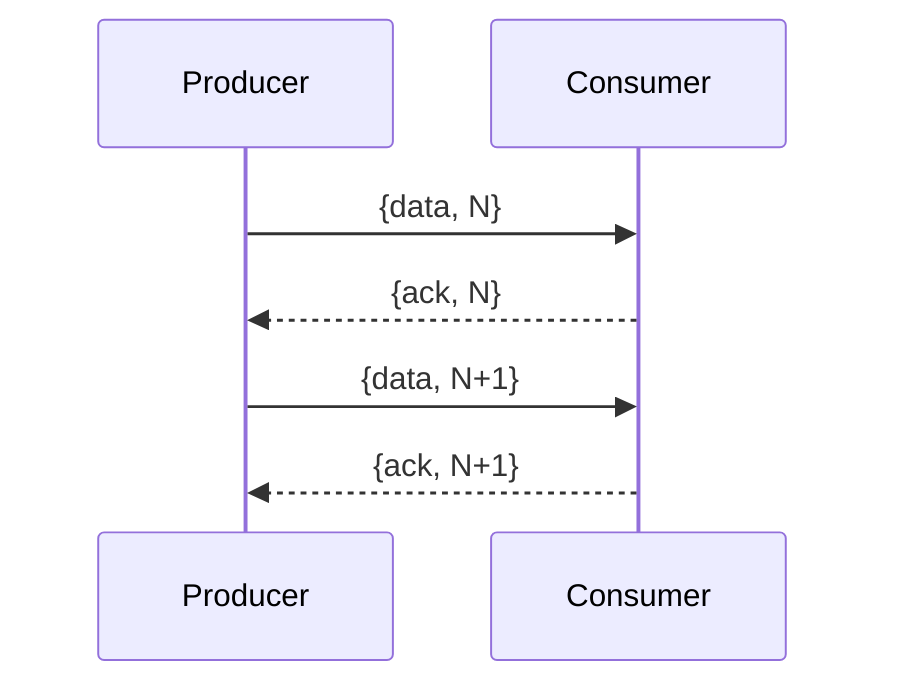

## 10.15 Implementing Reactive Programming Concepts

Reactive programming is a programming paradigm oriented around data flows and the propagation of change. This approach is particularly useful for building responsive and resilient systems, where the system can react to changes in its environment or internal state in a timely manner. In this section, we will explore how to implement reactive programming concepts in Erlang, leveraging its powerful concurrency model to build systems that are both responsive and resilient.

### Introduction to Reactive Programming

Reactive programming is based on the idea of asynchronous data streams and the propagation of change. It allows developers to express static or dynamic data flows with ease, and automatically propagate changes through the data flow. The key principles of reactive programming include:

- **Responsive**: The system should respond in a timely manner to user interactions or other external events.
- **Resilient**: The system should remain responsive in the face of failure.
- **Elastic**: The system should adapt to changes in the workload.
- **Message Driven**: The system should rely on asynchronous message-passing to establish a boundary between components.

### Erlang's Concurrency Model and Reactive Systems

Erlang's concurrency model is based on lightweight processes and message passing, making it an ideal platform for implementing reactive systems. Each Erlang process is isolated and communicates with other processes through message passing, which aligns well with the reactive programming paradigm.

#### Key Features of Erlang's Concurrency Model

- **Lightweight Processes**: Erlang processes are lightweight and can be created in large numbers, allowing for highly concurrent systems.
- **Message Passing**: Processes communicate through asynchronous message passing, which is a core concept in reactive programming.
- **Fault Tolerance**: Erlang's "let it crash" philosophy and supervision trees provide a robust mechanism for building resilient systems.

### Implementing Reactive Streams in Erlang

Reactive streams are a key concept in reactive programming, representing a sequence of data elements made available over time. In Erlang, we can implement reactive streams using processes and message passing.

#### Example: Basic Reactive Stream

Let's start by implementing a simple reactive stream in Erlang. We'll create a producer process that generates data and a consumer process that reacts to the data.

```erlang
-module(reactive_stream).
-export([start/0, producer/1, consumer/0]).

start() ->
    ProducerPid = spawn(?MODULE, producer, [self()]),
    spawn(?MODULE, consumer, [ProducerPid]).

producer(ConsumerPid) ->
    lists:foreach(fun(N) ->
        io:format("Producing: ~p~n", [N]),
        ConsumerPid ! {data, N},
        timer:sleep(1000)
    end, lists:seq(1, 10)).

consumer(ProducerPid) ->
    receive
        {data, N} ->
            io:format("Consuming: ~p~n", [N]),
            consumer(ProducerPid)
    end.
```

In this example, the `producer/1` function generates numbers from 1 to 10 and sends them to the consumer process. The `consumer/0` function receives the data and prints it.

#### Key Points

- **Asynchronous Communication**: The producer and consumer communicate asynchronously through message passing.
- **Decoupling**: The producer and consumer are decoupled, allowing them to operate independently.

### Using Libraries for Reactive Programming

While it's possible to implement reactive programming concepts from scratch in Erlang, using libraries can simplify the process and provide additional functionality. One such library is [Reactive Erlang](https://github.com/yrashk/reactive), which provides tools for building reactive systems in Erlang.

#### Example: Using Reactive Erlang

Let's explore how to use the Reactive Erlang library to implement a reactive stream.

```erlang
%% Assuming Reactive Erlang is included in your project
-module(reactive_example).
-export([start/0]).

start() ->
    {ok, Stream} = reactive:new_stream(),
    reactive:subscribe(Stream, fun(Data) ->
        io:format("Received: ~p~n", [Data])
    end),
    reactive:emit(Stream, 1),
    reactive:emit(Stream, 2),
    reactive:emit(Stream, 3).
```

In this example, we create a new reactive stream using the `reactive:new_stream/0` function. We then subscribe to the stream with a callback function that prints the received data. Finally, we emit data into the stream using the `reactive:emit/2` function.

### Designing Reactive Systems in Erlang

When designing reactive systems in Erlang, it's important to consider the following design principles:

- **Decoupling**: Keep components decoupled to allow for independent scaling and failure handling.
- **Backpressure**: Implement mechanisms to handle backpressure, ensuring that the system remains responsive under load.
- **Fault Tolerance**: Use Erlang's supervision trees to build fault-tolerant systems.

#### Example: Handling Backpressure

Backpressure is a mechanism for controlling the flow of data between producers and consumers. In Erlang, we can implement backpressure by using message queues and flow control.

```erlang
-module(backpressure_example).
-export([start/0, producer/1, consumer/0]).

start() ->
    ProducerPid = spawn(?MODULE, producer, [self()]),
    spawn(?MODULE, consumer, [ProducerPid]).

producer(ConsumerPid) ->
    lists:foreach(fun(N) ->
        io:format("Producing: ~p~n", [N]),
        ConsumerPid ! {data, N},
        receive
            {ack, N} ->
                ok
        after 5000 ->
            io:format("Consumer not responding, dropping: ~p~n", [N])
        end
    end, lists:seq(1, 10)).

consumer(ProducerPid) ->
    receive
        {data, N} ->
            io:format("Consuming: ~p~n", [N]),
            ProducerPid ! {ack, N},
            consumer(ProducerPid)
    end.
```

In this example, the producer waits for an acknowledgment from the consumer before sending the next piece of data. If the consumer doesn't respond within 5 seconds, the producer drops the data.

### Visualizing Reactive Systems

To better understand the flow of data in a reactive system, let's visualize the interaction between producers and consumers using a sequence diagram.



This diagram illustrates the message-passing interaction between the producer and consumer, highlighting the acknowledgment mechanism for backpressure.

### Key Takeaways

- **Reactive Programming**: A paradigm focused on asynchronous data streams and change propagation.
- **Erlang's Concurrency Model**: Ideal for implementing reactive systems due to lightweight processes and message passing.
- **Reactive Streams**: Implemented using processes and message passing in Erlang.
- **Libraries**: Tools like Reactive Erlang simplify the implementation of reactive systems.
- **Design Principles**: Decoupling, backpressure, and fault tolerance are key considerations.

### Try It Yourself

Experiment with the provided code examples by modifying the data generation rate or adding additional consumers. Observe how the system behaves under different conditions and consider implementing additional features like error handling or logging.

### References and Further Reading

- [Reactive Programming](https://en.wikipedia.org/wiki/Reactive_programming) on Wikipedia
- [Reactive Erlang](https://github.com/yrashk/reactive) GitHub repository
- [Erlang's Concurrency Model](https://erlang.org/doc/reference_manual/processes.html) in the Erlang documentation

## Quiz: Implementing Reactive Programming Concepts



### What is a key principle of reactive programming?

- [x] Asynchronous data streams
- [ ] Synchronous data processing
- [ ] Single-threaded execution
- [ ] Blocking I/O operations

> **Explanation:** Reactive programming is based on asynchronous data streams and the propagation of change.

### How does Erlang's concurrency model support reactive systems?

- [x] Through lightweight processes and message passing
- [ ] By using shared memory and locks
- [ ] By enforcing synchronous communication
- [ ] By limiting the number of processes

> **Explanation:** Erlang's concurrency model uses lightweight processes and message passing, which aligns well with reactive programming.

### What is a reactive stream?

- [x] A sequence of data elements available over time
- [ ] A static data structure
- [ ] A synchronous data pipeline
- [ ] A blocking I/O operation

> **Explanation:** A reactive stream represents a sequence of data elements made available over time.

### What is backpressure in reactive systems?

- [x] A mechanism for controlling data flow between producers and consumers
- [ ] A method for increasing data throughput
- [ ] A technique for reducing latency
- [ ] A way to synchronize processes

> **Explanation:** Backpressure is a mechanism for controlling the flow of data between producers and consumers to maintain system responsiveness.

### Which library can be used for reactive programming in Erlang?

- [x] Reactive Erlang
- [ ] OTP
- [ ] Cowboy
- [ ] EUnit

> **Explanation:** Reactive Erlang is a library that provides tools for building reactive systems in Erlang.

### What is the purpose of the `ack` message in the backpressure example?

- [x] To acknowledge receipt of data and control flow
- [ ] To initiate a new data stream
- [ ] To terminate the data stream
- [ ] To synchronize processes

> **Explanation:** The `ack` message is used to acknowledge receipt of data and control the flow between producer and consumer.

### What does the "let it crash" philosophy in Erlang promote?

- [x] Building fault-tolerant systems by allowing processes to fail and recover
- [ ] Preventing any process from crashing
- [ ] Using shared memory for error handling
- [ ] Avoiding process communication

> **Explanation:** The "let it crash" philosophy promotes building fault-tolerant systems by allowing processes to fail and recover through supervision.

### How can reactive streams be implemented in Erlang?

- [x] Using processes and message passing
- [ ] By using shared memory
- [ ] By enforcing synchronous communication
- [ ] By limiting the number of processes

> **Explanation:** Reactive streams can be implemented in Erlang using processes and message passing.

### What is a key benefit of using reactive programming?

- [x] Building responsive and resilient systems
- [ ] Increasing code complexity
- [ ] Reducing system responsiveness
- [ ] Limiting scalability

> **Explanation:** Reactive programming helps build responsive and resilient systems by focusing on asynchronous data flows.

### True or False: Erlang's lightweight processes make it unsuitable for reactive programming.

- [ ] True
- [x] False

> **Explanation:** Erlang's lightweight processes make it highly suitable for reactive programming, as they support high concurrency and message passing.



Remember, this is just the beginning. As you progress, you'll build more complex and interactive systems using reactive programming concepts in Erlang. Keep experimenting, stay curious, and enjoy the journey!
