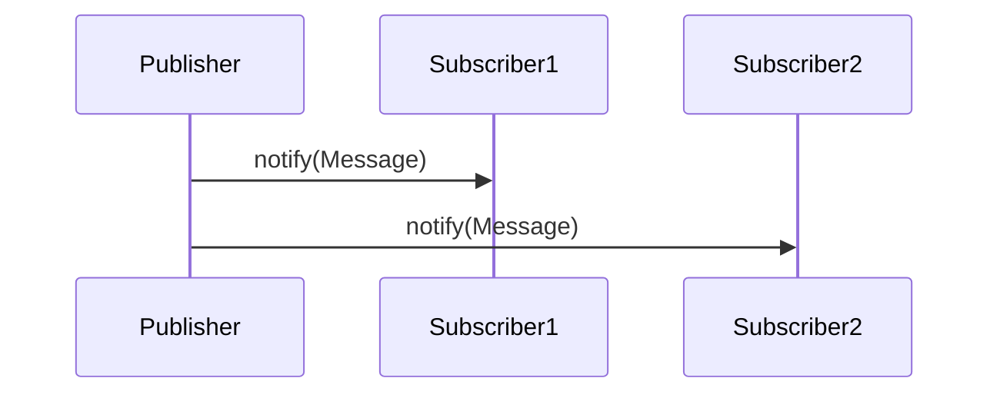

## 10.2 Observer Pattern with Publish/Subscribe

The Observer pattern is a fundamental design pattern used to establish a one-to-many dependency between objects. When one object changes state, all its dependents are notified and updated automatically. In Erlang, this pattern is often implemented using a publish/subscribe mechanism, which is well-suited for the language's concurrent and distributed nature.

### Understanding the Observer Pattern

**Intent**: The Observer pattern defines a subscription mechanism to allow multiple objects to listen and react to events or changes in another object. This pattern is particularly useful for implementing distributed event handling systems.

**Key Participants**:
- **Subject**: The entity that holds the state and sends notifications to observers.
- **Observer**: The entity that receives updates from the subject.
- **ConcreteSubject**: A specific implementation of the subject.
- **ConcreteObserver**: A specific implementation of the observer.

### Implementing Observer Pattern in Erlang

In Erlang, the Observer pattern can be effectively implemented using the publish/subscribe model. This model allows processes to subscribe to specific events and receive notifications when those events occur. Erlang's concurrency model, based on lightweight processes, makes it an ideal language for implementing such patterns.

#### Using `pg2` for Publish/Subscribe

`pg2` is a built-in Erlang module that provides process group management, which can be used to implement a simple publish/subscribe system.

```erlang
-module(observer_pg2).
-export([start/0, subscribe/1, unsubscribe/1, publish/1]).

start() ->
    pg2:create(my_topic).

subscribe(Pid) ->
    pg2:join(my_topic, Pid).

unsubscribe(Pid) ->
    pg2:leave(my_topic, Pid).

publish(Message) ->
    Members = pg2:get_members(my_topic),
    lists:foreach(fun(Pid) -> Pid ! {notify, Message} end, Members).
```

**Explanation**:
- **`start/0`**: Initializes a new topic for subscription.
- **`subscribe/1`**: Allows a process to subscribe to the topic.
- **`unsubscribe/1`**: Allows a process to unsubscribe from the topic.
- **`publish/1`**: Sends a message to all subscribed processes.

#### Using `gproc` for Enhanced Functionality

[gproc](https://github.com/uwiger/gproc) is a third-party library that extends the capabilities of process registry and can be used to implement more advanced publish/subscribe systems.

```erlang
-module(observer_gproc).
-export([start/0, subscribe/1, unsubscribe/1, publish/1]).

start() ->
    gproc:start_link().

subscribe(Event) ->
    gproc:reg({p, l, {my_topic, Event}}).

unsubscribe(Event) ->
    gproc:unreg({p, l, {my_topic, Event}}).

publish(Event, Message) ->
    gproc:send({p, l, {my_topic, Event}}, {notify, Message}).
```

**Explanation**:
- **`start/0`**: Starts the `gproc` process.
- **`subscribe/1`**: Registers a process to listen for a specific event.
- **`unsubscribe/1`**: Unregisters a process from a specific event.
- **`publish/1`**: Sends a message to all processes registered for a specific event.

### Use Cases for Observer Pattern

1. **Event Propagation**: The Observer pattern is ideal for propagating events across different parts of a system. For example, in a chat application, when a user sends a message, all other users in the chat room should receive it.

2. **Decoupled Communication**: By using the Observer pattern, components of a system can communicate without being tightly coupled. This decoupling enhances modularity and maintainability.

3. **Real-Time Updates**: Systems that require real-time updates, such as stock tickers or live sports scores, can benefit from the Observer pattern to push updates to subscribers as soon as they occur.

### Visualizing the Observer Pattern

To better understand the flow of the Observer pattern in Erlang, let's visualize it using a sequence diagram.



**Diagram Explanation**: The diagram illustrates a publisher sending a notification message to two subscribers. Each subscriber receives the message independently, demonstrating the decoupled nature of the Observer pattern.

### Design Considerations

- **Scalability**: Ensure that the publish/subscribe system can handle a large number of subscribers and high-frequency updates.
- **Fault Tolerance**: Implement mechanisms to handle failures in subscribers without affecting the entire system.
- **Performance**: Optimize message passing to minimize latency and resource usage.

### Erlang Unique Features

Erlang's lightweight processes and message-passing capabilities make it particularly well-suited for implementing the Observer pattern. The language's built-in support for concurrency and distribution allows for efficient and scalable publish/subscribe systems.

### Differences and Similarities

The Observer pattern is often confused with the Mediator pattern. While both involve communication between components, the Mediator pattern centralizes communication through a single mediator, whereas the Observer pattern allows direct communication between subjects and observers.

### Try It Yourself

Experiment with the provided code examples by modifying the message content or adding more subscribers. Observe how the system behaves with different numbers of subscribers and message frequencies.

### Knowledge Check

- What are the key components of the Observer pattern?
- How does the publish/subscribe model enhance decoupled communication?
- What are some potential pitfalls when implementing the Observer pattern in Erlang?

### Summary

The Observer pattern, implemented via publish/subscribe mechanisms, is a powerful tool for building scalable and decoupled systems in Erlang. By leveraging Erlang's concurrency model, developers can create efficient systems that propagate events and updates in real-time.

## Quiz: Observer Pattern with Publish/Subscribe



### What is the primary purpose of the Observer pattern?

- [x] To establish a one-to-many dependency between objects
- [ ] To centralize communication through a single mediator
- [ ] To create a one-to-one relationship between objects
- [ ] To manage state transitions in a system

> **Explanation:** The Observer pattern is designed to establish a one-to-many dependency, allowing multiple objects to listen and react to changes in another object.

### Which Erlang module is used for process group management in a publish/subscribe system?

- [x] pg2
- [ ] gen_server
- [ ] supervisor
- [ ] ets

> **Explanation:** The `pg2` module in Erlang is used for managing process groups, which can be utilized to implement a publish/subscribe system.

### What is a key advantage of using the publish/subscribe model?

- [x] Decoupled communication between components
- [ ] Centralized control of message flow
- [ ] Direct communication between all components
- [ ] Reduced number of processes

> **Explanation:** The publish/subscribe model allows for decoupled communication, meaning components can interact without being tightly coupled, enhancing modularity.

### Which library provides enhanced functionality for process registry in Erlang?

- [x] gproc
- [ ] rebar3
- [ ] observer
- [ ] dialyzer

> **Explanation:** `gproc` is a third-party library that extends the capabilities of process registry in Erlang, allowing for more advanced publish/subscribe systems.

### In the Observer pattern, what role does the "Subject" play?

- [x] Holds the state and sends notifications to observers
- [ ] Receives updates from other objects
- [ ] Manages the lifecycle of processes
- [ ] Handles error recovery

> **Explanation:** The "Subject" in the Observer pattern is responsible for holding the state and notifying observers of any changes.

### What is a common use case for the Observer pattern?

- [x] Real-time updates in applications
- [ ] Managing database transactions
- [ ] Handling user authentication
- [ ] Performing batch processing

> **Explanation:** The Observer pattern is commonly used for real-time updates, such as in stock tickers or live sports scores, where subscribers need immediate notifications.

### How does Erlang's concurrency model benefit the Observer pattern?

- [x] By allowing efficient message passing between lightweight processes
- [ ] By centralizing all communication through a single process
- [ ] By reducing the number of processes needed
- [ ] By simplifying error handling

> **Explanation:** Erlang's concurrency model, based on lightweight processes and message passing, is ideal for implementing the Observer pattern efficiently.

### What is a potential pitfall when implementing the Observer pattern?

- [x] Handling failures in subscribers without affecting the system
- [ ] Ensuring all components are tightly coupled
- [ ] Reducing the number of subscribers
- [ ] Centralizing all communication

> **Explanation:** One potential pitfall is ensuring that failures in subscribers do not affect the entire system, which requires careful design and fault tolerance.

### What is the role of the "Observer" in the Observer pattern?

- [x] Receives updates from the subject
- [ ] Manages the state of the subject
- [ ] Coordinates communication between components
- [ ] Handles error recovery

> **Explanation:** The "Observer" in the Observer pattern is responsible for receiving updates from the subject and reacting accordingly.

### True or False: The Observer pattern and Mediator pattern are the same.

- [ ] True
- [x] False

> **Explanation:** The Observer pattern and Mediator pattern are different. The Observer pattern involves direct communication between subjects and observers, while the Mediator pattern centralizes communication through a mediator.



Remember, this is just the beginning. As you progress, you'll build more complex and interactive systems using the Observer pattern in Erlang. Keep experimenting, stay curious, and enjoy the journey!
