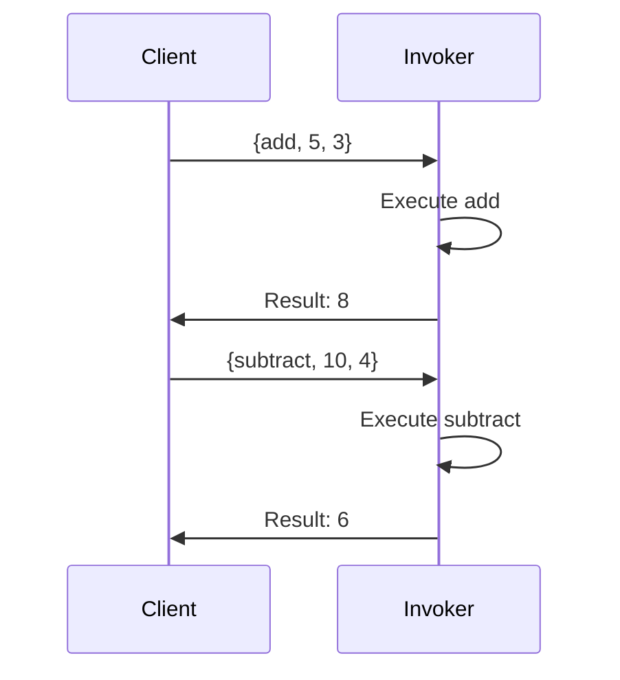

## 10.3 Command Pattern via Message Passing

In this section, we delve into the Command Pattern, a behavioral design pattern that encapsulates requests as objects, allowing for parameterization of clients with queues, requests, and operations. In Erlang, this pattern is particularly powerful due to its inherent support for message passing and concurrency. We will explore how to implement the Command Pattern using message passing, demonstrating its utility in building flexible and robust applications.

### Understanding the Command Pattern

The Command Pattern is a design pattern that turns a request into a stand-alone object that contains all information about the request. This transformation allows for the decoupling of the sender and receiver of the request, enabling features such as queuing, logging, and undo operations.

#### Key Participants

1. **Command**: An interface for executing an operation.
2. **ConcreteCommand**: Implements the Command interface and defines the binding between a Receiver object and an action.
3. **Receiver**: Knows how to perform the operations associated with carrying out a request.
4. **Invoker**: Asks the command to carry out the request.
5. **Client**: Creates a ConcreteCommand object and sets its receiver.

### Message Passing in Erlang

Erlang's concurrency model is based on the Actor Model, where processes communicate via message passing. This model naturally aligns with the Command Pattern, as commands can be encapsulated as messages sent between processes.

#### How Messages Represent Commands

In Erlang, messages can encapsulate both data and instructions. A message typically consists of a tuple where the first element is an atom representing the command, and the subsequent elements are the data or parameters needed to execute the command.

```erlang
% Example of a command message
{command, {operation, Data1, Data2}}
```

### Implementing the Command Pattern in Erlang

Let's explore how to implement the Command Pattern using message passing in Erlang. We'll create a simple system where commands are sent to a process that acts as the invoker and executes the commands.

#### Step 1: Define the Command Interface

In Erlang, the command interface can be represented by defining a set of message patterns that the process will handle.

```erlang
% Define command messages
-type command() :: {add, integer(), integer()} | {subtract, integer(), integer()}.
```

#### Step 2: Implement Concrete Commands

Concrete commands are implemented as specific message patterns that the process can handle.

```erlang
% Concrete command handling
handle_command({add, A, B}) ->
    Result = A + B,
    io:format("Addition Result: ~p~n", [Result]);
handle_command({subtract, A, B}) ->
    Result = A - B,
    io:format("Subtraction Result: ~p~n", [Result]).
```

#### Step 3: Create the Invoker Process

The invoker process receives command messages and delegates them to the appropriate handler.

```erlang
% Invoker process
invoker() ->
    receive
        Command when is_tuple(Command) ->
            handle_command(Command),
            invoker()
    end.
```

### Benefits of the Command Pattern

1. **Decoupling**: The sender of a request is decoupled from the receiver, allowing for more flexible system architectures.
2. **Queuing**: Commands can be queued for later execution, enabling asynchronous processing.
3. **Logging**: Commands can be logged for auditing or debugging purposes.
4. **Undo Functionality**: Commands can be stored and reversed, providing undo capabilities.

### Example: A Simple Calculator

Let's build a simple calculator using the Command Pattern in Erlang. The calculator will support addition and subtraction operations.

```erlang
-module(calculator).
-export([start/0, add/2, subtract/2]).

% Start the calculator process
start() ->
    spawn(fun invoker/0).

% Send an add command
add(Pid, A, B) ->
    Pid ! {add, A, B}.

% Send a subtract command
subtract(Pid, A, B) ->
    Pid ! {subtract, A, B}.

% Invoker process
invoker() ->
    receive
        {add, A, B} ->
            Result = A + B,
            io:format("Addition Result: ~p~n", [Result]),
            invoker();
        {subtract, A, B} ->
            Result = A - B,
            io:format("Subtraction Result: ~p~n", [Result]),
            invoker()
    end.
```

### Try It Yourself

Encourage experimentation by modifying the code to add new operations, such as multiplication or division. Try implementing a logging mechanism that records each command executed.

### Visualizing the Command Pattern

Below is a sequence diagram illustrating the flow of command messages in our calculator example.



### Design Considerations

- **Concurrency**: Ensure that the invoker process can handle multiple commands concurrently if needed.
- **Error Handling**: Implement robust error handling to manage invalid commands or execution failures.
- **Scalability**: Consider the scalability of the system when designing the command handling architecture.

### Erlang Unique Features

Erlang's lightweight processes and message-passing capabilities make it uniquely suited for implementing the Command Pattern. The ability to spawn thousands of processes allows for highly concurrent systems where commands can be processed in parallel.

### Differences and Similarities

The Command Pattern in Erlang differs from traditional implementations in object-oriented languages due to the use of message passing instead of method calls. However, the core concept of encapsulating requests as objects remains the same.

### Knowledge Check

- **Question**: How does Erlang's message-passing model enhance the Command Pattern?
- **Exercise**: Implement a new command in the calculator example that multiplies two numbers.

### Embrace the Journey

Remember, this is just the beginning. As you progress, you'll build more complex systems using the Command Pattern. Keep experimenting, stay curious, and enjoy the journey!

## Quiz: Command Pattern via Message Passing



### What is the primary purpose of the Command Pattern?

- [x] To encapsulate requests as objects
- [ ] To create a single point of failure
- [ ] To increase code complexity
- [ ] To reduce system performance

> **Explanation:** The Command Pattern encapsulates requests as objects, allowing for flexible request handling.

### How does Erlang's message-passing model benefit the Command Pattern?

- [x] It decouples the sender and receiver
- [ ] It increases coupling between components
- [ ] It reduces concurrency
- [ ] It simplifies error handling

> **Explanation:** Erlang's message-passing model decouples the sender and receiver, enhancing flexibility.

### What is a key advantage of using the Command Pattern?

- [x] Commands can be queued for later execution
- [ ] Commands must be executed immediately
- [ ] Commands cannot be logged
- [ ] Commands increase system complexity

> **Explanation:** The Command Pattern allows commands to be queued, enabling asynchronous processing.

### In Erlang, how are commands typically represented?

- [x] As tuples
- [ ] As lists
- [ ] As maps
- [ ] As strings

> **Explanation:** In Erlang, commands are typically represented as tuples containing the command and its parameters.

### What is a potential use of the Command Pattern in Erlang?

- [x] Implementing undo functionality
- [ ] Increasing code complexity
- [ ] Reducing system performance
- [ ] Creating a single point of failure

> **Explanation:** The Command Pattern can be used to implement undo functionality by storing and reversing commands.

### Which Erlang feature is particularly suited for the Command Pattern?

- [x] Lightweight processes
- [ ] Heavyweight threads
- [ ] Shared memory
- [ ] Global variables

> **Explanation:** Erlang's lightweight processes are well-suited for implementing the Command Pattern due to their efficiency.

### What is a common way to handle errors in the Command Pattern?

- [x] Implement robust error handling
- [ ] Ignore errors
- [ ] Increase system complexity
- [ ] Reduce concurrency

> **Explanation:** Implementing robust error handling is essential for managing invalid commands or execution failures.

### How can the Command Pattern enhance system scalability?

- [x] By allowing commands to be processed in parallel
- [ ] By reducing concurrency
- [ ] By increasing code complexity
- [ ] By creating a single point of failure

> **Explanation:** The Command Pattern enhances scalability by allowing commands to be processed in parallel.

### What is a key difference between Erlang's Command Pattern and traditional implementations?

- [x] Use of message passing instead of method calls
- [ ] Increased code complexity
- [ ] Reduced flexibility
- [ ] Decreased concurrency

> **Explanation:** Erlang's Command Pattern uses message passing instead of method calls, maintaining flexibility.

### True or False: The Command Pattern can be used for logging purposes.

- [x] True
- [ ] False

> **Explanation:** The Command Pattern can be used for logging by recording each command executed.


