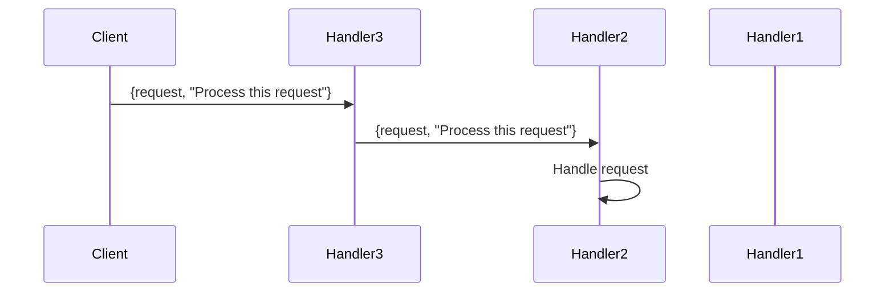

## 10.4 Chain of Responsibility with Process Pipelines

In this section, we delve into the Chain of Responsibility design pattern, a behavioral pattern that allows for the decoupling of request senders and receivers by passing requests along a chain of handlers. In Erlang, this pattern can be effectively implemented using process pipelines, leveraging Erlang's concurrency model to handle requests and data transformations efficiently.

### Understanding the Chain of Responsibility Pattern

**Definition**: The Chain of Responsibility pattern is a design pattern that allows an object to send a command without knowing which object will handle it. The command is passed along a chain of potential handlers until one of them handles it.

**Intent**: The primary intent of this pattern is to decouple the sender of a request from its receiver, allowing multiple objects to handle the request without the sender needing to know which object will ultimately process it.

**Key Participants**:
- **Handler**: Defines an interface for handling requests and optionally implements the successor link.
- **ConcreteHandler**: Handles requests it is responsible for and forwards requests to the next handler if it cannot process them.
- **Client**: Initiates the request to a handler in the chain.

### Implementing Chain of Responsibility with Process Pipelines in Erlang

In Erlang, we can implement the Chain of Responsibility pattern using process pipelines. Each process in the pipeline acts as a handler, receiving messages and deciding whether to handle them or pass them to the next process.

#### Setting Up Process Pipelines

To set up a process pipeline, we need to define a series of processes where each process can handle specific types of messages. If a process cannot handle a message, it forwards the message to the next process in the chain.

```erlang
-module(chain_of_responsibility).
-export([start_pipeline/0, handler/2]).

start_pipeline() ->
    % Start the first handler in the chain
    Handler1 = spawn(?MODULE, handler, [handler1, none]),
    Handler2 = spawn(?MODULE, handler, [handler2, Handler1]),
    Handler3 = spawn(?MODULE, handler, [handler3, Handler2]),
    % Send a message to the last handler in the chain
    Handler3 ! {request, "Process this request"}.

handler(Name, Next) ->
    receive
        {request, Message} ->
            io:format("~p received message: ~p~n", [Name, Message]),
            % Decide whether to handle the message or pass it on
            case can_handle(Name, Message) of
                true -> io:format("~p handled the message~n", [Name]);
                false -> 
                    io:format("~p passing message to next handler~n", [Name]),
                    Next ! {request, Message}
            end,
            handler(Name, Next)
    end.

can_handle(handler1, _Message) -> false;
can_handle(handler2, _Message) -> true;
can_handle(handler3, _Message) -> false.
```

**Explanation**:
- **Processes**: We create three processes (`Handler1`, `Handler2`, `Handler3`), each capable of handling messages.
- **Message Passing**: Each process receives a message and decides whether to handle it or pass it to the next process.
- **Decision Logic**: The `can_handle/2` function determines if a process can handle a given message.

### Visualizing Process Pipelines

To better understand how messages flow through the pipeline, let's visualize the process pipeline using a sequence diagram.



**Diagram Description**: The sequence diagram illustrates the flow of a request through the process pipeline. The client sends a request to `Handler3`, which passes it to `Handler2`. `Handler2` handles the request.

### Scenarios for Using Process Pipelines

Process pipelines are particularly useful in scenarios where requests need to be processed by multiple handlers, such as:

- **Request Processing**: In web servers, requests can be processed by a series of middleware components, each responsible for a specific task (e.g., authentication, logging, data validation).
- **Data Transformation**: In data processing applications, data can be transformed by a series of processes, each applying a specific transformation.

#### Example: Request Processing Pipeline

Let's consider a scenario where we have a request processing pipeline for a web server. Each process in the pipeline handles a specific aspect of the request.

```erlang
-module(request_pipeline).
-export([start_pipeline/0, auth_handler/2, log_handler/2, data_handler/2]).

start_pipeline() ->
    AuthHandler = spawn(?MODULE, auth_handler, [none]),
    LogHandler = spawn(?MODULE, log_handler, [AuthHandler]),
    DataHandler = spawn(?MODULE, data_handler, [LogHandler]),
    DataHandler ! {request, {user, "Alice"}, "GET /resource"}.

auth_handler(Next) ->
    receive
        {request, {user, User}, _} = Request ->
            io:format("AuthHandler: Authenticating user ~p~n", [User]),
            % Simulate authentication
            case User of
                "Alice" -> Next ! Request;
                _ -> io:format("AuthHandler: Authentication failed for ~p~n", [User])
            end,
            auth_handler(Next)
    end.

log_handler(Next) ->
    receive
        Request ->
            io:format("LogHandler: Logging request ~p~n", [Request]),
            Next ! Request,
            log_handler(Next)
    end.

data_handler(Next) ->
    receive
        {request, _, Resource} ->
            io:format("DataHandler: Processing resource ~p~n", [Resource]),
            data_handler(Next)
    end.
```

**Explanation**:
- **Authentication**: The `auth_handler` process checks if the user is authenticated before passing the request.
- **Logging**: The `log_handler` process logs the request details.
- **Data Processing**: The `data_handler` process handles the actual data processing.

### Design Considerations

When implementing the Chain of Responsibility pattern with process pipelines in Erlang, consider the following:

- **Order of Handlers**: The order of handlers in the pipeline can affect the outcome. Ensure that handlers are arranged logically.
- **Error Handling**: Implement error handling to manage failures in the pipeline gracefully.
- **Performance**: Consider the performance implications of passing messages through multiple processes, especially in high-load scenarios.

### Erlang Unique Features

Erlang's lightweight processes and message-passing model make it particularly well-suited for implementing the Chain of Responsibility pattern. The ability to spawn thousands of processes with minimal overhead allows for highly concurrent and scalable systems.

### Differences and Similarities with Other Patterns

The Chain of Responsibility pattern is often compared to the Decorator pattern. While both involve passing requests through a series of handlers, the Decorator pattern focuses on adding behavior to objects, whereas the Chain of Responsibility pattern focuses on passing requests along a chain.

### Try It Yourself

To gain a deeper understanding of process pipelines, try modifying the code examples:

- **Add a New Handler**: Introduce a new handler that performs a different task, such as data validation.
- **Change the Order**: Rearrange the order of handlers and observe how it affects the outcome.
- **Simulate Errors**: Introduce errors in one of the handlers and implement error handling to manage them.

### Knowledge Check

- **Question**: What is the primary intent of the Chain of Responsibility pattern?
- **Exercise**: Implement a process pipeline that handles multiple types of requests, such as GET and POST.

### Embrace the Journey

Remember, mastering design patterns is a journey. As you experiment with process pipelines, you'll gain insights into building robust and scalable systems. Keep exploring, stay curious, and enjoy the process!

## Quiz: Chain of Responsibility with Process Pipelines



### What is the primary intent of the Chain of Responsibility pattern?

- [x] To decouple the sender of a request from its receiver
- [ ] To couple the sender and receiver tightly
- [ ] To ensure only one handler processes the request
- [ ] To prioritize requests based on urgency

> **Explanation:** The Chain of Responsibility pattern aims to decouple the sender of a request from its receiver, allowing multiple handlers to process the request.

### In Erlang, how can the Chain of Responsibility pattern be implemented?

- [x] Using process pipelines
- [ ] Using global variables
- [ ] Using shared memory
- [ ] Using a single process

> **Explanation:** In Erlang, the Chain of Responsibility pattern can be implemented using process pipelines, leveraging Erlang's concurrency model.

### What role does the `can_handle/2` function play in the process pipeline example?

- [x] It determines if a process can handle a given message
- [ ] It sends messages to the next process
- [ ] It logs the message details
- [ ] It authenticates the user

> **Explanation:** The `can_handle/2` function determines if a process can handle a given message, deciding whether to process it or pass it on.

### What is a key advantage of using Erlang's lightweight processes in implementing the Chain of Responsibility pattern?

- [x] High concurrency and scalability
- [ ] Reduced code complexity
- [ ] Increased memory usage
- [ ] Simplified error handling

> **Explanation:** Erlang's lightweight processes allow for high concurrency and scalability, making it ideal for implementing the Chain of Responsibility pattern.

### Which of the following is a scenario where process pipelines are useful?

- [x] Request processing in web servers
- [ ] Storing data in a database
- [ ] Rendering graphics
- [ ] Compiling code

> **Explanation:** Process pipelines are useful in scenarios like request processing in web servers, where multiple handlers process requests.

### What should be considered when designing a process pipeline?

- [x] Order of handlers
- [ ] Number of lines of code
- [ ] Use of global variables
- [ ] Frequency of function calls

> **Explanation:** The order of handlers in a process pipeline can affect the outcome, so it should be carefully considered.

### How can errors be managed in a process pipeline?

- [x] Implement error handling in handlers
- [ ] Ignore errors
- [ ] Use global error variables
- [ ] Restart the entire pipeline

> **Explanation:** Implementing error handling in handlers allows for graceful management of failures in the pipeline.

### What is a difference between the Chain of Responsibility and Decorator patterns?

- [x] Chain of Responsibility focuses on passing requests; Decorator adds behavior
- [ ] Both focus on adding behavior
- [ ] Both focus on passing requests
- [ ] Chain of Responsibility adds behavior; Decorator passes requests

> **Explanation:** The Chain of Responsibility pattern focuses on passing requests along a chain, while the Decorator pattern adds behavior to objects.

### True or False: Erlang's message-passing model is well-suited for implementing the Chain of Responsibility pattern.

- [x] True
- [ ] False

> **Explanation:** Erlang's message-passing model is indeed well-suited for implementing the Chain of Responsibility pattern due to its concurrency capabilities.

### What is a potential modification you can try with the provided code examples?

- [x] Add a new handler for data validation
- [ ] Remove all handlers
- [ ] Use global variables for message passing
- [ ] Combine all handlers into one process

> **Explanation:** Adding a new handler for data validation is a potential modification to explore the flexibility of process pipelines.


