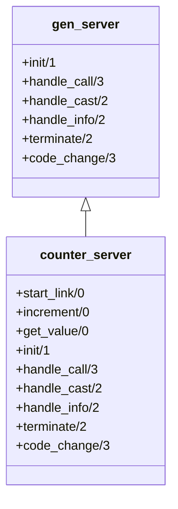

## 10.5 Template Method Pattern using Callbacks and Behaviors

In this section, we delve into the Template Method pattern, a fundamental behavioral design pattern, and explore how it is implemented in Erlang using callbacks and behaviors. This pattern is particularly useful in the context of Erlang's OTP framework, where it facilitates code reuse and standardization.

### Understanding the Template Method Pattern

The Template Method pattern defines the skeleton of an algorithm in a method, deferring some steps to subclasses. It allows subclasses to redefine certain steps of an algorithm without changing its structure. This pattern is essential for creating a framework where the high-level algorithm is fixed, but certain operations can be customized.

#### Key Participants

- **Abstract Class**: Defines the template method and declares abstract operations that subclasses must implement.
- **Concrete Class**: Implements the abstract operations to carry out subclass-specific steps of the algorithm.

### Erlang's Approach with Behaviors

In Erlang, the Template Method pattern is often realized through the use of behaviors. A behavior in Erlang is a module that defines a set of functions that must be implemented by any module that adopts the behavior. This is akin to the abstract class in object-oriented programming.

#### Behaviors and Callbacks

Behaviors in Erlang, such as `gen_server`, provide a framework for building applications. They define a set of callback functions that the developer must implement. These callbacks are the customizable parts of the algorithm, allowing developers to inject specific logic while adhering to a standard structure.

### OTP Behaviors: A Practical Example

Let's explore how the Template Method pattern is implemented using the `gen_server` behavior in OTP.

#### The `gen_server` Behavior

The `gen_server` behavior abstracts the common patterns of a server process, such as handling requests, maintaining state, and managing lifecycle events. It defines a set of callback functions that the developer must implement:

- `init/1`: Initializes the server.
- `handle_call/3`: Handles synchronous calls.
- `handle_cast/2`: Handles asynchronous messages.
- `handle_info/2`: Handles all other messages.
- `terminate/2`: Cleans up when the server is terminated.
- `code_change/3`: Handles code upgrades.

#### Implementing a `gen_server`

Let's implement a simple `gen_server` that manages a counter.

```erlang
-module(counter_server).
-behavior(gen_server).

%% API
-export([start_link/0, increment/0, get_value/0]).

%% gen_server callbacks
-export([init/1, handle_call/3, handle_cast/2, handle_info/2, terminate/2, code_change/3]).

%% API Functions
start_link() ->
    gen_server:start_link({local, ?MODULE}, ?MODULE, [], []).

increment() ->
    gen_server:cast(?MODULE, increment).

get_value() ->
    gen_server:call(?MODULE, get_value).

%% gen_server Callbacks
init([]) ->
    {ok, 0}. % Initial state is 0

handle_call(get_value, _From, State) ->
    {reply, State, State};

handle_cast(increment, State) ->
    {noreply, State + 1};

handle_info(_Info, State) ->
    {noreply, State}.

terminate(_Reason, _State) ->
    ok.

code_change(_OldVsn, State, _Extra) ->
    {ok, State}.
```

In this example, the `counter_server` module implements the `gen_server` behavior. The `init/1` function initializes the state, while `handle_call/3` and `handle_cast/2` manage synchronous and asynchronous operations, respectively.

### Advantages of Using the Template Method Pattern

1. **Code Reuse**: By defining the algorithm's structure in a behavior, we can reuse this structure across different modules, reducing duplication.
2. **Standardization**: Behaviors enforce a standard interface, ensuring consistency across modules.
3. **Flexibility**: Developers can customize specific parts of the algorithm by implementing the required callbacks.

### Visualizing the Template Method Pattern

Below is a diagram illustrating the relationship between the `gen_server` behavior and a module implementing it.



This diagram shows how `counter_server` inherits the structure from `gen_server` and implements the necessary callbacks.

### Erlang's Unique Features

Erlang's concurrency model and lightweight processes make it particularly suited for implementing the Template Method pattern. The use of behaviors like `gen_server` allows developers to focus on the specific logic of their application while relying on OTP to handle concurrency and fault tolerance.

### Differences and Similarities with Other Patterns

The Template Method pattern is often confused with the Strategy pattern. While both involve defining a family of algorithms, the Template Method pattern fixes the algorithm's structure and allows subclasses to override specific steps, whereas the Strategy pattern allows the entire algorithm to be swapped out.

### Try It Yourself

To deepen your understanding, try modifying the `counter_server` example:

- Add a `decrement/0` function to decrease the counter.
- Implement a reset functionality that sets the counter back to zero.
- Experiment with different initial states in the `init/1` function.

### Knowledge Check

- What are the key benefits of using the Template Method pattern in Erlang?
- How does the `gen_server` behavior exemplify the Template Method pattern?
- What are the differences between the Template Method and Strategy patterns?

### Conclusion

The Template Method pattern, when combined with Erlang's behaviors, provides a powerful tool for building robust, reusable, and standardized applications. By leveraging OTP behaviors like `gen_server`, developers can focus on the unique aspects of their application while relying on a proven framework for handling common tasks.

## Quiz: Template Method Pattern using Callbacks and Behaviors



### What is the primary purpose of the Template Method pattern?

- [x] To define the skeleton of an algorithm and allow subclasses to override specific steps.
- [ ] To allow the entire algorithm to be swapped out at runtime.
- [ ] To encapsulate a request as an object.
- [ ] To provide a way to access the elements of an aggregate object sequentially.

> **Explanation:** The Template Method pattern defines the skeleton of an algorithm, allowing subclasses to override specific steps without changing the algorithm's structure.

### How does Erlang implement the Template Method pattern?

- [x] Through behaviors and callback functions.
- [ ] By using macros and parse transformations.
- [ ] By defining abstract classes and interfaces.
- [ ] Through dynamic module loading.

> **Explanation:** Erlang uses behaviors and callback functions to implement the Template Method pattern, allowing developers to define a fixed algorithm structure with customizable steps.

### Which OTP behavior is commonly associated with the Template Method pattern?

- [x] gen_server
- [ ] gen_event
- [ ] supervisor
- [ ] application

> **Explanation:** The `gen_server` behavior is a common example of the Template Method pattern in Erlang, providing a framework for building server processes with customizable logic.

### What is the role of the `init/1` function in a `gen_server`?

- [x] To initialize the server's state.
- [ ] To handle synchronous calls.
- [ ] To manage asynchronous messages.
- [ ] To terminate the server process.

> **Explanation:** The `init/1` function initializes the server's state, setting up the initial conditions for the `gen_server`.

### What is a key advantage of using behaviors in Erlang?

- [x] They enforce a standard interface and promote code reuse.
- [ ] They allow for dynamic typing and runtime checks.
- [ ] They provide direct access to the BEAM VM internals.
- [ ] They enable hot code swapping without supervision.

> **Explanation:** Behaviors enforce a standard interface, promoting code reuse and consistency across different modules.

### How does the Template Method pattern differ from the Strategy pattern?

- [x] The Template Method pattern fixes the algorithm's structure, while the Strategy pattern allows the entire algorithm to be swapped.
- [ ] The Template Method pattern is used for creating objects, while the Strategy pattern is for managing state.
- [ ] The Template Method pattern is only applicable to functional languages.
- [ ] The Strategy pattern is a subset of the Template Method pattern.

> **Explanation:** The Template Method pattern fixes the algorithm's structure, allowing specific steps to be overridden, whereas the Strategy pattern allows the entire algorithm to be swapped.

### What is the purpose of the `handle_call/3` function in a `gen_server`?

- [x] To handle synchronous calls and return a response.
- [ ] To manage asynchronous messages.
- [ ] To initialize the server's state.
- [ ] To handle unexpected messages.

> **Explanation:** The `handle_call/3` function handles synchronous calls, processing requests and returning responses to the caller.

### Which function in a `gen_server` is responsible for handling asynchronous messages?

- [x] handle_cast/2
- [ ] handle_call/3
- [ ] init/1
- [ ] terminate/2

> **Explanation:** The `handle_cast/2` function is responsible for handling asynchronous messages in a `gen_server`.

### What is the benefit of using the Template Method pattern in Erlang's OTP?

- [x] It allows developers to focus on application-specific logic while relying on a proven framework for common tasks.
- [ ] It provides direct access to the BEAM VM internals.
- [ ] It enables dynamic typing and runtime checks.
- [ ] It allows for hot code swapping without supervision.

> **Explanation:** The Template Method pattern in OTP allows developers to focus on application-specific logic, leveraging a proven framework for handling common tasks like concurrency and fault tolerance.

### True or False: The Template Method pattern allows the entire algorithm to be swapped out at runtime.

- [ ] True
- [x] False

> **Explanation:** False. The Template Method pattern defines a fixed algorithm structure, allowing specific steps to be overridden, but not the entire algorithm.



Remember, this is just the beginning. As you progress, you'll build more complex and interactive applications using Erlang's powerful features. Keep experimenting, stay curious, and enjoy the journey!
