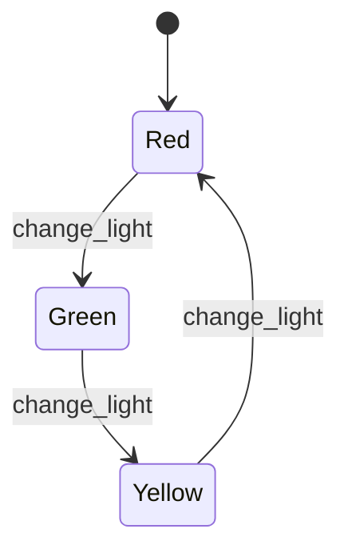

## 10.6 State Pattern with `gen_statem`

In this section, we delve into the State Pattern, a behavioral design pattern, and how it can be effectively implemented using `gen_statem` in Erlang. This pattern is particularly useful for managing state transitions in applications that require complex state-dependent behavior.

### Understanding the State Pattern

**Definition**: The State Pattern allows an object to alter its behavior when its internal state changes. This pattern is particularly useful when an object must change its behavior at runtime depending on its state.

The State Pattern is a way to encapsulate state-specific behavior and delegate behavior to the current state. It is often used in scenarios where an object can be in one of several states, and the behavior of the object changes based on its state.

### `gen_statem` in Erlang

Erlang's `gen_statem` is a powerful behavior module that directly supports state-based behavior. It is part of the Open Telecom Platform (OTP) and provides a framework for implementing state machines. `gen_statem` is particularly well-suited for applications that require complex state transitions and concurrent operations.

#### Key Features of `gen_statem`

- **State Encapsulation**: `gen_statem` allows you to encapsulate state-specific logic within callback functions, making it easy to manage and modify state transitions.
- **Concurrency Support**: Built on Erlang's lightweight process model, `gen_statem` supports concurrent state machines, enabling scalable and responsive applications.
- **Event Handling**: `gen_statem` provides a robust mechanism for handling events and messages, allowing for asynchronous state transitions.
- **Flexibility**: It supports both finite state machines (FSM) and extended state machines (ESM), providing flexibility in designing state-based systems.

### Implementing the State Pattern with `gen_statem`

Let's explore how to implement the State Pattern using `gen_statem` with a detailed example. We'll create a simple traffic light system that transitions between different states: Red, Green, and Yellow.

#### Step-by-Step Implementation

1. **Define the State Machine Module**

   Create a new Erlang module and define it as a `gen_statem` behavior.

   ```erlang
   -module(traffic_light).
   -behaviour(gen_statem).

   %% API
   -export([start_link/0, change_light/1]).

   %% gen_statem callbacks
   -export([init/1, callback_mode/0, handle_event/4, terminate/3, code_change/4]).
   ```

2. **Initialize the State Machine**

   Implement the `init/1` callback to initialize the state machine.

   ```erlang
   init([]) ->
       {ok, red, #{}};
   ```

   Here, we start the state machine in the `red` state with an empty state data.

3. **Define the Callback Mode**

   Specify the callback mode for the state machine. `gen_statem` supports both `state_functions` and `handle_event_function` modes. We'll use `state_functions` for this example.

   ```erlang
   callback_mode() ->
       state_functions.
   ```

4. **Implement State Functions**

   Define functions for each state to handle events and transitions.

   ```erlang
   red({call, From}, change_light, Data) ->
       {next_state, green, Data, {reply, From, ok}};

   green({call, From}, change_light, Data) ->
       {next_state, yellow, Data, {reply, From, ok}};

   yellow({call, From}, change_light, Data) ->
       {next_state, red, Data, {reply, From, ok}};
   ```

   Each function handles the `change_light` event and transitions to the next state.

5. **Start the State Machine**

   Implement the `start_link/0` function to start the state machine process.

   ```erlang
   start_link() ->
       gen_statem:start_link(?MODULE, [], []).
   ```

6. **Interact with the State Machine**

   Provide an API function to interact with the state machine.

   ```erlang
   change_light(Pid) ->
       gen_statem:call(Pid, change_light).
   ```

### Visualizing State Transitions

To better understand the state transitions, let's visualize the state machine using a state diagram.



**Diagram Description**: This state diagram illustrates the transitions between the Red, Green, and Yellow states in our traffic light system. Each transition is triggered by the `change_light` event.

### Benefits of Using `gen_statem`

- **Clarity**: By encapsulating state-specific behavior within functions, `gen_statem` makes the codebase easier to understand and maintain.
- **Concurrency**: Leveraging Erlang's process model, `gen_statem` supports concurrent state machines, enhancing scalability.
- **Flexibility**: The ability to handle complex state transitions and events makes `gen_statem` suitable for a wide range of applications.

### Try It Yourself

Experiment with the traffic light example by modifying the state transitions or adding new states. For instance, you could add a `flashing` state to simulate a malfunctioning traffic light.

### Knowledge Check

- **Question**: What is the primary advantage of using `gen_statem` for implementing the State Pattern in Erlang?
- **Exercise**: Modify the traffic light example to include a `flashing` state that transitions back to `red`.

### Conclusion

The State Pattern, when implemented using `gen_statem`, provides a robust framework for managing state transitions in Erlang applications. By leveraging Erlang's concurrency model and `gen_statem`'s state encapsulation, developers can build scalable and maintainable systems.

Remember, this is just the beginning. As you progress, you'll discover more complex patterns and techniques to enhance your Erlang applications. Keep experimenting, stay curious, and enjoy the journey!

## Quiz: State Pattern with `gen_statem`



### What is the primary purpose of the State Pattern?

- [x] To allow an object to change its behavior when its state changes
- [ ] To encapsulate data within an object
- [ ] To provide a way to create objects without specifying their concrete classes
- [ ] To define a family of algorithms

> **Explanation:** The State Pattern is used to allow an object to change its behavior when its internal state changes.

### Which Erlang module is used to implement state machines?

- [x] gen_statem
- [ ] gen_server
- [ ] gen_event
- [ ] gen_fsm

> **Explanation:** `gen_statem` is the Erlang module used to implement state machines.

### What is the initial state in the traffic light example?

- [x] Red
- [ ] Green
- [ ] Yellow
- [ ] Flashing

> **Explanation:** The initial state in the traffic light example is `Red`.

### What event triggers state transitions in the traffic light example?

- [x] change_light
- [ ] start_light
- [ ] stop_light
- [ ] reset_light

> **Explanation:** The `change_light` event triggers state transitions in the traffic light example.

### Which callback mode is used in the traffic light example?

- [x] state_functions
- [ ] handle_event_function
- [ ] state_event
- [ ] event_handler

> **Explanation:** The `state_functions` callback mode is used in the traffic light example.

### What is the benefit of using `gen_statem` for state management?

- [x] Clarity and maintainability
- [ ] Increased complexity
- [ ] Reduced performance
- [ ] Limited scalability

> **Explanation:** `gen_statem` provides clarity and maintainability by encapsulating state-specific behavior.

### How does `gen_statem` support concurrency?

- [x] By leveraging Erlang's lightweight process model
- [ ] By using threads
- [ ] By using locks
- [ ] By using semaphores

> **Explanation:** `gen_statem` supports concurrency by leveraging Erlang's lightweight process model.

### What is the purpose of the `init/1` callback in `gen_statem`?

- [x] To initialize the state machine
- [ ] To handle events
- [ ] To terminate the state machine
- [ ] To change the code

> **Explanation:** The `init/1` callback is used to initialize the state machine.

### True or False: `gen_statem` can only be used for finite state machines.

- [ ] True
- [x] False

> **Explanation:** `gen_statem` can be used for both finite state machines (FSM) and extended state machines (ESM).

### What is the next state after `Green` in the traffic light example?

- [x] Yellow
- [ ] Red
- [ ] Flashing
- [ ] Blue

> **Explanation:** The next state after `Green` in the traffic light example is `Yellow`.


