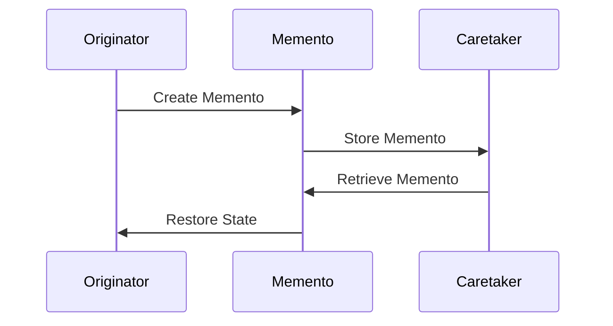

## 10.7 Memento Pattern for State Preservation

In the world of software design patterns, the Memento pattern stands out as a powerful tool for capturing and restoring the state of an object. This pattern is particularly useful in scenarios where you need to implement undo functionality, checkpointing, or state recovery. In this section, we will delve into the Memento pattern, its application in Erlang, and the unique considerations that arise when dealing with state serialization and restoration in a functional and concurrent programming environment.

### Understanding the Memento Pattern

**Definition**: The Memento pattern is a behavioral design pattern that allows you to capture and externalize an object's internal state so that the object can be restored to this state later without violating encapsulation.

#### Key Participants

1. **Originator**: The object whose state needs to be saved and restored.
2. **Memento**: The object that stores the state of the Originator.
3. **Caretaker**: The object responsible for keeping the Memento. It does not modify or inspect the contents of the Memento.

#### Intent

The primary intent of the Memento pattern is to provide the ability to restore an object to its previous state. This is particularly useful for implementing features like undo mechanisms, state rollback, and checkpointing.

### Applicability in Erlang

Erlang, with its functional programming paradigm and emphasis on concurrency, presents unique challenges and opportunities for implementing the Memento pattern. The pattern can be applied in Erlang to:

- **Save process state**: Capture the state of a process and store it externally for later restoration.
- **Implement undo functionality**: Allow processes to revert to a previous state.
- **Checkpointing**: Periodically save the state of a process for recovery in case of failure.

### Sample Code Snippet

Let's explore a simple example of the Memento pattern in Erlang. We'll create a module that simulates a counter process, allowing us to save and restore its state.

```erlang
-module(counter).
-export([start/0, increment/1, save_state/1, restore_state/2]).

% Start the counter process
start() ->
    spawn(fun() -> loop(0) end).

% Process loop with current state
loop(State) ->
    receive
        {increment, Caller} ->
            NewState = State + 1,
            Caller ! {ok, NewState},
            loop(NewState);
        {save_state, Caller} ->
            Caller ! {ok, State},
            loop(State);
        {restore_state, NewState, Caller} ->
            Caller ! {ok, NewState},
            loop(NewState)
    end.

% Increment the counter
increment(Pid) ->
    Pid ! {increment, self()},
    receive
        {ok, NewState} -> NewState
    end.

% Save the current state
save_state(Pid) ->
    Pid ! {save_state, self()},
    receive
        {ok, State} -> State
    end.

% Restore a previous state
restore_state(Pid, State) ->
    Pid ! {restore_state, State, self()},
    receive
        {ok, NewState} -> NewState
    end.
```

### Demonstrating State Preservation

In this example, the `counter` module defines a process that maintains a simple integer state. The process can increment its state, save its current state, and restore a previous state. This demonstrates the core functionality of the Memento pattern.

### Considerations for State Serialization and Restoration

When implementing the Memento pattern in Erlang, several considerations must be taken into account:

1. **State Serialization**: The state of a process may need to be serialized for storage. Erlang provides several options for serialization, such as using the `term_to_binary/1` function to convert data structures into a binary format.

2. **State Restoration**: Restoring state involves deserializing the stored state and applying it to the process. This requires careful handling to ensure that the restored state is consistent and valid.

3. **Concurrency**: Erlang's concurrent nature means that multiple processes may be interacting with the state simultaneously. It's crucial to ensure that state changes are atomic and do not lead to race conditions.

4. **Performance**: Serialization and deserialization can be computationally expensive. It's important to consider the performance implications of frequently saving and restoring state.

### Erlang Unique Features

Erlang's unique features, such as lightweight processes and message passing, make it well-suited for implementing the Memento pattern. The ability to spawn numerous processes allows for fine-grained control over state management, while message passing provides a natural mechanism for communication between the Originator, Memento, and Caretaker.

### Differences and Similarities with Other Patterns

The Memento pattern is often compared to the Command pattern, as both involve capturing and restoring state. However, the Memento pattern focuses specifically on state preservation, while the Command pattern encapsulates actions and their parameters.

### Try It Yourself

To deepen your understanding of the Memento pattern in Erlang, try modifying the `counter` module to:

- Add a decrement function.
- Implement a history feature that allows multiple states to be saved and restored.
- Experiment with different serialization formats for state storage.

### Visualizing the Memento Pattern

To better understand the flow of the Memento pattern, let's visualize the interactions between the Originator, Memento, and Caretaker using a sequence diagram.



**Diagram Description**: This sequence diagram illustrates the interactions between the Originator, Memento, and Caretaker in the Memento pattern. The Originator creates a Memento to capture its state, which is then stored by the Caretaker. When needed, the Caretaker retrieves the Memento, and the Originator restores its state from the Memento.

### Knowledge Check

Before we conclude, let's reinforce your understanding of the Memento pattern with a few questions:

- What are the key participants in the Memento pattern?
- How does Erlang's concurrency model affect the implementation of the Memento pattern?
- What are some considerations for state serialization and restoration in Erlang?

### Summary

In this section, we've explored the Memento pattern and its application in Erlang. We've seen how this pattern can be used to capture and restore process state, providing powerful functionality for undo mechanisms and state recovery. By leveraging Erlang's unique features, such as lightweight processes and message passing, we can implement the Memento pattern effectively in a concurrent environment.

Remember, the journey of mastering design patterns is ongoing. As you continue to explore and experiment with different patterns, you'll gain a deeper understanding of how to build robust and scalable applications in Erlang.

## Quiz: Memento Pattern for State Preservation



### What is the primary intent of the Memento pattern?

- [x] To capture and restore an object's state
- [ ] To encapsulate actions and their parameters
- [ ] To manage object creation
- [ ] To define a family of algorithms

> **Explanation:** The Memento pattern is designed to capture and restore an object's state without violating encapsulation.

### Which of the following is NOT a participant in the Memento pattern?

- [ ] Originator
- [ ] Memento
- [ ] Caretaker
- [x] Observer

> **Explanation:** The Observer is not a participant in the Memento pattern. The key participants are the Originator, Memento, and Caretaker.

### In Erlang, which function can be used for state serialization?

- [x] term_to_binary/1
- [ ] binary_to_term/1
- [ ] spawn/1
- [ ] receive/1

> **Explanation:** The `term_to_binary/1` function is used to serialize data structures into a binary format in Erlang.

### What is a key consideration when restoring state in Erlang?

- [x] Ensuring the restored state is consistent and valid
- [ ] Using the correct data type
- [ ] Optimizing for speed
- [ ] Minimizing memory usage

> **Explanation:** When restoring state, it's crucial to ensure that the restored state is consistent and valid to avoid errors.

### How does Erlang's concurrency model benefit the Memento pattern?

- [x] It allows fine-grained control over state management
- [ ] It simplifies state serialization
- [ ] It reduces memory usage
- [ ] It eliminates the need for message passing

> **Explanation:** Erlang's concurrency model, with lightweight processes, allows for fine-grained control over state management.

### What is a potential drawback of frequent state serialization?

- [x] It can be computationally expensive
- [ ] It simplifies state restoration
- [ ] It reduces code complexity
- [ ] It improves performance

> **Explanation:** Frequent state serialization can be computationally expensive, impacting performance.

### Which pattern is often compared to the Memento pattern?

- [x] Command pattern
- [ ] Singleton pattern
- [ ] Factory pattern
- [ ] Observer pattern

> **Explanation:** The Command pattern is often compared to the Memento pattern, as both involve capturing and restoring state.

### What is the role of the Caretaker in the Memento pattern?

- [x] To store and retrieve the Memento
- [ ] To create the Memento
- [ ] To modify the Memento
- [ ] To serialize the Memento

> **Explanation:** The Caretaker is responsible for storing and retrieving the Memento without modifying its contents.

### Which Erlang feature is particularly useful for implementing the Memento pattern?

- [x] Lightweight processes
- [ ] Pattern matching
- [ ] List comprehensions
- [ ] Tail call optimization

> **Explanation:** Erlang's lightweight processes are particularly useful for implementing the Memento pattern, allowing for efficient state management.

### True or False: The Memento pattern violates encapsulation.

- [ ] True
- [x] False

> **Explanation:** The Memento pattern is designed to capture and restore an object's state without violating encapsulation.



Remember, this is just the beginning. As you progress, you'll build more complex and interactive applications. Keep experimenting, stay curious, and enjoy the journey!
