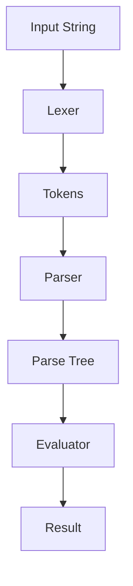

## 10.8 Interpreter Pattern using Custom Parsers

The Interpreter pattern is a powerful design pattern used to define a grammar for a language and an interpreter that uses the grammar to interpret sentences in the language. In Erlang, this pattern can be effectively implemented using custom parsers and evaluators, especially when working with domain-specific languages (DSLs).

### Intent

The intent of the Interpreter pattern is to interpret sentences in a language by defining a grammar and implementing an interpreter that processes the grammar. This pattern is particularly useful for creating command interpreters, expression evaluators, and other applications where a language needs to be parsed and executed.

### Key Participants

1. **AbstractExpression**: Declares an interface for executing an operation.
2. **TerminalExpression**: Implements an operation associated with terminal symbols in the grammar.
3. **NonTerminalExpression**: Implements an operation for non-terminal symbols in the grammar.
4. **Context**: Contains information that is global to the interpreter.
5. **Client**: Builds (or is given) an abstract syntax tree representing a particular sentence in the language defined by the grammar. The abstract syntax tree is assembled from instances of the NonTerminalExpression and TerminalExpression classes.

### Applicability

Use the Interpreter pattern when:
- You have a simple grammar and want to represent sentences in the language.
- You need to interpret expressions in a language.
- You want to create a language interpreter for a DSL.

### Erlang Unique Features

Erlang's functional nature and powerful concurrency model make it uniquely suited for implementing the Interpreter pattern. Erlang's pattern matching and recursion capabilities simplify the implementation of parsers and evaluators. Additionally, tools like `leex` and `yecc` provide powerful mechanisms for lexical analysis and parsing, respectively.

### Parsing and Evaluating DSLs

To parse and evaluate DSLs in Erlang, we can use `leex` for lexical analysis and `yecc` for parsing. These tools help in breaking down the input into tokens and then parsing these tokens according to a defined grammar.

#### Lexical Analysis with `leex`

`leex` is a lexical analyzer generator for Erlang. It takes a set of regular expressions and generates a lexer that can tokenize input strings.

```erlang
%% lexer.xrl
Definitions.
DIGIT = [0-9]
ID = [a-zA-Z][a-zA-Z0-9]*

Rules.
{DIGIT}+ : {token, {integer, TokenLine, list_to_integer(TokenChars)}}.
{ID} : {token, {identifier, TokenLine, TokenChars}}.
"+" : {token, {plus, TokenLine}}.
"*" : {token, {multiply, TokenLine}}.
"(" : {token, {lparen, TokenLine}}.
")" : {token, {rparen, TokenLine}}.
```

Compile the lexer with:

```shell
$ leex lexer.xrl
```

This generates a `lexer.erl` file that can be used to tokenize input strings.

#### Parsing with `yecc`

`yecc` is a parser generator for Erlang. It takes a grammar specification and generates a parser.

```erlang
%% parser.yrl
Nonterminals expr term factor.
Terminals integer plus multiply lparen rparen.
Rootsymbol expr.

expr -> expr plus term : {add, '$1', '$3'}.
expr -> term : '$1'.

term -> term multiply factor : {multiply, '$1', '$3'}.
term -> factor : '$1'.

factor -> integer : {integer, '$1'}.
factor -> lparen expr rparen : '$2'.
```

Compile the parser with:

```shell
$ yecc parser.yrl
```

This generates a `parser.erl` file that can be used to parse tokenized input.

### Sample Code Snippet

Let's put it all together with a simple example of interpreting arithmetic expressions.

```erlang
-module(interpreter).
-export([interpret/1]).

interpret(String) ->
    {ok, Tokens, _} = lexer:string(String),
    {ok, ParseTree} = parser:parse(Tokens),
    evaluate(ParseTree).

evaluate({add, Left, Right}) ->
    evaluate(Left) + evaluate(Right);
evaluate({multiply, Left, Right}) ->
    evaluate(Left) * evaluate(Right);
evaluate({integer, Value}) ->
    Value.
```

### Design Considerations

- **Complexity**: The Interpreter pattern can become complex if the grammar is large. Consider using other parsing techniques or tools if the grammar is too complex.
- **Performance**: Interpreters can be slower than compiled code. Consider performance implications when using this pattern.
- **Maintainability**: Keep the grammar simple to ensure the interpreter is maintainable.

### Applications

The Interpreter pattern is widely used in applications such as:
- Command interpreters
- Expression evaluators
- Scripting engines
- Configuration file parsers

### Differences and Similarities

The Interpreter pattern is often confused with the Strategy pattern. While both involve defining a set of operations, the Interpreter pattern is specifically focused on interpreting sentences in a language, whereas the Strategy pattern is about selecting an algorithm at runtime.

### Try It Yourself

Experiment with the code examples by modifying the grammar to include additional operations like subtraction or division. Try creating a DSL for a different domain, such as a simple query language or a configuration file format.

### Visualizing the Interpreter Pattern

Below is a diagram illustrating the flow of the Interpreter pattern using custom parsers in Erlang.



**Diagram Description**: This flowchart represents the process of interpreting an input string using the Interpreter pattern. The input string is first tokenized by the lexer, then parsed into a parse tree by the parser, and finally evaluated to produce a result.

### Knowledge Check

- What is the primary purpose of the Interpreter pattern?
- How does `leex` assist in implementing the Interpreter pattern in Erlang?
- What role does `yecc` play in parsing DSLs?
- Can you identify a scenario where the Interpreter pattern might not be the best choice?

### Embrace the Journey

Remember, this is just the beginning. As you progress, you'll build more complex interpreters and DSLs. Keep experimenting, stay curious, and enjoy the journey!

## Quiz: Interpreter Pattern using Custom Parsers



### What is the primary purpose of the Interpreter pattern?

- [x] To interpret sentences in a language by defining a grammar and implementing an interpreter.
- [ ] To compile code into machine language.
- [ ] To optimize code for performance.
- [ ] To manage memory allocation.

> **Explanation:** The Interpreter pattern is used to interpret sentences in a language by defining a grammar and implementing an interpreter.

### Which tool in Erlang is used for lexical analysis?

- [x] leex
- [ ] yecc
- [ ] rebar3
- [ ] dialyzer

> **Explanation:** `leex` is used for lexical analysis in Erlang, generating a lexer from a set of regular expressions.

### What is the role of `yecc` in the Interpreter pattern?

- [x] To parse tokenized input according to a defined grammar.
- [ ] To generate machine code.
- [ ] To perform static analysis.
- [ ] To manage dependencies.

> **Explanation:** `yecc` is a parser generator that parses tokenized input according to a defined grammar.

### In the Interpreter pattern, what is a TerminalExpression?

- [x] An operation associated with terminal symbols in the grammar.
- [ ] An operation for non-terminal symbols.
- [ ] A context for the interpreter.
- [ ] A client that builds an abstract syntax tree.

> **Explanation:** TerminalExpression implements operations associated with terminal symbols in the grammar.

### What is a potential drawback of using the Interpreter pattern?

- [x] It can become complex if the grammar is large.
- [ ] It is always the fastest solution.
- [ ] It does not support recursion.
- [ ] It cannot handle errors.

> **Explanation:** The Interpreter pattern can become complex if the grammar is large, making it difficult to maintain.

### How can you modify the example code to include subtraction?

- [x] Add a new rule in the grammar for subtraction.
- [ ] Change the lexer to recognize subtraction.
- [ ] Modify the evaluator to ignore subtraction.
- [ ] Remove the addition rule.

> **Explanation:** To include subtraction, you need to add a new rule in the grammar for subtraction.

### What is the output of the evaluator for the expression "2 + 3 * 4"?

- [x] 14
- [ ] 20
- [ ] 9
- [ ] 12

> **Explanation:** The expression "2 + 3 * 4" evaluates to 14 because multiplication has higher precedence than addition.

### Which of the following is NOT a key participant in the Interpreter pattern?

- [x] Compiler
- [ ] AbstractExpression
- [ ] TerminalExpression
- [ ] NonTerminalExpression

> **Explanation:** Compiler is not a key participant in the Interpreter pattern; it involves AbstractExpression, TerminalExpression, and NonTerminalExpression.

### What is the primary function of the Context in the Interpreter pattern?

- [x] To contain information that is global to the interpreter.
- [ ] To execute terminal operations.
- [ ] To build the abstract syntax tree.
- [ ] To manage memory allocation.

> **Explanation:** The Context contains information that is global to the interpreter.

### True or False: The Interpreter pattern is best suited for complex grammars.

- [ ] True
- [x] False

> **Explanation:** The Interpreter pattern is best suited for simple grammars, as it can become complex and difficult to maintain with large grammars.


