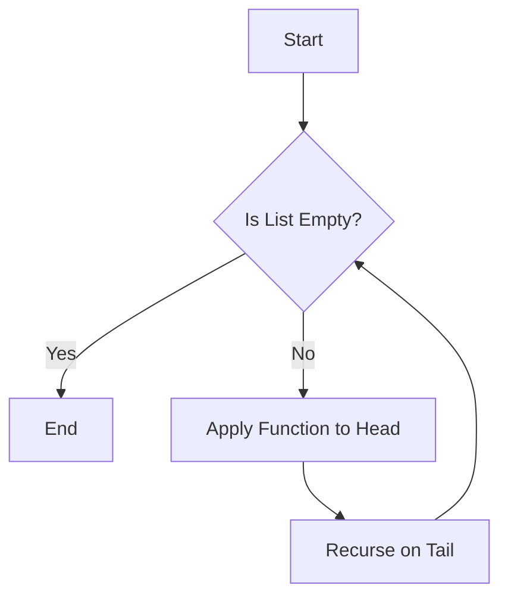

## 10.9 Iterator Pattern with List Processing

### Introduction

The Iterator Pattern is a design pattern that provides a way to access the elements of an aggregate object sequentially without exposing its underlying representation. In Erlang, this pattern is naturally supported by the language's powerful list processing capabilities. Erlang's functional nature allows us to traverse collections using higher-order functions, making iteration both expressive and efficient.

### Understanding the Iterator Pattern

**Intent**: The Iterator Pattern aims to provide a standard way to traverse elements in a collection, abstracting the iteration logic from the client code. This pattern is particularly useful when dealing with complex data structures where direct access to elements is not feasible or desirable.

**Key Participants**:
- **Iterator**: An interface for accessing and traversing elements.
- **Concrete Iterator**: Implements the iterator interface and maintains the current position in the traversal.
- **Aggregate**: An interface for creating an iterator object.
- **Concrete Aggregate**: Implements the aggregate interface and returns an instance of the concrete iterator.

### Erlang's Approach to Iteration

Erlang, being a functional language, emphasizes immutability and recursion, which naturally aligns with the Iterator Pattern. Instead of explicitly maintaining state, Erlang leverages recursive functions and higher-order functions to iterate over collections.

#### Traversing Collections with `lists:foreach/2`

One of the simplest ways to iterate over a list in Erlang is by using the `lists:foreach/2` function. This function takes a function and a list, applying the function to each element of the list.

```erlang
-module(iterator_example).
-export([print_elements/1]).

print_elements(List) ->
    lists:foreach(fun(Element) ->
        io:format("Element: ~p~n", [Element])
    end, List).
```

In this example, `print_elements/1` takes a list and prints each element. The `lists:foreach/2` function abstracts the iteration logic, allowing us to focus on the operation to be performed on each element.

#### Custom Iteration Over Complex Data Structures

While `lists:foreach/2` is suitable for simple lists, more complex data structures may require custom iteration logic. Consider a tree structure, where each node can have multiple children.

```erlang
-module(tree_iterator).
-export([traverse_tree/1]).

% Define a simple tree structure
-record(node, {value, children = []}).

traverse_tree(Node) ->
    io:format("Node: ~p~n", [Node#node.value]),
    lists:foreach(fun traverse_tree/1, Node#node.children).
```

In this example, `traverse_tree/1` recursively traverses a tree, printing the value of each node. The function calls itself on each child node, demonstrating a custom iteration strategy for a non-linear data structure.

### Functional Approach to Iteration

Erlang's functional paradigm encourages the use of higher-order functions for iteration. Functions like `lists:map/2`, `lists:foldl/3`, and `lists:filter/2` provide powerful abstractions for processing collections.

#### Using `lists:map/2` for Transformation

The `lists:map/2` function applies a given function to each element of a list, returning a new list with the transformed elements.

```erlang
-module(map_example).
-export([double_elements/1]).

double_elements(List) ->
    lists:map(fun(X) -> X * 2 end, List).
```

Here, `double_elements/1` takes a list of numbers and returns a new list where each number is doubled. This approach highlights the immutability of data in Erlang, as the original list remains unchanged.

#### Accumulating Results with `lists:foldl/3`

The `lists:foldl/3` function is used to accumulate results by applying a function to each element of a list, along with an accumulator.

```erlang
-module(fold_example).
-export([sum_elements/1]).

sum_elements(List) ->
    lists:foldl(fun(X, Acc) -> X + Acc end, 0, List).
```

In this example, `sum_elements/1` calculates the sum of a list of numbers. The function `fun(X, Acc) -> X + Acc end` is applied to each element, with `0` as the initial accumulator value.

### Visualizing Iteration in Erlang

To better understand how iteration works in Erlang, let's visualize the process using a simple flowchart.



This flowchart represents the recursive nature of list processing in Erlang. The function is applied to the head of the list, and the process recurses on the tail until the list is empty.

### Design Considerations

When implementing the Iterator Pattern in Erlang, consider the following:
- **Immutability**: Embrace Erlang's immutable data structures, which simplify iteration by eliminating side effects.
- **Recursion**: Use recursion to traverse collections, leveraging tail call optimization for efficiency.
- **Higher-Order Functions**: Utilize Erlang's rich set of higher-order functions to abstract common iteration patterns.

### Erlang Unique Features

Erlang's concurrency model and lightweight processes offer unique opportunities for parallel iteration. By spawning processes for each element, you can achieve concurrent iteration, which is particularly useful for large datasets.

```erlang
-module(concurrent_iterator).
-export([process_elements/1]).

process_elements(List) ->
    lists:foreach(fun(Element) ->
        spawn(fun() -> io:format("Processing: ~p~n", [Element]) end)
    end, List).
```

In this example, `process_elements/1` spawns a new process for each element in the list, allowing concurrent processing.

### Differences and Similarities with Other Patterns

The Iterator Pattern is often compared to the Visitor Pattern, as both involve traversing elements in a collection. However, the Visitor Pattern focuses on performing operations on elements, while the Iterator Pattern emphasizes the traversal mechanism itself.

### Try It Yourself

Experiment with the code examples provided. Try modifying the `traverse_tree/1` function to perform different operations on each node, or implement a concurrent version of `sum_elements/1` using processes.

### Knowledge Check

- What are the key participants in the Iterator Pattern?
- How does Erlang's functional nature influence iteration?
- What are the benefits of using higher-order functions for iteration?

### Summary

The Iterator Pattern in Erlang leverages the language's functional capabilities to provide a powerful and flexible way to traverse collections. By embracing immutability, recursion, and higher-order functions, we can implement efficient and expressive iteration strategies.

### Quiz: Iterator Pattern with List Processing



### What is the primary intent of the Iterator Pattern?

- [x] To provide a way to access elements of a collection sequentially without exposing its underlying representation.
- [ ] To modify elements of a collection in place.
- [ ] To sort elements of a collection.
- [ ] To filter elements of a collection.

> **Explanation:** The Iterator Pattern is designed to traverse elements without exposing the internal structure of the collection.

### Which Erlang function is commonly used for applying a function to each element of a list?

- [x] lists:foreach/2
- [ ] lists:filter/2
- [ ] lists:sort/2
- [ ] lists:reverse/2

> **Explanation:** `lists:foreach/2` is used to apply a function to each element of a list.

### How does Erlang handle iteration differently from imperative languages?

- [x] By using recursion and higher-order functions.
- [ ] By using loops and mutable state.
- [ ] By using pointers and references.
- [ ] By using classes and objects.

> **Explanation:** Erlang uses recursion and higher-order functions, aligning with its functional nature.

### What is a key advantage of using higher-order functions for iteration in Erlang?

- [x] They abstract common iteration patterns, making code more concise and expressive.
- [ ] They allow direct manipulation of list elements.
- [ ] They enable the use of global variables.
- [ ] They require less memory.

> **Explanation:** Higher-order functions abstract iteration logic, leading to more concise and expressive code.

### What is the role of the `lists:map/2` function?

- [x] To apply a function to each element of a list and return a new list with transformed elements.
- [ ] To filter elements of a list based on a condition.
- [ ] To sort elements of a list.
- [ ] To reverse the order of elements in a list.

> **Explanation:** `lists:map/2` transforms each element of a list and returns a new list.

### Which of the following is a unique feature of Erlang that can be leveraged for iteration?

- [x] Lightweight processes for concurrent iteration.
- [ ] Object-oriented inheritance.
- [ ] Mutable state.
- [ ] Static typing.

> **Explanation:** Erlang's lightweight processes enable concurrent iteration, a unique feature of the language.

### What is the benefit of using recursion for iteration in Erlang?

- [x] It aligns with Erlang's functional paradigm and supports tail call optimization.
- [ ] It allows direct access to list elements.
- [ ] It simplifies the use of global variables.
- [ ] It requires less memory.

> **Explanation:** Recursion aligns with Erlang's functional paradigm and benefits from tail call optimization.

### How does the Iterator Pattern differ from the Visitor Pattern?

- [x] The Iterator Pattern focuses on traversal, while the Visitor Pattern focuses on operations on elements.
- [ ] The Iterator Pattern modifies elements, while the Visitor Pattern sorts them.
- [ ] The Iterator Pattern filters elements, while the Visitor Pattern reverses them.
- [ ] The Iterator Pattern uses loops, while the Visitor Pattern uses recursion.

> **Explanation:** The Iterator Pattern is about traversal, whereas the Visitor Pattern is about operations on elements.

### What is the purpose of the `lists:foldl/3` function?

- [x] To accumulate results by applying a function to each element of a list and an accumulator.
- [ ] To filter elements of a list based on a condition.
- [ ] To sort elements of a list.
- [ ] To reverse the order of elements in a list.

> **Explanation:** `lists:foldl/3` accumulates results by applying a function to each element and an accumulator.

### True or False: Erlang's immutability simplifies iteration by eliminating side effects.

- [x] True
- [ ] False

> **Explanation:** Immutability in Erlang eliminates side effects, simplifying iteration.



Remember, this is just the beginning. As you progress, you'll build more complex and interactive applications. Keep experimenting, stay curious, and enjoy the journey!
