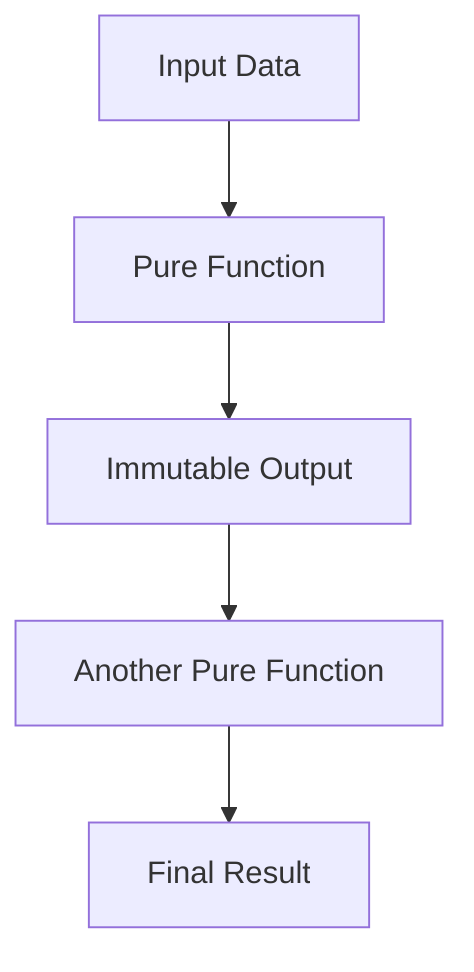

## 11.1 Immutability and Its Implications

In the realm of functional programming, immutability stands as a fundamental principle that shapes the way we design and reason about our code. Erlang, a language built with concurrency and fault tolerance in mind, embraces immutability as a core feature. In this section, we will delve into the concept of immutability, its implications for data handling and state management, and how it contributes to the robustness and maintainability of Erlang applications.

### Understanding Immutability

**Immutability** refers to the idea that once a data structure is created, it cannot be changed. Instead of modifying existing data, new data structures are created with the desired changes. This concept is a cornerstone of functional programming, promoting a declarative style where functions describe what to do rather than how to do it.

#### Why Immutability Matters

1. **Predictability**: Immutable data structures are predictable. Since they cannot change, functions that operate on them are free of side effects, making it easier to reason about code behavior.
2. **Concurrency**: In concurrent systems, immutability eliminates the need for locks or other synchronization mechanisms, as data cannot be altered by multiple threads or processes simultaneously.
3. **Reliability**: Immutable data structures contribute to system reliability by preventing unintended modifications, reducing bugs related to state changes.

### Immutability in Erlang

Erlang enforces immutability at the language level. Variables in Erlang are bound to values and cannot be reassigned. This immutability extends to all data structures, including lists, tuples, and maps.

```erlang
% Example of immutability in Erlang
-module(immutability_example).
-export([immutable_data/0]).

immutable_data() ->
    List1 = [1, 2, 3],
    List2 = [4 | List1], % Creates a new list, List1 remains unchanged
    {List1, List2}.
```

In the example above, `List1` remains unchanged when `List2` is created by prepending `4` to it. This behavior ensures that data integrity is maintained throughout the program.

### Implications for Data Handling and State Management

Immutability has profound implications for how we handle data and manage state in Erlang applications.

#### Data Handling

- **Copy-on-Write**: Since data cannot be modified, Erlang uses a copy-on-write strategy. When a data structure is "modified," a new version is created, sharing as much structure as possible with the original.
- **Memory Efficiency**: While it might seem that immutability leads to excessive memory usage, Erlang's efficient memory management and garbage collection mitigate this concern.

#### State Management

- **Functional State**: In functional programming, state is managed through function arguments and return values. Instead of modifying state, functions return new states.
- **Process State**: In Erlang, processes manage their state through message passing. Each process maintains its own state, which is immutable from the perspective of other processes.

### Benefits of Immutability in Concurrent Contexts

Concurrency is a first-class citizen in Erlang, and immutability plays a crucial role in simplifying concurrent programming.

#### Eliminating Race Conditions

Race conditions occur when multiple processes or threads access shared data simultaneously, leading to unpredictable results. Immutability eliminates race conditions by ensuring that data cannot be changed once created.

```erlang
% Example of concurrent processes with immutable state
-module(concurrent_example).
-export([start/0, process/1]).

start() ->
    Pid1 = spawn(?MODULE, process, [0]),
    Pid2 = spawn(?MODULE, process, [0]),
    Pid1 ! {self(), increment},
    Pid2 ! {self(), increment},
    receive
        {Pid1, NewState1} -> io:format("Process 1 state: ~p~n", [NewState1]);
        {Pid2, NewState2} -> io:format("Process 2 state: ~p~n", [NewState2])
    end.

process(State) ->
    receive
        {From, increment} ->
            NewState = State + 1,
            From ! {self(), NewState},
            process(NewState)
    end.
```

In this example, each process maintains its own state, and state changes are communicated through message passing. This design avoids race conditions and ensures data consistency.

#### Simplifying Debugging and Testing

Immutable data structures simplify debugging and testing by providing a clear snapshot of the program's state at any point in time. Since data cannot change, developers can easily trace the flow of data through the system.

### Easier Reasoning and Fewer Side Effects

Immutability leads to code that is easier to reason about and has fewer side effects. Functions that operate on immutable data are pure, meaning their output depends only on their input and not on any external state.

#### Pure Functions

Pure functions are a hallmark of functional programming. They do not modify any state or have side effects, making them predictable and easy to test.

```erlang
% Example of a pure function
-module(pure_function_example).
-export([add/2]).

add(A, B) ->
    A + B.
```

The `add/2` function is pure because it does not modify any external state and always produces the same output for the same input.

#### Referential Transparency

Referential transparency is a property of pure functions where expressions can be replaced with their corresponding values without changing the program's behavior. This property simplifies reasoning about code and enables powerful optimizations.

### Embracing Immutability for Robust Code

By embracing immutability, developers can create more robust and maintainable code. Immutable data structures reduce the complexity of state management and eliminate many common sources of bugs.

#### Encouragement to Adopt Immutability

- **Start Small**: Begin by using immutable data structures in new projects or modules. Gradually refactor existing code to embrace immutability.
- **Leverage Erlang's Features**: Take advantage of Erlang's built-in support for immutability and concurrency to simplify code design.
- **Focus on Pure Functions**: Aim to write pure functions whenever possible, reducing side effects and improving code clarity.

### Visualizing Immutability

To better understand the concept of immutability, let's visualize how data flows in a system that embraces immutability.



In this flowchart, data flows through a series of pure functions, each producing an immutable output. This design ensures that data integrity is maintained and side effects are minimized.

### Try It Yourself

To deepen your understanding of immutability, try modifying the code examples provided. Experiment with creating new data structures and observe how immutability affects the program's behavior. Consider the following exercises:

1. Modify the `immutable_data/0` function to create a new list by appending elements instead of prepending.
2. Extend the `concurrent_example` module to include additional operations, such as decrementing the state.
3. Refactor an existing Erlang module to use pure functions and immutable data structures.

### References and Further Reading

- [Erlang Documentation](https://www.erlang.org/docs)
- [Functional Programming Concepts](https://en.wikipedia.org/wiki/Functional_programming)
- [Concurrency in Erlang](https://erlang.org/doc/reference_manual/processes.html)

### Key Takeaways

- Immutability is a fundamental principle of functional programming, promoting predictability, concurrency, and reliability.
- Erlang enforces immutability at the language level, simplifying data handling and state management.
- Immutable data structures eliminate race conditions and simplify debugging and testing.
- Embracing immutability leads to more robust and maintainable code.

### Embrace the Journey

Remember, immutability is just one of the many powerful concepts in functional programming. As you continue to explore Erlang and its design patterns, you'll discover new ways to build robust, scalable applications. Keep experimenting, stay curious, and enjoy the journey!

## Quiz: Immutability and Its Implications



### What is immutability in the context of functional programming?

- [x] The inability to change data once it is created
- [ ] The ability to modify data in place
- [ ] The use of mutable variables
- [ ] The use of global state

> **Explanation:** Immutability means that once data is created, it cannot be changed. This is a key concept in functional programming.

### How does immutability affect concurrency?

- [x] It eliminates the need for locks or synchronization
- [ ] It requires more complex synchronization mechanisms
- [ ] It makes concurrency more difficult
- [ ] It has no effect on concurrency

> **Explanation:** Immutability eliminates the need for locks or synchronization because data cannot be changed by multiple threads or processes simultaneously.

### What is a pure function?

- [x] A function that does not modify state or have side effects
- [ ] A function that modifies global state
- [ ] A function that relies on external input
- [ ] A function that has side effects

> **Explanation:** A pure function does not modify state or have side effects, making it predictable and easy to test.

### What is referential transparency?

- [x] The property that allows expressions to be replaced with their values
- [ ] The ability to modify data in place
- [ ] The use of global state
- [ ] The use of mutable variables

> **Explanation:** Referential transparency allows expressions to be replaced with their corresponding values without changing the program's behavior.

### How does immutability simplify debugging?

- [x] By providing a clear snapshot of the program's state
- [ ] By making state changes more complex
- [ ] By introducing more side effects
- [ ] By requiring more synchronization

> **Explanation:** Immutability provides a clear snapshot of the program's state, making it easier to trace data flow and debug issues.

### What is the copy-on-write strategy?

- [x] Creating a new version of data when it is "modified"
- [ ] Modifying data in place
- [ ] Using global state
- [ ] Sharing data between processes

> **Explanation:** The copy-on-write strategy involves creating a new version of data when it is "modified," sharing as much structure as possible with the original.

### Why are immutable data structures memory efficient?

- [x] They share structure with the original data
- [ ] They require more memory
- [ ] They duplicate data
- [ ] They use global state

> **Explanation:** Immutable data structures are memory efficient because they share structure with the original data, reducing duplication.

### What is the benefit of using pure functions?

- [x] They are predictable and easy to test
- [ ] They modify global state
- [ ] They have side effects
- [ ] They rely on external input

> **Explanation:** Pure functions are predictable and easy to test because they do not modify state or have side effects.

### How can immutability lead to more maintainable code?

- [x] By reducing complexity and eliminating bugs related to state changes
- [ ] By increasing complexity
- [ ] By introducing more side effects
- [ ] By requiring more synchronization

> **Explanation:** Immutability reduces complexity and eliminates bugs related to state changes, leading to more maintainable code.

### True or False: Immutability is only important in functional programming.

- [ ] True
- [x] False

> **Explanation:** While immutability is a cornerstone of functional programming, it is also important in other programming paradigms, especially in concurrent and distributed systems.


