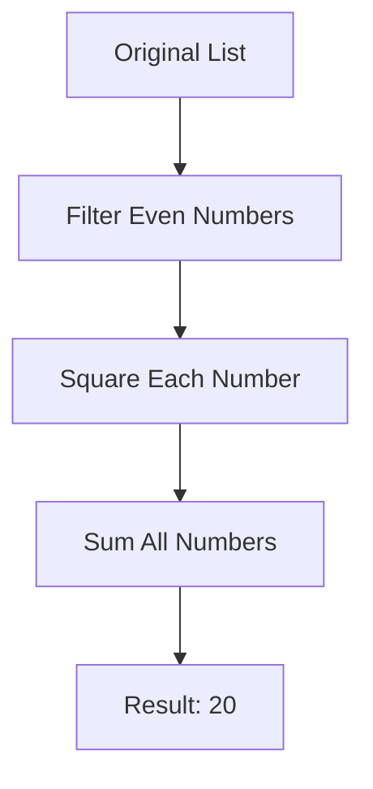

## 11.10 Techniques for Data Transformation

In the world of functional programming, data transformation is a fundamental concept that allows developers to manipulate and process data efficiently. Erlang, with its robust functional programming capabilities, provides a rich set of tools and techniques for transforming data. In this section, we will explore some of the most common data transformation techniques in Erlang, including `map`, `filter`, and `fold`, and demonstrate how these can be applied to lists and other collections. We will also discuss the importance of pure functions in these transformations and how to leverage Erlang's standard library for efficient data manipulation.

### Understanding Data Transformation

Data transformation involves converting data from one format or structure to another. In functional programming, this is often achieved through the use of higher-order functions that operate on collections of data, such as lists, tuples, or maps. These functions allow you to apply a transformation to each element of a collection, filter elements based on a condition, or accumulate values into a single result.

### Key Concepts in Data Transformation

Before diving into specific techniques, let's review some key concepts that are essential for understanding data transformation in Erlang:

- **Pure Functions**: Functions that have no side effects and return the same result given the same input. Pure functions are crucial in functional programming as they ensure predictability and reliability in data transformations.
- **Higher-Order Functions**: Functions that take other functions as arguments or return them as results. Higher-order functions are the backbone of data transformation techniques like `map`, `filter`, and `fold`.
- **Immutability**: In Erlang, data structures are immutable, meaning they cannot be changed once created. This immutability is a cornerstone of functional programming and ensures that data transformations do not alter the original data.

### Common Data Transformation Functions

#### Map

The `map` function is used to apply a transformation to each element in a list. It takes a function and a list as arguments and returns a new list with the transformed elements.

```erlang
% Define a function to double a number
double(X) -> X * 2.

% Use map to apply the double function to each element in the list
DoubledList = lists:map(fun double/1, [1, 2, 3, 4, 5]).
% Result: [2, 4, 6, 8, 10]
```

In this example, the `double` function is applied to each element of the list `[1, 2, 3, 4, 5]`, resulting in a new list `[2, 4, 6, 8, 10]`.

#### Filter

The `filter` function is used to select elements from a list that satisfy a given condition. It takes a predicate function and a list as arguments and returns a new list containing only the elements for which the predicate returns `true`.

```erlang
% Define a predicate function to check if a number is even
is_even(X) -> X rem 2 == 0.

% Use filter to select even numbers from the list
EvenList = lists:filter(fun is_even/1, [1, 2, 3, 4, 5]).
% Result: [2, 4]
```

Here, the `is_even` function is used to filter out odd numbers, resulting in a list of even numbers `[2, 4]`.

#### Fold (Reduce)

The `fold` function, also known as `reduce`, is used to accumulate a result by applying a function to each element of a list, along with an accumulator. There are two variants: `foldl` (fold left) and `foldr` (fold right).

```erlang
% Define a function to sum two numbers
sum(X, Acc) -> X + Acc.

% Use foldl to sum all elements in the list
Sum = lists:foldl(fun sum/2, 0, [1, 2, 3, 4, 5]).
% Result: 15
```

In this example, `foldl` is used to sum all elements of the list `[1, 2, 3, 4, 5]`, starting with an accumulator value of `0`.

### Combining Transformations

One of the strengths of functional programming is the ability to combine transformations to perform complex data processing tasks. By chaining functions like `map`, `filter`, and `fold`, you can create powerful data pipelines.

```erlang
% Define a function to square a number
square(X) -> X * X.

% Combine map, filter, and fold to process the list
Result = lists:foldl(fun sum/2, 0,
                     lists:map(fun square/1,
                               lists:filter(fun is_even/1, [1, 2, 3, 4, 5]))).
% Result: 20
```

In this example, we first filter the list to keep only even numbers, then map the `square` function over the filtered list, and finally fold the results to compute the sum of squares of even numbers.

### Importance of Pure Functions

Pure functions play a vital role in data transformation as they ensure that transformations are predictable and do not produce side effects. This predictability is crucial for debugging and reasoning about code, especially in concurrent and distributed systems like those built with Erlang.

### Leveraging Erlang's Standard Library

Erlang's standard library provides a wealth of functions for data manipulation, making it easy to perform common transformations efficiently. Functions like `lists:map/2`, `lists:filter/2`, and `lists:foldl/3` are optimized for performance and should be preferred over custom implementations.

### Try It Yourself

Experiment with the code examples provided by modifying the transformation functions or the input data. For instance, try changing the `double` function to triple the numbers, or filter for odd numbers instead of even ones. Observe how these changes affect the results.

### Visualizing Data Transformation

To better understand the flow of data through transformations, let's visualize the process using a flowchart:



This flowchart illustrates the sequence of transformations applied to the list `[1, 2, 3, 4, 5]`, resulting in the final sum of squares of even numbers.

### References and Further Reading

- [Erlang Documentation](https://www.erlang.org/doc/)
- [Functional Programming Concepts](https://en.wikipedia.org/wiki/Functional_programming)
- [Higher-Order Functions](https://en.wikipedia.org/wiki/Higher-order_function)

### Knowledge Check

- What are pure functions, and why are they important in data transformation?
- How can you combine `map`, `filter`, and `fold` to perform complex data processing?
- Why should you prefer Erlang's standard library functions for data manipulation?

### Summary

In this section, we've explored the fundamental techniques for data transformation in Erlang using functional programming paradigms. We've covered the use of `map`, `filter`, and `fold` functions, demonstrated how to combine transformations, and highlighted the importance of pure functions. By leveraging Erlang's standard library, you can efficiently manipulate data and build robust, scalable applications.

Remember, this is just the beginning. As you progress, you'll discover more advanced techniques and patterns for data transformation. Keep experimenting, stay curious, and enjoy the journey!

## Quiz: Techniques for Data Transformation



### What is the primary purpose of the `map` function in Erlang?

- [x] To apply a transformation to each element in a list
- [ ] To filter elements from a list based on a condition
- [ ] To accumulate values into a single result
- [ ] To sort elements in a list

> **Explanation:** The `map` function is used to apply a transformation to each element in a list, resulting in a new list with transformed elements.

### Which function would you use to select elements from a list that satisfy a given condition?

- [ ] map
- [x] filter
- [ ] foldl
- [ ] foldr

> **Explanation:** The `filter` function is used to select elements from a list that satisfy a given condition, returning a new list with only those elements.

### What is the difference between `foldl` and `foldr`?

- [x] `foldl` processes elements from left to right, while `foldr` processes from right to left
- [ ] `foldl` is used for lists, while `foldr` is used for tuples
- [ ] `foldl` is faster than `foldr`
- [ ] There is no difference

> **Explanation:** `foldl` processes elements from left to right, while `foldr` processes elements from right to left, which can affect the result depending on the operation being performed.

### Why are pure functions important in data transformation?

- [x] They ensure predictability and reliability
- [ ] They allow for mutable state
- [ ] They are faster than impure functions
- [ ] They require less memory

> **Explanation:** Pure functions are important because they ensure predictability and reliability in data transformations, as they have no side effects and always return the same result given the same input.

### How can you combine `map`, `filter`, and `fold` to perform complex data processing?

- [x] By chaining them together in a sequence
- [ ] By using them in separate functions
- [ ] By avoiding their use altogether
- [ ] By using only one of them

> **Explanation:** You can combine `map`, `filter`, and `fold` by chaining them together in a sequence to perform complex data processing tasks.

### What is the result of applying `lists:map(fun(X) -> X * 2 end, [1, 2, 3])`?

- [x] [2, 4, 6]
- [ ] [1, 2, 3]
- [ ] [3, 6, 9]
- [ ] [0, 2, 4]

> **Explanation:** The `map` function applies the transformation `X * 2` to each element in the list `[1, 2, 3]`, resulting in `[2, 4, 6]`.

### Which Erlang standard library module provides functions like `map`, `filter`, and `fold`?

- [x] lists
- [ ] maps
- [ ] tuples
- [ ] sets

> **Explanation:** The `lists` module in Erlang's standard library provides functions like `map`, `filter`, and `fold` for list manipulation.

### What is the initial value used in a `fold` operation called?

- [x] Accumulator
- [ ] Predicate
- [ ] Transformer
- [ ] Iterator

> **Explanation:** The initial value used in a `fold` operation is called the accumulator, which is used to accumulate the result as the function processes each element.

### What does the `filter` function return if no elements satisfy the condition?

- [x] An empty list
- [ ] The original list
- [ ] A list with `nil` values
- [ ] An error

> **Explanation:** If no elements satisfy the condition in a `filter` operation, the function returns an empty list.

### True or False: In Erlang, data structures are mutable.

- [ ] True
- [x] False

> **Explanation:** In Erlang, data structures are immutable, meaning they cannot be changed once created. This immutability is a key feature of functional programming.


