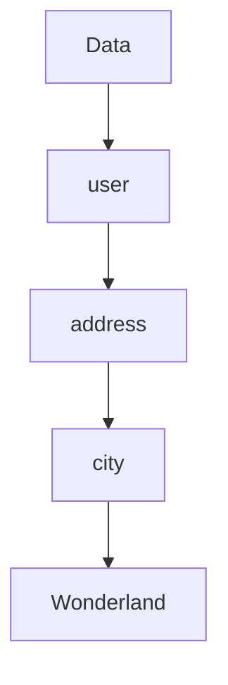

## 11.11 Accessing Nested Data Structures

In the realm of functional programming, immutability is a cornerstone principle that influences how we handle data. Erlang, as a functional language, embraces immutability, which presents unique challenges and opportunities when working with nested data structures. This section delves into methods for accessing and updating nested data structures in Erlang, ensuring that we maintain immutability while efficiently managing complex data.

### Understanding the Challenges

When dealing with nested data structures in an immutable system like Erlang, the primary challenge is updating data without altering the original structure. This requires creating a new version of the data structure with the desired changes, which can be non-trivial when dealing with deeply nested fields.

### Accessing Nested Fields with Pattern Matching

Pattern matching is a powerful feature in Erlang that allows us to destructure data and access nested fields with ease. Let's explore how pattern matching can be used to access nested data:

```erlang
% Define a nested data structure using maps
Data = #{user => #{name => "Alice", address => #{city => "Wonderland", zip => 12345}}}.

% Access the city field using pattern matching
#{user := #{address := #{city := City}}} = Data.

% City now holds the value "Wonderland"
io:format("City: ~s~n", [City]).
```

In this example, we define a nested map structure and use pattern matching to extract the `city` field. This approach is concise and leverages Erlang's pattern matching capabilities to access deeply nested fields.

### Updating Nested Data Without Mutation

Updating nested data structures in an immutable way involves creating a new structure with the updated values. Erlang provides functions like `maps:update_with/3` to facilitate this process:

```erlang
% Function to update the city in a nested map
update_city(Data, NewCity) ->
    maps:update_with(user, fun(User) ->
        maps:update_with(address, fun(Address) ->
            maps:put(city, NewCity, Address)
        end, User)
    end, Data).

% Update the city to "New Wonderland"
NewData = update_city(Data, "New Wonderland").

% Verify the update
io:format("Updated City: ~s~n", [maps:get(city, maps:get(address, maps:get(user, NewData)))]).
```

Here, we define a function `update_city/2` that updates the `city` field in a nested map. The `maps:update_with/3` function is used to traverse and update the nested structure, ensuring immutability by returning a new map.

### Libraries and Helper Functions

While Erlang's standard library provides basic tools for working with maps, there are libraries and helper functions that simplify nested data access and updates. One such library is `erlware_commons`, which offers utilities for handling nested structures.

#### Using `erlware_commons` for Nested Access

```erlang
% Example using erlware_commons
-include_lib("erlware_commons/include/ec_map.hrl").

% Access nested data using ec_map:get_path/2
City = ec_map:get_path([user, address, city], Data).

% Update nested data using ec_map:put_path/3
NewData = ec_map:put_path([user, address, city], "New Wonderland", Data).

% Verify the update
io:format("Updated City: ~s~n", [ec_map:get_path([user, address, city], NewData)]).
```

The `erlware_commons` library provides `get_path/2` and `put_path/3` functions, which allow for concise access and updates of nested fields using a path list. This approach reduces boilerplate code and enhances readability.

### Encouraging Clear and Concise Handling

When working with complex data structures, it's crucial to maintain clarity and conciseness in your code. Here are some best practices:

- **Use Descriptive Variable Names**: Clearly name variables to reflect their purpose and content.
- **Leverage Pattern Matching**: Use pattern matching to destructure and access data, reducing the need for verbose accessors.
- **Modularize Code**: Break down complex operations into smaller, reusable functions.
- **Document Your Code**: Provide comments and documentation to explain the structure and purpose of your data.

### Visualizing Nested Data Access

To better understand how nested data access works, let's visualize the process using a diagram:



This diagram represents the path taken to access the `city` field within a nested map structure. Each node represents a level of nesting, illustrating the traversal process.

### Try It Yourself

To deepen your understanding, try modifying the code examples:

- Change the structure of the nested data and update different fields.
- Implement a function to remove a nested field.
- Experiment with different libraries for nested data access.

### References and Further Reading

- [Erlang Maps Documentation](https://www.erlang.org/doc/man/maps.html)
- [Erlware Commons Library](https://github.com/erlware/erlware_commons)

### Knowledge Check

- What are the challenges of working with nested data in immutable systems?
- How does pattern matching facilitate nested data access in Erlang?
- What is the purpose of `maps:update_with/3` in updating nested data?
- How can libraries like `erlware_commons` simplify nested data handling?

### Summary

In this section, we've explored methods for accessing and updating nested data structures in Erlang. By leveraging pattern matching and functional programming techniques, we can manage complex data while maintaining immutability. Remember, mastering these concepts is a journey, so keep experimenting and refining your skills!

## Quiz: Accessing Nested Data Structures



### What is a primary challenge when working with nested data structures in Erlang?

- [x] Updating data without altering the original structure
- [ ] Accessing top-level fields
- [ ] Using mutable data
- [ ] Implementing recursion

> **Explanation:** In Erlang, immutability requires creating a new version of the data structure with updates, which is challenging for deeply nested fields.

### How does pattern matching help in accessing nested data?

- [x] It allows destructuring data to access nested fields
- [ ] It mutates the data structure
- [ ] It simplifies recursion
- [ ] It creates new data structures

> **Explanation:** Pattern matching in Erlang enables direct access to nested fields by destructuring the data structure.

### Which function is used to update nested data in Erlang?

- [x] maps:update_with/3
- [ ] lists:map/2
- [ ] io:format/2
- [ ] gen_server:call/2

> **Explanation:** The `maps:update_with/3` function is used to update nested fields in a map while maintaining immutability.

### What does the `erlware_commons` library provide?

- [x] Utilities for handling nested structures
- [ ] A new data type for nested data
- [ ] A mutable data structure
- [ ] A concurrency model

> **Explanation:** The `erlware_commons` library offers utilities like `get_path/2` and `put_path/3` for accessing and updating nested data.

### What is a best practice when handling complex data structures?

- [x] Use descriptive variable names
- [ ] Avoid using pattern matching
- [ ] Use global variables
- [ ] Minimize documentation

> **Explanation:** Descriptive variable names enhance code readability and maintainability, especially in complex data structures.

### Which of the following is a benefit of using pattern matching?

- [x] Reduces the need for verbose accessors
- [ ] Increases code complexity
- [ ] Requires mutable data
- [ ] Limits data access

> **Explanation:** Pattern matching allows for concise and direct access to data fields, reducing the need for additional accessors.

### How can you visualize nested data access?

- [x] Using diagrams to represent data paths
- [ ] By writing more code
- [ ] By using mutable data structures
- [ ] By ignoring data structure complexity

> **Explanation:** Diagrams can effectively illustrate the path taken to access nested fields, aiding in understanding.

### What is the role of `maps:get/2` in Erlang?

- [x] It retrieves a value from a map
- [ ] It updates a map
- [ ] It deletes a map entry
- [ ] It creates a new map

> **Explanation:** The `maps:get/2` function is used to retrieve a value associated with a key in a map.

### Which of these is a key takeaway from this section?

- [x] Maintaining immutability while handling nested data
- [ ] Using mutable data for efficiency
- [ ] Avoiding pattern matching
- [ ] Ignoring data structure complexity

> **Explanation:** The section emphasizes the importance of maintaining immutability when accessing and updating nested data structures.

### True or False: Erlang allows direct mutation of nested data structures.

- [ ] True
- [x] False

> **Explanation:** Erlang is a functional language that emphasizes immutability, so direct mutation of data structures is not allowed.


