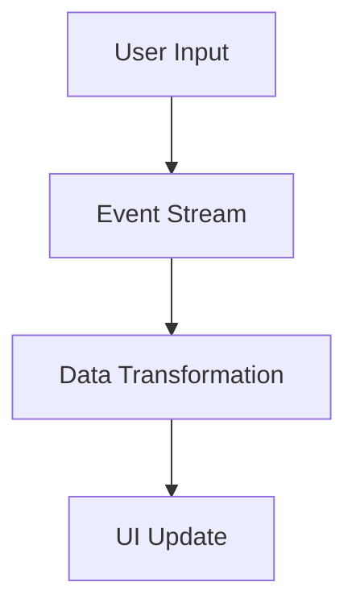

## 11.12 Functional Reactive Programming Concepts

Functional Reactive Programming (FRP) is a programming paradigm that combines the declarative nature of functional programming with the dynamic behavior of reactive systems. It is particularly well-suited for applications that require real-time data processing, such as user interfaces, games, and data streams. In this section, we will explore the core concepts of FRP, how it relates to Erlang's concurrency model, and how to implement reactive data flows in Erlang.

### Understanding Functional Reactive Programming

FRP is built on the principles of functional programming, which emphasizes immutability, pure functions, and higher-order functions. It extends these principles to handle time-varying values and asynchronous events, allowing developers to express complex data flows and interactions in a concise and declarative manner.

#### Key Principles of FRP

1. **Time-Varying Values**: In FRP, values can change over time. These are often referred to as "signals" or "behaviors." For example, the position of a mouse cursor is a time-varying value.

2. **Event Streams**: FRP models asynchronous events as streams. These streams can be transformed, filtered, and combined using functional operators.

3. **Declarative Data Flow**: FRP allows developers to define data flows declaratively. Instead of specifying how to compute a value, you describe what the value should be based on other values.

4. **Composability**: FRP systems are highly composable, allowing developers to build complex systems by combining simpler components.

### FRP and Erlang's Concurrency Model

Erlang is renowned for its concurrency model, which is based on lightweight processes and message passing. This model aligns well with the reactive nature of FRP, as it allows for the seamless handling of asynchronous events and data flows.

#### Erlang's Concurrency Features

- **Processes**: Erlang processes are lightweight and can be used to model individual components of a reactive system.
- **Message Passing**: Erlang's message-passing mechanism is ideal for implementing event streams and reactive data flows.
- **Fault Tolerance**: Erlang's "let it crash" philosophy ensures that systems remain robust in the face of errors, which is crucial for reactive systems that must handle unpredictable events.

### Implementing Reactive Data Flows in Erlang

To implement reactive data flows in Erlang, we can leverage its concurrency primitives and functional programming features. Let's explore some examples.

#### Example 1: Reactive Event Stream

```erlang
-module(reactive_example).
-export([start/0, handle_event/1]).

start() ->
    % Start a process to handle events
    Pid = spawn(fun() -> event_loop([]) end),
    % Send some events
    Pid ! {event, "Event 1"},
    Pid ! {event, "Event 2"},
    Pid ! {event, "Event 3"}.

event_loop(Events) ->
    receive
        {event, Data} ->
            % Process the event and update the state
            NewEvents = [Data | Events],
            io:format("Received event: ~p~n", [Data]),
            event_loop(NewEvents);
        stop ->
            io:format("Stopping event loop.~n")
    end.
```

In this example, we create a simple event loop that receives events and processes them. The `event_loop/1` function maintains a list of received events and prints each event as it arrives.

#### Example 2: Time-Varying Values

```erlang
-module(time_varying_example).
-export([start/0, update_position/2]).

start() ->
    % Start a process to track position
    Pid = spawn(fun() -> position_loop({0, 0}) end),
    % Update the position over time
    Pid ! {update, {10, 20}},
    Pid ! {update, {30, 40}},
    Pid ! stop.

position_loop(Position) ->
    receive
        {update, NewPosition} ->
            io:format("Position updated: ~p~n", [NewPosition]),
            position_loop(NewPosition);
        stop ->
            io:format("Stopping position loop.~n")
    end.
```

This example demonstrates how to model a time-varying value, such as a position, using Erlang processes. The `position_loop/1` function updates the position based on incoming messages.

### Use Cases for FRP in Erlang

FRP is particularly useful in scenarios where real-time data processing is required. Here are some potential use cases:

1. **User Interfaces**: FRP can be used to build responsive user interfaces that react to user input and other events.

2. **Games**: In game development, FRP can model game state and interactions in a declarative manner.

3. **Data Streams**: FRP is ideal for processing continuous data streams, such as sensor data or financial market data.

4. **Real-Time Analytics**: FRP can be used to build systems that perform real-time analytics on incoming data.

### Libraries and Frameworks Supporting FRP in Erlang

While Erlang does not have native support for FRP, several libraries and frameworks can help implement FRP concepts:

- **ReactiveX**: Although primarily used in other languages, the concepts of ReactiveX can be adapted to Erlang's concurrency model.
- **Erlang/OTP**: The OTP framework provides tools and patterns that can be used to implement reactive systems.

### Visualizing Reactive Data Flows

To better understand how reactive data flows work, let's visualize a simple data flow using Mermaid.js.



This diagram represents a typical reactive data flow in a user interface application. User input generates events, which are transformed and used to update the UI.

### Try It Yourself

To deepen your understanding of FRP in Erlang, try modifying the examples provided:

- **Experiment with Different Events**: Modify the `reactive_example` to handle different types of events and see how the system behaves.
- **Implement a Simple UI**: Use the `time_varying_example` to simulate a simple UI component that updates based on user input.

### Knowledge Check

- **What are the key principles of FRP?**
- **How does Erlang's concurrency model support FRP?**
- **What are some potential use cases for FRP in Erlang?**

### Summary

Functional Reactive Programming offers a powerful paradigm for building responsive and dynamic systems. By leveraging Erlang's concurrency model, developers can implement reactive data flows that handle real-time events and data streams efficiently. As you continue to explore FRP, remember to experiment with different patterns and techniques to find the best solutions for your applications.

## Quiz: Functional Reactive Programming Concepts



### What is a key principle of Functional Reactive Programming?

- [x] Time-varying values
- [ ] Mutable state
- [ ] Synchronous execution
- [ ] Object-oriented design

> **Explanation:** FRP focuses on time-varying values, allowing developers to model dynamic behaviors over time.

### How does Erlang's concurrency model align with FRP?

- [x] Through lightweight processes and message passing
- [ ] By using shared memory
- [ ] By enforcing synchronous execution
- [ ] By relying on global state

> **Explanation:** Erlang's concurrency model, with its lightweight processes and message-passing mechanism, is well-suited for implementing reactive data flows.

### Which of the following is a potential use case for FRP in Erlang?

- [x] Real-time data processing
- [ ] Static website generation
- [ ] Batch processing
- [ ] File system operations

> **Explanation:** FRP is ideal for real-time data processing, where dynamic and responsive behavior is required.

### What is an event stream in FRP?

- [x] A sequence of asynchronous events
- [ ] A static list of values
- [ ] A mutable data structure
- [ ] A synchronous function call

> **Explanation:** In FRP, an event stream represents a sequence of asynchronous events that can be transformed and combined.

### Which Erlang feature is crucial for implementing FRP?

- [x] Message passing
- [ ] Global variables
- [ ] Synchronous I/O
- [ ] Object inheritance

> **Explanation:** Message passing is crucial for implementing FRP in Erlang, as it allows for the handling of asynchronous events.

### What is a common use of time-varying values in FRP?

- [x] Modeling dynamic behaviors
- [ ] Storing static configurations
- [ ] Defining constant values
- [ ] Implementing global state

> **Explanation:** Time-varying values are used to model dynamic behaviors that change over time, such as user interactions or sensor data.

### How can Erlang's "let it crash" philosophy benefit FRP systems?

- [x] By ensuring robustness in the face of errors
- [ ] By promoting mutable state
- [ ] By enforcing synchronous execution
- [ ] By relying on global state

> **Explanation:** Erlang's "let it crash" philosophy ensures that systems remain robust and can recover from errors, which is important for reactive systems.

### What is a benefit of declarative data flow in FRP?

- [x] Simplified expression of complex interactions
- [ ] Increased reliance on mutable state
- [ ] Reduced code readability
- [ ] Enforced synchronous execution

> **Explanation:** Declarative data flow allows developers to express complex interactions in a simplified and readable manner.

### Which library or framework can support FRP in Erlang?

- [x] Erlang/OTP
- [ ] JavaFX
- [ ] React.js
- [ ] Angular

> **Explanation:** Erlang/OTP provides tools and patterns that can be used to implement reactive systems in Erlang.

### True or False: FRP is only suitable for GUI applications.

- [ ] True
- [x] False

> **Explanation:** FRP is not limited to GUI applications; it can be applied to any system requiring real-time data processing and dynamic behavior.



Remember, this is just the beginning. As you progress, you'll build more complex and interactive systems. Keep experimenting, stay curious, and enjoy the journey!
