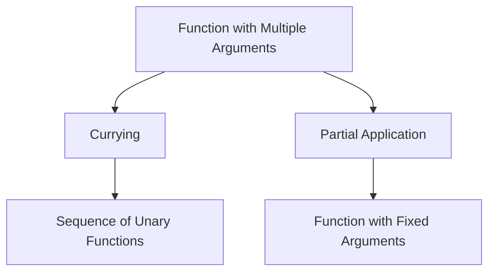

## 11.2 Currying and Partial Application

In the realm of functional programming, currying and partial application are powerful techniques that transform functions to simplify complex operations. These techniques are particularly useful in Erlang, a language known for its functional and concurrent programming capabilities. In this section, we will explore what currying and partial application are, how they differ, and how they can be implemented in Erlang to enhance code reuse and modularity.

### Understanding Currying and Partial Application

#### Currying

Currying is a technique in functional programming where a function with multiple arguments is transformed into a sequence of functions, each taking a single argument. This transformation allows functions to be applied partially, one argument at a time.

**Example of Currying:**

Consider a function `add(x, y)` that adds two numbers. In a curried form, it becomes `add(x)(y)`, where `add(x)` returns a new function that takes `y` as an argument.

#### Partial Application

Partial application, on the other hand, refers to the process of fixing a few arguments of a function, producing another function of smaller arity. Unlike currying, partial application does not necessarily transform a function into a sequence of unary functions.

**Example of Partial Application:**

Using the same `add(x, y)` function, partial application might involve fixing the first argument, resulting in a new function `add5(y)`, which adds 5 to its argument.

### Implementing Currying in Erlang

Erlang, being a functional language, supports higher-order functions, which makes it possible to implement currying. Let's see how we can achieve this.

```erlang
% Define a function that returns another function
-module(currying_example).
-export([curried_add/1, add/2]).

% Curried version of add
curried_add(X) ->
    fun(Y) -> X + Y end.

% Traditional add function
add(X, Y) ->
    X + Y.
```

In this example, `curried_add/1` is a curried version of the `add/2` function. It takes one argument `X` and returns a new function that takes another argument `Y`.

### Partial Application in Erlang

Partial application can be achieved using closures in Erlang. Let's see how we can partially apply functions.

```erlang
% Define a function that partially applies another function
-module(partial_application_example).
-export([partial_add/1, add/2]).

% Partial application of add
partial_add(X) ->
    fun(Y) -> add(X, Y) end.

% Traditional add function
add(X, Y) ->
    X + Y.
```

Here, `partial_add/1` partially applies the `add/2` function by fixing the first argument `X`. The resulting function can then be used to add `X` to any other number.

### Practical Benefits of Currying and Partial Application

#### Code Reuse and Modularity

Currying and partial application promote code reuse and modularity by allowing functions to be decomposed into smaller, reusable components. This decomposition makes it easier to build complex operations from simpler ones.

#### Simplifying Repetitive Tasks

By fixing certain arguments, partial application can simplify repetitive tasks. For instance, if you frequently need to add 5 to various numbers, you can create a partially applied function `add5` and reuse it throughout your code.

### Encouraging Experimentation

To truly grasp the power of currying and partial application, it's essential to experiment with these techniques. Try transforming existing functions in your codebase into curried or partially applied forms and observe how it affects readability and maintainability.

### Visualizing Currying and Partial Application

To better understand how currying and partial application work, let's visualize these concepts using a flowchart.



**Figure 1:** This diagram illustrates the transformation of a function with multiple arguments into a sequence of unary functions through currying, and into a function with fixed arguments through partial application.

### Try It Yourself

To deepen your understanding, try modifying the code examples provided:

1. **Experiment with Different Functions:** Try currying and partially applying different functions, such as multiplication or string concatenation.
2. **Combine Currying and Partial Application:** Create a function that uses both currying and partial application to achieve a specific task.
3. **Analyze Performance:** Measure the performance impact of using curried and partially applied functions in a real-world application.

### References and Further Reading

- [Erlang Documentation](https://www.erlang.org/docs)
- [Functional Programming Concepts](https://en.wikipedia.org/wiki/Functional_programming)
- [Currying on Wikipedia](https://en.wikipedia.org/wiki/Currying)

### Knowledge Check

Before moving on, let's reinforce what we've learned:

- **What is the main difference between currying and partial application?**
- **How can currying enhance code modularity?**
- **Why is partial application useful in repetitive tasks?**

### Conclusion

Currying and partial application are powerful techniques in functional programming that can transform the way you write and think about code. By breaking down complex functions into simpler, reusable components, you can enhance the modularity and readability of your code. Remember, this is just the beginning. As you progress, you'll discover even more ways to leverage these techniques in your Erlang applications. Keep experimenting, stay curious, and enjoy the journey!

## Quiz: Currying and Partial Application



### What is currying in functional programming?

- [x] Transforming a function with multiple arguments into a sequence of functions with a single argument each.
- [ ] Fixing a few arguments of a function to produce another function of smaller arity.
- [ ] A method to optimize recursive functions.
- [ ] A technique to handle errors in functional programming.

> **Explanation:** Currying involves transforming a function with multiple arguments into a sequence of unary functions.

### What is partial application?

- [ ] Transforming a function with multiple arguments into a sequence of functions with a single argument each.
- [x] Fixing a few arguments of a function to produce another function of smaller arity.
- [ ] A method to optimize recursive functions.
- [ ] A technique to handle errors in functional programming.

> **Explanation:** Partial application involves fixing some arguments of a function, resulting in a new function with fewer arguments.

### How does currying enhance code modularity?

- [x] By breaking down complex functions into simpler, reusable components.
- [ ] By increasing the number of arguments a function can take.
- [ ] By reducing the execution time of functions.
- [ ] By making functions more complex.

> **Explanation:** Currying enhances code modularity by decomposing functions into smaller, reusable parts.

### Why is partial application useful in repetitive tasks?

- [x] It allows fixing certain arguments, simplifying the repeated use of functions.
- [ ] It increases the complexity of functions.
- [ ] It makes functions slower to execute.
- [ ] It reduces the readability of code.

> **Explanation:** Partial application simplifies repetitive tasks by fixing certain arguments, making functions easier to reuse.

### Can currying and partial application be combined?

- [x] Yes
- [ ] No

> **Explanation:** Currying and partial application can be combined to achieve more flexible and reusable functions.

### What is a higher-order function?

- [x] A function that takes other functions as arguments or returns a function as a result.
- [ ] A function that only takes primitive data types as arguments.
- [ ] A function that cannot be reused.
- [ ] A function that is always recursive.

> **Explanation:** Higher-order functions can take other functions as arguments or return them as results, enabling currying and partial application.

### Which Erlang feature supports currying and partial application?

- [x] Higher-order functions
- [ ] Macros
- [ ] Records
- [ ] Processes

> **Explanation:** Higher-order functions in Erlang enable currying and partial application by allowing functions to be passed as arguments or returned as results.

### What is the result of currying a function?

- [x] A sequence of unary functions
- [ ] A function with fixed arguments
- [ ] A function with increased arity
- [ ] A function that cannot be reused

> **Explanation:** Currying transforms a function into a sequence of unary functions, each taking a single argument.

### How does partial application affect function arity?

- [x] It reduces the arity by fixing some arguments.
- [ ] It increases the arity by adding more arguments.
- [ ] It does not affect the arity.
- [ ] It makes the function non-functional.

> **Explanation:** Partial application reduces the arity of a function by fixing some of its arguments.

### Currying and partial application are only applicable in Erlang.

- [ ] True
- [x] False

> **Explanation:** Currying and partial application are concepts in functional programming and are applicable in many functional languages, not just Erlang.


