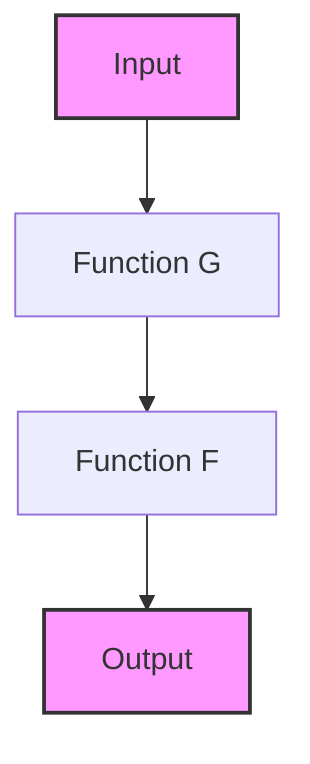

## 11.3 Higher-Order Functions and Function Composition

In this section, we delve into the concepts of higher-order functions and function composition in Erlang. These powerful tools allow developers to create more modular, expressive, and concise code. By understanding and utilizing these concepts, you can unlock new levels of abstraction and flexibility in your Erlang applications.

### Understanding Higher-Order Functions

Higher-order functions are a fundamental concept in functional programming. They are functions that can take other functions as arguments or return functions as results. This capability allows for greater abstraction and code reuse.

#### Key Characteristics of Higher-Order Functions

1. **Function as Argument**: A higher-order function can accept one or more functions as parameters.
2. **Function as Return Value**: It can return a function as its result.
3. **Function Manipulation**: It can manipulate functions, allowing for dynamic behavior.

#### Examples of Higher-Order Functions

Let's explore some examples to solidify our understanding of higher-order functions in Erlang.

```erlang
% Define a simple function that adds two numbers
add(X, Y) -> X + Y.

% Define a higher-order function that takes a function and two numbers
apply_function(Fun, A, B) -> Fun(A, B).

% Use the higher-order function
Result = apply_function(fun add/2, 5, 3).
% Result is 8
```

In this example, `apply_function/3` is a higher-order function that takes another function `Fun` and two numbers `A` and `B`. It applies `Fun` to `A` and `B`, demonstrating how functions can be passed around and used dynamically.

### Function Composition

Function composition is the process of combining two or more functions to produce a new function. This new function represents the application of the original functions in sequence. Function composition is a powerful tool for building complex operations from simpler ones.

#### The Compose Pattern

The compose pattern is a common way to implement function composition. It involves creating a new function that applies one function to the result of another.

```erlang
% Define a function that doubles a number
double(X) -> X * 2.

% Define a function that increments a number
increment(X) -> X + 1.

% Define a compose function
compose(F, G) ->
    fun(X) -> F(G(X)) end.

% Create a new function by composing double and increment
double_then_increment = compose(fun increment/1, fun double/1).

% Use the composed function
Result = double_then_increment(3).
% Result is 7 (3 * 2 + 1)
```

In this example, `compose/2` is a higher-order function that takes two functions, `F` and `G`, and returns a new function. This new function applies `G` to its argument and then applies `F` to the result.

### Custom Combinators

Combinators are higher-order functions that combine other functions in specific ways. They are useful for creating reusable patterns of function composition.

#### Example: The Pipeline Combinator

The pipeline combinator allows you to chain functions together in a linear sequence, similar to Unix pipes.

```erlang
% Define a pipeline combinator
pipeline(Funs) ->
    lists:foldl(fun(F, Acc) -> F(Acc) end, fun(X) -> X end, Funs).

% Define some simple functions
square(X) -> X * X.
negate(X) -> -X.

% Create a pipeline of functions
pipeline_fun = pipeline([fun double/1, fun increment/1, fun square/1, fun negate/1]).

% Use the pipeline function
Result = pipeline_fun(2).
% Result is -36 ((2 * 2 + 1)^2 * -1)
```

In this example, `pipeline/1` is a combinator that takes a list of functions and returns a new function. This new function applies each function in the list to its argument in sequence.

### Benefits of Higher-Order Functions and Function Composition

Higher-order functions and function composition offer several benefits for Erlang developers:

1. **Modularity**: By breaking down complex operations into smaller functions, you can create more modular and maintainable code.
2. **Reusability**: Higher-order functions and combinators allow you to reuse common patterns of computation.
3. **Expressiveness**: Function composition enables you to express complex operations concisely and clearly.
4. **Flexibility**: By passing functions as arguments, you can create flexible and dynamic behavior.

### Encouraging Expressive and Concise Code

To make the most of higher-order functions and function composition, consider the following tips:

- **Identify Reusable Patterns**: Look for common patterns in your code that can be abstracted into higher-order functions or combinators.
- **Compose Functions Thoughtfully**: Use function composition to build complex operations from simpler ones, enhancing readability and maintainability.
- **Experiment with Combinators**: Create custom combinators to encapsulate common patterns of function composition.

### Visualizing Function Composition

To better understand function composition, let's visualize the process using a flowchart.



**Description**: This diagram illustrates the flow of data through two composed functions, `G` and `F`. The input is first processed by `G`, and the result is then passed to `F`, producing the final output.

### Try It Yourself

To deepen your understanding, try modifying the code examples provided:

- **Experiment with Different Functions**: Replace `double/1` and `increment/1` with your own functions in the composition example.
- **Create New Combinators**: Design a new combinator that combines functions in a different way, such as applying them in parallel.
- **Visualize Your Compositions**: Use the Mermaid.js syntax to create your own diagrams of function compositions.

### References and Further Reading

- [Erlang Documentation on Functions](https://www.erlang.org/doc/reference_manual/functions.html)
- [Functional Programming Concepts](https://en.wikipedia.org/wiki/Functional_programming)
- [Higher-Order Functions in Programming](https://en.wikipedia.org/wiki/Higher-order_function)

### Knowledge Check

- **What is a higher-order function?**
- **How does function composition enhance code modularity?**
- **What are combinators, and how can they be used?**

### Embrace the Journey

Remember, mastering higher-order functions and function composition is just the beginning. As you continue to explore these concepts, you'll discover new ways to create powerful abstractions and expressive code. Keep experimenting, stay curious, and enjoy the journey!

## Quiz: Higher-Order Functions and Function Composition



### What is a higher-order function?

- [x] A function that takes other functions as arguments or returns a function
- [ ] A function that only performs arithmetic operations
- [ ] A function that cannot be composed
- [ ] A function that is only used in object-oriented programming

> **Explanation:** Higher-order functions are those that can take other functions as arguments or return them as results, enabling greater abstraction and flexibility.

### What is the purpose of function composition?

- [x] To combine multiple functions into a single function
- [ ] To split a function into multiple smaller functions
- [ ] To make functions run in parallel
- [ ] To convert functions into objects

> **Explanation:** Function composition allows you to combine multiple functions into a single function, enabling complex operations to be built from simpler ones.

### How does the compose pattern work?

- [x] It creates a new function that applies one function to the result of another
- [ ] It creates a new function that applies functions in parallel
- [ ] It creates a new function that applies functions in reverse order
- [ ] It creates a new function that applies functions randomly

> **Explanation:** The compose pattern creates a new function that applies one function to the result of another, allowing for sequential application of functions.

### What is a combinator in the context of functional programming?

- [x] A higher-order function that combines other functions in specific ways
- [ ] A function that only works with numbers
- [ ] A function that cannot be reused
- [ ] A function that is only used for error handling

> **Explanation:** Combinators are higher-order functions that combine other functions in specific ways, enabling reusable patterns of function composition.

### What is the benefit of using higher-order functions?

- [x] They enhance code modularity and reusability
- [ ] They make code harder to read
- [ ] They are only useful in object-oriented programming
- [ ] They decrease code performance

> **Explanation:** Higher-order functions enhance code modularity and reusability by allowing functions to be passed around and used dynamically.

### What does the pipeline combinator do?

- [x] Chains functions together in a linear sequence
- [ ] Splits functions into separate threads
- [ ] Converts functions into objects
- [ ] Randomizes the order of function execution

> **Explanation:** The pipeline combinator chains functions together in a linear sequence, similar to Unix pipes, allowing for sequential application of functions.

### How can function composition improve code readability?

- [x] By expressing complex operations concisely and clearly
- [ ] By making code longer and more detailed
- [ ] By using more variables
- [ ] By avoiding the use of functions

> **Explanation:** Function composition improves code readability by expressing complex operations concisely and clearly, reducing the need for verbose code.

### What is the result of composing `double/1` and `increment/1`?

- [x] A function that doubles a number and then increments it
- [ ] A function that increments a number and then doubles it
- [ ] A function that only doubles a number
- [ ] A function that only increments a number

> **Explanation:** Composing `double/1` and `increment/1` results in a function that doubles a number and then increments it, applying the functions in sequence.

### What is the role of the `compose/2` function in Erlang?

- [x] To create a new function that applies one function to the result of another
- [ ] To create a new function that applies functions in parallel
- [ ] To create a new function that applies functions in reverse order
- [ ] To create a new function that applies functions randomly

> **Explanation:** The `compose/2` function in Erlang creates a new function that applies one function to the result of another, enabling sequential application of functions.

### True or False: Higher-order functions can only be used in functional programming languages.

- [ ] True
- [x] False

> **Explanation:** Higher-order functions can be used in many programming paradigms, not just functional programming, although they are a fundamental concept in functional programming.




