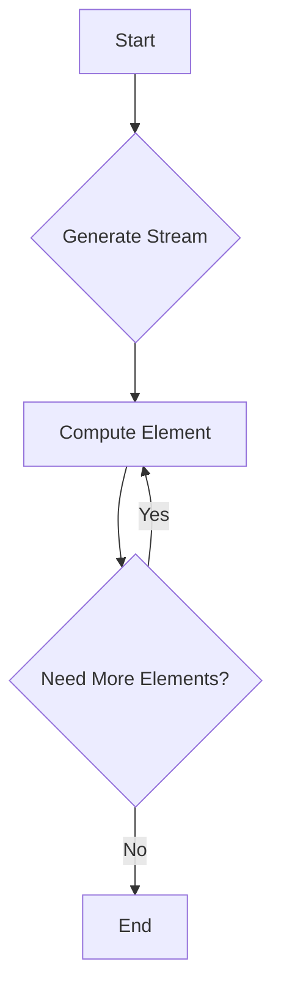

## 11.4 Lazy Evaluation Patterns

Lazy evaluation is a powerful concept in functional programming that allows us to delay the computation of expressions until their values are actually needed. This can lead to significant performance improvements by avoiding unnecessary calculations, especially in scenarios involving large data sets or complex computations. In this section, we'll explore how to implement lazy evaluation patterns in Erlang, a language known for its concurrency and functional programming capabilities.

### Understanding Lazy Evaluation

Lazy evaluation is a strategy that defers the evaluation of an expression until its value is required. This approach can lead to performance gains by:

- **Reducing unnecessary computations**: Only the values that are needed are computed, saving time and resources.
- **Allowing for infinite data structures**: With lazy evaluation, we can work with potentially infinite data structures, as only the required parts are evaluated.
- **Improving modularity**: Functions can be composed more flexibly, as computations are decoupled from their execution.

### Implementing Lazy Evaluation in Erlang

Erlang does not natively support lazy evaluation like some other functional languages (e.g., Haskell). However, we can simulate lazy evaluation using closures and streams.

#### Using Closures for Lazy Evaluation

Closures in Erlang can capture the environment in which they are created, allowing us to defer computation. Here's a simple example:

```erlang
-module(lazy_eval).
-export([lazy_square/1, force/1]).

% Create a lazy square computation
lazy_square(N) ->
    fun() -> N * N end.

% Force the evaluation of a lazy computation
force(LazyComputation) ->
    LazyComputation().
```

In this example, `lazy_square/1` returns a closure that encapsulates the computation of squaring a number. The computation is only performed when `force/1` is called.

#### Implementing Streams for Lazy Evaluation

Streams are another way to achieve lazy evaluation. A stream is a potentially infinite sequence of data elements, where each element is computed on demand. Here's how you can implement a simple stream in Erlang:

```erlang
-module(lazy_stream).
-export([from/1, take/2]).

% Create an infinite stream starting from N
from(N) ->
    fun() -> {N, from(N + 1)} end.

% Take the first N elements from a stream
take(0, _) ->
    [];
take(N, Stream) ->
    {Head, TailFun} = Stream(),
    [Head | take(N - 1, TailFun)].
```

In this example, `from/1` generates an infinite stream of integers starting from `N`. The `take/2` function extracts the first `N` elements from the stream, demonstrating how elements are computed only when needed.

### Benefits of Lazy Evaluation

Lazy evaluation can be particularly beneficial in scenarios such as:

- **Working with large data sets**: By computing only the necessary parts of a data set, we can save on memory and processing power.
- **Implementing algorithms with early exits**: Algorithms that can terminate early based on certain conditions can benefit from lazy evaluation, as unnecessary computations are avoided.
- **Creating modular and reusable code**: Lazy evaluation allows for more flexible function composition, as computations are decoupled from their execution.

### Avoiding Unnecessary Computations

Consider a scenario where we need to find the first even number in a large list. Without lazy evaluation, we might compute properties of all elements even after finding the result. With lazy evaluation, we can stop as soon as we find the first even number:

```erlang
-module(lazy_example).
-export([first_even/1]).

% Find the first even number in a list
first_even(List) ->
    lists:foldl(fun(X, Acc) ->
        case Acc of
            undefined when X rem 2 == 0 -> X;
            _ -> Acc
        end
    end, undefined, List).
```

This example uses `lists:foldl/3` to traverse the list, stopping as soon as an even number is found.

### Potential Pitfalls of Lazy Evaluation

While lazy evaluation offers many benefits, it also comes with potential pitfalls:

- **Increased memory usage**: Deferred computations can accumulate, leading to increased memory usage if not managed properly.
- **Complex debugging**: Lazy evaluation can make it harder to trace the flow of a program, as computations are not performed in a straightforward manner.
- **Unexpected performance costs**: In some cases, the overhead of managing deferred computations can outweigh the benefits.

### Scenarios Where Lazy Evaluation Enhances Efficiency

Lazy evaluation is particularly useful in the following scenarios:

- **Data processing pipelines**: When processing large data sets, lazy evaluation allows us to build efficient pipelines that only compute necessary results.
- **Graph algorithms**: Algorithms that explore graphs can benefit from lazy evaluation by avoiding unnecessary exploration of nodes.
- **Reactive programming**: In reactive systems, lazy evaluation can help manage event streams efficiently by computing only the necessary parts of the stream.

### Visualizing Lazy Evaluation with Streams

To better understand how lazy evaluation works with streams, let's visualize the process using a Mermaid.js diagram:



This diagram illustrates the process of generating a stream and computing elements on demand. The cycle between "Compute Element" and "Need More Elements?" represents the lazy evaluation loop, where elements are only computed as needed.

### Try It Yourself

Experiment with the provided code examples to get a feel for lazy evaluation in Erlang. Try modifying the `from/1` stream generator to create streams of different sequences, such as Fibonacci numbers or prime numbers. Observe how lazy evaluation allows you to work with these potentially infinite sequences efficiently.

### Key Takeaways

- Lazy evaluation defers computation until necessary, improving performance by avoiding unnecessary calculations.
- Erlang can simulate lazy evaluation using closures and streams, despite not having native support.
- Lazy evaluation is beneficial in scenarios involving large data sets, early-exit algorithms, and modular code composition.
- Be mindful of potential pitfalls, such as increased memory usage and complex debugging.

### References and Further Reading

- [Erlang Programming Language](https://www.erlang.org/)
- [Functional Programming Concepts](https://en.wikipedia.org/wiki/Functional_programming)
- [Lazy Evaluation on Wikipedia](https://en.wikipedia.org/wiki/Lazy_evaluation)

## Quiz: Lazy Evaluation Patterns



### What is lazy evaluation?

- [x] A strategy that defers computation until the value is needed
- [ ] A method for eagerly computing all values in advance
- [ ] A technique for parallel processing
- [ ] A way to optimize memory usage by precomputing values

> **Explanation:** Lazy evaluation delays the computation of expressions until their values are required, which can improve performance by avoiding unnecessary calculations.

### How can lazy evaluation be implemented in Erlang?

- [x] Using closures and streams
- [ ] Using only macros
- [ ] Through native language support
- [ ] By precomputing all possible values

> **Explanation:** Erlang can simulate lazy evaluation using closures and streams, as it does not have native support for lazy evaluation.

### What is a potential benefit of lazy evaluation?

- [x] Reducing unnecessary computations
- [ ] Increasing the complexity of code
- [ ] Making debugging easier
- [ ] Ensuring all computations are performed

> **Explanation:** Lazy evaluation reduces unnecessary computations by only evaluating expressions when their values are needed.

### What is a potential pitfall of lazy evaluation?

- [x] Increased memory usage
- [ ] Decreased code readability
- [ ] Improved debugging
- [ ] Guaranteed performance improvement

> **Explanation:** Deferred computations can accumulate, leading to increased memory usage if not managed properly.

### In which scenario is lazy evaluation particularly useful?

- [x] Data processing pipelines
- [ ] Simple arithmetic operations
- [ ] Static code analysis
- [ ] Precomputing all values in a list

> **Explanation:** Lazy evaluation is useful in data processing pipelines, where it allows for efficient computation of only the necessary results.

### What does the `force/1` function do in the lazy evaluation example?

- [x] Forces the evaluation of a lazy computation
- [ ] Defers the computation further
- [ ] Optimizes the computation
- [ ] Converts the computation to a stream

> **Explanation:** The `force/1` function triggers the evaluation of a lazy computation encapsulated in a closure.

### How does lazy evaluation improve modularity?

- [x] By decoupling computation from execution
- [ ] By coupling all computations together
- [ ] By making all computations eager
- [ ] By reducing the number of functions

> **Explanation:** Lazy evaluation allows functions to be composed more flexibly, as computations are decoupled from their execution.

### What is a stream in the context of lazy evaluation?

- [x] A potentially infinite sequence of data elements computed on demand
- [ ] A finite list of precomputed values
- [ ] A parallel processing technique
- [ ] A method for eager computation

> **Explanation:** A stream is a potentially infinite sequence of data elements, where each element is computed on demand.

### What does the `take/2` function do in the stream example?

- [x] Extracts the first N elements from a stream
- [ ] Computes all elements of a stream
- [ ] Converts a stream to a list
- [ ] Forces the evaluation of all stream elements

> **Explanation:** The `take/2` function extracts the first N elements from a stream, demonstrating lazy evaluation by computing elements only when needed.

### True or False: Lazy evaluation always improves performance.

- [ ] True
- [x] False

> **Explanation:** While lazy evaluation can improve performance by avoiding unnecessary computations, it may also introduce overhead and increase memory usage, which can negate the benefits in some cases.



Remember, this is just the beginning. As you progress, you'll build more complex and interactive applications using Erlang's powerful features. Keep experimenting, stay curious, and enjoy the journey!
