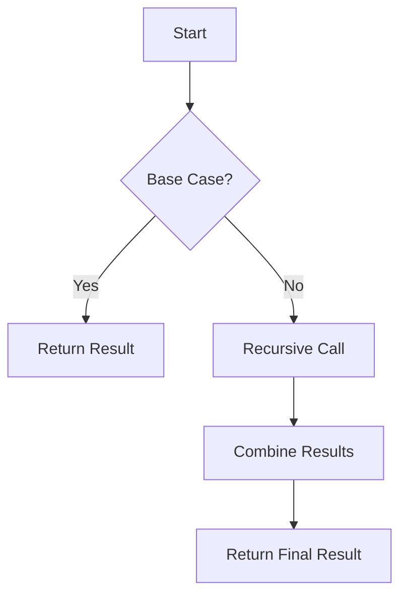

## 11.5 Recursive Patterns and Tail Call Optimization

In this section, we delve into the world of recursive patterns in Erlang, focusing on advanced techniques and the critical role of tail call optimization (TCO) in enhancing performance. Recursion is a fundamental concept in functional programming, and understanding how to leverage it effectively can lead to elegant and efficient solutions to complex problems.

### Understanding Recursion in Erlang

Recursion is a method where a function calls itself to solve a problem. In Erlang, recursion is a natural fit due to its functional nature and immutability. Let's start by reviewing the basics of recursion with a simple example.

#### Basic Recursion Example

Consider a function to calculate the factorial of a number:

```erlang
-module(factorial).
-export([factorial/1]).

factorial(0) -> 1;
factorial(N) when N > 0 -> N * factorial(N - 1).
```

In this example, the `factorial/1` function calls itself with a decremented value of `N` until it reaches the base case of `0`. This is a straightforward recursive pattern.

### Tail Call Optimization (TCO)

Tail call optimization is a technique used by Erlang to optimize recursive function calls. When a function call is the last operation in a function, it is considered a tail call. Erlang's runtime can optimize tail calls to prevent stack overflow and reduce memory usage.

#### Tail Recursive Example

Let's modify the factorial function to be tail recursive:

```erlang
-module(factorial).
-export([factorial/1]).

factorial(N) -> factorial(N, 1).

factorial(0, Acc) -> Acc;
factorial(N, Acc) when N > 0 -> factorial(N - 1, N * Acc).
```

In this version, the `factorial/2` function uses an accumulator (`Acc`) to carry the result. The recursive call is the last operation, making it a tail call. Erlang optimizes this by reusing the current function's stack frame, preventing stack overflow.

### Advanced Recursive Patterns

Now that we understand the basics, let's explore advanced recursive patterns like divide and conquer, recursive descent parsers, and tree traversals.

#### Divide and Conquer

Divide and conquer is a strategy that breaks a problem into smaller subproblems, solves them recursively, and combines their results. A classic example is the merge sort algorithm.

```erlang
-module(mergesort).
-export([mergesort/1]).

mergesort([]) -> [];
mergesort([X]) -> [X];
mergesort(List) ->
    {Left, Right} = split(List),
    merge(mergesort(Left), mergesort(Right)).

split(List) ->
    {lists:sublist(List, length(List) div 2), lists:nthtail(length(List) div 2, List)}.

merge([], Right) -> Right;
merge(Left, []) -> Left;
merge([H1|T1] = Left, [H2|T2] = Right) ->
    if H1 < H2 -> [H1|merge(T1, Right)];
       true -> [H2|merge(Left, T2)]
    end.
```

In this example, `mergesort/1` recursively splits the list into halves, sorts each half, and merges the sorted halves. This pattern is efficient for large datasets.

#### Recursive Descent Parsers

Recursive descent parsers are used in compilers to parse expressions. They are built using mutually recursive functions, each handling a specific grammar rule.

```erlang
-module(parser).
-export([parse_expr/1]).

parse_expr(Tokens) ->
    {Expr, Rest} = parse_term(Tokens),
    parse_expr_tail(Expr, Rest).

parse_expr_tail(Acc, [plus|Tokens]) ->
    {Term, Rest} = parse_term(Tokens),
    parse_expr_tail({add, Acc, Term}, Rest);
parse_expr_tail(Acc, Tokens) ->
    {Acc, Tokens}.

parse_term([int(X)|Tokens]) ->
    {X, Tokens}.
```

This parser handles simple arithmetic expressions with addition. The `parse_expr/1` function calls `parse_term/1` and `parse_expr_tail/2` recursively to build the expression tree.

#### Tree Traversals

Tree structures are common in computer science, and recursive functions are ideal for traversing them. Let's look at a binary tree traversal example.

```erlang
-module(tree).
-export([inorder/1]).

inorder(nil) -> [];
inorder({Value, Left, Right}) ->
    inorder(Left) ++ [Value] ++ inorder(Right).
```

The `inorder/1` function performs an in-order traversal of a binary tree, visiting the left subtree, the root, and the right subtree recursively.

### Optimizing Recursive Functions

While recursion is powerful, it can lead to performance issues if not used carefully. Here are some strategies for optimizing recursive functions in Erlang:

1. **Use Tail Recursion**: Always prefer tail recursion to leverage Erlang's TCO. This reduces stack usage and improves performance.

2. **Minimize State**: Use accumulators to carry state across recursive calls, reducing the need for additional data structures.

3. **Avoid Deep Recursion**: For very deep recursion, consider iterative solutions or refactor the problem to reduce recursion depth.

4. **Memoization**: Cache results of expensive recursive calls to avoid redundant computations.

5. **Parallelize**: For divide and conquer problems, consider parallelizing recursive calls to utilize multiple cores.

### Encouraging Thoughtful Recursion

Recursion is a powerful tool, but it should be used thoughtfully. Consider the problem's nature and constraints before choosing recursion as a solution. When used appropriately, recursion can lead to elegant and efficient solutions.

### Try It Yourself

Experiment with the provided examples by modifying them:

- Change the base case in the factorial function to see how it affects the result.
- Implement a quicksort algorithm using divide and conquer.
- Extend the parser to handle multiplication and parentheses.
- Create a function to traverse a tree in pre-order or post-order.

### Visualizing Recursive Patterns

To better understand recursive patterns, let's visualize a simple recursive function using a flowchart.



This flowchart represents the general structure of a recursive function, highlighting the base case, recursive call, and result combination.

### References and Further Reading

For more information on recursion and tail call optimization, consider the following resources:

- [Erlang Documentation on Recursion](https://erlang.org/doc/reference_manual/functions.html#recursion)
- [Tail Call Optimization Explained](https://en.wikipedia.org/wiki/Tail_call)
- [Functional Programming in Erlang](https://learnyousomeerlang.com/recursion)

### Knowledge Check

- What is tail call optimization, and why is it important in Erlang?
- How can you convert a non-tail recursive function to a tail recursive one?
- What are some common recursive patterns used in functional programming?

### Embrace the Journey

Remember, recursion is just one tool in your functional programming toolkit. As you continue to explore Erlang, you'll discover more patterns and techniques to solve complex problems. Keep experimenting, stay curious, and enjoy the journey!

## Quiz: Recursive Patterns and Tail Call Optimization



### What is the primary benefit of tail call optimization in Erlang?

- [x] It prevents stack overflow by reusing stack frames.
- [ ] It increases the speed of function execution.
- [ ] It allows for parallel execution of recursive calls.
- [ ] It simplifies the syntax of recursive functions.

> **Explanation:** Tail call optimization prevents stack overflow by reusing stack frames, making recursive functions more efficient.

### Which of the following is a characteristic of a tail recursive function?

- [x] The recursive call is the last operation in the function.
- [ ] The function has multiple recursive calls.
- [ ] The function uses global variables.
- [ ] The function does not have a base case.

> **Explanation:** In a tail recursive function, the recursive call is the last operation, allowing for optimization.

### How can you optimize a recursive function that is not tail recursive?

- [x] Use an accumulator to carry state across recursive calls.
- [ ] Increase the recursion depth.
- [ ] Use global variables to store intermediate results.
- [ ] Remove the base case.

> **Explanation:** Using an accumulator helps convert a non-tail recursive function into a tail recursive one.

### What is a common use case for recursive descent parsers?

- [x] Parsing expressions in compilers.
- [ ] Sorting large datasets.
- [ ] Traversing binary trees.
- [ ] Calculating factorials.

> **Explanation:** Recursive descent parsers are commonly used in compilers to parse expressions.

### Which pattern is often used in conjunction with recursion to solve complex problems?

- [x] Divide and conquer.
- [ ] Singleton pattern.
- [ ] Observer pattern.
- [ ] Factory pattern.

> **Explanation:** Divide and conquer is a strategy that breaks a problem into smaller subproblems, often solved recursively.

### What is a potential drawback of deep recursion?

- [x] It can lead to stack overflow.
- [ ] It simplifies code readability.
- [ ] It improves performance.
- [ ] It reduces memory usage.

> **Explanation:** Deep recursion can lead to stack overflow if not optimized properly.

### How can memoization improve the performance of recursive functions?

- [x] By caching results of expensive recursive calls.
- [ ] By increasing recursion depth.
- [ ] By using global variables.
- [ ] By removing the base case.

> **Explanation:** Memoization caches results to avoid redundant computations, improving performance.

### What is the purpose of using an accumulator in a recursive function?

- [x] To carry state across recursive calls.
- [ ] To increase recursion depth.
- [ ] To store global variables.
- [ ] To remove the base case.

> **Explanation:** An accumulator carries state across recursive calls, aiding in tail recursion.

### Which of the following is an example of a tree traversal method?

- [x] In-order traversal.
- [ ] Quick sort.
- [ ] Factorial calculation.
- [ ] Expression parsing.

> **Explanation:** In-order traversal is a method for traversing binary trees.

### True or False: Tail call optimization is automatically applied to all recursive functions in Erlang.

- [ ] True
- [x] False

> **Explanation:** Tail call optimization is only applied to functions where the recursive call is the last operation.


