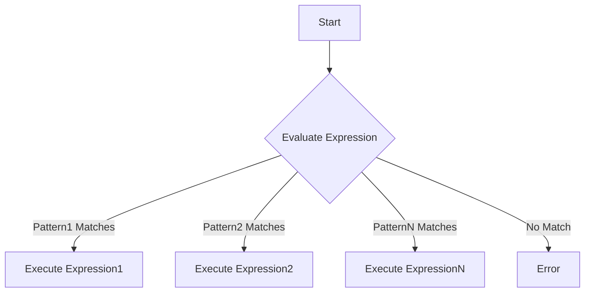

## 11.6 Control Flow with `case`, `if`, and `receive`

In Erlang, control flow constructs are essential for directing the execution of code based on conditions and events. This section delves into the `case`, `if`, and `receive` constructs, which are pivotal in Erlang's functional and concurrent programming paradigms. We will explore their syntax, use cases, and best practices, with a focus on writing clear and maintainable conditional logic.

### Understanding Control Flow in Erlang

Control flow in Erlang is distinct from imperative languages due to its functional nature. Instead of using loops and mutable state, Erlang relies on recursion and pattern matching to control the flow of execution. Let's explore the three primary constructs: `case`, `if`, and `receive`.

### The `case` Construct

The `case` construct in Erlang is used to match a value against a series of patterns, executing the corresponding block of code for the first matching pattern. It is similar to a switch statement in other languages but more powerful due to Erlang's pattern matching capabilities.

#### Syntax of `case`

```erlang
case Expression of
    Pattern1 [when Guard1] -> 
        Expression1;
    Pattern2 [when Guard2] -> 
        Expression2;
    ...
    PatternN [when GuardN] -> 
        ExpressionN
end
```

- **Expression**: The value to be matched against the patterns.
- **Pattern**: A pattern to match the expression.
- **Guard**: An optional condition that must be true for the pattern to match.
- **ExpressionN**: The code block executed if the pattern matches.

#### Example of `case`

```erlang
-module(case_example).
-export([evaluate_grade/1]).

evaluate_grade(Score) ->
    case Score of
        S when S >= 90 -> 
            "A";
        S when S >= 80 -> 
            "B";
        S when S >= 70 -> 
            "C";
        S when S >= 60 -> 
            "D";
        _ -> 
            "F"
    end.
```

In this example, `evaluate_grade/1` uses a `case` construct to determine a letter grade based on a numeric score. The use of guards (`when S >= 90`) allows for additional conditions beyond simple pattern matching.

#### Best Practices for `case`

- **Use Guards Wisely**: Guards can make your `case` statements more expressive and precise.
- **Avoid Complex Logic**: Keep each branch simple to maintain readability.
- **Pattern Order Matters**: Arrange patterns from most specific to least specific to ensure correct matching.

### The `if` Construct

The `if` construct in Erlang evaluates a series of boolean expressions, executing the block of code for the first true condition. Unlike `case`, `if` does not use pattern matching.

#### Syntax of `if`

```erlang
if
    Condition1 -> 
        Expression1;
    Condition2 -> 
        Expression2;
    ...
    true -> 
        DefaultExpression
end
```

- **Condition**: A boolean expression.
- **ExpressionN**: The code block executed if the condition is true.
- **true**: A catch-all condition that acts as a default case.

#### Example of `if`

```erlang
-module(if_example).
-export([check_temperature/1]).

check_temperature(Temp) ->
    if
        Temp > 30 -> 
            "It's hot!";
        Temp < 10 -> 
            "It's cold!";
        true -> 
            "It's moderate."
    end.
```

In this example, `check_temperature/1` uses an `if` construct to categorize temperature into hot, cold, or moderate.

#### Best Practices for `if`

- **Use for Simple Conditions**: `if` is best suited for straightforward boolean checks.
- **Always Include a Default**: Use `true` as a default to handle unexpected cases.
- **Consider Readability**: For complex conditions, consider using `case` or refactoring into separate functions.

### The `receive` Construct

The `receive` construct is unique to Erlang's concurrency model, allowing processes to handle messages from their mailbox. It is a cornerstone of Erlang's actor model.

#### Syntax of `receive`

```erlang
receive
    Pattern1 [when Guard1] -> 
        Expression1;
    Pattern2 [when Guard2] -> 
        Expression2;
    ...
    PatternN [when GuardN] -> 
        ExpressionN
after Timeout ->
    TimeoutExpression
end
```

- **Pattern**: A pattern to match incoming messages.
- **Guard**: An optional condition for the pattern.
- **Timeout**: An optional timeout period in milliseconds.
- **TimeoutExpression**: Code executed if no message is received within the timeout.

#### Example of `receive`

```erlang
-module(receive_example).
-export([start/0]).

start() ->
    spawn(fun() -> loop() end).

loop() ->
    receive
        {hello, From} -> 
            io:format("Received hello from ~p~n", [From]),
            loop();
        {goodbye, From} -> 
            io:format("Received goodbye from ~p~n", [From]),
            loop();
        stop -> 
            io:format("Stopping~n")
    after 5000 ->
        io:format("No message received in 5 seconds~n"),
        loop()
    end.
```

In this example, the `loop/0` function uses `receive` to handle messages like `{hello, From}` and `{goodbye, From}`. If no message is received within 5 seconds, a timeout message is printed.

#### Best Practices for `receive`

- **Use Timeouts**: Always consider using timeouts to avoid blocking indefinitely.
- **Pattern Match Carefully**: Ensure patterns are specific enough to handle expected messages.
- **Avoid Complex Logic**: Keep the logic within `receive` simple to maintain clarity.

### Choosing the Right Control Flow Mechanism

When deciding between `case`, `if`, and `receive`, consider the following:

- **Use `case`** when you need pattern matching and guards.
- **Use `if`** for simple boolean conditions.
- **Use `receive`** for handling messages in concurrent processes.

### Role of Pattern Matching in Control Flow

Pattern matching is a powerful feature in Erlang that simplifies control flow by allowing concise and expressive conditions. It is integral to `case` and `receive`, enabling developers to write clear and maintainable code.

### Writing Clear and Maintainable Conditional Logic

- **Keep It Simple**: Avoid nesting control flow constructs deeply.
- **Use Descriptive Names**: Name variables and functions clearly to convey intent.
- **Refactor When Necessary**: Break down complex logic into smaller functions.

### Visualizing Control Flow

To better understand how these constructs work, let's visualize the flow of a `case` statement:



This diagram illustrates the decision-making process in a `case` statement, where the expression is evaluated against multiple patterns.

### Try It Yourself

Experiment with the provided examples by modifying conditions, patterns, and messages. Try adding new branches to the `case` and `receive` constructs or changing the conditions in the `if` construct to see how the behavior changes.

### References and Further Reading

- [Erlang Documentation on Control Flow](https://www.erlang.org/doc/reference_manual/expressions.html#case)
- [Learn You Some Erlang for Great Good!](http://learnyousomeerlang.com/)
- [Erlang Programming by Francesco Cesarini and Simon Thompson](https://www.oreilly.com/library/view/erlang-programming/9780596518189/)

### Knowledge Check

Before we conclude, let's reinforce what we've learned with a few questions and exercises.

## Quiz: Control Flow with `case`, `if`, and `receive`



### What is the primary use of the `case` construct in Erlang?

- [x] To match a value against a series of patterns
- [ ] To evaluate boolean expressions
- [ ] To handle messages in concurrent processes
- [ ] To perform arithmetic operations

> **Explanation:** The `case` construct is used to match a value against a series of patterns, executing the corresponding block of code for the first matching pattern.

### Which construct is best suited for handling messages in concurrent processes?

- [ ] `case`
- [ ] `if`
- [x] `receive`
- [ ] `loop`

> **Explanation:** The `receive` construct is specifically designed for handling messages in concurrent processes, making it ideal for Erlang's actor model.

### What is a guard in the context of a `case` statement?

- [ ] A boolean expression that always evaluates to true
- [x] An optional condition that must be true for the pattern to match
- [ ] A function that executes when no pattern matches
- [ ] A default case in a `case` statement

> **Explanation:** A guard is an optional condition in a `case` statement that must be true for the pattern to match.

### What should you always include in an `if` construct?

- [ ] A `case` statement
- [ ] A `receive` block
- [x] A default condition using `true`
- [ ] A recursive call

> **Explanation:** In an `if` construct, it's best practice to include a default condition using `true` to handle unexpected cases.

### How can you avoid blocking indefinitely in a `receive` construct?

- [ ] Use complex logic
- [ ] Avoid pattern matching
- [x] Use timeouts
- [ ] Ignore messages

> **Explanation:** Using timeouts in a `receive` construct helps avoid blocking indefinitely by specifying a period after which a timeout expression is executed.

### Which control flow construct does not use pattern matching?

- [ ] `case`
- [x] `if`
- [ ] `receive`
- [ ] `loop`

> **Explanation:** The `if` construct evaluates boolean expressions and does not use pattern matching.

### What is the role of pattern matching in control flow?

- [ ] To perform arithmetic operations
- [x] To simplify control flow by allowing concise and expressive conditions
- [ ] To handle errors
- [ ] To execute loops

> **Explanation:** Pattern matching simplifies control flow by allowing concise and expressive conditions, making code more readable and maintainable.

### What is the purpose of the `after` clause in a `receive` construct?

- [ ] To match patterns
- [ ] To execute a default case
- [x] To specify a timeout period
- [ ] To perform arithmetic operations

> **Explanation:** The `after` clause in a `receive` construct specifies a timeout period, after which a timeout expression is executed if no message is received.

### What is a common best practice when using `case` statements?

- [ ] Use complex logic
- [x] Arrange patterns from most specific to least specific
- [ ] Avoid using guards
- [ ] Ignore unexpected cases

> **Explanation:** A common best practice when using `case` statements is to arrange patterns from most specific to least specific to ensure correct matching.

### True or False: The `receive` construct can be used for pattern matching.

- [x] True
- [ ] False

> **Explanation:** True. The `receive` construct uses pattern matching to handle messages in concurrent processes.



Remember, mastering control flow in Erlang is a journey. As you continue to explore and experiment, you'll gain a deeper understanding of how these constructs can be used to write robust and efficient Erlang applications. Keep experimenting, stay curious, and enjoy the journey!
