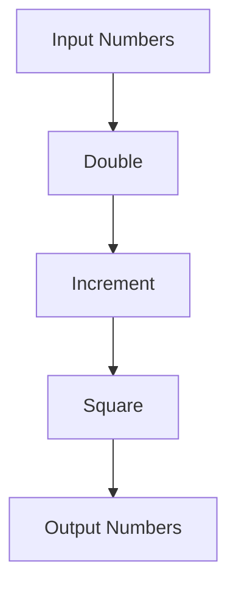

## 11.8 Pipeline Patterns with Function Composition

In the realm of functional programming, pipelines and function composition are powerful techniques that allow developers to process data in a clear, modular, and efficient manner. This section delves into the concept of pipeline patterns in Erlang, illustrating how to chain function calls to create seamless data processing flows. We will explore the benefits of these patterns, provide practical examples, and discuss how they enhance code readability and modularity.

### Understanding Pipelines in Functional Programming

**Pipelines** in functional programming refer to the technique of chaining functions together, where the output of one function becomes the input of the next. This approach is akin to an assembly line, where data is processed in stages, each stage performing a specific transformation or operation.

#### Key Concepts

- **Function Composition**: The process of combining two or more functions to produce a new function. In Erlang, this is achieved by nesting function calls.
- **Data Flow**: The movement of data through a series of processing stages, each represented by a function.
- **Modularity**: Breaking down complex operations into smaller, reusable functions that can be easily composed.

### Benefits of Pipeline Patterns

Pipeline patterns offer several advantages:

1. **Readability**: By organizing code into a series of transformations, pipelines make it easier to understand the flow of data and the sequence of operations.
2. **Modularity**: Functions can be developed independently and reused across different pipelines, promoting code reuse and reducing duplication.
3. **Maintainability**: Changes to individual processing stages can be made without affecting the entire pipeline, simplifying maintenance and updates.
4. **Testability**: Each function in the pipeline can be tested in isolation, ensuring that each stage performs its intended operation correctly.

### Function Composition in Erlang

Erlang does not have a built-in pipeline operator like Elixir's `|>`, but we can achieve similar functionality through careful function composition. Let's explore how to implement pipeline patterns in Erlang.

#### Example: Basic Function Composition

Consider a simple scenario where we have three functions: `double/1`, `increment/1`, and `square/1`. We want to apply these functions in sequence to a list of numbers.

```erlang
-module(pipeline_example).
-export([process_numbers/1]).

% Function to double a number
double(N) ->
    N * 2.

% Function to increment a number
increment(N) ->
    N + 1.

% Function to square a number
square(N) ->
    N * N.

% Function to process a list of numbers using a pipeline
process_numbers(Numbers) ->
    lists:map(fun square/1,
        lists:map(fun increment/1,
            lists:map(fun double/1, Numbers))).
```

In this example, we use `lists:map/2` to apply each function to the list of numbers. The functions are composed by nesting the `lists:map/2` calls, creating a pipeline that processes each number through the `double`, `increment`, and `square` functions.

#### Visualizing the Pipeline

To better understand the flow of data through the pipeline, let's visualize the process using a diagram.



This diagram illustrates how each number is transformed as it passes through the pipeline stages.

### Enhancing Pipelines with Higher-Order Functions

Erlang's support for higher-order functions allows us to create more flexible and dynamic pipelines. By passing functions as arguments, we can build pipelines that adapt to different processing needs.

#### Example: Dynamic Pipeline Construction

Let's enhance our previous example by allowing the pipeline to be constructed dynamically based on a list of functions.

```erlang
-module(dynamic_pipeline).
-export([process_numbers/2]).

% Function to apply a list of transformations to a list of numbers
process_numbers(Numbers, Functions) ->
    lists:foldl(fun(F, Acc) -> lists:map(F, Acc) end, Numbers, Functions).
```

In this version, `process_numbers/2` takes a list of numbers and a list of functions. We use `lists:foldl/3` to apply each function in the list to the numbers, effectively constructing a dynamic pipeline.

#### Try It Yourself

Experiment with different combinations of functions to see how the pipeline adapts:

```erlang
1> dynamic_pipeline:process_numbers([1, 2, 3], [fun dynamic_pipeline:double/1, fun dynamic_pipeline:increment/1]).
[3,5,7]
2> dynamic_pipeline:process_numbers([1, 2, 3], [fun dynamic_pipeline:square/1, fun dynamic_pipeline:increment/1]).
[2,5,10]
```

### Organizing Code into Reusable Processing Stages

To maximize the benefits of pipeline patterns, it's essential to organize code into reusable processing stages. Each stage should perform a single, well-defined operation, making it easy to compose and reuse.

#### Example: Modular Pipeline Stages

Let's refactor our previous example to demonstrate how to organize code into modular stages.

```erlang
-module(modular_pipeline).
-export([double/1, increment/1, square/1, process_numbers/2]).

% Define each stage as a separate function
double(N) -> N * 2.
increment(N) -> N + 1.
square(N) -> N * N.

% Function to apply a list of transformations to a list of numbers
process_numbers(Numbers, Functions) ->
    lists:foldl(fun(F, Acc) -> lists:map(F, Acc) end, Numbers, Functions).
```

By defining each stage as a separate function, we create a library of reusable components that can be combined in various ways to form different pipelines.

### Simulating the `|>` Operator in Erlang

While Erlang does not have a built-in pipeline operator like Elixir's `|>`, we can simulate similar behavior using function composition techniques.

#### Example: Simulating the `|>` Operator

Let's create a helper function that mimics the behavior of the `|>` operator.

```erlang
-module(pipeline_operator).
-export([pipe/2, double/1, increment/1, square/1]).

% Define each stage as a separate function
double(N) -> N * 2.
increment(N) -> N + 1.
square(N) -> N * N.

% Helper function to simulate the pipeline operator
pipe(Value, Functions) ->
    lists:foldl(fun(F, Acc) -> F(Acc) end, Value, Functions).
```

With the `pipe/2` function, we can chain function calls in a manner similar to the `|>` operator:

```erlang
1> pipeline_operator:pipe(2, [fun pipeline_operator:double/1, fun pipeline_operator:increment/1, fun pipeline_operator:square/1]).
36
```

### Design Considerations and Best Practices

When implementing pipeline patterns in Erlang, consider the following best practices:

- **Keep Functions Pure**: Ensure that each function in the pipeline is pure, meaning it has no side effects and always produces the same output for the same input.
- **Limit Side Effects**: If side effects are necessary, isolate them to specific stages and document their behavior clearly.
- **Optimize for Performance**: Be mindful of performance implications, especially when processing large data sets. Consider using parallel processing techniques if necessary.
- **Document Pipelines**: Clearly document the purpose and behavior of each pipeline, including the expected input and output for each stage.

### Erlang Unique Features

Erlang's concurrency model and lightweight processes make it particularly well-suited for implementing pipeline patterns in distributed systems. By leveraging Erlang's process model, you can create pipelines that distribute processing across multiple nodes, enhancing scalability and fault tolerance.

### Differences and Similarities with Other Languages

While Erlang does not have a built-in pipeline operator like Elixir, the principles of function composition and pipeline patterns are similar across functional programming languages. The key difference lies in the syntax and the tools available for composing functions.

### Conclusion

Pipeline patterns and function composition are powerful techniques in Erlang that enhance code readability, modularity, and maintainability. By organizing code into reusable processing stages and simulating pipeline behavior, you can create efficient data processing flows that are easy to understand and maintain. Remember, this is just the beginning. As you progress, you'll build more complex and interactive applications. Keep experimenting, stay curious, and enjoy the journey!

## Quiz: Pipeline Patterns with Function Composition



### What is the primary benefit of using pipeline patterns in functional programming?

- [x] Improved code readability and modularity
- [ ] Increased execution speed
- [ ] Reduced memory usage
- [ ] Simplified error handling

> **Explanation:** Pipeline patterns improve code readability and modularity by organizing code into a series of transformations.

### How can you simulate the `|>` operator in Erlang?

- [x] By using a helper function that applies a list of functions to a value
- [ ] By using the `lists:map/2` function
- [ ] By nesting function calls
- [ ] By using the `lists:foldl/3` function

> **Explanation:** A helper function can simulate the `|>` operator by applying a list of functions to a value.

### What is the purpose of the `lists:foldl/3` function in the context of pipelines?

- [x] To apply a list of functions to a list of values
- [ ] To filter a list based on a condition
- [ ] To concatenate two lists
- [ ] To reverse a list

> **Explanation:** `lists:foldl/3` is used to apply a list of functions to a list of values in a pipeline.

### Which of the following is a key characteristic of a pure function?

- [x] It has no side effects
- [ ] It modifies global state
- [ ] It depends on external input
- [ ] It produces different outputs for the same input

> **Explanation:** A pure function has no side effects and always produces the same output for the same input.

### What is the role of higher-order functions in pipeline patterns?

- [x] They allow functions to be passed as arguments, enabling dynamic pipeline construction
- [ ] They increase the execution speed of pipelines
- [ ] They reduce the memory usage of pipelines
- [ ] They simplify error handling in pipelines

> **Explanation:** Higher-order functions enable dynamic pipeline construction by allowing functions to be passed as arguments.

### Why is it important to document pipelines?

- [x] To clearly communicate the purpose and behavior of each stage
- [ ] To increase the execution speed of pipelines
- [ ] To reduce memory usage
- [ ] To simplify error handling

> **Explanation:** Documenting pipelines helps communicate the purpose and behavior of each stage, making them easier to understand and maintain.

### What is a common practice when organizing code into pipeline stages?

- [x] Ensuring each stage performs a single, well-defined operation
- [ ] Combining multiple operations into a single stage
- [ ] Using global variables to share data between stages
- [ ] Avoiding the use of higher-order functions

> **Explanation:** Each stage should perform a single, well-defined operation to maximize modularity and reusability.

### How does Erlang's concurrency model benefit pipeline patterns?

- [x] It allows pipelines to distribute processing across multiple nodes
- [ ] It increases the execution speed of pipelines
- [ ] It reduces memory usage
- [ ] It simplifies error handling

> **Explanation:** Erlang's concurrency model allows pipelines to distribute processing across multiple nodes, enhancing scalability and fault tolerance.

### What is the main difference between Erlang and Elixir regarding pipeline patterns?

- [x] Erlang does not have a built-in pipeline operator like Elixir
- [ ] Erlang has a more efficient pipeline operator
- [ ] Elixir does not support function composition
- [ ] Erlang requires more memory for pipelines

> **Explanation:** Erlang does not have a built-in pipeline operator like Elixir, but similar functionality can be achieved through function composition.

### True or False: Pipeline patterns can only be used in functional programming languages.

- [ ] True
- [x] False

> **Explanation:** While pipeline patterns are common in functional programming, they can be implemented in other programming paradigms as well.


