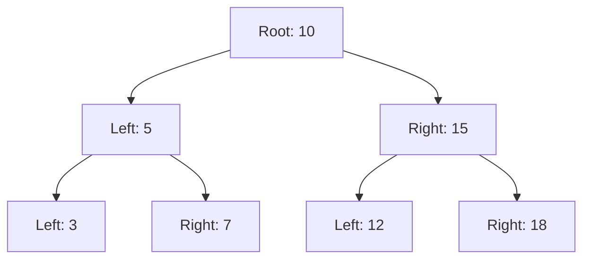

## 11.9 Functional Data Structures

In the world of functional programming, data structures play a pivotal role in ensuring that applications remain robust, scalable, and easy to reason about. Erlang, with its roots in functional programming, provides a rich set of functional data structures that are inherently immutable. This immutability is a cornerstone of functional programming, allowing developers to build applications that are both reliable and concurrent.

### Introduction to Functional Data Structures

Functional data structures are designed to be immutable, meaning that once they are created, their state cannot be changed. Instead of modifying existing data structures, operations on these structures return new versions, leaving the original unchanged. This approach has several benefits, particularly in concurrent programming, where shared mutable state can lead to complex bugs and race conditions.

#### Key Concepts

- **Immutability**: Once a data structure is created, it cannot be altered. Any operation that would modify the structure instead returns a new structure.
- **Persistence**: Functional data structures often support persistence, allowing previous versions of the data structure to be accessed even after modifications.
- **Concurrency**: Immutability simplifies concurrent programming by eliminating the need for locks or other synchronization mechanisms.

### Common Functional Data Structures in Erlang

Erlang provides several built-in data structures that are well-suited for functional programming. Let's explore some of these structures and how they can be used in a functional context.

#### Lists

Lists are one of the most fundamental data structures in Erlang. They are simple, versatile, and inherently functional.

```erlang
% Creating a list
List1 = [1, 2, 3, 4, 5].

% Adding an element to the front of the list
List2 = [0 | List1].

% Removing the first element
[_Head | Tail] = List2.
```

In the above example, `List1` is a list of integers. When we add an element to the front of the list, we create a new list `List2`, leaving `List1` unchanged. Similarly, when removing the first element, we use pattern matching to deconstruct the list into its head and tail.

#### Tuples

Tuples are another common data structure in Erlang, used to store a fixed number of elements.

```erlang
% Creating a tuple
Tuple1 = {ok, "Success", 200}.

% Accessing elements
{Status, Message, Code} = Tuple1.
```

Tuples are useful for grouping related data together. They are immutable, meaning that any operation that changes a tuple will result in a new tuple being created.

#### Maps

Maps are key-value stores that allow for efficient lookups and updates.

```erlang
% Creating a map
Map1 = #{name => "Alice", age => 30}.

% Updating a map
Map2 = Map1#{age => 31}.

% Accessing a value
Name = maps:get(name, Map2).
```

Maps provide a flexible way to store and retrieve data. Like other functional data structures, updating a map results in a new map being created.

### Implementing Functional Data Structures

While Erlang provides several built-in data structures, there are times when you may need to implement your own. Let's explore how to implement some common data structures in a functional way.

#### Stacks

A stack is a last-in, first-out (LIFO) data structure. In a functional context, a stack can be implemented using lists.

```erlang
% Push an element onto the stack
push(Element, Stack) -> [Element | Stack].

% Pop an element from the stack
pop([Top | Rest]) -> {Top, Rest}.
```

In this implementation, `push` adds an element to the front of the list, while `pop` removes the first element, returning both the element and the rest of the stack.

#### Queues

A queue is a first-in, first-out (FIFO) data structure. Implementing a queue functionally can be a bit more complex, but it can be done using two lists.

```erlang
% Initialize a queue
new_queue() -> {[], []}.

% Enqueue an element
enqueue(Element, {In, Out}) -> {In, [Element | Out]}.

% Dequeue an element
dequeue({[], Out}) -> dequeue({lists:reverse(Out), []});
dequeue({[Head | In], Out}) -> {Head, {In, Out}}.
```

In this implementation, the queue is represented as a tuple of two lists. The `enqueue` function adds elements to the `Out` list, while `dequeue` removes elements from the `In` list. If the `In` list is empty, the `Out` list is reversed and becomes the new `In` list.

#### Trees

Trees are hierarchical data structures that can be used to represent a variety of data models. A simple binary tree can be implemented functionally as follows:

```erlang
% Define a binary tree node
-record(node, {value, left, right}).

% Insert a value into the tree
insert(Value, nil) -> #node{value = Value, left = nil, right = nil};
insert(Value, #node{value = V, left = L, right = R}) when Value < V ->
    #node{value = V, left = insert(Value, L), right = R};
insert(Value, #node{value = V, left = L, right = R}) ->
    #node{value = V, left = L, right = insert(Value, R)}.
```

In this implementation, a binary tree is represented using a record with a value and two child nodes. The `insert` function recursively traverses the tree to find the correct position for the new value, creating a new tree structure in the process.

### Benefits of Functional Data Structures

Functional data structures offer several advantages, particularly in the context of concurrent programming.

#### Immutability and Concurrency

Immutability eliminates the need for locks or other synchronization mechanisms, as there is no shared mutable state. This makes it easier to reason about concurrent programs and reduces the likelihood of race conditions.

#### Code Reliability

Functional data structures promote code reliability by ensuring that data cannot be accidentally modified. This leads to fewer bugs and more predictable behavior.

#### Simplified Debugging

Since functional data structures are immutable, it is easier to track changes and understand the flow of data through a program. This simplifies debugging and makes it easier to identify the source of errors.

### Encouraging Immutability

When working with Erlang, it is important to embrace the functional paradigm and use immutable data structures wherever possible. This not only improves the reliability and scalability of your applications but also aligns with Erlang's strengths in concurrent programming.

### Try It Yourself

To get a better understanding of functional data structures, try implementing your own versions of stacks, queues, or trees. Experiment with different operations and see how they affect the immutability and concurrency of your applications.

### Visualizing Functional Data Structures

To further illustrate the concepts discussed, let's use Mermaid.js to visualize a simple binary tree structure.



This diagram represents a binary tree with a root node of 10, and child nodes branching off to the left and right. Each node contains a value, and the tree is structured to maintain the binary search tree property.

### References and Further Reading

- [Erlang Documentation](https://www.erlang.org/doc/)
- [Learn You Some Erlang for Great Good!](http://learnyousomeerlang.com/)
- [Functional Programming in Erlang](https://www.functional-programming.org/erlang.html)

### Knowledge Check

Before moving on, consider the following questions to test your understanding of functional data structures:

1. What are the benefits of using immutable data structures in concurrent programming?
2. How does the `enqueue` function in the queue implementation maintain immutability?
3. Why is it important to use pattern matching when working with lists in Erlang?

### Summary

Functional data structures are a powerful tool in the Erlang programmer's toolkit. By embracing immutability and leveraging Erlang's strengths in functional programming, you can build applications that are both reliable and scalable. Remember, this is just the beginning. As you progress, you'll discover even more ways to harness the power of functional programming in Erlang. Keep experimenting, stay curious, and enjoy the journey!

## Quiz: Functional Data Structures



### What is a key benefit of using functional data structures in Erlang?

- [x] Immutability simplifies concurrent programming.
- [ ] They allow for mutable state.
- [ ] They require complex synchronization mechanisms.
- [ ] They are only useful for small datasets.

> **Explanation:** Immutability simplifies concurrent programming by eliminating the need for locks or other synchronization mechanisms.

### How does Erlang handle updates to functional data structures?

- [x] By creating a new version of the data structure.
- [ ] By modifying the existing data structure.
- [ ] By using pointers to the original data.
- [ ] By locking the data structure during updates.

> **Explanation:** Erlang creates a new version of the data structure, leaving the original unchanged, to maintain immutability.

### Which Erlang data structure is inherently functional and supports efficient lookups?

- [ ] Lists
- [ ] Tuples
- [x] Maps
- [ ] Binaries

> **Explanation:** Maps are key-value stores that allow for efficient lookups and updates in Erlang.

### What is the primary characteristic of a functional data structure?

- [x] Immutability
- [ ] Mutability
- [ ] Complexity
- [ ] Volatility

> **Explanation:** Immutability is the primary characteristic of functional data structures, ensuring that once created, they cannot be altered.

### In a functional stack implementation, what does the `pop` function return?

- [x] The top element and the rest of the stack.
- [ ] Only the top element.
- [ ] The entire stack.
- [ ] A boolean indicating success.

> **Explanation:** The `pop` function returns the top element and the rest of the stack, maintaining the stack's immutability.

### What is a common use case for tuples in Erlang?

- [x] Grouping related data together.
- [ ] Storing large datasets.
- [ ] Implementing queues.
- [ ] Managing concurrent processes.

> **Explanation:** Tuples are used to group related data together in Erlang.

### How does the `enqueue` function in a functional queue maintain immutability?

- [x] By adding elements to a separate list.
- [ ] By modifying the original list.
- [ ] By using a single list for all operations.
- [ ] By locking the queue during operations.

> **Explanation:** The `enqueue` function adds elements to a separate list, ensuring that the original list remains unchanged.

### What is a key advantage of using functional data structures in debugging?

- [x] Easier to track changes and understand data flow.
- [ ] They require fewer lines of code.
- [ ] They are more complex to implement.
- [ ] They eliminate all bugs.

> **Explanation:** Functional data structures are easier to track changes and understand data flow, simplifying debugging.

### Which of the following is a functional data structure in Erlang?

- [x] Lists
- [ ] Arrays
- [ ] Hash tables
- [ ] Linked lists

> **Explanation:** Lists are a functional data structure in Erlang, supporting immutability and functional operations.

### True or False: Functional data structures in Erlang can be modified in place.

- [ ] True
- [x] False

> **Explanation:** False. Functional data structures in Erlang are immutable and cannot be modified in place.


