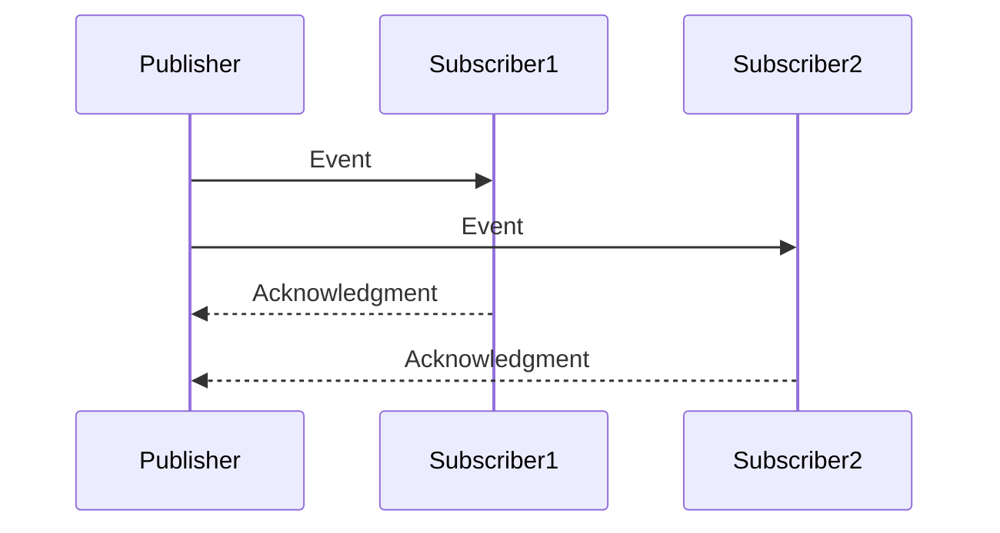

## 12.1 Introduction to Reactive Programming

### Understanding Reactive Programming

Reactive programming is a programming paradigm oriented around data flows and the propagation of change. This means that it allows developers to express static or dynamic data flows with ease, and automatically propagate changes through the data flow. In essence, reactive programming is about building systems that react to changes in data and events, making it particularly suitable for applications that require high responsiveness and scalability.

#### Core Concepts of Reactive Programming

1. **Data Streams**: At the heart of reactive programming are data streams. These streams are sequences of ongoing events ordered in time. They can be anything from user inputs, messages, or even changes in a database.

2. **Propagation of Change**: Reactive systems automatically propagate changes through the data flow. This means that when a data source changes, all dependent computations are automatically updated.

3. **Asynchronous Data Handling**: Reactive programming excels in handling asynchronous data streams, allowing systems to process data as it arrives without blocking operations.

4. **Backpressure**: This is a mechanism to handle the flow of data between producers and consumers, ensuring that the system remains stable and responsive even under load.

5. **Event-Driven Architecture**: Reactive programming often employs an event-driven architecture, where the flow of the program is determined by events such as user actions, sensor outputs, or messages from other programs.

### Addressing Challenges with Asynchronous Data Streams

Handling asynchronous data streams is a significant challenge in modern software development. Traditional programming models often struggle with concurrency and scalability, leading to complex and error-prone code. Reactive programming addresses these challenges by:

- **Decoupling Components**: By using data streams and event-driven architectures, reactive programming decouples components, making them more modular and easier to manage.

- **Simplifying Concurrency**: Reactive programming abstracts away the complexities of concurrency, allowing developers to focus on the logic of their applications rather than the intricacies of thread management.

- **Enhancing Scalability**: Reactive systems are inherently scalable, as they can handle varying loads by adjusting the flow of data between components.

### Relevance of Reactive Programming in Modern Applications

In today's fast-paced digital world, applications need to be responsive, resilient, and scalable. Reactive programming is particularly relevant in the following scenarios:

- **Real-Time Applications**: Applications that require real-time data processing, such as financial systems, gaming, and IoT applications, benefit greatly from reactive programming.

- **User Interfaces**: Reactive programming is ideal for building responsive user interfaces that need to react to user inputs and other events in real-time.

- **Microservices Architecture**: In a microservices architecture, reactive programming helps manage the complexity of communication between services, ensuring that the system remains responsive and scalable.

### Erlang and Reactive Programming

Erlang is a functional programming language designed for building concurrent, distributed, and fault-tolerant systems. Its features align closely with the principles of reactive programming, making it an excellent choice for implementing reactive systems.

#### Erlang's Unique Features for Reactive Programming

1. **Concurrency Model**: Erlang's lightweight process model allows for massive concurrency, which is essential for handling multiple data streams simultaneously.

2. **Message Passing**: Erlang uses message passing for communication between processes, which aligns with the event-driven nature of reactive programming.

3. **Fault Tolerance**: Erlang's "let it crash" philosophy and robust error handling make it ideal for building resilient reactive systems.

4. **Hot Code Swapping**: Erlang supports hot code swapping, allowing systems to be updated without downtime, which is crucial for maintaining responsiveness in reactive systems.

5. **Functional Paradigm**: Erlang's functional programming paradigm simplifies the management of state and side effects, which are common challenges in reactive programming.

### Code Example: Basic Reactive System in Erlang

Let's explore a simple example of a reactive system in Erlang that reacts to changes in a data stream.

```erlang
-module(reactive_example).
-export([start/0, subscribe/1, publish/1]).

% Start the reactive system
start() ->
    register(publisher, spawn(fun() -> loop([]) end)).

% Subscribe a process to the data stream
subscribe(Pid) ->
    publisher ! {subscribe, Pid}.

% Publish a new event to the data stream
publish(Event) ->
    publisher ! {publish, Event}.

% Internal loop handling subscriptions and events
loop(Subscribers) ->
    receive
        {subscribe, Pid} ->
            loop([Pid | Subscribers]);
        {publish, Event} ->
            lists:foreach(fun(Pid) -> Pid ! {event, Event} end, Subscribers),
            loop(Subscribers)
    end.
```

In this example, we define a simple reactive system with a publisher process that manages a list of subscribers. When an event is published, it is sent to all subscribers. This demonstrates the core concept of reactive programming: reacting to changes in data streams.

### Visualizing Reactive Systems

To better understand the flow of data in a reactive system, let's visualize the interaction between components using a Mermaid.js diagram.



This diagram illustrates how the publisher sends events to multiple subscribers, and each subscriber acknowledges the receipt of the event. This is a fundamental pattern in reactive programming, where components communicate through events and data streams.

### Try It Yourself

Experiment with the code example by adding more subscribers or modifying the event handling logic. Try implementing additional features such as filtering events or transforming data before sending it to subscribers. This hands-on approach will deepen your understanding of reactive programming in Erlang.

### References and Further Reading

- [Reactive Programming in the Reactive Manifesto](https://www.reactivemanifesto.org/)
- [Erlang Programming Language](https://www.erlang.org/)
- [Functional Programming Concepts](https://en.wikipedia.org/wiki/Functional_programming)

### Knowledge Check

- What are the core concepts of reactive programming?
- How does reactive programming address the challenges of asynchronous data streams?
- Why is reactive programming relevant in modern applications?
- How do Erlang's features align with reactive programming principles?

### Embrace the Journey

Remember, this is just the beginning of your journey into reactive programming with Erlang. As you progress, you'll build more complex and interactive systems. Keep experimenting, stay curious, and enjoy the journey!

## Quiz: Introduction to Reactive Programming



### What is a core concept of reactive programming?

- [x] Data Streams
- [ ] Object-Oriented Design
- [ ] Static Typing
- [ ] Manual Memory Management

> **Explanation:** Data streams are a fundamental aspect of reactive programming, allowing systems to react to changes in data over time.

### How does reactive programming handle asynchronous data?

- [x] By using data streams and event-driven architectures
- [ ] By blocking operations until data is available
- [ ] By using global variables
- [ ] By relying on manual thread management

> **Explanation:** Reactive programming uses data streams and event-driven architectures to handle asynchronous data efficiently.

### Why is reactive programming relevant for real-time applications?

- [x] It allows for responsive and scalable systems
- [ ] It simplifies database management
- [ ] It reduces code complexity
- [ ] It eliminates the need for testing

> **Explanation:** Reactive programming is relevant for real-time applications because it enables systems to be responsive and scalable.

### Which Erlang feature aligns with reactive programming principles?

- [x] Message Passing
- [ ] Global Variables
- [ ] Manual Memory Management
- [ ] Static Typing

> **Explanation:** Erlang's message-passing model aligns with the event-driven nature of reactive programming.

### What is backpressure in reactive programming?

- [x] A mechanism to handle data flow between producers and consumers
- [ ] A method for optimizing database queries
- [ ] A technique for reducing code complexity
- [ ] A way to manage global state

> **Explanation:** Backpressure is a mechanism in reactive programming to manage the flow of data between producers and consumers.

### How does Erlang's concurrency model benefit reactive programming?

- [x] It allows for massive concurrency with lightweight processes
- [ ] It relies on global variables for state management
- [ ] It uses manual thread management
- [ ] It requires complex locking mechanisms

> **Explanation:** Erlang's concurrency model supports massive concurrency with lightweight processes, which is beneficial for reactive programming.

### What is the "let it crash" philosophy in Erlang?

- [x] A fault-tolerance approach that allows processes to fail and recover
- [ ] A method for optimizing performance
- [ ] A technique for reducing code complexity
- [ ] A way to manage global state

> **Explanation:** The "let it crash" philosophy in Erlang is a fault-tolerance approach that allows processes to fail and recover gracefully.

### How does Erlang's functional paradigm simplify reactive programming?

- [x] By managing state and side effects effectively
- [ ] By using global variables
- [ ] By relying on manual thread management
- [ ] By requiring complex locking mechanisms

> **Explanation:** Erlang's functional paradigm simplifies reactive programming by effectively managing state and side effects.

### What is a benefit of using reactive programming in microservices?

- [x] It helps manage communication complexity between services
- [ ] It simplifies database management
- [ ] It reduces code complexity
- [ ] It eliminates the need for testing

> **Explanation:** Reactive programming helps manage the complexity of communication between services in a microservices architecture.

### True or False: Reactive programming is only suitable for web applications.

- [ ] True
- [x] False

> **Explanation:** Reactive programming is suitable for a wide range of applications, not just web applications.


