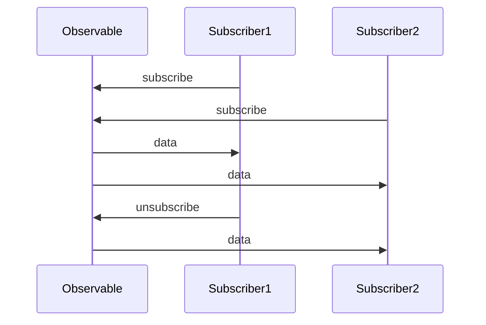

## 12.2 Implementing Observables in Erlang

In this section, we will delve into the concept of observables within the realm of reactive programming and explore how to implement them in Erlang. Observables are a powerful abstraction for working with asynchronous data streams, enabling developers to build responsive and scalable systems. By the end of this section, you will understand how to create observables in Erlang, manage subscriptions, and leverage these concepts to enhance your applications.

### Understanding Observables

Observables are a key component of reactive programming, a paradigm that focuses on asynchronous data streams and the propagation of change. In essence, an observable is an entity that emits data over time, which can be subscribed to by observers (or subscribers). This allows for a decoupled architecture where data producers and consumers operate independently.

#### Key Characteristics of Observables

- **Asynchronous Data Streams**: Observables can emit data at any point in time, allowing for non-blocking operations.
- **Push-Based Model**: Observables push data to subscribers, as opposed to subscribers pulling data.
- **Composability**: Observables can be combined and transformed, enabling complex data processing pipelines.

### Creating Observables in Erlang

In Erlang, we can leverage its powerful concurrency model to implement observables. Erlang processes, which are lightweight and isolated, serve as an excellent foundation for creating observables.

#### Basic Observable Implementation

Let's start by implementing a simple observable that emits a sequence of numbers over time.

```erlang
-module(observable).
-export([start/0, subscribe/1]).

start() ->
    spawn(fun() -> emit_numbers(1) end).

emit_numbers(N) ->
    receive
        {subscribe, Subscriber} ->
            Subscriber ! {data, N},
            emit_numbers(N + 1);
        stop ->
            ok
    after 1000 ->
        emit_numbers(N + 1)
    end.
```

In this example, the `emit_numbers/1` function is responsible for emitting numbers. It waits for a `subscribe` message to send data to a subscriber. The `after` clause ensures that numbers are emitted every second.

#### Subscribing to an Observable

To receive data from an observable, we need to implement a subscriber that listens for data messages.

```erlang
-module(subscriber).
-export([start/1]).

start(Observable) ->
    Observable ! {subscribe, self()},
    listen().

listen() ->
    receive
        {data, N} ->
            io:format("Received data: ~p~n", [N]),
            listen();
        stop ->
            ok
    end.
```

The `start/1` function sends a `subscribe` message to the observable, and the `listen/0` function waits for data messages, printing them to the console.

### Managing Subscriptions

Managing subscriptions involves handling the lifecycle of subscribers, including adding, removing, and notifying them. This is crucial for building robust systems where subscribers can dynamically join and leave.

#### Subscription Management Patterns

1. **Subscription List**: Maintain a list of subscribers and iterate over it to send data.
2. **Dynamic Subscription**: Allow subscribers to join and leave at runtime, updating the subscription list accordingly.
3. **Unsubscription**: Provide a mechanism for subscribers to unsubscribe and stop receiving data.

#### Implementing Subscription Management

Let's enhance our observable to manage multiple subscribers.

```erlang
-module(observable).
-export([start/0, subscribe/1, unsubscribe/1]).

start() ->
    spawn(fun() -> loop([]) end).

loop(Subscribers) ->
    receive
        {subscribe, Subscriber} ->
            loop([Subscriber | Subscribers]);
        {unsubscribe, Subscriber} ->
            loop(lists:delete(Subscriber, Subscribers));
        {emit, Data} ->
            lists:foreach(fun(Subscriber) -> Subscriber ! {data, Data} end, Subscribers),
            loop(Subscribers);
        stop ->
            ok
    end.
```

In this implementation, the `loop/1` function maintains a list of subscribers. It handles `subscribe` and `unsubscribe` messages to manage the subscription list. When data is emitted, it iterates over the list and sends data to each subscriber.

### Benefits of Observables in Erlang

Implementing observables in Erlang provides several benefits for building responsive systems:

- **Decoupled Architecture**: Observables promote a separation of concerns, allowing data producers and consumers to operate independently.
- **Scalability**: Erlang's lightweight processes and message-passing model enable scalable data streams.
- **Flexibility**: Observables can be composed and transformed, facilitating complex data processing pipelines.

### Visualizing Observable Architecture

To better understand the flow of data in an observable system, let's visualize the architecture using a sequence diagram.



**Figure 1**: This diagram illustrates the interaction between an observable and its subscribers. Subscribers send `subscribe` messages to the observable, which then emits data to all subscribers. Subscribers can also send `unsubscribe` messages to stop receiving data.

### Try It Yourself

To reinforce your understanding, try modifying the code examples:

- **Change the Emission Interval**: Modify the `after` clause in `emit_numbers/1` to emit data at different intervals.
- **Add More Subscribers**: Create additional subscriber processes and observe how they receive data.
- **Implement Unsubscription**: Extend the subscriber module to send `unsubscribe` messages.

### References and Further Reading

- [ReactiveX - Introduction to Reactive Programming](http://reactivex.io/intro.html)
- [Erlang Processes and Concurrency](https://erlang.org/doc/reference_manual/processes.html)
- [Erlang Message Passing](https://erlang.org/doc/reference_manual/processes.html#message-passing)

### Knowledge Check

Before moving on, consider these questions:

- What are the key characteristics of observables?
- How does Erlang's concurrency model facilitate the implementation of observables?
- What are the benefits of using observables in a reactive system?

### Summary

In this section, we've explored the concept of observables in reactive programming and how to implement them in Erlang. By leveraging Erlang's concurrency model, we can create powerful and scalable data streams that enhance the responsiveness of our applications. Remember, this is just the beginning. As you progress, you'll build more complex and interactive systems. Keep experimenting, stay curious, and enjoy the journey!

## Quiz: Implementing Observables in Erlang



### What is the primary role of an observable in reactive programming?

- [x] To emit data over time
- [ ] To store data persistently
- [ ] To manage user interfaces
- [ ] To handle file I/O operations

> **Explanation:** Observables are designed to emit data over time, allowing subscribers to react to changes asynchronously.

### How do subscribers receive data from an observable in Erlang?

- [x] By sending a subscribe message to the observable
- [ ] By polling the observable at regular intervals
- [ ] By directly accessing the observable's data
- [ ] By using a shared memory space

> **Explanation:** Subscribers send a subscribe message to the observable, which then emits data to them.

### What is a key benefit of using observables in Erlang?

- [x] Decoupled architecture
- [ ] Increased memory usage
- [ ] Synchronous data processing
- [ ] Complex error handling

> **Explanation:** Observables promote a decoupled architecture, allowing data producers and consumers to operate independently.

### Which Erlang feature is crucial for implementing observables?

- [x] Lightweight processes
- [ ] Synchronous functions
- [ ] Global variables
- [ ] File handling capabilities

> **Explanation:** Erlang's lightweight processes and message-passing model are crucial for implementing observables.

### What pattern is used to manage multiple subscribers in an observable?

- [x] Subscription list
- [ ] Singleton pattern
- [ ] Factory pattern
- [ ] Observer pattern

> **Explanation:** A subscription list is used to manage multiple subscribers, allowing the observable to send data to each one.

### How can a subscriber stop receiving data from an observable?

- [x] By sending an unsubscribe message
- [ ] By closing the network connection
- [ ] By terminating the Erlang VM
- [ ] By deleting the observable process

> **Explanation:** Subscribers can stop receiving data by sending an unsubscribe message to the observable.

### What is the purpose of the `after` clause in the `emit_numbers/1` function?

- [x] To emit data at regular intervals
- [ ] To handle error conditions
- [ ] To initialize the observable
- [ ] To manage process termination

> **Explanation:** The `after` clause is used to emit data at regular intervals, ensuring the observable continues to send data over time.

### What is a common use case for observables in Erlang?

- [x] Real-time data processing
- [ ] Static website generation
- [ ] Batch processing of files
- [ ] Database schema design

> **Explanation:** Observables are commonly used for real-time data processing, where data needs to be handled as it arrives.

### Which of the following is NOT a characteristic of observables?

- [ ] Asynchronous data streams
- [ ] Push-based model
- [x] Synchronous execution
- [ ] Composability

> **Explanation:** Observables are inherently asynchronous, allowing data to be emitted and processed independently of the main execution flow.

### True or False: Observables in Erlang can only have one subscriber at a time.

- [ ] True
- [x] False

> **Explanation:** Observables can have multiple subscribers, each receiving data independently.


