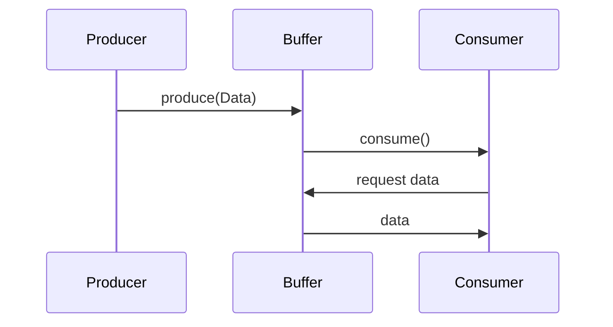

## 12.3 Handling Backpressure and Flow Control

In the realm of reactive programming, managing the flow of data efficiently is crucial to building scalable and reliable systems. This section delves into the concept of backpressure, a common challenge in data streams, and explores strategies to handle scenarios where data producers outpace consumers. We will leverage Erlang's concurrency model to implement effective flow control mechanisms, ensuring that our systems remain robust under varying loads.

### Understanding Backpressure

Backpressure is a mechanism for controlling the flow of data between producers and consumers in a system. When a producer generates data faster than a consumer can process it, backpressure helps to prevent system overload by signaling the producer to slow down or by managing the excess data through various strategies.

#### Key Concepts

- **Producer**: The source of data in a system, which can be a process, a network socket, or any entity generating data.
- **Consumer**: The entity that processes or consumes the data produced.
- **Flow Control**: Techniques used to manage the rate of data transfer between producers and consumers to prevent overload.

### Strategies for Handling Faster Producers

When producers are faster than consumers, several strategies can be employed to manage the data flow effectively:

1. **Buffering**: Temporarily storing excess data in a buffer until the consumer is ready to process it.
2. **Dropping**: Discarding excess data when the buffer is full, ensuring that the system does not become overwhelmed.
3. **Throttling**: Slowing down the producer to match the consumer's processing rate.

Let's explore each of these strategies in detail, with examples demonstrating their implementation in Erlang.

### Buffering in Erlang

Buffering involves using a temporary storage area to hold data until the consumer is ready to process it. In Erlang, we can implement buffering using processes and message queues.

#### Example: Implementing a Buffer

```erlang
-module(buffer).
-export([start/0, produce/2, consume/1]).

start() ->
    spawn(fun() -> loop([]) end).

loop(Buffer) ->
    receive
        {produce, Data} ->
            NewBuffer = lists:append(Buffer, [Data]),
            loop(NewBuffer);
        {consume, Pid} when Buffer =/= [] ->
            [Head | Tail] = Buffer,
            Pid ! {data, Head},
            loop(Tail);
        {consume, Pid} ->
            Pid ! {empty},
            loop(Buffer)
    end.

produce(BufferPid, Data) ->
    BufferPid ! {produce, Data}.

consume(BufferPid) ->
    BufferPid ! {consume, self()},
    receive
        {data, Data} ->
            io:format("Consumed: ~p~n", [Data]);
        {empty} ->
            io:format("Buffer is empty~n")
    end.
```

In this example, we create a buffer process that can receive `produce` and `consume` messages. The buffer stores incoming data in a list and sends data to consumers when requested.

### Dropping Messages

Dropping involves discarding messages when the buffer is full. This approach is useful when it's acceptable to lose some data to maintain system stability.

#### Example: Implementing Dropping

```erlang
-module(drop_buffer).
-export([start/1, produce/2, consume/1]).

start(MaxSize) ->
    spawn(fun() -> loop([], MaxSize) end).

loop(Buffer, MaxSize) ->
    receive
        {produce, Data} when length(Buffer) < MaxSize ->
            NewBuffer = lists:append(Buffer, [Data]),
            loop(NewBuffer, MaxSize);
        {produce, _Data} ->
            io:format("Dropping data~n"),
            loop(Buffer, MaxSize);
        {consume, Pid} when Buffer =/= [] ->
            [Head | Tail] = Buffer,
            Pid ! {data, Head},
            loop(Tail, MaxSize);
        {consume, Pid} ->
            Pid ! {empty},
            loop(Buffer, MaxSize)
    end.

produce(BufferPid, Data) ->
    BufferPid ! {produce, Data}.

consume(BufferPid) ->
    BufferPid ! {consume, self()},
    receive
        {data, Data} ->
            io:format("Consumed: ~p~n", [Data]);
        {empty} ->
            io:format("Buffer is empty~n")
    end.
```

Here, we modify the buffer to drop data when it exceeds a specified maximum size. This ensures that the buffer does not grow indefinitely, which could lead to resource exhaustion.

### Throttling Producers

Throttling involves controlling the rate at which a producer generates data. This can be achieved by introducing delays or using feedback from the consumer to adjust the production rate.

#### Example: Implementing Throttling

```erlang
-module(throttle).
-export([start/0, produce/2, consume/1]).

start() ->
    spawn(fun() -> loop() end).

loop() ->
    receive
        {produce, Data, Delay} ->
            timer:sleep(Delay),
            io:format("Produced: ~p~n", [Data]),
            loop();
        {consume, Pid} ->
            Pid ! {data, "Data"},
            loop()
    end.

produce(ThrottlePid, Data, Delay) ->
    ThrottlePid ! {produce, Data, Delay}.

consume(ThrottlePid) ->
    ThrottlePid ! {consume, self()},
    receive
        {data, Data} ->
            io:format("Consumed: ~p~n", [Data])
    end.
```

In this example, we introduce a delay in the `produce` function to control the rate of data production. This allows the consumer to process data at a manageable pace.

### Erlang Processes for Flow Control

Erlang's lightweight processes are ideal for implementing flow control mechanisms. Each process can handle a specific aspect of data flow, such as buffering, dropping, or throttling, and communicate with other processes to coordinate actions.

#### Visualizing Process Communication



This diagram illustrates the interaction between a producer, a buffer, and a consumer. The producer sends data to the buffer, and the consumer requests data from the buffer when ready.

### Designing for Scalability and Reliability

When designing systems with backpressure and flow control, consider the following principles:

- **Scalability**: Ensure that your system can handle increased loads by distributing work across multiple processes or nodes.
- **Reliability**: Implement fault-tolerant mechanisms, such as supervision trees, to recover from failures gracefully.
- **Adaptability**: Design your system to adjust dynamically to changing conditions, such as varying data rates or network latencies.

### Try It Yourself

Experiment with the provided code examples by modifying buffer sizes, introducing different delays, or simulating varying data rates. Observe how these changes affect the system's behavior and performance.

### References and Further Reading

- [Reactive Streams](https://www.reactive-streams.org/)
- [Erlang Documentation](https://www.erlang.org/docs)
- [Flow Control in Distributed Systems](https://www.infoq.com/articles/flow-control-distributed-systems/)

### Knowledge Check

- What is backpressure, and why is it important in reactive systems?
- How can buffering help manage faster producers?
- What are the trade-offs of dropping messages in a system?
- How does throttling differ from buffering and dropping?
- Why are Erlang processes well-suited for implementing flow control?

### Embrace the Journey

Remember, mastering backpressure and flow control is a journey. As you experiment and learn, you'll develop more efficient and resilient systems. Keep exploring, stay curious, and enjoy the process!

## Quiz: Handling Backpressure and Flow Control



### What is backpressure in data streams?

- [x] A mechanism to control data flow between producers and consumers
- [ ] A method to increase data production speed
- [ ] A technique for data encryption
- [ ] A way to store data permanently

> **Explanation:** Backpressure is a mechanism to control data flow between producers and consumers, ensuring that the system does not become overloaded.

### Which strategy involves temporarily storing excess data?

- [x] Buffering
- [ ] Dropping
- [ ] Throttling
- [ ] Encrypting

> **Explanation:** Buffering involves temporarily storing excess data until the consumer is ready to process it.

### What happens when the buffer is full in a dropping strategy?

- [ ] Data is stored in a secondary buffer
- [x] Data is discarded
- [ ] Data is encrypted
- [ ] Data is sent to another consumer

> **Explanation:** In a dropping strategy, data is discarded when the buffer is full to prevent system overload.

### How does throttling control data flow?

- [x] By slowing down the producer
- [ ] By speeding up the consumer
- [ ] By encrypting data
- [ ] By storing data in a buffer

> **Explanation:** Throttling controls data flow by slowing down the producer to match the consumer's processing rate.

### Why are Erlang processes suitable for flow control?

- [x] They are lightweight and can handle specific tasks
- [ ] They are heavy and require significant resources
- [ ] They are used for data encryption
- [ ] They are only suitable for data storage

> **Explanation:** Erlang processes are lightweight and can handle specific tasks, making them ideal for implementing flow control mechanisms.

### What is the primary goal of flow control?

- [x] To prevent system overload
- [ ] To increase data production speed
- [ ] To encrypt data
- [ ] To store data permanently

> **Explanation:** The primary goal of flow control is to prevent system overload by managing the rate of data transfer between producers and consumers.

### Which strategy is best when data loss is acceptable?

- [ ] Buffering
- [x] Dropping
- [ ] Throttling
- [ ] Encrypting

> **Explanation:** Dropping is best when data loss is acceptable, as it discards excess data when the buffer is full.

### What does a buffer process do in Erlang?

- [x] Stores and manages data flow between producer and consumer
- [ ] Encrypts data
- [ ] Increases data production speed
- [ ] Permanently stores data

> **Explanation:** A buffer process in Erlang stores and manages data flow between producer and consumer, ensuring smooth data transfer.

### How can you experiment with flow control strategies?

- [x] By modifying buffer sizes and introducing delays
- [ ] By encrypting data
- [ ] By permanently storing data
- [ ] By increasing data production speed

> **Explanation:** Experimenting with flow control strategies can be done by modifying buffer sizes and introducing delays to observe system behavior.

### True or False: Throttling involves discarding data.

- [ ] True
- [x] False

> **Explanation:** Throttling involves controlling the rate of data production, not discarding data.


