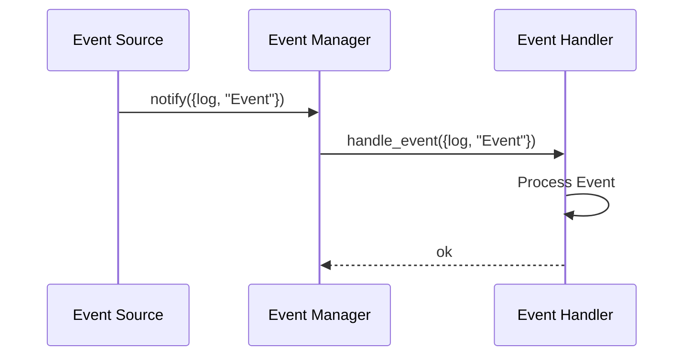

## 12.4 Event-Driven Architectures with `gen_event`

In the world of software development, event-driven architectures (EDA) have become a cornerstone for building responsive, scalable, and maintainable systems. Erlang, with its robust concurrency model, provides a powerful tool for implementing EDA through the `gen_event` behavior. In this section, we will delve into how `gen_event` supports event-driven programming, explore setting up event managers and handlers, and discuss how to emit and handle events in a reactive manner. We will also highlight the decoupling of event sources and consumers, encouraging the use of `gen_event` for scalable and maintainable systems.

### Understanding `gen_event` in Erlang

`gen_event` is a generic event manager behavior in Erlang that allows you to create event-driven systems. It provides a mechanism for managing a set of event handlers, which can be dynamically added or removed. This flexibility makes `gen_event` an excellent choice for systems where the set of event handlers may change over time.

#### Key Concepts

- **Event Manager**: The core component that manages event handlers and dispatches events to them.
- **Event Handler**: A module that implements the `gen_event` behavior to handle specific events.
- **Event**: A message or signal that triggers actions within the system.

### Setting Up Event Managers and Handlers

To effectively use `gen_event`, you need to set up an event manager and one or more event handlers. Let's walk through the process of creating a simple event-driven system using `gen_event`.

#### Creating an Event Manager

An event manager is a process that maintains a list of event handlers and dispatches events to them. You can create an event manager using the `gen_event:start_link/0` function, which starts the event manager as a linked process.

```erlang
% Start an event manager
{ok, EventManager} = gen_event:start_link().
```

#### Implementing Event Handlers

Event handlers are modules that implement the `gen_event` behavior. They define how to handle specific events. Here is a simple example of an event handler module:

```erlang
-module(my_event_handler).
-behaviour(gen_event).

-export([init/1, handle_event/2, handle_call/2, handle_info/2, terminate/2, code_change/3]).

% Initialize the event handler
init([]) ->
    {ok, #state{}}.

% Handle incoming events
handle_event(Event, State) ->
    io:format("Handling event: ~p~n", [Event]),
    {ok, State}.

% Handle synchronous calls
handle_call(Request, State) ->
    {reply, ok, State}.

% Handle other messages
handle_info(Info, State) ->
    {ok, State}.

% Handle termination
terminate(Reason, State) ->
    ok.

% Handle code changes
code_change(OldVsn, State, Extra) ->
    {ok, State}.
```

#### Adding and Removing Handlers

Once you have your event handler module, you can add it to the event manager using `gen_event:add_handler/3`:

```erlang
% Add an event handler to the event manager
gen_event:add_handler(EventManager, my_event_handler, []).
```

To remove a handler, use `gen_event:delete_handler/3`:

```erlang
% Remove an event handler from the event manager
gen_event:delete_handler(EventManager, my_event_handler, []).
```

### Emitting and Handling Events

With the event manager and handlers in place, you can start emitting and handling events. Events are typically emitted using the `gen_event:notify/2` function, which sends an event to all registered handlers.

```erlang
% Emit an event
gen_event:notify(EventManager, {my_event, "Hello, World!"}).
```

Each handler will receive the event and process it according to its `handle_event/2` function.

### Decoupling Event Sources and Consumers

One of the significant advantages of using `gen_event` is the decoupling it provides between event sources and consumers. Event sources emit events without needing to know which handlers will process them. This decoupling allows for flexible and scalable system architectures, where handlers can be added or removed without affecting the event sources.

#### Benefits of Decoupling

- **Scalability**: Easily add or remove handlers to scale the system.
- **Maintainability**: Modify handlers independently of event sources.
- **Flexibility**: Dynamically change the set of handlers based on runtime conditions.

### Building Scalable and Maintainable Systems

Using `gen_event` to build event-driven architectures can lead to highly scalable and maintainable systems. Here are some best practices to consider:

- **Design for Change**: Anticipate changes in event handlers and design your system to accommodate them.
- **Use Supervisors**: Leverage OTP supervisors to manage event managers and ensure fault tolerance.
- **Monitor Performance**: Keep an eye on the performance of your event-driven system, especially under high load.

### Example: A Simple Logging System

Let's put everything together with a practical example. We'll create a simple logging system using `gen_event`.

#### Step 1: Define the Event Handler

```erlang
-module(logger_handler).
-behaviour(gen_event).

-export([init/1, handle_event/2, handle_call/2, handle_info/2, terminate/2, code_change/3]).

init([]) ->
    {ok, []}.

handle_event({log, Message}, State) ->
    io:format("Log: ~s~n", [Message]),
    {ok, State};
handle_event(_, State) ->
    {ok, State}.

handle_call(_Request, State) ->
    {reply, ok, State}.

handle_info(_Info, State) ->
    {ok, State}.

terminate(_Reason, _State) ->
    ok.

code_change(_OldVsn, State, _Extra) ->
    {ok, State}.
```

#### Step 2: Start the Event Manager and Add the Handler

```erlang
% Start the event manager
{ok, LogManager} = gen_event:start_link().

% Add the logger handler
gen_event:add_handler(LogManager, logger_handler, []).
```

#### Step 3: Emit Log Events

```erlang
% Emit log events
gen_event:notify(LogManager, {log, "System started"}).
gen_event:notify(LogManager, {log, "User logged in"}).
```

### Visualizing Event Flow

To better understand how events flow through the system, let's visualize the process using a sequence diagram.



**Diagram Description**: This sequence diagram illustrates the flow of an event from the source to the event manager and finally to the event handler, where it is processed.

### Try It Yourself

Now that you've seen how to set up a basic event-driven system using `gen_event`, try experimenting with the code. Here are some suggestions:

- **Add More Handlers**: Create additional handlers to process different types of events.
- **Modify Event Data**: Change the structure of events and see how handlers can adapt.
- **Implement Error Handling**: Introduce error handling in your handlers to manage unexpected events.

### References and Further Reading

- [Erlang Documentation on `gen_event`](https://www.erlang.org/doc/man/gen_event.html)
- [Event-Driven Architecture on Wikipedia](https://en.wikipedia.org/wiki/Event-driven_architecture)
- [Reactive Programming in Erlang](https://www.erlang-solutions.com/blog/reactive-programming-in-erlang.html)

### Knowledge Check

- What are the main components of an event-driven architecture using `gen_event`?
- How does `gen_event` facilitate decoupling between event sources and consumers?
- What are some best practices for building scalable systems with `gen_event`?

### Embrace the Journey

Remember, mastering event-driven architectures with `gen_event` is just the beginning. As you continue to explore Erlang's capabilities, you'll find new ways to build responsive and resilient systems. Keep experimenting, stay curious, and enjoy the journey!

## Quiz: Event-Driven Architectures with `gen_event`



### What is the primary role of an event manager in Erlang's `gen_event`?

- [x] To manage event handlers and dispatch events to them
- [ ] To generate events for the system
- [ ] To handle synchronous calls only
- [ ] To monitor system performance

> **Explanation:** The event manager's primary role is to manage event handlers and dispatch events to them.

### How do you add an event handler to an event manager?

- [x] Using `gen_event:add_handler/3`
- [ ] Using `gen_event:notify/2`
- [ ] Using `gen_event:start_link/0`
- [ ] Using `gen_event:delete_handler/3`

> **Explanation:** `gen_event:add_handler/3` is used to add an event handler to an event manager.

### What is a key benefit of decoupling event sources and consumers?

- [x] Scalability and flexibility
- [ ] Increased complexity
- [ ] Reduced performance
- [ ] More dependencies

> **Explanation:** Decoupling event sources and consumers provides scalability and flexibility, allowing for easier system modifications.

### Which function is used to emit events in `gen_event`?

- [x] `gen_event:notify/2`
- [ ] `gen_event:add_handler/3`
- [ ] `gen_event:delete_handler/3`
- [ ] `gen_event:start_link/0`

> **Explanation:** `gen_event:notify/2` is used to emit events to all registered handlers.

### What is the purpose of the `handle_event/2` function in an event handler?

- [x] To process incoming events
- [ ] To initialize the event handler
- [ ] To handle synchronous calls
- [ ] To terminate the event handler

> **Explanation:** The `handle_event/2` function is used to process incoming events in an event handler.

### True or False: An event handler can be dynamically added or removed from an event manager.

- [x] True
- [ ] False

> **Explanation:** Event handlers can be dynamically added or removed from an event manager, providing flexibility.

### What is a common use case for `gen_event` in Erlang?

- [x] Logging systems
- [ ] Database management
- [ ] User authentication
- [ ] File I/O operations

> **Explanation:** `gen_event` is commonly used in logging systems to handle log events.

### Which of the following is NOT a component of `gen_event`?

- [ ] Event Manager
- [ ] Event Handler
- [ ] Event
- [x] Event Queue

> **Explanation:** `gen_event` does not have an explicit event queue component; it manages handlers and events directly.

### What is the benefit of using OTP supervisors with `gen_event`?

- [x] Ensures fault tolerance and process management
- [ ] Increases event processing speed
- [ ] Simplifies event handler code
- [ ] Reduces memory usage

> **Explanation:** Using OTP supervisors with `gen_event` ensures fault tolerance and effective process management.

### Which function is used to remove an event handler from an event manager?

- [x] `gen_event:delete_handler/3`
- [ ] `gen_event:notify/2`
- [ ] `gen_event:add_handler/3`
- [ ] `gen_event:start_link/0`

> **Explanation:** `gen_event:delete_handler/3` is used to remove an event handler from an event manager.


