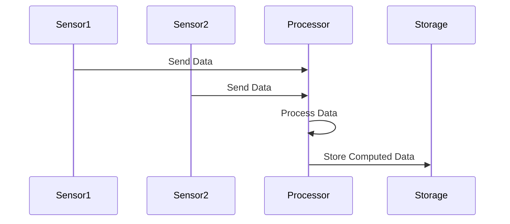

## 12.5 Real-Time Data Processing with Reactive Streams

In today's fast-paced digital world, the ability to process data in real-time is crucial for many applications, from monitoring sensor networks to handling user interactions in web applications. Erlang, with its robust concurrency model and functional programming paradigm, is well-suited for implementing reactive streams to handle such real-time data processing tasks efficiently.

### Understanding Reactive Streams

Reactive streams are a programming concept designed to handle asynchronous data streams with non-blocking backpressure. They provide a standard for processing sequences of data asynchronously, allowing systems to react to incoming data as it arrives. This is particularly useful for applications that require real-time processing, such as IoT systems, financial trading platforms, and live data analytics.

#### Key Properties of Reactive Streams

1. **Asynchronous Data Handling**: Reactive streams process data asynchronously, allowing systems to handle multiple data streams concurrently without blocking.
2. **Backpressure Management**: They provide mechanisms to manage backpressure, ensuring that data producers do not overwhelm consumers.
3. **Composability**: Reactive streams can be composed to form complex data processing pipelines, making it easier to build modular and scalable systems.
4. **Event-Driven Architecture**: They are inherently event-driven, reacting to data as it arrives and triggering appropriate actions.

### Processing Continuous Data Inputs in Real-Time

To process continuous data inputs in real-time using reactive streams in Erlang, we need to leverage Erlang's concurrency model and message-passing capabilities. Erlang processes, which are lightweight and isolated, can be used to implement the components of a reactive stream, such as data producers, consumers, and processors.

#### Example: Processing Sensor Data

Consider a scenario where we need to process data from a network of sensors in real-time. Each sensor sends data periodically, and our system needs to aggregate this data, perform some computations, and store the results.

```erlang
-module(sensor_processor).
-export([start/0, sensor_loop/1, process_data/1]).

start() ->
    % Start a process for each sensor
    Sensor1 = spawn(?MODULE, sensor_loop, [sensor1]),
    Sensor2 = spawn(?MODULE, sensor_loop, [sensor2]),
    % More sensors can be added here
    ok.

sensor_loop(SensorId) ->
    receive
        {SensorId, Data} ->
            process_data(Data),
            sensor_loop(SensorId)
    end.

process_data(Data) ->
    % Perform computations on the data
    ComputedData = Data * 2, % Example computation
    io:format("Processed data: ~p~n", [ComputedData]).
```

In this example, each sensor has a dedicated Erlang process that listens for incoming data messages. The `process_data/1` function performs computations on the data, demonstrating how real-time data processing can be achieved using Erlang's concurrency model.

### Challenges in Real-Time Data Processing

While reactive streams offer a powerful model for real-time data processing, there are several challenges that developers must address:

1. **Latency**: Minimizing the time it takes to process data from the moment it arrives is critical for real-time applications.
2. **Throughput**: The system must be able to handle a high volume of data without degrading performance.
3. **Consistency**: Ensuring that data is processed consistently and accurately, even in the presence of failures or network partitions.

#### Addressing Latency

Erlang's lightweight processes and efficient message-passing capabilities help reduce latency by allowing data to be processed concurrently and independently. By distributing the workload across multiple processes, we can minimize the time it takes to process each data item.

#### Managing Throughput

To handle high throughput, we can leverage Erlang's ability to spawn thousands of processes. Each process can handle a portion of the data stream, allowing the system to scale horizontally. Additionally, using ETS (Erlang Term Storage) for in-memory data storage can improve access times and reduce bottlenecks.

#### Ensuring Consistency

Erlang's "let it crash" philosophy and supervision trees provide a robust mechanism for handling failures. By designing processes to fail gracefully and restart automatically, we can ensure that data processing continues even in the face of errors.

### Erlang's Strengths in Handling Real-Time Data

Erlang's strengths in handling real-time data processing stem from its design as a concurrent, distributed, and fault-tolerant language. Some of the key features that make Erlang ideal for real-time data processing include:

- **Lightweight Processes**: Erlang's processes are lightweight and can be created in large numbers, making it easy to handle multiple data streams concurrently.
- **Efficient Message Passing**: Erlang's message-passing model allows processes to communicate efficiently, enabling real-time data flow between components.
- **Fault Tolerance**: Erlang's supervision trees and "let it crash" philosophy ensure that systems can recover from failures quickly and continue processing data.
- **Hot Code Swapping**: Erlang supports hot code swapping, allowing systems to be updated without downtime, which is crucial for real-time applications.

### Try It Yourself

To get hands-on experience with real-time data processing using reactive streams in Erlang, try modifying the example code provided above. Here are a few suggestions:

- Add more sensors and processes to simulate a larger network.
- Implement a more complex data processing function that performs additional computations or transformations.
- Introduce a mechanism to handle backpressure, ensuring that the system can cope with varying data rates.

### Visualizing Real-Time Data Processing

To better understand how real-time data processing with reactive streams works in Erlang, let's visualize the flow of data through the system using a sequence diagram.



**Figure 1**: This sequence diagram illustrates the flow of data from sensors to the processor and finally to storage. Each sensor sends data to the processor, which processes it and stores the results.

### References and Further Reading

- [Reactive Streams Specification](https://www.reactive-streams.org/)
- [Erlang Documentation](https://www.erlang.org/docs)
- [Concurrency in Erlang](https://learnyousomeerlang.com/concurrent-erlang)
- [Erlang Term Storage (ETS)](https://erlang.org/doc/man/ets.html)

### Knowledge Check

1. What are the key properties of reactive streams?
2. How does Erlang's concurrency model help in real-time data processing?
3. What are the challenges associated with real-time data processing?
4. How can Erlang's "let it crash" philosophy aid in ensuring consistency?

### Embrace the Journey

Remember, mastering real-time data processing with reactive streams in Erlang is a journey. As you experiment with different scenarios and challenges, you'll gain a deeper understanding of how to leverage Erlang's unique features to build robust, scalable systems. Keep exploring, stay curious, and enjoy the process!

## Quiz: Real-Time Data Processing with Reactive Streams



### What is a key property of reactive streams?

- [x] Asynchronous data handling
- [ ] Synchronous data handling
- [ ] Blocking operations
- [ ] Single-threaded processing

> **Explanation:** Reactive streams are designed for asynchronous data handling, allowing systems to process data concurrently without blocking.

### How does Erlang's concurrency model benefit real-time data processing?

- [x] By allowing lightweight processes to handle multiple data streams concurrently
- [ ] By using a single-threaded approach to process data
- [ ] By blocking processes to ensure data consistency
- [ ] By limiting the number of processes to reduce complexity

> **Explanation:** Erlang's concurrency model allows for lightweight processes that can handle multiple data streams concurrently, making it ideal for real-time data processing.

### What challenge does backpressure address in reactive streams?

- [x] Preventing data producers from overwhelming consumers
- [ ] Increasing data latency
- [ ] Reducing data throughput
- [ ] Ensuring data consistency

> **Explanation:** Backpressure is a mechanism in reactive streams that prevents data producers from overwhelming consumers, ensuring smooth data flow.

### Which Erlang feature helps in minimizing latency in real-time data processing?

- [x] Lightweight processes
- [ ] Heavyweight processes
- [ ] Synchronous message passing
- [ ] Single-threaded execution

> **Explanation:** Erlang's lightweight processes allow for concurrent data processing, minimizing latency in real-time applications.

### What is a benefit of using ETS in real-time data processing?

- [x] Improved access times and reduced bottlenecks
- [ ] Increased latency
- [ ] Reduced data consistency
- [ ] Limited scalability

> **Explanation:** ETS (Erlang Term Storage) provides in-memory data storage, improving access times and reducing bottlenecks in real-time data processing.

### How does Erlang's "let it crash" philosophy contribute to fault tolerance?

- [x] By allowing processes to fail gracefully and restart automatically
- [ ] By preventing any process from crashing
- [ ] By ignoring process failures
- [ ] By requiring manual intervention for process failures

> **Explanation:** Erlang's "let it crash" philosophy allows processes to fail gracefully and restart automatically, contributing to the system's fault tolerance.

### What is a common use case for reactive streams in real-time data processing?

- [x] Processing sensor data
- [ ] Batch processing of historical data
- [ ] Single-threaded data analysis
- [ ] Synchronous data handling

> **Explanation:** Reactive streams are commonly used for processing sensor data in real-time, allowing systems to react to incoming data as it arrives.

### What is the role of a processor in a reactive stream?

- [x] To process incoming data and perform computations
- [ ] To store data without processing
- [ ] To generate data for consumers
- [ ] To block data flow

> **Explanation:** In a reactive stream, the processor's role is to process incoming data and perform necessary computations before passing it on.

### How can Erlang's hot code swapping benefit real-time applications?

- [x] By allowing updates without downtime
- [ ] By requiring system restarts for updates
- [ ] By increasing system latency during updates
- [ ] By limiting the number of updates

> **Explanation:** Erlang's hot code swapping allows systems to be updated without downtime, which is crucial for maintaining real-time application availability.

### True or False: Reactive streams are inherently synchronous.

- [ ] True
- [x] False

> **Explanation:** Reactive streams are inherently asynchronous, allowing systems to process data concurrently without blocking.


