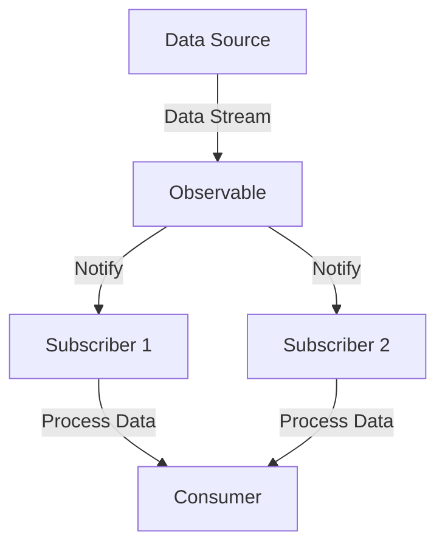

## 12.6 Integrating Reactive Patterns in Erlang Applications

Reactive programming is a paradigm that focuses on asynchronous data streams and the propagation of change. In Erlang, a language renowned for its concurrency and fault-tolerance, integrating reactive patterns can significantly enhance the responsiveness and scalability of applications. This section explores strategies for refactoring existing Erlang code to adopt reactive patterns, combining traditional Erlang practices with reactive concepts, and the benefits of such integration.

### Understanding Reactive Programming in Erlang

Reactive programming in Erlang involves creating systems that react to changes in data or events. This is achieved through the use of asynchronous data streams and the propagation of changes. Erlang's concurrency model, based on lightweight processes and message passing, aligns well with the principles of reactive programming.

#### Key Concepts

- **Asynchronous Data Streams**: Data flows that can be observed and reacted to without blocking the main execution flow.
- **Event Propagation**: Changes in data or state trigger updates in dependent components.
- **Backpressure**: A mechanism to handle situations where data producers outpace consumers.

### Strategies for Refactoring Code to Adopt Reactive Patterns

Refactoring existing Erlang applications to incorporate reactive patterns involves several steps. The goal is to enhance the system's ability to handle asynchronous data flows and improve its responsiveness.

#### Identify Reactive Opportunities

1. **Analyze Current Architecture**: Examine the existing system to identify areas where reactive patterns can be beneficial. Look for parts of the application that deal with asynchronous data or events.
2. **Determine Data Flow**: Map out the data flow within the application to understand how data is processed and where bottlenecks occur.

#### Refactor for Asynchronous Processing

1. **Decouple Components**: Use Erlang's process model to decouple components, allowing them to operate independently and communicate via message passing.
2. **Implement Observables**: Create observables for data streams that can be subscribed to by interested parties. This can be achieved using Erlang's message passing capabilities.

```erlang
-module(observable).
-export([create/1, subscribe/2, notify/2]).

create() ->
    spawn(fun() -> loop([]) end).

loop(Subscribers) ->
    receive
        {subscribe, Subscriber} ->
            loop([Subscriber | Subscribers]);
        {notify, Message} ->
            lists:foreach(fun(Subscriber) -> Subscriber ! Message end, Subscribers),
            loop(Subscribers)
    end.

subscribe(Observable, Subscriber) ->
    Observable ! {subscribe, Subscriber}.

notify(Observable, Message) ->
    Observable ! {notify, Message}.
```

#### Introduce Backpressure Mechanisms

1. **Control Data Flow**: Implement mechanisms to control the flow of data, ensuring that consumers are not overwhelmed by producers.
2. **Use Buffers**: Introduce buffers to manage data flow and apply backpressure when necessary.

### Combining Traditional Erlang Practices with Reactive Concepts

Erlang's strengths in concurrency and fault-tolerance can be leveraged to implement reactive systems effectively. By combining traditional Erlang practices with reactive concepts, developers can create robust and scalable applications.

#### Message Passing and Reactive Streams

Erlang's message passing model is inherently reactive. By treating messages as data streams, we can create systems that react to changes in state or data.

```erlang
-module(reactive_stream).
-export([start/0, produce/2, consume/1]).

start() ->
    Producer = spawn(fun() -> producer_loop() end),
    Consumer = spawn(fun() -> consumer_loop() end),
    Producer ! {set_consumer, Consumer},
    {Producer, Consumer}.

producer_loop() ->
    receive
        {set_consumer, Consumer} ->
            produce(Consumer, 0)
    end.

produce(Consumer, N) ->
    Consumer ! {data, N},
    timer:sleep(1000),
    produce(Consumer, N + 1).

consumer_loop() ->
    receive
        {data, N} ->
            io:format("Received: ~p~n", [N]),
            consumer_loop()
    end.
```

#### Fault Tolerance and Reactive Systems

Erlang's "let it crash" philosophy aligns well with reactive systems, where components are designed to fail gracefully and recover automatically.

1. **Supervision Trees**: Use OTP's supervision trees to manage the lifecycle of reactive components, ensuring that failures are isolated and recovery is automatic.
2. **Error Handling**: Implement robust error handling strategies to manage failures in data streams.

### Benefits of Integrating Reactive Patterns

Integrating reactive patterns into Erlang applications offers several benefits:

- **Improved Responsiveness**: Systems can react to changes in data or state more quickly, enhancing user experience.
- **Scalability**: Reactive systems can handle increased load more effectively by distributing work across multiple processes.
- **Resilience**: By embracing Erlang's fault-tolerance features, reactive systems can recover from failures more gracefully.

### Incremental Adoption of Reactive Techniques

Adopting reactive patterns does not require a complete overhaul of existing systems. Instead, developers can incrementally introduce reactive techniques, starting with small components and gradually expanding to larger parts of the application.

1. **Start Small**: Begin by refactoring a single component to use reactive patterns, such as an observable data stream.
2. **Iterate and Expand**: Gradually apply reactive techniques to other parts of the system, iterating and refining the approach as needed.
3. **Monitor and Adjust**: Continuously monitor the system's performance and adjust the implementation to address any issues that arise.

### Visualizing Reactive Patterns in Erlang

To better understand how reactive patterns can be integrated into Erlang applications, let's visualize the flow of data and messages in a reactive system.



**Diagram Description**: This diagram illustrates a simple reactive system where a data source produces a stream of data. The data is observed by an observable, which notifies multiple subscribers. Each subscriber processes the data independently.

### Try It Yourself

To deepen your understanding of integrating reactive patterns in Erlang, try modifying the provided code examples:

- **Experiment with Different Data Sources**: Modify the `produce/2` function to generate different types of data or events.
- **Add More Subscribers**: Extend the `observable` module to support additional subscribers and observe how the system handles increased load.
- **Implement Backpressure**: Introduce a buffer in the `reactive_stream` module to manage data flow and apply backpressure when necessary.

### Key Takeaways

- **Reactive programming** in Erlang leverages asynchronous data streams and event propagation to enhance responsiveness and scalability.
- **Refactoring existing code** to adopt reactive patterns involves decoupling components, implementing observables, and introducing backpressure mechanisms.
- **Combining traditional Erlang practices** with reactive concepts can create robust and scalable systems.
- **Incremental adoption** of reactive techniques allows for gradual integration without overhauling the entire system.

### References and Further Reading

- [Reactive Programming in Erlang](https://erlang.org/doc/design_principles/reactive_programming.html)
- [Erlang and OTP in Action](https://www.manning.com/books/erlang-and-otp-in-action)
- [Reactive Streams Specification](https://www.reactive-streams.org/)

## Quiz: Integrating Reactive Patterns in Erlang Applications



### What is the primary focus of reactive programming?

- [x] Asynchronous data streams and event propagation
- [ ] Synchronous data processing
- [ ] Blocking operations
- [ ] Sequential execution

> **Explanation:** Reactive programming focuses on asynchronous data streams and the propagation of changes, allowing systems to react to data or event changes efficiently.

### How can Erlang's message passing model be utilized in reactive programming?

- [x] By treating messages as data streams
- [ ] By blocking message queues
- [ ] By using synchronous communication
- [ ] By avoiding message passing

> **Explanation:** Erlang's message passing model can be leveraged to treat messages as data streams, enabling reactive systems to react to changes in state or data.

### What is a key benefit of integrating reactive patterns into Erlang applications?

- [x] Improved responsiveness and scalability
- [ ] Increased complexity
- [ ] Reduced fault tolerance
- [ ] Slower data processing

> **Explanation:** Integrating reactive patterns can improve the responsiveness and scalability of Erlang applications by enabling them to handle asynchronous data flows more effectively.

### What is the purpose of backpressure in reactive systems?

- [x] To control data flow and prevent consumers from being overwhelmed
- [ ] To increase data production rate
- [ ] To block data streams
- [ ] To simplify data processing

> **Explanation:** Backpressure is used to control data flow, ensuring that consumers are not overwhelmed by producers, thus maintaining system stability.

### How can Erlang's "let it crash" philosophy benefit reactive systems?

- [x] By allowing components to fail gracefully and recover automatically
- [ ] By preventing any failures
- [ ] By ignoring errors
- [ ] By increasing system complexity

> **Explanation:** Erlang's "let it crash" philosophy allows reactive systems to handle failures gracefully, with components designed to recover automatically.

### What is the role of observables in reactive programming?

- [x] To create data streams that can be subscribed to by interested parties
- [ ] To block data flow
- [ ] To simplify synchronous processing
- [ ] To reduce data complexity

> **Explanation:** Observables create data streams that can be subscribed to by interested parties, enabling reactive systems to react to changes in data or events.

### How can developers incrementally adopt reactive techniques in Erlang applications?

- [x] By starting with small components and gradually expanding
- [ ] By overhauling the entire system at once
- [ ] By avoiding reactive patterns
- [ ] By using synchronous processing

> **Explanation:** Developers can incrementally adopt reactive techniques by starting with small components and gradually expanding to larger parts of the application.

### What is a common strategy for refactoring Erlang code to adopt reactive patterns?

- [x] Decoupling components and using message passing
- [ ] Increasing code complexity
- [ ] Blocking data streams
- [ ] Avoiding process communication

> **Explanation:** Refactoring Erlang code to adopt reactive patterns involves decoupling components and using message passing to enable asynchronous data flows.

### What is the benefit of using supervision trees in reactive systems?

- [x] To manage the lifecycle of reactive components and ensure recovery from failures
- [ ] To increase system complexity
- [ ] To block data streams
- [ ] To simplify error handling

> **Explanation:** Supervision trees manage the lifecycle of reactive components, ensuring that failures are isolated and recovery is automatic.

### True or False: Reactive programming in Erlang requires a complete system overhaul.

- [ ] True
- [x] False

> **Explanation:** Reactive programming in Erlang can be adopted incrementally, allowing developers to gradually introduce reactive techniques without overhauling the entire system.



Remember, integrating reactive patterns in Erlang is a journey. Start small, experiment, and gradually expand your use of reactive techniques. As you progress, you'll build more responsive and scalable applications. Keep exploring, stay curious, and enjoy the journey!
