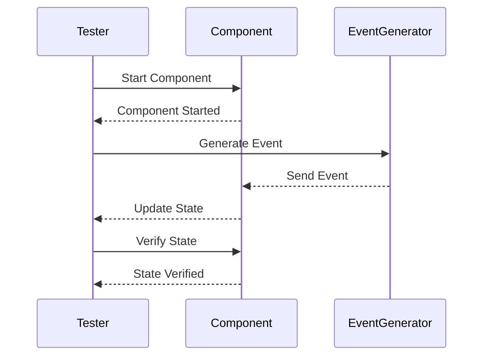

## 12.7 Testing Reactive Systems

Reactive systems are designed to be responsive, resilient, elastic, and message-driven. Testing these systems presents unique challenges due to their asynchronous and event-driven nature. In this section, we will explore strategies and tools for effectively testing reactive systems in Erlang, ensuring their reliability and correctness.

### Challenges of Testing Asynchronous and Event-Driven Code

Testing reactive systems involves dealing with asynchronous operations, non-deterministic behavior, and complex interactions between components. Here are some of the key challenges:

- **Concurrency and Timing Issues**: Asynchronous operations can lead to race conditions and timing issues that are difficult to reproduce and test.
- **State Management**: Reactive systems often maintain state across various components, making it challenging to ensure consistency and correctness.
- **Event Handling**: The system's behavior is driven by events, which can occur in unpredictable sequences and combinations.
- **Non-Determinism**: The order of message processing and the timing of events can vary, leading to non-deterministic behavior.

### Techniques for Simulating Data Streams and Events

To effectively test reactive systems, we need to simulate data streams and events. Here are some techniques to achieve this:

#### 1. Mocking and Stubbing

Mocking and stubbing are essential techniques for simulating external dependencies and controlling the behavior of components during testing.

- **Mocks**: Create mock objects to simulate the behavior of real components. Use them to verify interactions and assert that certain methods are called with expected parameters.
- **Stubs**: Use stubs to provide predefined responses to method calls, allowing you to control the flow of the test.

#### 2. Event Simulation

Simulate events and data streams to test how the system reacts to various scenarios.

- **Event Generators**: Create event generators that produce a sequence of events to simulate real-world scenarios.
- **Data Streams**: Use data streams to simulate continuous input, testing the system's ability to handle real-time data.

#### 3. Time Manipulation

Manipulating time is crucial for testing time-dependent behavior in reactive systems.

- **Time Travel**: Use techniques to fast-forward or rewind time, allowing you to test time-based logic without waiting for real-time delays.
- **Timers and Schedulers**: Simulate timers and schedulers to test how the system handles scheduled tasks and timeouts.

### Using EUnit and Common Test for Reactive Components

Erlang provides powerful testing frameworks like EUnit and Common Test, which can be leveraged to test reactive components effectively.

#### EUnit

EUnit is a lightweight unit testing framework for Erlang, ideal for testing individual functions and modules.

- **Setup and Teardown**: Use setup and teardown functions to prepare the environment and clean up after tests.
- **Assertions**: Use assertions to verify that the system behaves as expected.
- **Test Suites**: Organize tests into suites for better structure and readability.

#### Common Test

Common Test is a more comprehensive testing framework, suitable for integration and system testing.

- **Test Cases**: Define test cases to cover different scenarios and edge cases.
- **Configuration**: Use configuration files to manage test environments and dependencies.
- **Logging and Reporting**: Take advantage of built-in logging and reporting features to analyze test results.

### Property-Based Testing for Reactive Systems

Property-based testing is a powerful technique for testing reactive systems, allowing you to define properties that the system should satisfy.

- **Properties**: Define properties that describe the expected behavior of the system. These can include invariants, preconditions, and postconditions.
- **Generators**: Use generators to produce a wide range of input data, ensuring that the system is tested against various scenarios.
- **Shrinking**: Automatically reduce failing test cases to minimal examples, making it easier to identify the root cause of issues.

### Importance of Thorough Testing

Due to the complexity of concurrency and the potential for subtle bugs, thorough testing is crucial for reactive systems. Here are some best practices:

- **Test Coverage**: Aim for high test coverage to ensure that all parts of the system are tested.
- **Stress Testing**: Perform stress testing to evaluate the system's performance under heavy load and identify bottlenecks.
- **Fault Injection**: Use fault injection to simulate failures and test the system's resilience and fault tolerance.

### Code Example: Testing a Reactive Component

Let's look at a simple example of testing a reactive component using EUnit.

```erlang
-module(my_reactive_component_test).
-include_lib("eunit/include/eunit.hrl").

% Test setup
setup() ->
    % Initialize the component
    {ok, Pid} = my_reactive_component:start_link(),
    {Pid, fun() -> my_reactive_component:stop(Pid) end}.

% Test case: Verify event handling
event_handling_test() ->
    {Pid, Cleanup} = setup(),
    try
        % Simulate an event
        my_reactive_component:send_event(Pid, {event, "test_event"}),
        % Assert expected state
        ?assertEqual(expected_state, my_reactive_component:get_state(Pid))
    after
        Cleanup()
    end.

% Test suite
my_reactive_component_test_() ->
    [setup, event_handling_test].
```

In this example, we define a test module for a reactive component. The `setup` function initializes the component, and the `event_handling_test` function simulates an event and verifies the expected state.

### Visualizing Reactive System Testing

To better understand the flow of testing a reactive system, let's visualize the process using a sequence diagram.



**Diagram Description**: This sequence diagram illustrates the process of testing a reactive component. The tester starts the component, generates an event, and verifies the component's state after processing the event.

### Knowledge Check

- **Question**: What are the main challenges of testing reactive systems?
- **Question**: How can you simulate data streams and events in reactive systems?
- **Question**: What are the benefits of using property-based testing for reactive systems?

### Embrace the Journey

Testing reactive systems can be challenging, but with the right strategies and tools, you can ensure their reliability and correctness. Remember, this is just the beginning. As you progress, you'll build more complex and robust systems. Keep experimenting, stay curious, and enjoy the journey!

## Quiz: Testing Reactive Systems



### What is a key challenge of testing reactive systems?

- [x] Concurrency and timing issues
- [ ] Lack of available testing tools
- [ ] Limited test coverage
- [ ] Absence of event-driven architecture

> **Explanation:** Concurrency and timing issues are a key challenge due to the asynchronous nature of reactive systems.

### Which technique is used to simulate external dependencies in testing?

- [x] Mocking
- [ ] Logging
- [ ] Debugging
- [ ] Profiling

> **Explanation:** Mocking is used to simulate external dependencies and control component behavior during testing.

### What is the purpose of property-based testing?

- [x] To define properties that the system should satisfy
- [ ] To increase code coverage
- [ ] To reduce test execution time
- [ ] To simplify test case creation

> **Explanation:** Property-based testing defines properties that describe the expected behavior of the system.

### Which Erlang testing framework is suitable for integration testing?

- [x] Common Test
- [ ] EUnit
- [ ] Dialyzer
- [ ] PropEr

> **Explanation:** Common Test is suitable for integration and system testing in Erlang.

### What is the benefit of using generators in property-based testing?

- [x] They produce a wide range of input data
- [ ] They simplify test case management
- [ ] They enhance logging capabilities
- [ ] They improve test execution speed

> **Explanation:** Generators produce a wide range of input data, ensuring the system is tested against various scenarios.

### How can you manipulate time for testing time-dependent behavior?

- [x] Time travel techniques
- [ ] Event logging
- [ ] Code refactoring
- [ ] Dependency injection

> **Explanation:** Time travel techniques allow you to fast-forward or rewind time to test time-based logic.

### What is the role of fault injection in testing reactive systems?

- [x] To simulate failures and test resilience
- [ ] To improve code readability
- [ ] To enhance performance
- [ ] To simplify debugging

> **Explanation:** Fault injection simulates failures to test the system's resilience and fault tolerance.

### Which tool is used for unit testing in Erlang?

- [x] EUnit
- [ ] Common Test
- [ ] Dialyzer
- [ ] PropEr

> **Explanation:** EUnit is a lightweight unit testing framework for Erlang.

### What is the importance of stress testing in reactive systems?

- [x] To evaluate performance under heavy load
- [ ] To simplify code structure
- [ ] To improve test coverage
- [ ] To enhance logging capabilities

> **Explanation:** Stress testing evaluates the system's performance under heavy load and identifies bottlenecks.

### True or False: Non-determinism is a challenge in testing reactive systems.

- [x] True
- [ ] False

> **Explanation:** Non-determinism is a challenge due to the variable order of message processing and event timing.


