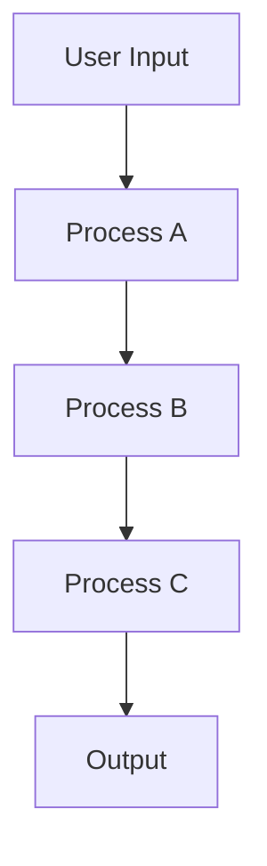

## 12.8 Best Practices in Reactive Programming

Reactive programming is a paradigm that focuses on asynchronous data streams and the propagation of change. In Erlang, this paradigm is naturally supported by the language's concurrency model and its functional programming roots. This section compiles best practices for implementing reactive programming in Erlang effectively, ensuring that your systems are robust, scalable, and maintainable.

### Key Principles for Building Reactive Systems

#### 1. Embrace Asynchronous Communication

Reactive systems thrive on asynchronous communication. In Erlang, processes communicate through message passing, which is inherently asynchronous. This allows systems to remain responsive under load and handle multiple tasks concurrently.

- **Example**: Use Erlang's lightweight processes to handle different parts of your application independently. This can be achieved by spawning processes and using message passing to communicate between them.

```erlang
% Spawning a process to handle a task
Pid = spawn(fun() -> handle_task() end),

% Sending a message to the process
Pid ! {task, Data},

% Receiving a message in a process
receive
    {task, Data} -> process_data(Data)
end.
```

#### 2. Design for Resilience

A key aspect of reactive systems is resilience. Erlang's "let it crash" philosophy supports this by encouraging developers to design systems that can recover from failures gracefully.

- **Example**: Use supervisors to monitor processes and restart them if they fail.

```erlang
% Define a supervisor with a child process
-supervisor:start_link({local, my_supervisor}, my_supervisor, []).

% Supervisor callback module
-module(my_supervisor).
-behaviour(supervisor).

init([]) ->
    % Define child processes
    Children = [
        {worker, {my_worker, start_link, []}, permanent, 5000, worker, [my_worker]}
    ],
    {ok, {{one_for_one, 5, 10}, Children}}.
```

#### 3. Prioritize Responsiveness

Ensure that your system remains responsive under varying load conditions. This can be achieved by designing non-blocking operations and using backpressure mechanisms to manage load.

- **Example**: Implement backpressure by controlling the flow of messages between processes.

```erlang
% Implementing backpressure
handle_message(State) ->
    case can_accept_more(State) of
        true -> receive_message(State);
        false -> {noreply, State}
    end.
```

### Common Pitfalls and How to Avoid Them

#### 1. Avoid Blocking Operations

Blocking operations can hinder the responsiveness of your system. Ensure that long-running tasks are handled asynchronously.

- **Solution**: Use asynchronous APIs and offload blocking operations to separate processes.

```erlang
% Offloading a blocking operation
spawn(fun() -> perform_blocking_operation() end).
```

#### 2. Prevent Process Overload

Creating too many processes can lead to system overload. Monitor the number of processes and ensure they are properly managed.

- **Solution**: Use process pools to manage resources efficiently.

```erlang
% Example of a simple process pool
pool_manager() ->
    receive
        {request, From} ->
            Pid = spawn(fun worker/0),
            From ! {ok, Pid},
            pool_manager()
    end.
```

#### 3. Handle Errors Gracefully

Reactive systems should handle errors gracefully without affecting the overall system stability.

- **Solution**: Use try-catch blocks and error logging to manage exceptions.

```erlang
% Error handling with try-catch
try
    risky_operation()
catch
    error:Reason ->
        log_error(Reason),
        {error, Reason}
end.
```

### Effective Patterns for Error Handling and Recovery

#### 1. Use Supervisors for Fault Tolerance

Supervisors are a core component of Erlang's OTP framework, providing a structured way to manage process lifecycles and recover from failures.

- **Example**: Define a supervision tree with appropriate restart strategies.

```erlang
% Supervisor with a one_for_one strategy
init([]) ->
    Children = [
        {worker, {my_worker, start_link, []}, permanent, 5000, worker, [my_worker]}
    ],
    {ok, {{one_for_one, 5, 10}, Children}}.
```

#### 2. Implement Circuit Breakers

Circuit breakers prevent a system from repeatedly attempting operations that are likely to fail, protecting it from cascading failures.

- **Example**: Implement a simple circuit breaker pattern.

```erlang
% Circuit breaker implementation
circuit_breaker(State) ->
    case State of
        open -> {error, "Circuit is open"};
        closed -> try_operation()
    end.
```

#### 3. Log and Monitor Errors

Logging and monitoring are essential for identifying and diagnosing issues in reactive systems.

- **Example**: Use Erlang's built-in logging capabilities to track errors.

```erlang
% Logging an error
error_logger:error_msg("An error occurred: ~p", [Reason]).
```

### Writing Clear, Modular, and Maintainable Code

#### 1. Use Modules to Organize Code

Erlang modules help organize code into logical units, making it easier to maintain and extend.

- **Example**: Define modules with clear interfaces and responsibilities.

```erlang
% Defining a module
-module(my_module).
-export([function1/0, function2/1]).

function1() ->
    % Implementation
    ok.

function2(Arg) ->
    % Implementation
    Arg.
```

#### 2. Follow Naming Conventions

Consistent naming conventions improve code readability and maintainability.

- **Example**: Use descriptive names for functions and variables.

```erlang
% Descriptive naming
calculate_total_price(Items) ->
    % Implementation
    Total.
```

#### 3. Write Tests for Your Code

Testing is crucial for ensuring the reliability of reactive systems. Use Erlang's testing frameworks to write unit and integration tests.

- **Example**: Write tests using EUnit.

```erlang
% EUnit test example
-module(my_module_tests).
-include_lib("eunit/include/eunit.hrl").

function1_test() ->
    ?assertEqual(ok, my_module:function1()).
```

### Guidelines for Performance Optimization and Resource Management

#### 1. Optimize Message Passing

Efficient message passing is critical for the performance of reactive systems.

- **Example**: Minimize the size of messages and avoid unnecessary data copying.

```erlang
% Optimizing message passing
send_message(Pid, Data) when is_pid(Pid) ->
    Pid ! {data, Data}.
```

#### 2. Use ETS for Shared State

ETS (Erlang Term Storage) provides a way to store and access shared state efficiently.

- **Example**: Use ETS tables for caching and shared data access.

```erlang
% Creating an ETS table
Table = ets:new(my_table, [set, public]),

% Storing data in ETS
ets:insert(Table, {key, value}),

% Retrieving data from ETS
case ets:lookup(Table, key) of
    [{key, Value}] -> Value;
    [] -> undefined
end.
```

#### 3. Profile and Monitor Performance

Regularly profile and monitor your system to identify bottlenecks and optimize performance.

- **Example**: Use Erlang's profiling tools to analyze performance.

```erlang
% Profiling with fprof
fprof:apply(fun_to_profile, [Args]),
fprof:profile(),
fprof:analyse([{sort, time}]).
```

### Visualizing Reactive Systems in Erlang

To better understand the flow of data and control in reactive systems, let's visualize a simple reactive architecture using Mermaid.js.



**Description**: This diagram represents a simple reactive system where user input is processed through a series of processes (A, B, C) before producing an output. Each process can operate independently, allowing for asynchronous and concurrent execution.

### Knowledge Check

- **Question**: What is the primary benefit of using asynchronous communication in reactive systems?
- **Challenge**: Modify the provided code examples to implement a new feature or optimize performance.

### Embrace the Journey

Remember, reactive programming in Erlang is a powerful approach to building scalable and resilient systems. As you continue to explore and implement these best practices, you'll gain a deeper understanding of how to leverage Erlang's unique features to create robust applications. Keep experimenting, stay curious, and enjoy the journey!

## Quiz: Best Practices in Reactive Programming



### What is a key principle of reactive programming in Erlang?

- [x] Asynchronous communication
- [ ] Synchronous communication
- [ ] Single-threaded execution
- [ ] Blocking operations

> **Explanation:** Asynchronous communication is fundamental to reactive programming, allowing systems to remain responsive and handle multiple tasks concurrently.

### How can you ensure resilience in a reactive system?

- [x] Use supervisors to monitor and restart processes
- [ ] Avoid using supervisors
- [ ] Use blocking operations
- [ ] Ignore process failures

> **Explanation:** Supervisors are used to monitor processes and restart them if they fail, ensuring system resilience.

### What is a common pitfall in reactive programming?

- [x] Blocking operations
- [ ] Asynchronous communication
- [ ] Using supervisors
- [ ] Message passing

> **Explanation:** Blocking operations can hinder system responsiveness and should be avoided in reactive programming.

### How can you handle errors gracefully in a reactive system?

- [x] Use try-catch blocks and error logging
- [ ] Ignore errors
- [ ] Use blocking operations
- [ ] Avoid error handling

> **Explanation:** Using try-catch blocks and error logging helps manage exceptions and maintain system stability.

### What is a benefit of using ETS in Erlang?

- [x] Efficient shared state management
- [ ] Blocking operations
- [ ] Synchronous communication
- [ ] Single-threaded execution

> **Explanation:** ETS provides efficient shared state management, making it useful for caching and shared data access.

### How can you optimize message passing in Erlang?

- [x] Minimize message size and avoid unnecessary data copying
- [ ] Increase message size
- [ ] Use blocking operations
- [ ] Ignore message optimization

> **Explanation:** Minimizing message size and avoiding unnecessary data copying can optimize message passing.

### What tool can you use for profiling in Erlang?

- [x] fprof
- [ ] ets
- [ ] supervisor
- [ ] error_logger

> **Explanation:** fprof is a profiling tool in Erlang used to analyze performance.

### What is a best practice for writing maintainable code in Erlang?

- [x] Use modules to organize code
- [ ] Avoid using modules
- [ ] Write monolithic code
- [ ] Ignore code organization

> **Explanation:** Using modules helps organize code into logical units, improving maintainability.

### How can you implement backpressure in a reactive system?

- [x] Control the flow of messages between processes
- [ ] Ignore message flow
- [ ] Use blocking operations
- [ ] Avoid message passing

> **Explanation:** Implementing backpressure involves controlling the flow of messages to manage load effectively.

### True or False: Reactive programming in Erlang relies on synchronous communication.

- [ ] True
- [x] False

> **Explanation:** Reactive programming in Erlang relies on asynchronous communication, not synchronous.




