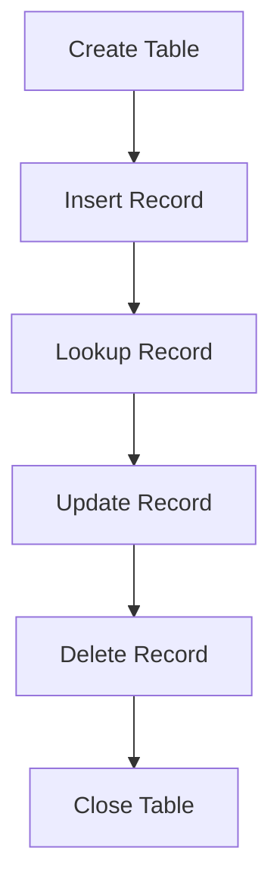

## 13.1 In-Memory Storage with ETS and DETS

In the world of Erlang, efficient data storage and management are crucial for building robust and scalable applications. Erlang Term Storage (ETS) and Disk Erlang Term Storage (DETS) are two powerful tools that facilitate in-memory and disk-based storage solutions. This section will guide you through the features, differences, and practical applications of ETS and DETS, providing you with the knowledge to leverage these tools effectively.

### Introduction to ETS and DETS

**Erlang Term Storage (ETS)** is a built-in feature of Erlang that allows for the creation of large in-memory tables. These tables can store tuples and are highly efficient for concurrent read and write operations. ETS is particularly useful for applications requiring fast access to shared data.

**Disk Erlang Term Storage (DETS)** extends the functionality of ETS by providing a mechanism to store data on disk. This is essential for applications that need to persist data beyond the lifecycle of an Erlang process or system restart.

#### Key Features of ETS

- **In-Memory Storage**: ETS tables reside in memory, providing fast access to data.
- **Concurrent Access**: Supports concurrent reads and writes, making it suitable for multi-process environments.
- **Multiple Table Types**: Includes set, ordered_set, bag, and duplicate_bag, each with unique characteristics.
- **Large Capacity**: Can handle large volumes of data, limited only by available memory.

#### Key Features of DETS

- **Disk-Based Storage**: Stores data on disk, ensuring persistence across system restarts.
- **Compatibility with ETS**: Shares similar API and table types with ETS, easing the transition between in-memory and disk-based storage.
- **Data Size Limitations**: Each DETS file has a size limit, which must be considered during design.

### Creating and Managing ETS Tables

Let's dive into how to create and manage ETS tables in Erlang. We'll explore the different types of tables and how to perform basic operations.

#### Creating ETS Tables

To create an ETS table, use the `ets:new/2` function. This function requires a table name and a list of options specifying the table type and properties.

```erlang
% Create a set-type ETS table
Table = ets:new(my_table, [set, public]).
```

- **Table Types**: `set`, `ordered_set`, `bag`, `duplicate_bag`.
- **Access Control**: `public`, `protected`, `private`.

#### Accessing and Modifying ETS Tables

Once a table is created, you can perform various operations such as inserting, updating, and deleting records.

```erlang
% Insert a record into the table
ets:insert(Table, {key1, value1}).

% Lookup a record by key
{ok, Record} = ets:lookup(Table, key1).

% Update a record
ets:insert(Table, {key1, new_value}).

% Delete a record
ets:delete(Table, key1).
```

#### Managing ETS Tables

ETS tables can be managed using functions like `ets:delete/1` to remove tables and `ets:info/1` to retrieve table information.

```erlang
% Delete the entire table
ets:delete(Table).

% Get information about the table
Info = ets:info(Table).
```

### Using DETS for Persistent Storage

DETS provides a way to store data on disk, ensuring persistence. Let's explore how to create and manage DETS tables.

#### Creating DETS Tables

To create a DETS table, use the `dets:open_file/2` function. This function requires a file name and a list of options.

```erlang
% Open a DETS table
{ok, DetsTable} = dets:open_file(my_dets_table, [type => set]).
```

#### Accessing and Modifying DETS Tables

DETS tables support similar operations to ETS, with functions like `dets:insert/2`, `dets:lookup/2`, and `dets:delete/2`.

```erlang
% Insert a record into the DETS table
dets:insert(DetsTable, {key1, value1}).

% Lookup a record by key
{ok, Record} = dets:lookup(DetsTable, key1).

% Delete a record
dets:delete(DetsTable, key1).
```

#### Closing DETS Tables

It's important to close DETS tables when they're no longer needed to ensure data integrity.

```erlang
% Close the DETS table
dets:close(DetsTable).
```

### Use Cases for ETS and DETS

ETS and DETS are versatile tools with a wide range of applications. Here are some common use cases:

- **Caching**: Use ETS for fast, in-memory caching of frequently accessed data.
- **Session Storage**: Store user session data in ETS for quick retrieval.
- **Persistent Data**: Use DETS for data that needs to persist across system restarts.
- **Configuration Management**: Store configuration settings in ETS for easy access by multiple processes.

### Considerations for Data Size and Performance

When using ETS and DETS, consider the following:

- **Memory Usage**: ETS tables reside in memory, so ensure sufficient memory is available.
- **DETS File Size Limit**: DETS files have a size limit (typically 2GB), which can impact design decisions.
- **Concurrency**: ETS supports concurrent access, but DETS operations are serialized, affecting performance.

### Visualizing ETS and DETS Operations

To better understand how ETS and DETS work, let's visualize the operations using Mermaid.js diagrams.



**Diagram Description**: This flowchart illustrates the typical operations performed on ETS and DETS tables, from creation to closure.

### Knowledge Check

Before we wrap up, let's reinforce what we've learned with a few questions:

- What are the key differences between ETS and DETS?
- How do you ensure data persistence with DETS?
- What are some common use cases for ETS?

### Summary

In this section, we've explored the powerful in-memory and disk-based storage solutions provided by ETS and DETS in Erlang. We've learned how to create, access, and manage data efficiently, and discussed practical applications and considerations for using these tools. Remember, mastering ETS and DETS will enhance your ability to build robust and scalable Erlang applications.

### Embrace the Journey

As you continue your journey with Erlang, keep experimenting with ETS and DETS. Try different table types, explore new use cases, and optimize your applications for performance and scalability. The more you practice, the more proficient you'll become in leveraging these powerful tools.

## Quiz: In-Memory Storage with ETS and DETS



### What is the primary purpose of ETS in Erlang?

- [x] To provide efficient in-memory storage for concurrent access
- [ ] To store data on disk for persistence
- [ ] To manage network connections
- [ ] To compile Erlang code

> **Explanation:** ETS is designed for efficient in-memory storage, allowing concurrent access by multiple processes.

### Which function is used to create an ETS table?

- [x] ets:new/2
- [ ] ets:create/2
- [ ] ets:open/2
- [ ] ets:start/2

> **Explanation:** The `ets:new/2` function is used to create a new ETS table.

### What is a key feature of DETS compared to ETS?

- [x] DETS provides disk-based storage for persistence
- [ ] DETS supports concurrent access
- [ ] DETS allows for unlimited data size
- [ ] DETS is faster than ETS

> **Explanation:** DETS provides disk-based storage, ensuring data persistence across system restarts.

### How do you close a DETS table?

- [x] dets:close/1
- [ ] dets:delete/1
- [ ] dets:stop/1
- [ ] dets:terminate/1

> **Explanation:** The `dets:close/1` function is used to close a DETS table.

### Which of the following is a valid use case for ETS?

- [x] Caching frequently accessed data
- [ ] Storing large files
- [ ] Managing network connections
- [ ] Compiling Erlang code

> **Explanation:** ETS is commonly used for caching frequently accessed data due to its fast in-memory access.

### What is a limitation of DETS?

- [x] Each DETS file has a size limit
- [ ] DETS does not support disk storage
- [ ] DETS cannot be used with ETS
- [ ] DETS is not compatible with Erlang

> **Explanation:** DETS files have a size limit, typically around 2GB, which must be considered during design.

### How do you insert a record into an ETS table?

- [x] ets:insert/2
- [ ] ets:add/2
- [ ] ets:put/2
- [ ] ets:store/2

> **Explanation:** The `ets:insert/2` function is used to insert a record into an ETS table.

### What type of access does ETS support?

- [x] Concurrent access by multiple processes
- [ ] Exclusive access by a single process
- [ ] Read-only access
- [ ] Write-only access

> **Explanation:** ETS supports concurrent access, allowing multiple processes to read and write simultaneously.

### True or False: DETS tables are stored in memory.

- [ ] True
- [x] False

> **Explanation:** DETS tables are stored on disk, providing persistence across system restarts.

### Which table type in ETS allows for duplicate keys?

- [x] duplicate_bag
- [ ] set
- [ ] ordered_set
- [ ] bag

> **Explanation:** The `duplicate_bag` table type in ETS allows for duplicate keys.



Remember, this is just the beginning. As you progress, you'll build more complex and interactive applications using ETS and DETS. Keep experimenting, stay curious, and enjoy the journey!
