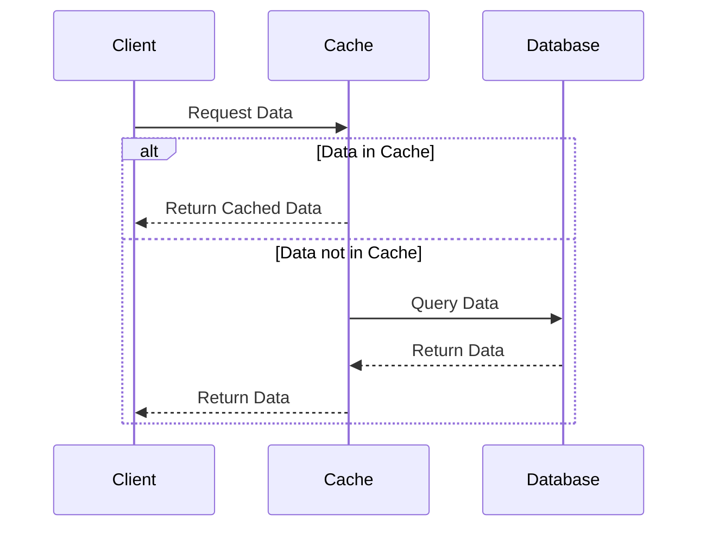

## 13.10 Optimization Techniques for Data Access

In the realm of Erlang programming, optimizing data access is crucial for building high-performance and scalable applications. This section delves into various techniques that can be employed to enhance data access efficiency, reduce latency, and improve overall application performance. We will explore indexing strategies, querying optimizations, minimizing data retrieval overhead, batching operations, and the importance of profiling and monitoring data access patterns.

### Indexing Strategies and Querying Optimizations

Indexing is a powerful technique to speed up data retrieval operations. In Erlang, when working with databases like Mnesia or external databases such as PostgreSQL or MySQL, proper indexing can significantly reduce query execution time.

#### Indexing in Mnesia

Mnesia, Erlang's distributed database, supports secondary indexes, which can be used to optimize query performance. Here's how you can create and use indexes in Mnesia:

```erlang
% Define a record with an index
-record(person, {id, name, age}).

% Create a table with an index on the 'name' field
mnesia:create_table(person, [
    {attributes, record_info(fields, person)},
    {index, [name]}
]).

% Query using the index
find_person_by_name(Name) ->
    mnesia:transaction(fun() ->
        mnesia:index_read(person, Name, #person.name)
    end).
```

**Explanation**: In this example, we define a `person` record and create a Mnesia table with an index on the `name` field. The `index_read/3` function leverages the index to quickly find records by name.

#### Query Optimization in SQL Databases

When working with SQL databases, optimizing queries involves using indexes, avoiding full table scans, and leveraging query execution plans. Consider the following SQL query optimization tips:

- **Use Indexes**: Ensure that columns used in `WHERE`, `JOIN`, and `ORDER BY` clauses are indexed.
- **Avoid SELECT *:** Specify only the columns you need to reduce data transfer.
- **Use LIMIT**: Limit the number of rows returned to avoid fetching unnecessary data.
- **Analyze Query Plans**: Use tools like `EXPLAIN` in PostgreSQL to understand and optimize query execution plans.

### Minimizing Data Retrieval Overhead

Reducing the overhead associated with data retrieval can lead to significant performance gains. Here are some strategies to minimize data retrieval overhead:

#### Caching Frequently Accessed Data

Caching is an effective way to reduce the load on databases by storing frequently accessed data in memory. Erlang's ETS (Erlang Term Storage) is a powerful tool for caching:

```erlang
% Create an ETS table for caching
Cache = ets:new(person_cache, [set, public, named_table]).

% Cache a person record
ets:insert(person_cache, {1, #person{id=1, name="Alice", age=30}}).

% Retrieve from cache
get_person_from_cache(Id) ->
    case ets:lookup(person_cache, Id) of
        [] -> not_found;
        [{_, Person}] -> Person
    end.
```

**Explanation**: In this example, we create an ETS table named `person_cache` and use it to cache and retrieve person records, reducing the need to query the database repeatedly.

#### Reducing Network Calls

Minimizing network calls is essential for optimizing data access, especially in distributed systems. Consider the following techniques:

- **Batch Requests**: Group multiple requests into a single network call to reduce latency.
- **Use Asynchronous Calls**: Utilize Erlang's asynchronous messaging to avoid blocking operations.
- **Data Compression**: Compress data before transmission to reduce bandwidth usage.

### Batching Operations

Batching operations can significantly improve performance by reducing the number of interactions with the database. This is particularly useful in scenarios involving bulk data processing.

#### Example: Batching Inserts in Mnesia

```erlang
% Batch insert records into Mnesia
batch_insert_persons(Persons) ->
    mnesia:transaction(fun() ->
        lists:foreach(fun(Person) ->
            mnesia:write(#person{id=Person#person.id, name=Person#person.name, age=Person#person.age})
        end, Persons)
    end).
```

**Explanation**: This function takes a list of `Persons` and inserts them into the Mnesia database in a single transaction, reducing the overhead of multiple database interactions.

### Profiling and Monitoring Data Access Patterns

Profiling and monitoring are critical for identifying bottlenecks and optimizing data access. Erlang provides several tools for profiling and monitoring:

- **Erlang Observer**: A graphical tool for monitoring system performance, including process activity and memory usage.
- **fprof**: A profiling tool for analyzing function call performance.
- **eprof**: A time profiling tool for measuring the execution time of processes.

#### Example: Using `fprof` for Profiling

```erlang
% Start profiling
fprof:apply(fun() -> my_function() end, []).

% Analyze the results
fprof:analyse([]).
```

**Explanation**: In this example, we use `fprof` to profile the execution of `my_function`, allowing us to identify performance bottlenecks and optimize accordingly.

### Continuous Performance Tuning

Optimizing data access is an ongoing process that requires continuous performance tuning based on real-world usage. Here are some best practices:

- **Regularly Review Indexes**: Ensure that indexes are still relevant and beneficial as data and query patterns evolve.
- **Monitor Query Performance**: Use monitoring tools to track query execution times and identify slow queries.
- **Adjust Caching Strategies**: Update caching strategies based on access patterns and data changes.
- **Scale Infrastructure**: Consider scaling database infrastructure to handle increased load and improve performance.

### Try It Yourself

Experiment with the provided code examples by modifying them to suit your specific use cases. For instance, try creating different indexes in Mnesia or adjusting caching strategies using ETS. Observe how these changes impact performance and data access efficiency.

### Visualizing Data Access Optimization

To better understand the flow of data access optimization, let's visualize the process using a sequence diagram:



**Diagram Description**: This sequence diagram illustrates the process of data access optimization using caching. The client first requests data from the cache. If the data is available, it is returned directly. Otherwise, the cache queries the database, stores the result, and then returns the data to the client.

### References and Further Reading

- [Erlang Mnesia Documentation](https://erlang.org/doc/man/mnesia.html)
- [PostgreSQL Indexing Documentation](https://www.postgresql.org/docs/current/indexes.html)
- [ETS (Erlang Term Storage) Documentation](https://erlang.org/doc/man/ets.html)
- [Erlang Observer Documentation](https://erlang.org/doc/man/observer.html)

### Knowledge Check

- What are the benefits of using indexes in databases?
- How can caching improve data access performance?
- Why is it important to batch operations in database interactions?
- What tools can be used for profiling and monitoring data access in Erlang?

### Embrace the Journey

Remember, optimizing data access is a journey that involves continuous learning and adaptation. As you apply these techniques, you'll gain insights into your application's performance characteristics and discover new ways to enhance efficiency. Keep experimenting, stay curious, and enjoy the process of building high-performance Erlang applications!

## Quiz: Optimization Techniques for Data Access



### What is the primary benefit of using indexes in databases?

- [x] Faster data retrieval
- [ ] Increased data storage
- [ ] Simplified database schema
- [ ] Enhanced data security

> **Explanation:** Indexes improve query performance by allowing faster data retrieval, reducing the need for full table scans.


### How does caching improve data access performance?

- [x] By reducing the need to query the database repeatedly
- [ ] By increasing the database size
- [ ] By simplifying data structures
- [ ] By enhancing data security

> **Explanation:** Caching stores frequently accessed data in memory, reducing the load on databases and speeding up data retrieval.


### What is a key advantage of batching operations in database interactions?

- [x] Reducing the number of database interactions
- [ ] Increasing the complexity of queries
- [ ] Simplifying data models
- [ ] Enhancing data security

> **Explanation:** Batching operations reduces the number of interactions with the database, improving performance and reducing latency.


### Which Erlang tool is used for profiling function call performance?

- [x] fprof
- [ ] eprof
- [ ] observer
- [ ] dialyzer

> **Explanation:** `fprof` is a profiling tool in Erlang used for analyzing function call performance.


### What should be regularly reviewed to ensure continued query performance?

- [x] Indexes
- [ ] Data types
- [ ] Database size
- [ ] Network bandwidth

> **Explanation:** Regularly reviewing indexes ensures they remain relevant and beneficial as data and query patterns change.


### How can network calls be minimized in distributed systems?

- [x] By batching requests
- [ ] By increasing data size
- [ ] By simplifying data structures
- [ ] By enhancing data security

> **Explanation:** Batching requests reduces the number of network calls, minimizing latency and improving performance.


### What is the purpose of using the `EXPLAIN` tool in SQL databases?

- [x] To analyze query execution plans
- [ ] To increase database size
- [ ] To simplify data models
- [ ] To enhance data security

> **Explanation:** The `EXPLAIN` tool helps analyze query execution plans, allowing for optimization of SQL queries.


### Why is continuous performance tuning important?

- [x] To adapt to real-world usage and improve efficiency
- [ ] To increase database size
- [ ] To simplify data models
- [ ] To enhance data security

> **Explanation:** Continuous performance tuning allows for adaptation to real-world usage, ensuring ongoing efficiency improvements.


### What is a common technique to reduce data retrieval overhead?

- [x] Caching
- [ ] Increasing data size
- [ ] Simplifying data structures
- [ ] Enhancing data security

> **Explanation:** Caching reduces data retrieval overhead by storing frequently accessed data in memory.


### True or False: Profiling and monitoring are only necessary during the initial development phase.

- [ ] True
- [x] False

> **Explanation:** Profiling and monitoring are ongoing processes necessary throughout the application's lifecycle to identify and resolve performance bottlenecks.


