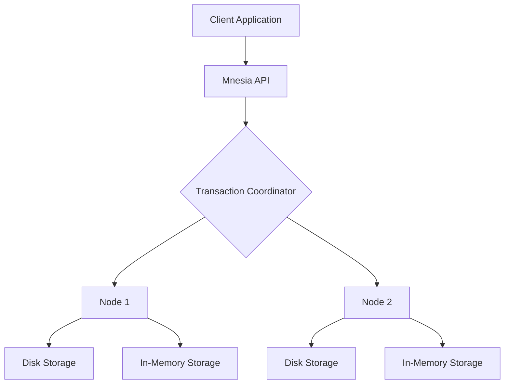

## 13.2 Distributed Databases with Mnesia

In the realm of distributed systems, managing data efficiently and reliably is paramount. Erlang, a language designed for building robust, concurrent systems, offers Mnesia, a distributed database management system that is tightly integrated with the language itself. In this section, we will delve into Mnesia, exploring its capabilities, how to define schemas, create tables, perform transactions, and replicate data across nodes. We will also discuss its strengths and limitations, providing you with a comprehensive understanding of how to leverage Mnesia in your distributed applications.

### Introduction to Mnesia

Mnesia is a multi-user distributed database management system that is part of the standard Erlang/OTP distribution. It is designed to handle large volumes of data across multiple nodes, providing features such as atomic transactions, complex queries, and data replication. Mnesia is particularly well-suited for applications that require high availability and fault tolerance, making it a popular choice for telecommunications, real-time systems, and other distributed applications.

#### Key Features of Mnesia

- **Distributed Architecture**: Mnesia allows data to be distributed across multiple nodes, providing redundancy and fault tolerance.
- **Atomic Transactions**: Mnesia supports ACID transactions, ensuring data integrity even in the presence of failures.
- **Flexible Data Model**: Mnesia supports both relational and object-oriented data models, allowing for flexible schema design.
- **In-Memory and Disk-Based Storage**: Mnesia can store data in memory for fast access or on disk for persistence.
- **Replication and Consistency**: Mnesia provides mechanisms for replicating data across nodes, ensuring consistency and availability.

### Defining Schemas and Creating Tables

To start using Mnesia, you need to define a schema and create tables. A schema in Mnesia defines the structure of your database, including the tables and their attributes.

#### Defining a Schema

To define a schema, you need to specify the nodes that will participate in the database. This is done using the `mnesia:create_schema/1` function:

```erlang
% Define a schema for nodes
Nodes = [node()],
ok = mnesia:create_schema(Nodes).
```

#### Creating Tables

Once the schema is defined, you can create tables using the `mnesia:create_table/2` function. Each table requires a name and a list of attributes, including the type of storage (RAM or disk), the type of records (set or ordered_set), and any indexes.

```erlang
% Create a table named 'user'
TableDef = [
    {attributes, record_info(fields, user)},
    {disc_copies, [node()]},
    {index, [name]}
],
{ok, _} = mnesia:create_table(user, TableDef).
```

In this example, we create a table named `user` with attributes defined in the `user` record. The table is stored on disk (`disc_copies`) and indexed by the `name` attribute.

### Performing Transactions

Mnesia supports atomic transactions, allowing you to perform multiple operations as a single unit of work. Transactions are executed using the `mnesia:transaction/1` function, which takes a fun as an argument.

```erlang
% Perform a transaction to write a record
WriteUser = fun() ->
    Record = #user{id = 1, name = "Alice", age = 30},
    mnesia:write(Record)
end,
{atomic, ok} = mnesia:transaction(WriteUser).
```

In this example, we define a transaction that writes a `user` record to the database. The transaction is executed atomically, ensuring that the write operation is completed successfully or not at all.

### Data Replication Across Nodes

One of Mnesia's strengths is its ability to replicate data across multiple nodes, providing redundancy and fault tolerance. To replicate a table, you need to specify the nodes where the table should be stored.

```erlang
% Replicate the 'user' table across multiple nodes
Nodes = [node(), 'node2@host'],
TableDef = [
    {attributes, record_info(fields, user)},
    {disc_copies, Nodes}
],
{ok, _} = mnesia:create_table(user, TableDef).
```

In this example, we replicate the `user` table across two nodes, `node()` and `'node2@host'`. This ensures that the data is available even if one of the nodes fails.

### Query Mechanisms

Mnesia provides several mechanisms for querying data, including match specifications and QLC (Query List Comprehensions).

#### Match Specifications

Match specifications allow you to perform pattern matching on records, similar to pattern matching in Erlang.

```erlang
% Use match specifications to find users by name
MatchSpec = [{#user{name = '_', _ = '_'}, [], [true]}],
{atomic, Results} = mnesia:transaction(fun() ->
    mnesia:match_object(#user{name = "Alice"})
end).
```

#### Query List Comprehensions (QLC)

QLC provides a more powerful and flexible way to query data using list comprehensions.

```erlang
% Use QLC to find users older than 25
F = fun() ->
    Q = qlc:q([X || X <- mnesia:table(user), X#user.age > 25]),
    qlc:e(Q)
end,
{atomic, Results} = mnesia:transaction(F).
```

### Strengths and Limitations of Mnesia

#### Strengths

- **Tight Integration with Erlang**: Mnesia is part of the Erlang/OTP distribution, providing seamless integration with Erlang applications.
- **High Availability**: Mnesia's distributed architecture and replication features ensure high availability and fault tolerance.
- **Flexible Data Model**: Mnesia supports both relational and object-oriented data models, allowing for flexible schema design.

#### Limitations

- **Scalability**: Mnesia is not designed for very large datasets or high write loads, making it less suitable for big data applications.
- **Complexity**: Mnesia's distributed features can add complexity to application design and deployment.
- **Limited Query Capabilities**: While Mnesia provides powerful query mechanisms, it lacks some of the advanced features found in dedicated database systems.

### Visualizing Mnesia's Architecture

To better understand Mnesia's architecture, let's visualize its components and how they interact in a distributed system.



**Diagram Description**: This diagram illustrates how a client application interacts with Mnesia through the Mnesia API. The transaction coordinator manages transactions across multiple nodes, each of which can store data in memory or on disk.

### Try It Yourself

Now that we've covered the basics of Mnesia, it's time to experiment with the concepts you've learned. Try modifying the code examples to:

- Add new attributes to the `user` table and update existing records.
- Create a new table and replicate it across different nodes.
- Use QLC to perform more complex queries, such as finding users within a specific age range.

### References and Further Reading

For more information on Mnesia, refer to the official [Mnesia Documentation](http://erlang.org/doc/man/mnesia.html).

### Knowledge Check

Before moving on, let's review some key concepts:

- What are the main features of Mnesia that make it suitable for distributed applications?
- How do you define a schema and create tables in Mnesia?
- What are the differences between in-memory and disk-based storage in Mnesia?
- How does Mnesia handle data replication across nodes?

### Embrace the Journey

Remember, mastering Mnesia is just one step in your journey to becoming an expert in distributed systems with Erlang. Keep experimenting, stay curious, and enjoy the process of learning and building robust applications.

## Quiz: Distributed Databases with Mnesia



### What is a key feature of Mnesia that supports high availability?

- [x] Data replication across multiple nodes
- [ ] Support for SQL queries
- [ ] Built-in machine learning algorithms
- [ ] Integration with NoSQL databases

> **Explanation:** Mnesia's ability to replicate data across multiple nodes ensures high availability and fault tolerance.

### How do you define a schema in Mnesia?

- [x] Using the `mnesia:create_schema/1` function
- [ ] By writing SQL statements
- [ ] Through a graphical user interface
- [ ] Using JSON configuration files

> **Explanation:** The `mnesia:create_schema/1` function is used to define a schema in Mnesia, specifying the nodes that will participate in the database.

### What is the purpose of the `mnesia:transaction/1` function?

- [x] To execute atomic transactions
- [ ] To create tables
- [ ] To replicate data
- [ ] To delete records

> **Explanation:** The `mnesia:transaction/1` function is used to execute atomic transactions, ensuring data integrity.

### Which of the following is a limitation of Mnesia?

- [x] Not designed for very large datasets
- [ ] Lack of support for transactions
- [ ] Inability to store data on disk
- [ ] No support for distributed systems

> **Explanation:** Mnesia is not designed for very large datasets or high write loads, making it less suitable for big data applications.

### What is the role of the transaction coordinator in Mnesia?

- [x] To manage transactions across multiple nodes
- [ ] To store data in memory
- [ ] To perform data backups
- [ ] To handle user authentication

> **Explanation:** The transaction coordinator manages transactions across multiple nodes, ensuring consistency and integrity.

### How can you replicate a table across multiple nodes in Mnesia?

- [x] By specifying the nodes in the table definition
- [ ] By using SQL replication commands
- [ ] Through a third-party tool
- [ ] By manually copying data files

> **Explanation:** You can replicate a table across multiple nodes by specifying the nodes in the table definition using the `disc_copies` or `ram_copies` options.

### What is a benefit of using in-memory storage in Mnesia?

- [x] Faster data access
- [ ] Increased data durability
- [ ] Reduced memory usage
- [ ] Simplified data replication

> **Explanation:** In-memory storage provides faster data access compared to disk-based storage.

### Which query mechanism in Mnesia allows for pattern matching on records?

- [x] Match specifications
- [ ] SQL queries
- [ ] JSON queries
- [ ] XML queries

> **Explanation:** Match specifications allow for pattern matching on records in Mnesia.

### What is a strength of Mnesia's data model?

- [x] Supports both relational and object-oriented models
- [ ] Only supports relational models
- [ ] Only supports object-oriented models
- [ ] Requires no schema definition

> **Explanation:** Mnesia supports both relational and object-oriented data models, allowing for flexible schema design.

### True or False: Mnesia is part of the standard Erlang/OTP distribution.

- [x] True
- [ ] False

> **Explanation:** Mnesia is indeed part of the standard Erlang/OTP distribution, providing seamless integration with Erlang applications.


