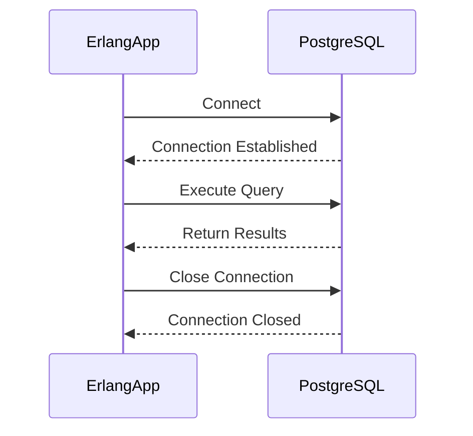

## 13.3 Working with External Databases (MySQL, PostgreSQL, Cassandra)

In the realm of software development, managing data efficiently is crucial. While Erlang provides robust in-memory storage solutions like ETS and Mnesia, there are scenarios where external databases are necessary. These include handling larger datasets, executing complex queries, and ensuring data persistence across distributed systems. In this section, we will explore how to interface Erlang with popular external databases such as MySQL, PostgreSQL, and Cassandra. We will delve into the libraries and drivers available, provide examples of connecting and querying these databases, and discuss best practices for security and performance.

### Why Use External Databases?

Erlang's built-in data storage solutions are powerful, but they have limitations, especially when dealing with:

- **Large Datasets**: When data exceeds the memory capacity of a single node, external databases provide a scalable solution.
- **Complex Queries**: SQL databases like MySQL and PostgreSQL offer advanced querying capabilities that are not natively available in Erlang.
- **Data Persistence**: Ensuring data is stored persistently across system restarts or failures is crucial for many applications.
- **Distributed Systems**: Databases like Cassandra are designed for high availability and fault tolerance in distributed environments.

### Erlang Libraries and Drivers for Database Connectivity

To interact with external databases, Erlang developers can leverage several libraries and drivers:

- **[epgsql](https://github.com/epgsql/epgsql)**: A PostgreSQL client library for Erlang.
- **[mysql-otp](https://github.com/mysql-otp/mysql-otp)**: A MySQL client library for Erlang.
- **[cqerl](https://github.com/cqerl/cqerl)**: A Cassandra client library for Erlang.

Let's explore each of these libraries in detail, including how to connect, query, and manage data.

### Connecting to PostgreSQL with epgsql

#### Installation and Setup

To use `epgsql`, you need to include it in your project's dependencies. If you're using Rebar3, add the following to your `rebar.config`:

```erlang
{deps, [
    {epgsql, "4.6.0"}
]}.
```

#### Connecting to a PostgreSQL Database

Here's a simple example of how to connect to a PostgreSQL database using `epgsql`:

```erlang
% Start the epgsql application
application:start(epgsql).

% Connect to the database
{ok, Connection} = epgsql:connect("localhost", "username", "password", [{database, "mydb"}]).

% Check the connection status
case Connection of
    {ok, Conn} ->
        io:format("Connected to PostgreSQL database successfully.~n"),
        Conn;
    {error, Reason} ->
        io:format("Failed to connect to PostgreSQL: ~p~n", [Reason])
end.
```

#### Querying Data

Once connected, you can execute queries as follows:

```erlang
% Execute a simple query
{ok, Columns, Rows} = epgsql:squery(Connection, "SELECT * FROM users;").

% Process the results
lists:foreach(fun(Row) ->
    io:format("User: ~p~n", [Row])
end, Rows).
```

#### Managing Connections

For efficient database interaction, consider using connection pooling. This can be achieved using libraries like `poolboy` to manage a pool of connections.

### Connecting to MySQL with mysql-otp

#### Installation and Setup

Add `mysql-otp` to your `rebar.config`:

```erlang
{deps, [
    {mysql, "1.6.0"}
]}.
```

#### Connecting to a MySQL Database

Here's how to establish a connection:

```erlang
% Start the mysql application
application:start(mysql).

% Connect to the database
{ok, Connection} = mysql:start_link([{host, "localhost"}, {user, "username"}, {password, "password"}, {database, "mydb"}]).

% Check the connection status
case Connection of
    {ok, Conn} ->
        io:format("Connected to MySQL database successfully.~n"),
        Conn;
    {error, Reason} ->
        io:format("Failed to connect to MySQL: ~p~n", [Reason])
end.
```

#### Querying Data

Execute queries using the following approach:

```erlang
% Execute a query
{ok, Result} = mysql:query(Connection, "SELECT * FROM users;").

% Process the results
lists:foreach(fun(Row) ->
    io:format("User: ~p~n", [Row])
end, Result).
```

### Connecting to Cassandra with cqerl

#### Installation and Setup

Add `cqerl` to your `rebar.config`:

```erlang
{deps, [
    {cqerl, "1.0.8"}
]}.
```

#### Connecting to a Cassandra Database

Here's how to connect to Cassandra:

```erlang
% Start the cqerl application
application:start(cqerl).

% Connect to the database
{ok, Client} = cqerl:new_client({127, 0, 0, 1}, 9042).

% Check the connection status
case Client of
    {ok, Conn} ->
        io:format("Connected to Cassandra database successfully.~n"),
        Conn;
    {error, Reason} ->
        io:format("Failed to connect to Cassandra: ~p~n", [Reason])
end.
```

#### Querying Data

Execute queries in Cassandra as follows:

```erlang
% Execute a query
{ok, Result} = cqerl:run_query(Client, "SELECT * FROM users;").

% Process the results
lists:foreach(fun(Row) ->
    io:format("User: ~p~n", [Row])
end, Result).
```

### Considerations for Database Interactions

#### Connection Pooling

Managing database connections efficiently is crucial for performance. Connection pooling helps by reusing existing connections rather than opening new ones for each request. Libraries like `poolboy` can be used to implement connection pooling in Erlang.

#### Error Handling

Robust error handling is essential when dealing with databases. Always check for errors when connecting to the database or executing queries, and implement retry mechanisms where appropriate.

#### Security Best Practices

- **Use SSL/TLS**: Ensure that your database connections are encrypted to protect sensitive data.
- **Sanitize Inputs**: Prevent SQL injection attacks by sanitizing user inputs.
- **Limit Permissions**: Grant only necessary permissions to database users.

#### Performance Optimization

- **Indexing**: Use indexes to speed up query execution.
- **Batch Processing**: Process data in batches to reduce the number of database interactions.
- **Caching**: Implement caching strategies to reduce database load.

### Try It Yourself

Experiment with the code examples provided by modifying the queries or connection parameters. Try connecting to a different database or executing more complex queries to deepen your understanding.

### Visualizing Database Interactions

Below is a sequence diagram illustrating the interaction between an Erlang application and a PostgreSQL database using `epgsql`.



This diagram shows the typical flow of connecting to a database, executing a query, and closing the connection.

### Summary

In this section, we've explored how to work with external databases in Erlang using libraries like `epgsql`, `mysql-otp`, and `cqerl`. We've discussed the importance of using external databases for handling large datasets and complex queries, and provided examples of connecting to and querying these databases. We've also highlighted best practices for connection pooling, error handling, security, and performance optimization.

Remember, mastering database interactions is a crucial skill for building scalable and efficient applications. Keep experimenting, stay curious, and enjoy the journey!

## Quiz: Working with External Databases (MySQL, PostgreSQL, Cassandra)



### Which Erlang library is used for connecting to PostgreSQL?

- [x] epgsql
- [ ] mysql-otp
- [ ] cqerl
- [ ] poolboy

> **Explanation:** `epgsql` is the Erlang library used for connecting to PostgreSQL databases.

### What is the primary purpose of connection pooling?

- [x] To reuse existing connections and improve performance
- [ ] To encrypt database connections
- [ ] To sanitize user inputs
- [ ] To execute complex queries

> **Explanation:** Connection pooling helps in reusing existing connections, thus improving performance by reducing the overhead of establishing new connections.

### Which library would you use to connect to a MySQL database in Erlang?

- [ ] epgsql
- [x] mysql-otp
- [ ] cqerl
- [ ] poolboy

> **Explanation:** `mysql-otp` is the Erlang library used for connecting to MySQL databases.

### What is a key security practice when working with databases?

- [x] Use SSL/TLS for encrypted connections
- [ ] Use plain text passwords
- [ ] Allow all IP addresses
- [ ] Disable user authentication

> **Explanation:** Using SSL/TLS ensures that database connections are encrypted, protecting sensitive data from interception.

### Which library is used for connecting to Cassandra in Erlang?

- [ ] epgsql
- [ ] mysql-otp
- [x] cqerl
- [ ] poolboy

> **Explanation:** `cqerl` is the Erlang library used for connecting to Cassandra databases.

### Why is error handling important in database interactions?

- [x] To manage connection failures and query errors
- [ ] To increase query execution speed
- [ ] To reduce database size
- [ ] To simplify code

> **Explanation:** Error handling is crucial for managing connection failures and query errors, ensuring the application can respond appropriately.

### What is a benefit of using indexes in databases?

- [x] Speed up query execution
- [ ] Increase database size
- [ ] Simplify database schema
- [ ] Reduce data redundancy

> **Explanation:** Indexes help in speeding up query execution by allowing the database to quickly locate the data.

### What is the role of `poolboy` in Erlang applications?

- [x] Manage connection pools
- [ ] Execute SQL queries
- [ ] Encrypt data
- [ ] Serialize data

> **Explanation:** `poolboy` is used to manage connection pools, ensuring efficient use of database connections.

### Which practice helps prevent SQL injection attacks?

- [x] Sanitize user inputs
- [ ] Use plain text passwords
- [ ] Disable user authentication
- [ ] Allow all IP addresses

> **Explanation:** Sanitizing user inputs helps prevent SQL injection attacks by ensuring that inputs are treated as data, not executable code.

### True or False: Batch processing can reduce the number of database interactions.

- [x] True
- [ ] False

> **Explanation:** Batch processing allows multiple operations to be executed in a single interaction, reducing the overall number of database interactions.


