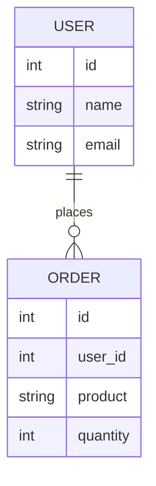

## 13.4 Data Modeling and Schema Design

In the realm of software development, data modeling and schema design are crucial components that dictate how data is stored, accessed, and manipulated. In Erlang applications, these concepts take on unique characteristics due to Erlang's functional and concurrent nature. This section delves into the principles of data modeling, the selection of appropriate data types and structures, and the design of schemas for both Mnesia and external databases. We will also emphasize the importance of considering query patterns and performance, and encourage iterative refinement of data models based on application needs.

### Principles of Data Modeling

Data modeling is the process of creating a data model for the data to be stored in a database. This model defines the logical structure of the data, including the relationships and constraints that apply to it. In Erlang, data modeling must account for the language's functional paradigm and its emphasis on immutability and concurrency.

#### Normalization and Denormalization

Normalization is the process of organizing data to reduce redundancy and improve data integrity. It involves dividing a database into two or more tables and defining relationships between the tables. The primary goal is to eliminate redundant data and ensure data dependencies make sense.

- **First Normal Form (1NF)**: Ensure that each table column contains atomic values and each record is unique.
- **Second Normal Form (2NF)**: Ensure that all non-key attributes are fully functional dependent on the primary key.
- **Third Normal Form (3NF)**: Ensure that all attributes are only dependent on the primary key.

Denormalization, on the other hand, involves combining tables to improve read performance at the expense of write performance and data integrity. This is often used in scenarios where read-heavy operations are more common than writes.

**Example:**

Consider a simple example where we have a `users` table and an `orders` table. In a normalized form, these tables might look like this:

```erlang
% Users table
-record(user, {id, name, email}).

% Orders table
-record(order, {id, user_id, product, quantity}).
```

In a denormalized form, we might combine these tables to reduce the number of joins required for read operations:

```erlang
% Denormalized table
-record(user_order, {user_id, name, email, order_id, product, quantity}).
```

### Selecting Appropriate Data Types and Structures

Choosing the right data types and structures is essential for efficient data modeling. Erlang provides a variety of data types, including lists, tuples, maps, and records, each with its own strengths and use cases.

#### Lists, Tuples, and Maps

- **Lists**: Ideal for ordered collections of elements where frequent traversal is required. However, they are not the most efficient for random access due to their linked-list nature.
  
  ```erlang
  Users = ["Alice", "Bob", "Charlie"].
  ```

- **Tuples**: Suitable for fixed-size collections where elements are accessed by position. They provide faster access compared to lists.

  ```erlang
  User = {id, "Alice", "alice@example.com"}.
  ```

- **Maps**: Best for key-value pairs where quick lookup is needed. Maps offer efficient access and update operations.

  ```erlang
  UserMap = #{id => 1, name => "Alice", email => "alice@example.com"}.
  ```

#### Records

Records are a convenient way to define structured data types in Erlang. They are essentially syntactic sugar over tuples, providing named fields for easier access and manipulation.

```erlang
-record(user, {id, name, email}).

% Creating a record
User = #user{id=1, name="Alice", email="alice@example.com"}.

% Accessing a record field
Name = User#user.name.
```

### Designing Schemas for Mnesia and External Databases

Mnesia is a distributed database management system that comes with Erlang. It is designed for high availability and fault tolerance, making it suitable for applications that require these features.

#### Mnesia Schema Design

When designing schemas for Mnesia, consider the following:

- **Table Types**: Mnesia supports different table types, including `ram_copies`, `disc_copies`, and `disc_only_copies`. Choose the appropriate type based on your application's persistence and performance requirements.

- **Indexes**: Use indexes to speed up query operations. Mnesia allows you to define secondary indexes on tables to improve lookup times.

- **Fragmentation**: For large datasets, consider fragmenting tables to distribute data across multiple nodes, enhancing performance and scalability.

**Example:**

```erlang
% Define a Mnesia table
mnesia:create_table(user, [
    {attributes, record_info(fields, user)},
    {index, [name]},
    {disc_copies, [node()]}
]).
```

#### External Database Schema Design

For external databases like PostgreSQL or MySQL, the schema design principles remain similar, but you must also consider the specific features and limitations of the database system.

- **Data Types**: Choose data types that align with the database's capabilities and your application's needs. For example, use `VARCHAR` for strings and `INTEGER` for numeric values.

- **Indexes and Constraints**: Define indexes and constraints to enforce data integrity and improve query performance.

- **Normalization**: Apply normalization principles to reduce redundancy and ensure data integrity.

### Considering Query Patterns and Performance

When designing data models, it's crucial to consider the query patterns your application will use. This involves understanding the types of queries that will be most common and optimizing the schema to support them efficiently.

- **Read vs. Write Operations**: Determine whether your application is read-heavy or write-heavy and design your schema accordingly. For read-heavy applications, denormalization might be beneficial, while normalization is often better for write-heavy scenarios.

- **Join Operations**: Minimize the number of join operations required by designing your schema to support common queries directly.

- **Indexing**: Use indexes strategically to speed up query operations. However, be mindful of the trade-offs, as indexes can slow down write operations.

### Iterative Refinement of Data Models

Data modeling is not a one-time task but an iterative process that evolves with your application's needs. As your application grows and changes, revisit your data models to ensure they continue to meet performance and functionality requirements.

- **Monitor Performance**: Continuously monitor the performance of your database operations and identify bottlenecks.

- **Refactor Schemas**: Be prepared to refactor your schemas as new requirements emerge or as you identify inefficiencies in your current design.

- **Test Changes**: Before implementing schema changes, thoroughly test them to ensure they do not negatively impact your application's performance or data integrity.

### Visualizing Data Models

To better understand and communicate your data models, consider using diagrams to visualize the relationships between tables and data structures.



This diagram illustrates the relationship between `USER` and `ORDER` tables, showing that a user can place multiple orders.

### Try It Yourself

To solidify your understanding of data modeling and schema design in Erlang, try the following exercises:

1. **Create a Mnesia Schema**: Design a schema for a simple e-commerce application using Mnesia. Consider tables for users, products, and orders.

2. **Normalize a Database**: Take an existing denormalized database and apply normalization principles to improve data integrity.

3. **Optimize Query Performance**: Analyze a set of queries and propose schema changes to optimize their performance.

### Key Takeaways

- Data modeling and schema design are critical for efficient data storage and retrieval in Erlang applications.
- Normalization and denormalization are essential techniques for managing data redundancy and performance.
- Selecting appropriate data types and structures is crucial for efficient data handling.
- Mnesia offers unique features for distributed and fault-tolerant applications.
- Iterative refinement of data models ensures they continue to meet application needs.

### Embrace the Journey

Remember, data modeling and schema design are ongoing processes that require continuous learning and adaptation. As you gain experience, you'll develop a deeper understanding of how to design efficient and effective data models. Keep experimenting, stay curious, and enjoy the journey!

## Quiz: Data Modeling and Schema Design



### What is the primary goal of normalization in database design?

- [x] To reduce redundancy and improve data integrity
- [ ] To increase redundancy for faster reads
- [ ] To simplify database queries
- [ ] To enhance data visualization

> **Explanation:** Normalization aims to reduce redundancy and improve data integrity by organizing data into separate tables and defining relationships.

### Which Erlang data type is best suited for key-value pair storage?

- [ ] List
- [ ] Tuple
- [x] Map
- [ ] Record

> **Explanation:** Maps in Erlang are designed for key-value pair storage, providing efficient access and update operations.

### What is a key consideration when designing schemas for Mnesia?

- [ ] Ensuring all data is stored in a single table
- [x] Choosing the appropriate table type (e.g., ram_copies, disc_copies)
- [ ] Avoiding the use of indexes
- [ ] Using only normalized tables

> **Explanation:** Mnesia supports different table types, and choosing the appropriate type is crucial for meeting persistence and performance requirements.

### What is a potential downside of denormalization?

- [ ] Improved read performance
- [x] Increased data redundancy
- [ ] Simplified schema design
- [ ] Enhanced data integrity

> **Explanation:** Denormalization can lead to increased data redundancy, which may impact data integrity and write performance.

### How can you optimize query performance in a read-heavy application?

- [x] Use denormalization to reduce the number of joins
- [ ] Normalize all tables to the highest normal form
- [ ] Avoid using indexes
- [ ] Store all data in a single table

> **Explanation:** In read-heavy applications, denormalization can reduce the number of joins required, improving query performance.

### What is an advantage of using records in Erlang?

- [ ] They are more efficient than maps for key-value storage
- [x] They provide named fields for easier access and manipulation
- [ ] They are immutable
- [ ] They automatically enforce data integrity

> **Explanation:** Records in Erlang provide named fields, making it easier to access and manipulate structured data.

### Why is iterative refinement important in data modeling?

- [ ] To ensure the initial design is perfect
- [ ] To avoid making any changes to the schema
- [x] To adapt to changing application needs and improve performance
- [ ] To simplify the data model

> **Explanation:** Iterative refinement allows data models to adapt to changing application needs and improve performance over time.

### What is a common use case for denormalization?

- [ ] Write-heavy applications
- [x] Read-heavy applications
- [ ] Applications with no data redundancy
- [ ] Applications with complex transactions

> **Explanation:** Denormalization is often used in read-heavy applications to improve read performance by reducing the need for joins.

### Which of the following is a benefit of using Mnesia for schema design?

- [ ] It only supports single-node deployments
- [x] It offers high availability and fault tolerance
- [ ] It requires extensive configuration
- [ ] It does not support indexes

> **Explanation:** Mnesia is designed for high availability and fault tolerance, making it suitable for distributed applications.

### True or False: Data modeling is a one-time task that does not require revisiting.

- [ ] True
- [x] False

> **Explanation:** Data modeling is an iterative process that should be revisited as application needs evolve and performance requirements change.




