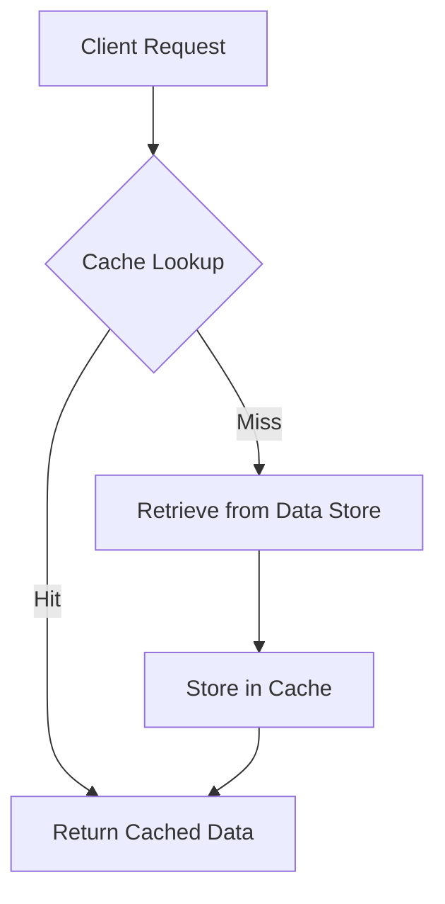

## 13.5 Caching Strategies

In the realm of software development, caching is a pivotal strategy employed to enhance application performance and reduce the load on data stores. In this section, we will delve into the intricacies of caching strategies within Erlang, exploring how to implement effective caching mechanisms using Erlang Term Storage (ETS) and external solutions like Redis. We will also discuss cache invalidation strategies, considerations for consistency and stale data, and the importance of measuring and monitoring cache effectiveness.

### Understanding Caching and Its Benefits

Caching is the process of storing copies of data in a temporary storage location, or cache, so that future requests for that data can be served faster. The primary benefits of caching include:

- **Improved Performance**: By reducing the need to repeatedly access slower data stores, caching can significantly speed up data retrieval times.
- **Reduced Load on Data Stores**: Caching decreases the number of requests to the primary data store, which can lead to improved scalability and reduced operational costs.
- **Enhanced User Experience**: Faster data access translates to quicker response times, improving the overall user experience.

### Implementing Caches in Erlang

Erlang provides several mechanisms for implementing caches, with ETS being one of the most commonly used in-memory storage solutions. Additionally, external caching solutions like Redis can be integrated with Erlang applications for distributed caching needs.

#### Using ETS for Caching

ETS is a powerful in-memory storage system built into Erlang, offering fast read and write operations. It is particularly well-suited for caching due to its ability to handle large volumes of data efficiently.

**Example: Implementing a Simple Cache with ETS**

```erlang
-module(simple_cache).
-export([start/0, put/2, get/1, delete/1]).

start() ->
    ets:new(cache, [named_table, public, set]).

put(Key, Value) ->
    ets:insert(cache, {Key, Value}).

get(Key) ->
    case ets:lookup(cache, Key) of
        [{_, Value}] -> {ok, Value};
        [] -> not_found
    end.

delete(Key) ->
    ets:delete(cache, Key).
```

In this example, we define a simple cache module using ETS. The `start/0` function initializes a new ETS table named `cache`. The `put/2` function inserts a key-value pair into the cache, while the `get/1` function retrieves a value based on the key. The `delete/1` function removes a key-value pair from the cache.

#### Integrating Redis with Erlang

Redis is a popular external caching solution that provides a distributed, in-memory data store. Erlang can interact with Redis using libraries such as `eredis`.

**Example: Connecting to Redis and Caching Data**

```erlang
-module(redis_cache).
-export([start/0, put/2, get/1, delete/1]).

start() ->
    {ok, Conn} = eredis:start_link([{host, "127.0.0.1"}, {port, 6379}]),
    Conn.

put(Conn, Key, Value) ->
    eredis:q(Conn, ["SET", Key, Value]).

get(Conn, Key) ->
    case eredis:q(Conn, ["GET", Key]) of
        {ok, Value} -> {ok, Value};
        _ -> not_found
    end.

delete(Conn, Key) ->
    eredis:q(Conn, ["DEL", Key]).
```

In this example, we demonstrate how to connect to a Redis server using the `eredis` library. The `start/0` function establishes a connection to Redis, while the `put/2`, `get/1`, and `delete/1` functions perform caching operations.

### Cache Invalidation Strategies

Cache invalidation is a critical aspect of caching, ensuring that stale data is not served to users. There are several strategies for cache invalidation:

- **Time-to-Live (TTL)**: This strategy involves setting an expiration time for cached data. Once the TTL expires, the data is automatically invalidated.
- **Event-Based Updates**: In this approach, the cache is updated or invalidated based on specific events, such as data changes in the primary data store.
- **Manual Invalidation**: This involves explicitly removing or updating cache entries when data changes occur.

**Example: Implementing TTL in ETS**

```erlang
-module(ttl_cache).
-export([start/0, put/3, get/1, delete/1, cleanup/0]).

start() ->
    ets:new(cache, [named_table, public, set]).

put(Key, Value, TTL) ->
    Expiry = erlang:system_time(seconds) + TTL,
    ets:insert(cache, {Key, Value, Expiry}).

get(Key) ->
    CurrentTime = erlang:system_time(seconds),
    case ets:lookup(cache, Key) of
        [{_, Value, Expiry}] when Expiry > CurrentTime ->
            {ok, Value};
        _ ->
            not_found
    end.

delete(Key) ->
    ets:delete(cache, Key).

cleanup() ->
    CurrentTime = erlang:system_time(seconds),
    Fun = fun({Key, _, Expiry}) when Expiry =< CurrentTime ->
                  ets:delete(cache, Key);
             (_) -> ok
          end,
    ets:foldl(Fun, ok, cache).
```

In this example, we extend the ETS cache to include a TTL mechanism. The `put/3` function stores the expiration time alongside the value. The `get/1` function checks the expiration time before returning the value. The `cleanup/0` function removes expired entries from the cache.

### Considerations for Consistency and Stale Data

When implementing caching strategies, it is crucial to consider the consistency of cached data and the potential for serving stale data. Here are some key considerations:

- **Data Consistency**: Ensure that the cache reflects the current state of the data store. This may involve implementing cache invalidation strategies or using write-through caching, where updates to the data store are immediately reflected in the cache.
- **Stale Data**: Be aware of the potential for serving outdated data. Implement mechanisms to detect and refresh stale data as needed.
- **Cache Coherency**: In distributed caching scenarios, ensure that all cache nodes have a consistent view of the data.

### Measuring and Monitoring Cache Effectiveness

To ensure that your caching strategy is effective, it is essential to measure and monitor cache performance. Consider the following metrics:

- **Cache Hit Rate**: The percentage of requests served by the cache. A high hit rate indicates effective caching.
- **Cache Miss Rate**: The percentage of requests that require data retrieval from the primary data store.
- **Latency**: The time taken to retrieve data from the cache compared to the primary data store.
- **Resource Utilization**: Monitor the memory and CPU usage of the caching solution to ensure it does not become a bottleneck.

### Visualizing Caching Strategies

To better understand the flow of data in caching strategies, consider the following diagram:



**Diagram Description**: This flowchart illustrates the process of handling a client request with caching. The request first checks the cache. If the data is found (a cache hit), it is returned immediately. If not (a cache miss), the data is retrieved from the primary data store and stored in the cache for future requests.

### Try It Yourself

Experiment with the provided code examples by modifying the cache implementation to suit your application's needs. Consider integrating additional features such as cache statistics, logging, or more sophisticated invalidation strategies.

### References and Further Reading

- [Erlang Documentation on ETS](https://www.erlang.org/doc/man/ets.html)
- [Redis Official Documentation](https://redis.io/documentation)
- [Eredis GitHub Repository](https://github.com/wooga/eredis)

### Knowledge Check

- What are the primary benefits of caching in applications?
- How does ETS facilitate caching in Erlang?
- What are some common cache invalidation strategies?
- Why is it important to monitor cache performance?

### Embrace the Journey

Remember, caching is a powerful tool in your arsenal for optimizing application performance. As you explore different caching strategies, keep experimenting and refining your approach to achieve the best results. Stay curious and enjoy the journey of mastering caching in Erlang!

## Quiz: Caching Strategies



### What is the primary purpose of caching in applications?

- [x] To improve performance and reduce load on data stores
- [ ] To increase the complexity of the system
- [ ] To replace the primary data store
- [ ] To store data permanently

> **Explanation:** Caching is used to improve performance by storing frequently accessed data in a temporary storage location, reducing the need to repeatedly access slower data stores.

### Which Erlang feature is commonly used for in-memory caching?

- [x] ETS (Erlang Term Storage)
- [ ] Mnesia
- [ ] GenServer
- [ ] Supervisor

> **Explanation:** ETS is a powerful in-memory storage system in Erlang, commonly used for caching due to its fast read and write operations.

### What is a common cache invalidation strategy?

- [x] Time-to-Live (TTL)
- [ ] Infinite caching
- [ ] Manual refresh
- [ ] Data duplication

> **Explanation:** Time-to-Live (TTL) is a common strategy where cached data is automatically invalidated after a specified period.

### What is a potential risk of caching?

- [x] Serving stale data
- [ ] Increasing data accuracy
- [ ] Reducing system complexity
- [ ] Eliminating the need for a primary data store

> **Explanation:** Caching can lead to serving stale data if the cache is not properly invalidated or updated.

### How can you measure cache effectiveness?

- [x] By monitoring cache hit and miss rates
- [ ] By counting the number of cache entries
- [ ] By measuring disk usage
- [ ] By checking the number of cache servers

> **Explanation:** Cache effectiveness is often measured by monitoring the cache hit rate (percentage of requests served by the cache) and miss rate (requests requiring data retrieval from the primary store).

### Which external solution can be integrated with Erlang for distributed caching?

- [x] Redis
- [ ] PostgreSQL
- [ ] MySQL
- [ ] CouchDB

> **Explanation:** Redis is a popular distributed in-memory data store that can be integrated with Erlang for caching purposes.

### What is a key consideration when using distributed caching?

- [x] Cache coherency
- [ ] Data duplication
- [ ] Increasing cache size
- [ ] Reducing network latency

> **Explanation:** Cache coherency ensures that all cache nodes have a consistent view of the data, which is crucial in distributed caching scenarios.

### What is the role of the `cleanup/0` function in the TTL cache example?

- [x] To remove expired entries from the cache
- [ ] To add new entries to the cache
- [ ] To update existing cache entries
- [ ] To monitor cache performance

> **Explanation:** The `cleanup/0` function is responsible for removing expired entries from the cache, ensuring that stale data is not served.

### What is the benefit of using write-through caching?

- [x] Ensures cache consistency with the data store
- [ ] Reduces the need for cache invalidation
- [ ] Increases cache storage requirements
- [ ] Eliminates the need for a primary data store

> **Explanation:** Write-through caching ensures that updates to the data store are immediately reflected in the cache, maintaining consistency.

### True or False: Caching can completely replace the need for a primary data store.

- [ ] True
- [x] False

> **Explanation:** Caching is a temporary storage solution that complements the primary data store, but it cannot replace it entirely.


