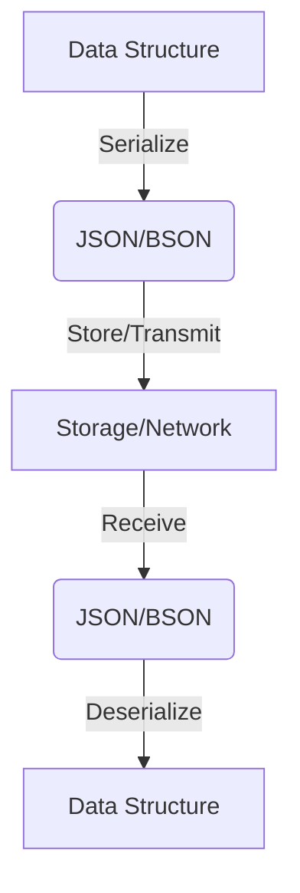

## 13.6 Data Serialization and Deserialization (JSON, BSON)

In the realm of data storage and communication, serialization and deserialization are crucial processes. They allow us to convert complex data structures into a format that can be easily stored or transmitted and then reconstructed later. In this section, we will delve into how Erlang handles serialization and deserialization, focusing on two popular formats: JSON (JavaScript Object Notation) and BSON (Binary JSON).

### Introduction to Serialization and Deserialization

Serialization is the process of converting a data structure or object state into a format that can be stored or transmitted and reconstructed later. Deserialization is the reverse process, where the stored or transmitted data is converted back into a usable data structure.

**Use Cases:**
- **RESTful APIs**: JSON is widely used for data interchange in web services.
- **Configuration Files**: JSON is often used to store configuration settings.
- **Data Storage**: BSON is used in databases like MongoDB for efficient storage.

### JSON in Erlang

JSON is a lightweight data interchange format that is easy for humans to read and write and easy for machines to parse and generate. Erlang provides several libraries for handling JSON, with `jsx` and `jiffy` being two of the most popular.

#### Using the `jsx` Library

`jsx` is a pure Erlang library for encoding and decoding JSON. It is known for its simplicity and ease of use.

**Installation:**
To use `jsx`, add it to your `rebar.config` dependencies:

```erlang
{deps, [
    {jsx, "2.9.0"}
]}.
```

**Encoding Data to JSON:**

```erlang
1> Data = #{name => "Alice", age => 30, city => "New York"}.
2> Json = jsx:encode(Data).
3> io:format("Encoded JSON: ~s~n", [Json]).
```

**Decoding JSON to Data:**

```erlang
1> JsonString = "{\"name\":\"Alice\",\"age\":30,\"city\":\"New York\"}".
2> {ok, Data} = jsx:decode(JsonString).
3> io:format("Decoded Data: ~p~n", [Data]).
```

#### Using the `jiffy` Library

`jiffy` is another popular JSON library in Erlang, known for its speed and efficiency as it is implemented in C.

**Installation:**
Add `jiffy` to your `rebar.config` dependencies:

```erlang
{deps, [
    {jiffy, "1.0.0"}
]}.
```

**Encoding Data to JSON:**

```erlang
1> Data = #{name => "Bob", age => 25, city => "Los Angeles"}.
2> Json = jiffy:encode(Data).
3> io:format("Encoded JSON: ~s~n", [Json]).
```

**Decoding JSON to Data:**

```erlang
1> JsonString = "{\"name\":\"Bob\",\"age\":25,\"city\":\"Los Angeles\"}".
2> {ok, Data} = jiffy:decode(JsonString).
3> io:format("Decoded Data: ~p~n", [Data]).
```

### BSON in Erlang

BSON is a binary representation of JSON-like documents. It is used in MongoDB and is designed to be efficient in both storage and scanning speed.

#### BSON Libraries

While JSON is more commonly used, BSON can be advantageous in certain scenarios, especially when dealing with binary data or when performance is a critical factor. Erlang has libraries like `bson-erlang` that can be used for BSON serialization and deserialization.

**Installation:**
Add `bson-erlang` to your `rebar.config` dependencies:

```erlang
{deps, [
    {bson, "0.1.0"}
]}.
```

**Encoding Data to BSON:**

```erlang
1> Data = #{name => "Charlie", age => 35, city => "Chicago"}.
2> Bson = bson:encode(Data).
3> io:format("Encoded BSON: ~p~n", [Bson]).
```

**Decoding BSON to Data:**

```erlang
1> BsonData = <<...>>. % Assume this is a valid BSON binary
2> {ok, Data} = bson:decode(BsonData).
3> io:format("Decoded Data: ~p~n", [Data]).
```

### Performance Considerations

When choosing between JSON and BSON, consider the following:

- **JSON** is text-based and human-readable, making it ideal for configuration files and APIs where readability is important.
- **BSON** is binary and more efficient for storage and retrieval, especially when dealing with large datasets or binary data.

#### Choosing the Right Library

- **`jsx`**: Pure Erlang, easy to use, suitable for most applications.
- **`jiffy`**: Faster due to C implementation, suitable for performance-critical applications.
- **`bson-erlang`**: Use when working with MongoDB or when binary efficiency is needed.

### Handling Data Types and Errors

When serializing and deserializing data, it's crucial to handle data types carefully to avoid errors. JSON and BSON have specific data type support, and mismatches can lead to runtime errors.

**Common Pitfalls:**
- **Data Type Mismatches**: Ensure that the data types in your Erlang structures match those supported by JSON/BSON.
- **Error Handling**: Always handle potential errors during encoding and decoding to prevent crashes.

### Use Cases

- **RESTful APIs**: JSON is the de facto standard for data interchange in web services. Use libraries like `jsx` or `jiffy` to encode and decode JSON payloads.
- **Configuration Files**: JSON's readability makes it ideal for storing configuration settings.
- **Database Storage**: BSON is used in databases like MongoDB for efficient storage and retrieval.

### Try It Yourself

Experiment with the code examples provided. Try modifying the data structures, encoding options, or libraries to see how they affect the output. Consider implementing a small RESTful API using JSON for data interchange.

### Visualizing JSON and BSON Serialization



**Diagram Description:** This flowchart illustrates the process of serializing a data structure into JSON or BSON, storing or transmitting it, and then deserializing it back into a data structure.

### References and Further Reading

- [jsx GitHub Repository](https://github.com/talentdeficit/jsx)
- [jiffy GitHub Repository](https://github.com/davisp/jiffy)
- [BSON Specification](http://bsonspec.org/)

### Knowledge Check

- What are the main differences between JSON and BSON?
- How do you handle errors during serialization and deserialization?
- Why might you choose `jiffy` over `jsx` for JSON handling?

### Embrace the Journey

Remember, mastering data serialization and deserialization is a journey. As you explore these concepts, you'll gain a deeper understanding of how data is managed in distributed systems. Keep experimenting, stay curious, and enjoy the journey!

## Quiz: Data Serialization and Deserialization (JSON, BSON)



### What is the primary advantage of using JSON for data interchange?

- [x] Human-readable format
- [ ] Binary efficiency
- [ ] Faster processing
- [ ] Built-in encryption

> **Explanation:** JSON is a text-based format that is easy for humans to read and write, making it ideal for data interchange.

### Which Erlang library is known for its speed due to C implementation?

- [ ] jsx
- [x] jiffy
- [ ] bson-erlang
- [ ] erlson

> **Explanation:** `jiffy` is implemented in C, which makes it faster than pure Erlang libraries like `jsx`.

### What is BSON primarily used for?

- [ ] Human-readable configuration files
- [x] Efficient storage and retrieval in databases
- [ ] Real-time data streaming
- [ ] Web page rendering

> **Explanation:** BSON is a binary format used for efficient storage and retrieval, commonly used in databases like MongoDB.

### Which library would you choose for a performance-critical application?

- [ ] jsx
- [x] jiffy
- [ ] erlson
- [ ] bson-erlang

> **Explanation:** `jiffy` is faster due to its C implementation, making it suitable for performance-critical applications.

### What is a common pitfall when serializing data?

- [ ] Using too many libraries
- [x] Data type mismatches
- [ ] Lack of comments
- [ ] Overuse of functions

> **Explanation:** Data type mismatches can lead to runtime errors during serialization and deserialization.

### What is the primary use case for JSON in web services?

- [x] Data interchange
- [ ] Binary data storage
- [ ] Real-time analytics
- [ ] Machine learning

> **Explanation:** JSON is widely used for data interchange in web services due to its readability and ease of use.

### Which format is more efficient for storing binary data?

- [ ] JSON
- [x] BSON
- [ ] XML
- [ ] CSV

> **Explanation:** BSON is a binary format, making it more efficient for storing binary data compared to text-based formats like JSON.

### How can you handle errors during JSON decoding in Erlang?

- [x] Use pattern matching to handle error tuples
- [ ] Ignore errors and continue processing
- [ ] Use a try-catch block
- [ ] Log errors without handling them

> **Explanation:** Pattern matching can be used to handle error tuples returned during JSON decoding.

### What is a key consideration when choosing between JSON and BSON?

- [ ] Library size
- [x] Performance and data type support
- [ ] Number of contributors
- [ ] License type

> **Explanation:** Performance and data type support are key considerations when choosing between JSON and BSON.

### True or False: BSON is always the better choice for web APIs.

- [ ] True
- [x] False

> **Explanation:** JSON is often preferred for web APIs due to its human-readable format, while BSON is used for efficient storage.


