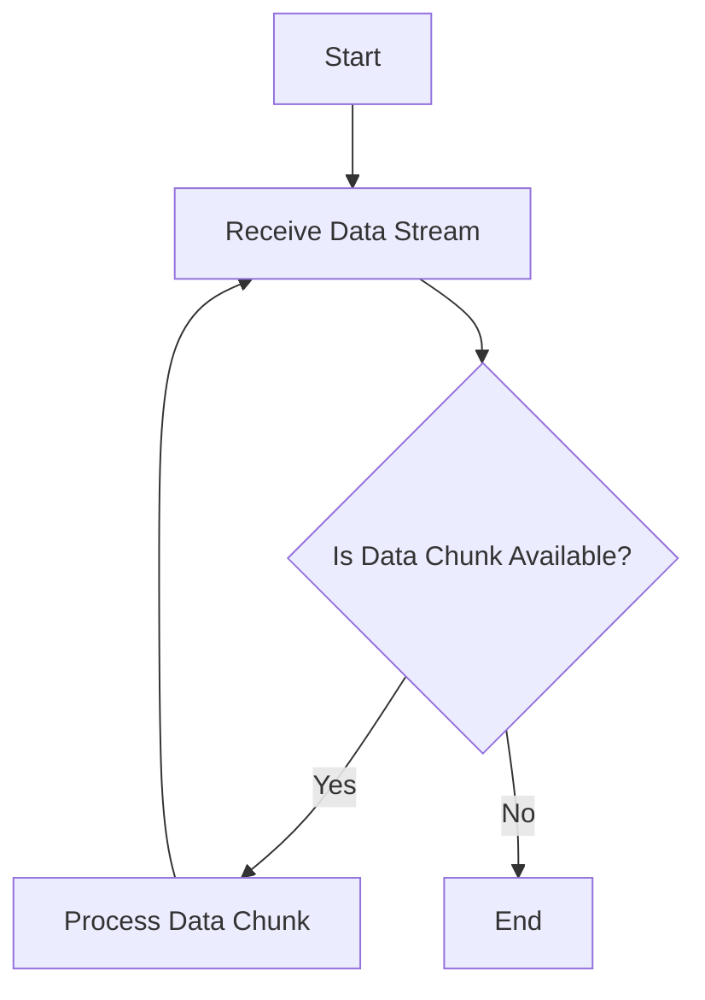

## 13.7 Handling Large Data Sets

In today's data-driven world, handling large datasets efficiently is crucial for building scalable and robust applications. Erlang, with its functional and concurrent programming paradigms, offers unique capabilities to manage and process large volumes of data. In this section, we will explore the challenges associated with large data volumes and provide strategies to overcome them using Erlang. We will delve into techniques such as streaming data processing, chunking, and leveraging Erlang's concurrency model. Additionally, we will discuss the importance of memory management and garbage collection, and how external tools or databases optimized for big data can be integrated into Erlang applications.

### Challenges of Handling Large Data Sets

Handling large datasets presents several challenges, including:

- **Memory Consumption**: Large datasets can quickly exhaust available memory, leading to performance degradation or application crashes.
- **Processing Time**: Processing large volumes of data can be time-consuming, requiring efficient algorithms and parallel processing.
- **Data Transfer**: Transferring large datasets over networks can be slow and costly, necessitating efficient data transfer mechanisms.
- **Scalability**: Applications must be able to scale horizontally to handle increasing data volumes without significant performance loss.

### Strategies for Handling Large Data Sets

#### Streaming Data Processing

Streaming data processing is a technique where data is processed in small chunks as it arrives, rather than loading the entire dataset into memory. This approach is particularly useful for real-time data processing and reduces memory consumption.

**Example: Streaming Data Processing in Erlang**

```erlang
-module(stream_processor).
-export([process_stream/1]).

process_stream(Stream) ->
    case get_next_chunk(Stream) of
        eof -> ok;
        Chunk ->
            process_chunk(Chunk),
            process_stream(Stream)
    end.

get_next_chunk(Stream) ->
    %% Simulate fetching the next chunk of data from the stream
    %% Replace with actual implementation
    receive
        {stream, Data} -> Data;
        eof -> eof
    end.

process_chunk(Chunk) ->
    %% Process the chunk of data
    io:format("Processing chunk: ~p~n", [Chunk]).
```

In this example, `process_stream/1` recursively processes chunks of data from a stream. The `get_next_chunk/1` function simulates fetching data from a stream, and `process_chunk/1` processes each chunk.

#### Chunking

Chunking involves dividing a large dataset into smaller, manageable pieces that can be processed independently. This technique can improve performance by allowing parallel processing and reducing memory usage.

**Example: Chunking a Large List in Erlang**

```erlang
-module(chunk_processor).
-export([process_large_list/2]).

process_large_list(List, ChunkSize) ->
    process_chunks(chunk_list(List, ChunkSize)).

chunk_list(List, ChunkSize) ->
    chunk_list(List, ChunkSize, []).

chunk_list([], _ChunkSize, Acc) ->
    lists:reverse(Acc);
chunk_list(List, ChunkSize, Acc) ->
    {Chunk, Rest} = lists:split(ChunkSize, List),
    chunk_list(Rest, ChunkSize, [Chunk | Acc]).

process_chunks([]) -> ok;
process_chunks([Chunk | Rest]) ->
    spawn(fun() -> process_chunk(Chunk) end),
    process_chunks(Rest).

process_chunk(Chunk) ->
    %% Process each chunk
    io:format("Processing chunk: ~p~n", [Chunk]).
```

In this example, `process_large_list/2` divides a large list into chunks of a specified size and processes each chunk concurrently using Erlang's `spawn/1` function.

#### Leveraging Erlang's Concurrency

Erlang's lightweight processes and message-passing model make it well-suited for parallel processing of large datasets. By distributing tasks across multiple processes, you can take advantage of multi-core processors and improve performance.

**Example: Parallel Processing with Erlang Processes**

```erlang
-module(parallel_processor).
-export([process_data_parallel/2]).

process_data_parallel(Data, NumProcesses) ->
    Pids = [spawn(fun() -> process_data(Data, self()) end) || _ <- lists:seq(1, NumProcesses)],
    gather_results(Pids).

process_data(Data, Parent) ->
    %% Simulate data processing
    Result = lists:sum(Data),
    Parent ! {self(), Result}.

gather_results(Pids) ->
    gather_results(Pids, []).

gather_results([], Results) ->
    lists:sum(Results);
gather_results([Pid | Rest], Results) ->
    receive
        {Pid, Result} ->
            gather_results(Rest, [Result | Results])
    end.
```

In this example, `process_data_parallel/2` spawns multiple processes to process data in parallel. Each process sends its result back to the parent process, which gathers and sums the results.

#### Memory Management and Garbage Collection

Efficient memory management is crucial when handling large datasets. Erlang's garbage collector automatically reclaims memory, but developers should be mindful of memory usage patterns to avoid excessive garbage collection overhead.

**Tips for Efficient Memory Management**

- **Avoid Large Data Structures**: Use data structures that fit the problem size and avoid unnecessary data duplication.
- **Use Binaries for Large Data**: Erlang's binaries are more memory-efficient for large data compared to lists.
- **Monitor Memory Usage**: Use tools like `observer` to monitor memory usage and identify bottlenecks.

#### Using External Tools and Databases

For extremely large datasets, consider using external tools or databases optimized for big data, such as Apache Kafka for streaming data or Apache Cassandra for distributed storage. Erlang can interface with these tools using libraries and APIs.

**Example: Integrating with Apache Kafka**

```erlang
%% Example using the brod library for Kafka
%% Ensure brod is included in your project dependencies

-module(kafka_consumer).
-export([start/0]).

start() ->
    %% Start the Kafka consumer
    {ok, _} = brod:start_client([{"localhost", 9092}], client1),
    {ok, _} = brod:start_link_group_subscriber(client1, group1, [#{topic => <<"my_topic">>}], ?MODULE, []).

handle_message(_Topic, _Partition, _Offset, Message, _State) ->
    %% Process the Kafka message
    io:format("Received message: ~p~n", [Message]),
    {ok, _State}.
```

In this example, we use the `brod` library to consume messages from an Apache Kafka topic. The `handle_message/5` function processes each message received from Kafka.

### Visualizing Data Processing Flow

To better understand the flow of data processing in Erlang, let's visualize a typical data processing pipeline using Mermaid.js:



**Diagram Description**: This flowchart represents a data processing pipeline where data is received as a stream, processed in chunks, and the process repeats until no more data is available.

### Knowledge Check

- **Question**: What is the primary advantage of streaming data processing?
  - **Answer**: It reduces memory consumption by processing data in small chunks as it arrives.

- **Question**: How does chunking improve performance when handling large datasets?
  - **Answer**: Chunking allows parallel processing and reduces memory usage by dividing data into smaller, manageable pieces.

### Try It Yourself

Experiment with the provided code examples by modifying the chunk size or the number of parallel processes. Observe how these changes affect performance and memory usage. Consider integrating an external tool like Apache Kafka or Cassandra into your Erlang application to handle even larger datasets.

### Summary

In this section, we explored various strategies for handling large datasets in Erlang, including streaming data processing, chunking, and leveraging concurrency. We discussed the importance of memory management and garbage collection and highlighted the use of external tools and databases optimized for big data. By applying these techniques, you can build scalable and efficient applications capable of processing large volumes of data.

## Quiz: Handling Large Data Sets



### What is the primary advantage of streaming data processing?

- [x] It reduces memory consumption by processing data in small chunks as it arrives.
- [ ] It increases processing speed by loading all data into memory.
- [ ] It simplifies code by avoiding recursion.
- [ ] It eliminates the need for external databases.

> **Explanation:** Streaming data processing reduces memory consumption by processing data in small chunks as it arrives, rather than loading the entire dataset into memory.

### How does chunking improve performance when handling large datasets?

- [x] It allows parallel processing and reduces memory usage.
- [ ] It increases the size of data structures.
- [ ] It simplifies error handling.
- [ ] It eliminates the need for garbage collection.

> **Explanation:** Chunking divides data into smaller, manageable pieces, allowing parallel processing and reducing memory usage.

### What is a key benefit of leveraging Erlang's concurrency model for large datasets?

- [x] It allows parallel processing across multiple processes.
- [ ] It eliminates the need for data serialization.
- [ ] It simplifies code by avoiding message passing.
- [ ] It reduces the number of processes needed.

> **Explanation:** Erlang's concurrency model allows parallel processing across multiple processes, improving performance for large datasets.

### Which Erlang data structure is more memory-efficient for large data?

- [x] Binaries
- [ ] Lists
- [ ] Tuples
- [ ] Maps

> **Explanation:** Erlang's binaries are more memory-efficient for large data compared to lists.

### What tool can be used to monitor memory usage in Erlang applications?

- [x] Observer
- [ ] Dialyzer
- [ ] EDoc
- [ ] Rebar3

> **Explanation:** The `observer` tool can be used to monitor memory usage and identify bottlenecks in Erlang applications.

### What is a common challenge when handling large datasets?

- [x] Memory consumption
- [ ] Code readability
- [ ] Function naming
- [ ] Module organization

> **Explanation:** Memory consumption is a common challenge when handling large datasets, as they can quickly exhaust available memory.

### Which external tool is commonly used for streaming data?

- [x] Apache Kafka
- [ ] Apache Cassandra
- [ ] MySQL
- [ ] PostgreSQL

> **Explanation:** Apache Kafka is commonly used for streaming data, providing efficient data transfer mechanisms.

### What is the purpose of garbage collection in Erlang?

- [x] To automatically reclaim memory
- [ ] To increase processing speed
- [ ] To simplify code structure
- [ ] To eliminate the need for external databases

> **Explanation:** Garbage collection in Erlang automatically reclaims memory, helping manage memory usage efficiently.

### How can Erlang processes be used to handle large datasets?

- [x] By distributing tasks across multiple processes
- [ ] By avoiding message passing
- [ ] By using only one process for all tasks
- [ ] By eliminating the need for data serialization

> **Explanation:** Erlang processes can handle large datasets by distributing tasks across multiple processes, taking advantage of multi-core processors.

### True or False: Chunking eliminates the need for external databases.

- [ ] True
- [x] False

> **Explanation:** Chunking does not eliminate the need for external databases; it is a technique to manage data within an application.



Remember, this is just the beginning. As you progress, you'll build more complex and interactive applications capable of handling even larger datasets. Keep experimenting, stay curious, and enjoy the journey!
