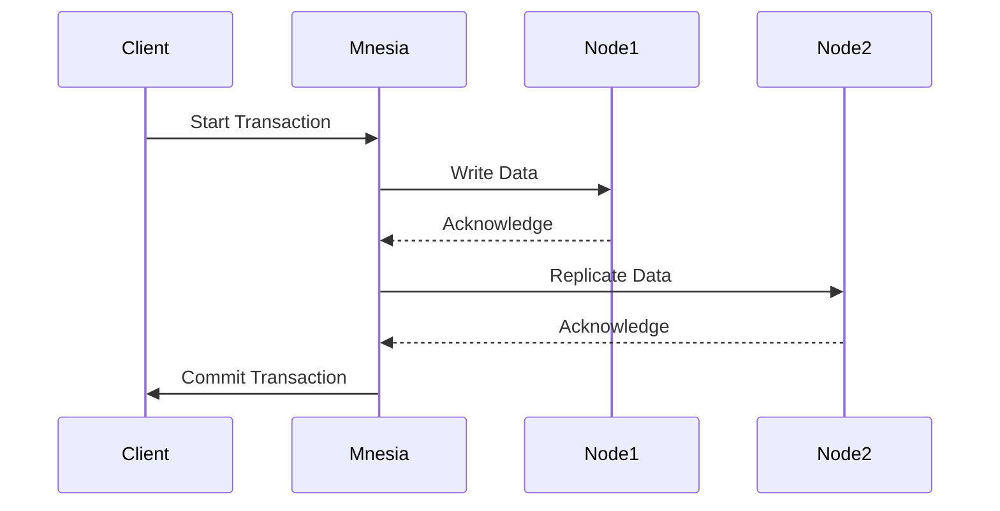

## 13.8 Data Consistency and Transactions

In the realm of distributed systems, ensuring data consistency and managing transactions are critical components for building robust applications. Erlang, with its powerful concurrency model and distributed nature, provides unique capabilities to handle these challenges. In this section, we will delve into the concepts of data consistency models, ACID properties, and how Erlang's Mnesia database supports transactions and consistency. We will also explore transaction management through code examples, discuss conflict handling, recovery from failures, and the trade-offs between consistency, availability, and performance.

### Understanding Data Consistency Models

Data consistency models define the rules for how data is viewed and updated across a distributed system. These models are crucial for ensuring that all nodes in a distributed system have a coherent view of the data. Let's explore some common consistency models:

1. **Strong Consistency**: Ensures that all nodes see the same data at the same time. Any read operation following a write will return the updated value. This model is often implemented using distributed locking mechanisms.

2. **Eventual Consistency**: Guarantees that if no new updates are made to a given piece of data, eventually all accesses to that data will return the last updated value. This model is suitable for systems where availability is prioritized over immediate consistency.

3. **Causal Consistency**: Ensures that operations that are causally related are seen by all nodes in the same order. This model is weaker than strong consistency but stronger than eventual consistency.

4. **Read-Your-Writes Consistency**: Guarantees that once a write is completed, subsequent reads by the same client will reflect that write.

5. **Session Consistency**: Provides consistency guarantees within a session, ensuring that all operations within a session are consistent.

### ACID Properties in Erlang

ACID (Atomicity, Consistency, Isolation, Durability) properties are a set of principles that ensure reliable transaction processing in databases:

- **Atomicity**: Ensures that a transaction is all-or-nothing. If any part of the transaction fails, the entire transaction is rolled back.
- **Consistency**: Guarantees that a transaction will bring the database from one valid state to another, maintaining database invariants.
- **Isolation**: Ensures that concurrent transactions do not interfere with each other.
- **Durability**: Guarantees that once a transaction is committed, it will remain so, even in the event of a system failure.

### Mnesia: Erlang's Distributed Database

Mnesia is a distributed database management system built into Erlang, designed to handle both in-memory and disk-based storage. It supports transactions and provides mechanisms to ensure data consistency across distributed nodes.

#### Key Features of Mnesia

- **Distributed Transactions**: Mnesia supports ACID transactions across distributed nodes, ensuring data consistency.
- **Replication**: Data can be replicated across multiple nodes for fault tolerance and availability.
- **Schema Flexibility**: Mnesia allows dynamic schema changes without downtime.
- **In-Memory and Disk Storage**: Supports both in-memory tables for fast access and disk-based tables for persistence.

### Transaction Management in Mnesia

Mnesia provides a robust transaction management system that allows developers to perform complex operations atomically. Let's explore how to manage transactions in Mnesia with code examples.

#### Basic Transaction Example

```erlang
% Start a Mnesia transaction
mnesia:transaction(fun() ->
    % Write operation
    mnesia:write({person, 1, "Alice", 30}),
    % Read operation
    {atomic, Result} = mnesia:read({person, 1}),
    % Return the result
    Result
end).
```

In this example, we start a transaction using `mnesia:transaction/1`, which takes a function as an argument. Inside the transaction, we perform a write operation to insert a record into the `person` table and then read the record back.

#### Handling Conflicts and Recovery

In distributed systems, conflicts can arise when multiple nodes attempt to update the same data simultaneously. Mnesia provides mechanisms to handle such conflicts and recover from failures.

##### Conflict Resolution

Mnesia uses a versioning system to detect conflicts. When a conflict is detected, Mnesia can be configured to resolve it automatically or allow the application to handle it manually.

```erlang
% Custom conflict resolution
resolve_conflict(OldValue, NewValue) ->
    % Implement custom logic to resolve conflict
    case compare_versions(OldValue, NewValue) of
        newer -> NewValue;
        older -> OldValue;
        equal -> NewValue
    end.
```

In this example, `resolve_conflict/2` is a custom function that compares the versions of conflicting values and resolves the conflict based on the comparison.

##### Recovery from Failures

Mnesia provides built-in support for recovering from failures. In the event of a node failure, Mnesia can automatically recover data from other nodes in the cluster.

```erlang
% Recover data from a failed node
mnesia:force_load_table(person).
```

The `mnesia:force_load_table/1` function forces Mnesia to reload the `person` table from other nodes, ensuring data consistency after a failure.

### Trade-offs: Consistency, Availability, and Performance

In distributed systems, there is often a trade-off between consistency, availability, and performance. This trade-off is encapsulated in the CAP theorem, which states that a distributed system can only guarantee two of the following three properties at any given time:

- **Consistency**: All nodes see the same data at the same time.
- **Availability**: Every request receives a response, without guarantee that it contains the most recent data.
- **Partition Tolerance**: The system continues to operate despite network partitions.

#### Balancing Trade-offs

When designing a distributed system with Erlang and Mnesia, it's essential to balance these trade-offs based on the application's requirements. For example, a financial application may prioritize consistency over availability, while a social media application may prioritize availability.

### Visualizing Data Consistency and Transactions

To better understand the flow of transactions and data consistency in a distributed system, let's visualize these concepts using Mermaid.js diagrams.

#### Transaction Flow Diagram



**Diagram Description**: This sequence diagram illustrates the flow of a transaction in a distributed system using Mnesia. The client starts a transaction, writes data to Node1, replicates it to Node2, and commits the transaction upon acknowledgment.

### Try It Yourself

To deepen your understanding of data consistency and transactions in Erlang, try modifying the code examples provided. Experiment with different conflict resolution strategies and observe how Mnesia handles transactions under various scenarios.

### References and Further Reading

- [Erlang Mnesia Documentation](https://www.erlang.org/doc/man/mnesia.html)
- [CAP Theorem Explained](https://en.wikipedia.org/wiki/CAP_theorem)
- [ACID Properties](https://en.wikipedia.org/wiki/ACID)

### Knowledge Check

- What are the ACID properties, and why are they important for transactions?
- How does Mnesia handle data consistency in a distributed system?
- What are the trade-offs between consistency, availability, and performance?

### Embrace the Journey

Remember, mastering data consistency and transactions in Erlang is a journey. As you continue to explore these concepts, you'll gain a deeper understanding of building robust distributed systems. Keep experimenting, stay curious, and enjoy the process!

## Quiz: Data Consistency and Transactions



### What are the ACID properties?

- [x] Atomicity, Consistency, Isolation, Durability
- [ ] Availability, Consistency, Isolation, Durability
- [ ] Atomicity, Consistency, Integrity, Durability
- [ ] Availability, Consistency, Integrity, Durability

> **Explanation:** ACID stands for Atomicity, Consistency, Isolation, and Durability, which are key properties of reliable transaction processing.

### Which consistency model ensures all nodes see the same data at the same time?

- [x] Strong Consistency
- [ ] Eventual Consistency
- [ ] Causal Consistency
- [ ] Session Consistency

> **Explanation:** Strong Consistency ensures that all nodes see the same data at the same time, often using distributed locking mechanisms.

### What is the primary trade-off in the CAP theorem?

- [x] Consistency, Availability, Partition Tolerance
- [ ] Consistency, Availability, Performance
- [ ] Consistency, Integrity, Partition Tolerance
- [ ] Availability, Integrity, Performance

> **Explanation:** The CAP theorem states that a distributed system can only guarantee two of the following three properties: Consistency, Availability, and Partition Tolerance.

### How does Mnesia handle conflicts in distributed transactions?

- [x] Using versioning and custom conflict resolution
- [ ] By ignoring conflicts
- [ ] By locking all nodes
- [ ] By aborting all transactions

> **Explanation:** Mnesia uses a versioning system to detect conflicts and allows for custom conflict resolution strategies.

### What function is used to start a transaction in Mnesia?

- [x] mnesia:transaction/1
- [ ] mnesia:start_transaction/1
- [ ] mnesia:begin/1
- [ ] mnesia:init_transaction/1

> **Explanation:** The `mnesia:transaction/1` function is used to start a transaction in Mnesia.

### Which property ensures that a transaction is all-or-nothing?

- [x] Atomicity
- [ ] Consistency
- [ ] Isolation
- [ ] Durability

> **Explanation:** Atomicity ensures that a transaction is all-or-nothing, meaning if any part of the transaction fails, the entire transaction is rolled back.

### What is the role of the `mnesia:force_load_table/1` function?

- [x] To recover data from a failed node
- [ ] To start a new transaction
- [ ] To commit a transaction
- [ ] To abort a transaction

> **Explanation:** The `mnesia:force_load_table/1` function forces Mnesia to reload a table from other nodes, ensuring data consistency after a failure.

### Which consistency model is suitable for systems prioritizing availability over immediate consistency?

- [x] Eventual Consistency
- [ ] Strong Consistency
- [ ] Causal Consistency
- [ ] Read-Your-Writes Consistency

> **Explanation:** Eventual Consistency is suitable for systems where availability is prioritized over immediate consistency.

### What does the CAP theorem state about distributed systems?

- [x] They can only guarantee two of Consistency, Availability, and Partition Tolerance
- [ ] They can guarantee all three: Consistency, Availability, and Partition Tolerance
- [ ] They can only guarantee one of Consistency, Availability, and Partition Tolerance
- [ ] They cannot guarantee any of Consistency, Availability, and Partition Tolerance

> **Explanation:** The CAP theorem states that a distributed system can only guarantee two of the following three properties: Consistency, Availability, and Partition Tolerance.

### True or False: Mnesia supports both in-memory and disk-based storage.

- [x] True
- [ ] False

> **Explanation:** Mnesia supports both in-memory tables for fast access and disk-based tables for persistence.


