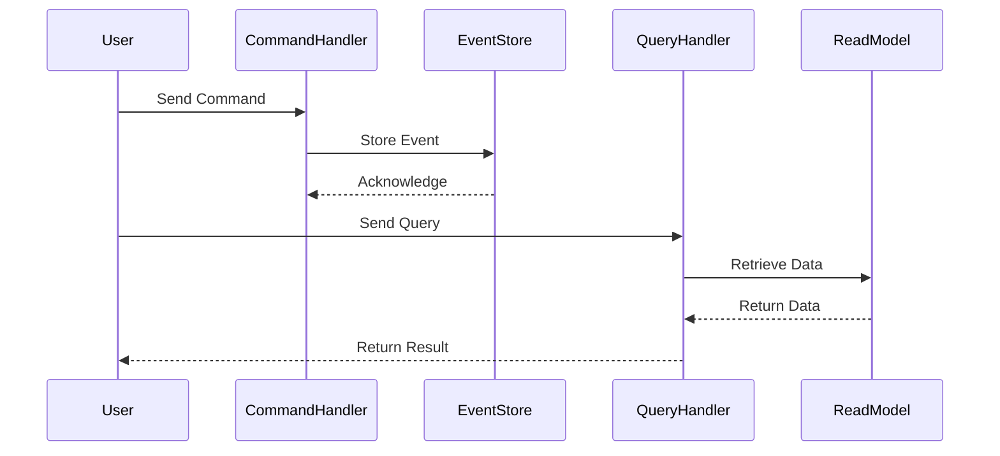

## 13.9 Event Sourcing and CQRS Patterns

Event Sourcing and Command Query Responsibility Segregation (CQRS) are two powerful patterns that can transform how we manage state and handle data in applications. In this section, we will delve into these patterns, exploring their definitions, implementations in Erlang, benefits, and challenges.

### Understanding Event Sourcing

**Event Sourcing** is a design pattern where state changes are captured as a sequence of events. Instead of storing the current state of an entity, we store a log of state-changing events. This approach allows us to reconstruct the state by replaying these events.

#### Key Concepts of Event Sourcing

- **Event Log**: A persistent record of all events that have occurred in the system. Each event represents a state change.
- **Event Replay**: The process of reconstructing the current state by replaying the event log.
- **Event Store**: A specialized database or storage system designed to store and retrieve events efficiently.

#### Benefits of Event Sourcing

- **Auditability**: Every state change is recorded, providing a complete audit trail.
- **Scalability**: Events can be processed asynchronously, allowing for scalable architectures.
- **Flexibility**: The ability to replay events enables easy debugging and state reconstruction.

#### Challenges of Event Sourcing

- **Complexity**: Managing event logs and ensuring consistency can be complex.
- **Eventual Consistency**: Systems using event sourcing often operate under eventual consistency, which can complicate real-time data access.

### Implementing Event Sourcing in Erlang

Let's explore how to implement Event Sourcing in Erlang. We'll create a simple banking application where account transactions are recorded as events.

#### Erlang Code Example: Event Sourcing

```erlang
-module(bank_account).
-export([create_account/1, deposit/2, withdraw/2, get_balance/1]).

-record(event, {type, amount, timestamp}).
-record(account, {id, events = []}).

% Create a new account with an empty event log
create_account(Id) ->
    #account{id = Id}.

% Record a deposit event
deposit(Account, Amount) ->
    Event = #event{type = deposit, amount = Amount, timestamp = erlang:system_time()},
    UpdatedEvents = [Event | Account#account.events],
    Account#account{events = UpdatedEvents}.

% Record a withdrawal event
withdraw(Account, Amount) ->
    Event = #event{type = withdraw, amount = Amount, timestamp = erlang:system_time()},
    UpdatedEvents = [Event | Account#account.events],
    Account#account{events = UpdatedEvents}.

% Calculate the balance by replaying events
get_balance(Account) ->
    lists:foldl(fun calculate_balance/2, 0, lists:reverse(Account#account.events)).

calculate_balance(#event{type = deposit, amount = Amount}, Balance) ->
    Balance + Amount;
calculate_balance(#event{type = withdraw, amount = Amount}, Balance) ->
    Balance - Amount.
```

In this example, we define a `bank_account` module where each account has an event log. Deposits and withdrawals are recorded as events, and the balance is calculated by replaying these events.

### Understanding CQRS

**Command Query Responsibility Segregation (CQRS)** is a pattern that separates the read and write operations of a system. In CQRS, commands are responsible for updating the state, while queries are responsible for reading the state.

#### Key Concepts of CQRS

- **Commands**: Operations that change the state of the system. They do not return data.
- **Queries**: Operations that retrieve data without modifying the state.
- **Separation of Concerns**: By separating commands and queries, we can optimize each for its specific purpose.

#### Benefits of CQRS

- **Scalability**: Read and write operations can be scaled independently.
- **Performance**: Queries can be optimized for fast data retrieval.
- **Flexibility**: Different models can be used for reading and writing data.

#### Challenges of CQRS

- **Complexity**: Managing separate models for commands and queries can increase complexity.
- **Consistency**: Ensuring consistency between the read and write models requires careful design.

### Implementing CQRS in Erlang

Let's implement a simple CQRS pattern in Erlang using the same banking application. We'll separate the command and query operations.

#### Erlang Code Example: CQRS

```erlang
-module(bank_cqrs).
-export([execute_command/2, query_balance/1]).

-record(command, {type, amount}).
-record(query, {type}).

% Execute a command to update the account state
execute_command(Account, #command{type = deposit, amount = Amount}) ->
    bank_account:deposit(Account, Amount);
execute_command(Account, #command{type = withdraw, amount = Amount}) ->
    bank_account:withdraw(Account, Amount).

% Query the account balance
query_balance(Account) ->
    bank_account:get_balance(Account).
```

In this example, we define a `bank_cqrs` module where commands and queries are handled separately. The `execute_command/2` function processes commands, while the `query_balance/1` function retrieves the account balance.

### Combining Event Sourcing and CQRS

Event Sourcing and CQRS are often used together to leverage their combined benefits. Event Sourcing provides a reliable way to record state changes, while CQRS optimizes read and write operations.

#### Erlang Code Example: Event Sourcing with CQRS

```erlang
-module(bank_es_cqrs).
-export([handle_command/2, handle_query/1]).

% Handle commands using Event Sourcing
handle_command(Account, Command) ->
    UpdatedAccount = bank_cqrs:execute_command(Account, Command),
    UpdatedAccount.

% Handle queries using CQRS
handle_query(Account) ->
    bank_cqrs:query_balance(Account).
```

In this example, we integrate Event Sourcing and CQRS in the `bank_es_cqrs` module. Commands are processed using Event Sourcing, and queries are handled using CQRS.

### Visualizing Event Sourcing and CQRS

To better understand the flow of Event Sourcing and CQRS, let's visualize the process using a sequence diagram.



**Diagram Description**: This sequence diagram illustrates the interaction between a user, command handler, event store, query handler, and read model in a system using Event Sourcing and CQRS. Commands are processed and stored as events, while queries retrieve data from the read model.

### Design Considerations

When implementing Event Sourcing and CQRS, consider the following:

- **Event Schema**: Design a flexible event schema to accommodate future changes.
- **Consistency Models**: Choose between strong and eventual consistency based on application needs.
- **Eventual Consistency**: Be prepared to handle eventual consistency in read models.
- **Scalability**: Plan for scaling both the event store and read models.

### Erlang Unique Features

Erlang's concurrency model and fault-tolerance capabilities make it well-suited for implementing Event Sourcing and CQRS. The lightweight process model allows for efficient handling of commands and events, while the "let it crash" philosophy supports robust error handling.

### Differences and Similarities

Event Sourcing and CQRS are complementary patterns but can be used independently. Event Sourcing focuses on capturing state changes as events, while CQRS separates read and write operations. Together, they provide a powerful approach to managing application state.

### Try It Yourself

Experiment with the provided code examples by modifying the event types or adding new commands and queries. Try implementing additional features, such as event replay for debugging or optimizing the read model for specific queries.

### Knowledge Check

- **What is the primary benefit of using Event Sourcing?**
- **How does CQRS improve scalability?**
- **What are the challenges of eventual consistency?**
- **How can Erlang's concurrency model benefit Event Sourcing and CQRS implementations?**

### Summary

Event Sourcing and CQRS are powerful patterns for managing application state, offering benefits like auditability, scalability, and flexibility. While they introduce complexity, Erlang's features make it an excellent choice for implementing these patterns.

Remember, this is just the beginning. As you progress, you'll build more complex and interactive systems. Keep experimenting, stay curious, and enjoy the journey!

## Quiz: Event Sourcing and CQRS Patterns



### What is the primary benefit of Event Sourcing?

- [x] Auditability
- [ ] Simplicity
- [ ] Real-time data access
- [ ] Reduced storage requirements

> **Explanation:** Event Sourcing provides a complete audit trail of all state changes.

### How does CQRS improve scalability?

- [x] By separating read and write operations
- [ ] By reducing the number of events
- [ ] By using a single data model
- [ ] By eliminating eventual consistency

> **Explanation:** CQRS allows read and write operations to be scaled independently.

### What is a challenge of eventual consistency?

- [x] Real-time data access can be difficult
- [ ] Increased storage requirements
- [ ] Simplified data models
- [ ] Reduced auditability

> **Explanation:** Eventual consistency can complicate real-time data access.

### How can Erlang's concurrency model benefit Event Sourcing and CQRS implementations?

- [x] Efficient handling of commands and events
- [ ] Simplified data models
- [ ] Reduced storage requirements
- [ ] Real-time data access

> **Explanation:** Erlang's lightweight process model allows for efficient handling of commands and events.

### What is a key concept of Event Sourcing?

- [x] Event Log
- [ ] Single data model
- [ ] Real-time data access
- [ ] Reduced storage requirements

> **Explanation:** An Event Log is a persistent record of all events in the system.

### What is a key concept of CQRS?

- [x] Separation of Concerns
- [ ] Single data model
- [ ] Real-time data access
- [ ] Reduced storage requirements

> **Explanation:** CQRS separates read and write operations, optimizing each for its specific purpose.

### How can Event Sourcing and CQRS be used together?

- [x] Event Sourcing records state changes, CQRS optimizes read/write operations
- [ ] Both use a single data model
- [ ] Both eliminate eventual consistency
- [ ] Both reduce storage requirements

> **Explanation:** Event Sourcing provides a reliable way to record state changes, while CQRS optimizes read and write operations.

### What is a benefit of using Erlang for Event Sourcing and CQRS?

- [x] Concurrency model and fault-tolerance
- [ ] Simplified data models
- [ ] Reduced storage requirements
- [ ] Real-time data access

> **Explanation:** Erlang's concurrency model and fault-tolerance capabilities make it well-suited for these patterns.

### What is a design consideration for Event Sourcing?

- [x] Event Schema
- [ ] Single data model
- [ ] Real-time data access
- [ ] Reduced storage requirements

> **Explanation:** Designing a flexible event schema is crucial for accommodating future changes.

### True or False: Event Sourcing and CQRS can only be used together.

- [ ] True
- [x] False

> **Explanation:** Event Sourcing and CQRS are complementary patterns but can be used independently.


