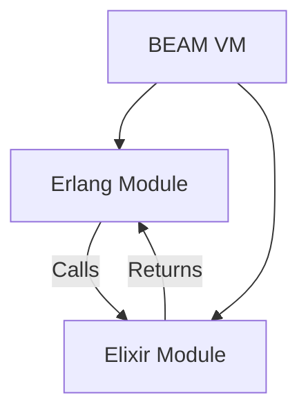

## 14.1 Interoperability with Elixir and Other BEAM Languages

In the world of software development, leveraging multiple languages within a single ecosystem can significantly enhance the capabilities of your applications. The BEAM VM (Bogdan/Björn's Erlang Abstract Machine) is a powerful virtual machine that supports multiple languages, including Erlang and Elixir. This section delves into how Erlang can interoperate with Elixir and other BEAM languages, providing you with the tools to harness the strengths of each language.

### Understanding the BEAM VM

The BEAM VM is the heart of the Erlang ecosystem, designed to run concurrent, distributed, and fault-tolerant applications. It supports multiple languages, allowing developers to choose the best tool for the task at hand. Erlang, with its robust concurrency model, and Elixir, with its modern syntax and metaprogramming capabilities, are two of the most popular languages on the BEAM.

#### Key Features of the BEAM VM

- **Concurrency**: The BEAM VM is built for concurrency, with lightweight processes and message-passing capabilities.
- **Fault Tolerance**: It supports the "let it crash" philosophy, enabling systems to recover from failures gracefully.
- **Hot Code Swapping**: The ability to update code without stopping the system is a unique feature of the BEAM.
- **Cross-Language Interoperability**: The BEAM allows different languages to interoperate seamlessly, sharing data and functionality.

### Interoperability Between Erlang and Elixir

Erlang and Elixir are both first-class citizens on the BEAM VM, and their interoperability is a key feature that developers can leverage. This section will guide you through the process of calling Elixir code from Erlang and vice versa, ensuring you can utilize the strengths of both languages.

#### Calling Elixir Code from Erlang

To call Elixir code from Erlang, you need to understand how modules and functions are structured in Elixir. Elixir modules are compiled into BEAM bytecode, just like Erlang modules, and can be called using the same syntax.

**Example: Calling an Elixir Function from Erlang**

Suppose you have an Elixir module `Math` with a function `add/2`:

```elixir
# Elixir code
defmodule Math do
  def add(a, b) do
    a + b
  end
end
```

To call this function from Erlang, you can use the following code:

```erlang
% Erlang code
Result = 'Elixir.Math':add(5, 10).
io:format("Result: ~p~n", [Result]).
```

**Explanation**: In Erlang, Elixir modules are prefixed with `'Elixir.'`, and you can call functions using the `Module:Function(Args)` syntax.

#### Calling Erlang Code from Elixir

Elixir can also call Erlang functions directly, thanks to the shared BEAM environment. This allows Elixir developers to utilize Erlang's mature libraries and tools.

**Example: Calling an Erlang Function from Elixir**

Assume you have an Erlang module `math` with a function `multiply/2`:

```erlang
% Erlang code
-module(math).
-export([multiply/2]).

multiply(A, B) ->
    A * B.
```

You can call this function from Elixir as follows:

```elixir
# Elixir code
result = :math.multiply(5, 10)
IO.puts("Result: #{result}")
```

**Explanation**: In Elixir, Erlang modules are referenced with a colon `:`, and functions are called using the `Module.function(args)` syntax.

### Considerations for Interoperability

When working with multiple languages on the BEAM, there are several considerations to keep in mind to ensure smooth interoperability.

#### Module Naming

- **Elixir Modules**: Prefixed with `'Elixir.'` when called from Erlang.
- **Erlang Modules**: Referenced with a colon `:` in Elixir.

#### Data Type Compatibility

The BEAM VM ensures that basic data types are compatible across languages, but there are nuances to be aware of:

- **Atoms**: Both languages support atoms, but Elixir atoms are prefixed with `:` in Elixir code.
- **Lists and Tuples**: Fully compatible between Erlang and Elixir.
- **Maps**: Supported in both languages, but syntax differs.
- **Strings**: Elixir strings are UTF-8 binaries, while Erlang strings are lists of integers.

#### Error Handling

Both Erlang and Elixir have robust error-handling mechanisms, but they differ in syntax and idiomatic usage. When interoperating, ensure that you handle errors appropriately, considering the conventions of both languages.

### Benefits of Cross-Language Collaboration

Interoperability between Erlang and Elixir offers several benefits, allowing developers to leverage the strengths of each language.

#### Accessing Elixir's Libraries and Features

Elixir's modern syntax and rich ecosystem of libraries can enhance your Erlang applications. By calling Elixir code from Erlang, you can access powerful tools like Phoenix for web development or Ecto for database interactions.

#### Leveraging Erlang's Concurrency Model

Erlang's concurrency model is one of its greatest strengths. Elixir developers can call Erlang functions to handle concurrent tasks efficiently, benefiting from Erlang's mature process management.

### Encouraging Cross-Language Collaboration

To fully harness the power of the BEAM VM, consider exploring cross-language collaboration. By combining the strengths of Erlang and Elixir, you can build robust, scalable applications that leverage the best features of both languages.

#### Example: Building a Web Application

Imagine building a web application where the backend logic is implemented in Erlang for its concurrency capabilities, while the web interface is developed using Elixir's Phoenix framework. This approach allows you to utilize Erlang's strengths in handling concurrent requests while benefiting from Elixir's modern web development tools.

### Visualizing Interoperability

To better understand how Erlang and Elixir can interoperate on the BEAM VM, consider the following diagram:



**Description**: This diagram illustrates the interaction between Erlang and Elixir modules running on the BEAM VM. Both languages can call each other's functions seamlessly, leveraging the shared environment.

### Try It Yourself

To solidify your understanding of interoperability between Erlang and Elixir, try modifying the examples provided:

- **Experiment**: Create an Elixir module with multiple functions and call them from Erlang.
- **Challenge**: Implement an Erlang module with different data types and call it from Elixir, observing how data types are handled.
- **Explore**: Use Elixir's `mix` tool to create a project that includes both Erlang and Elixir code, and experiment with calling functions across languages.

### References and Further Reading

- [Elixir Interoperability Guide](https://elixir-lang.org/getting-started/interoperability.html)
- [Erlang Documentation](https://www.erlang.org/docs)
- [BEAM VM Overview](https://en.wikipedia.org/wiki/BEAM_(Erlang_virtual_machine))

### Knowledge Check

Before moving on, consider the following questions to test your understanding:

- How do you call an Elixir function from Erlang?
- What are some considerations when working with data types across Erlang and Elixir?
- What benefits can you gain from using both Erlang and Elixir in a single application?

### Embrace the Journey

Remember, this is just the beginning of your exploration into the world of BEAM languages. As you progress, you'll discover more ways to leverage the strengths of Erlang and Elixir, building more complex and capable applications. Keep experimenting, stay curious, and enjoy the journey!

## Quiz: Interoperability with Elixir and Other BEAM Languages



### How do you call an Elixir function from Erlang?

- [x] Use the `'Elixir.Module':function(args)` syntax.
- [ ] Use the `:Module.function(args)` syntax.
- [ ] Use the `Module.function(args)` syntax.
- [ ] Use the `Elixir.Module.function(args)` syntax.

> **Explanation:** In Erlang, Elixir modules are prefixed with `'Elixir.'`, and you call functions using the `Module:Function(Args)` syntax.

### What is a key feature of the BEAM VM?

- [x] Concurrency and fault tolerance.
- [ ] Object-oriented programming.
- [ ] Static typing.
- [ ] Manual memory management.

> **Explanation:** The BEAM VM is designed for concurrency and fault tolerance, making it ideal for building robust, distributed systems.

### How are Erlang modules referenced in Elixir?

- [x] With a colon `:`.
- [ ] With a dot `.`.
- [ ] With a slash `/`.
- [ ] With a hyphen `-`.

> **Explanation:** In Elixir, Erlang modules are referenced with a colon `:`, and functions are called using the `Module.function(args)` syntax.

### What is a benefit of using both Erlang and Elixir in a single application?

- [x] Leveraging the strengths of both languages.
- [ ] Reducing the need for error handling.
- [ ] Simplifying the build process.
- [ ] Eliminating the need for testing.

> **Explanation:** By using both Erlang and Elixir, you can leverage the strengths of each language, such as Erlang's concurrency model and Elixir's modern syntax and libraries.

### What is a consideration when working with data types across Erlang and Elixir?

- [x] Ensuring compatibility of basic data types.
- [ ] Using only strings for data exchange.
- [ ] Avoiding the use of lists.
- [ ] Converting all data to integers.

> **Explanation:** The BEAM VM ensures compatibility of basic data types across languages, but developers should be aware of differences in syntax and idiomatic usage.

### How are Elixir atoms represented in Elixir code?

- [x] Prefixed with `:`.
- [ ] Enclosed in quotes.
- [ ] Prefixed with `@`.
- [ ] Enclosed in brackets.

> **Explanation:** In Elixir, atoms are prefixed with `:`, such as `:atom`.

### What is a key consideration for module naming in cross-language interoperability?

- [x] Elixir modules are prefixed with `'Elixir.'` when called from Erlang.
- [ ] Erlang modules are prefixed with `'Erlang.'` when called from Elixir.
- [ ] Modules must be named in lowercase.
- [ ] Modules must be named in uppercase.

> **Explanation:** When calling Elixir modules from Erlang, they are prefixed with `'Elixir.'`.

### How can Elixir developers benefit from Erlang's concurrency model?

- [x] By calling Erlang functions to handle concurrent tasks.
- [ ] By rewriting Erlang code in Elixir.
- [ ] By avoiding the use of processes.
- [ ] By using only synchronous messaging.

> **Explanation:** Elixir developers can call Erlang functions to efficiently handle concurrent tasks, leveraging Erlang's mature process management.

### What is a unique feature of the BEAM VM?

- [x] Hot code swapping.
- [ ] Static code compilation.
- [ ] Manual memory management.
- [ ] Object-oriented inheritance.

> **Explanation:** The BEAM VM supports hot code swapping, allowing updates to code without stopping the system.

### True or False: Erlang and Elixir can seamlessly share data and functionality on the BEAM VM.

- [x] True
- [ ] False

> **Explanation:** The BEAM VM allows Erlang and Elixir to interoperate seamlessly, sharing data and functionality.


