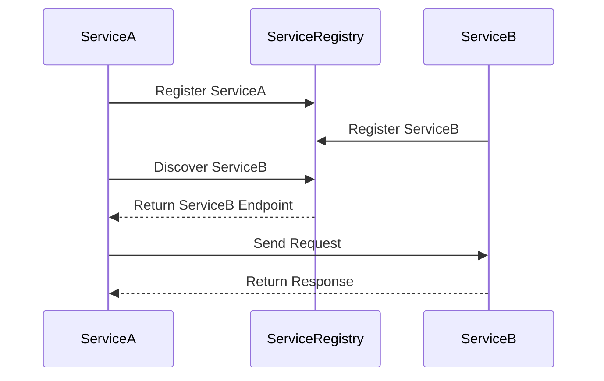

## 14.10 Service Discovery and Coordination

In the realm of distributed systems, service discovery and coordination are pivotal for ensuring that services can locate each other and work together seamlessly. As systems grow in complexity, the need for dynamic service discovery becomes paramount. This section delves into the mechanisms of service discovery and coordination within Erlang distributed systems, highlighting integration with tools such as Consul, etcd, and ZooKeeper.

### Introduction to Service Discovery

Service discovery is the process by which services in a distributed system locate each other. In a microservices architecture, services are often ephemeral and can change dynamically. Thus, a robust service discovery mechanism is essential to maintain connectivity and ensure that services can communicate effectively.

#### Key Concepts

- **Service Registry**: A centralized database where service instances register themselves. It acts as a directory for service locations.
- **Discovery Protocols**: Protocols that enable services to find each other, often through querying the service registry.
- **Dynamic Topology**: The ability of a system to adapt to changes in the network, such as services being added or removed.

### Integrating with Service Discovery Tools

Several tools facilitate service discovery and coordination in distributed systems. Let's explore how Erlang can integrate with popular tools like Consul, etcd, and ZooKeeper.

#### Consul

Consul is a service mesh solution providing service discovery, configuration, and segmentation functionality. It uses a distributed key-value store and supports health checking to ensure service availability.

##### Integration with Consul

To integrate Erlang with Consul, you can use the `consul` Erlang client library. Here's a basic example of registering a service with Consul:

```erlang
% Register a service with Consul
register_service(ServiceName, ServiceID, Port) ->
    ServiceData = #{ "Name" => ServiceName,
                     "ID" => ServiceID,
                     "Port" => Port },
    consul:put("/v1/agent/service/register", ServiceData).
```

In this example, we define a function `register_service/3` that registers a service with Consul by sending a POST request to the Consul agent.

##### Discovering Services

To discover services, you can query Consul's service catalog:

```erlang
% Discover services from Consul
discover_service(ServiceName) ->
    {ok, Response} = consul:get("/v1/catalog/service/" ++ ServiceName),
    parse_service_response(Response).

parse_service_response(Response) ->
    % Parse the JSON response to extract service details
    % This function should return a list of service instances
    % with their respective IP addresses and ports.
```

#### etcd

etcd is a distributed key-value store that provides a reliable way to store data across a cluster of machines. It is often used for service discovery and configuration management.

##### Integration with etcd

To use etcd with Erlang, you can leverage the `etcd` Erlang client. Here's an example of registering a service:

```erlang
% Register a service with etcd
register_service(ServiceName, ServiceID, Port) ->
    Key = "/services/" ++ ServiceName ++ "/" ++ ServiceID,
    Value = #{ "port" => Port },
    etcd:put(Key, Value).
```

##### Discovering Services

Service discovery in etcd involves querying the key-value store:

```erlang
% Discover services from etcd
discover_service(ServiceName) ->
    {ok, Response} = etcd:get("/services/" ++ ServiceName),
    parse_etcd_response(Response).

parse_etcd_response(Response) ->
    % Parse the response to extract service details
    % This function should return a list of service instances
    % with their respective IP addresses and ports.
```

#### ZooKeeper

ZooKeeper is a centralized service for maintaining configuration information, naming, providing distributed synchronization, and providing group services.

##### Integration with ZooKeeper

To integrate Erlang with ZooKeeper, you can use the `erlzk` library. Here's an example of registering a service:

```erlang
% Register a service with ZooKeeper
register_service(ServiceName, ServiceID, Port) ->
    Path = "/services/" ++ ServiceName ++ "/" ++ ServiceID,
    Data = term_to_binary(#{ "port" => Port }),
    erlzk:create(Path, Data, [persistent]).
```

##### Discovering Services

Service discovery in ZooKeeper involves reading nodes from the ZooKeeper tree:

```erlang
% Discover services from ZooKeeper
discover_service(ServiceName) ->
    {ok, Children} = erlzk:get_children("/services/" ++ ServiceName),
    lists:map(fun(Child) -> erlzk:get_data("/services/" ++ ServiceName ++ "/" ++ Child) end, Children).
```

### Considerations for Consistency and Fault Tolerance

When designing service discovery mechanisms, it's crucial to consider consistency and fault tolerance. Here are some key considerations:

- **Consistency Models**: Choose between strong consistency and eventual consistency based on your application's needs.
- **Fault Tolerance**: Ensure that your service discovery mechanism can handle failures gracefully. This may involve implementing retries, fallbacks, and health checks.
- **Scalability**: As your system grows, ensure that your service discovery mechanism can scale to accommodate more services and requests.

### Designing Systems for Dynamic Topology

In a distributed system, services may come and go, and network topologies can change. It's essential to design systems that can adapt dynamically to these changes.

#### Dynamic Service Registration

Implement mechanisms for services to register and deregister themselves dynamically. This can be achieved through:

- **Lifecycle Hooks**: Use hooks to register services on startup and deregister them on shutdown.
- **Health Checks**: Regularly check the health of services and update their status in the service registry.

#### Adaptive Service Discovery

Design your service discovery mechanism to adapt to changes in the network topology. This can involve:

- **Caching**: Cache service discovery results to reduce the load on the service registry.
- **Load Balancing**: Implement load balancing to distribute requests evenly across service instances.
- **Failover**: Implement failover mechanisms to redirect requests to healthy service instances in case of failures.

### Visualizing Service Discovery and Coordination

To better understand the flow of service discovery and coordination, let's visualize the process using a sequence diagram.



**Diagram Description**: This sequence diagram illustrates the process of service discovery and coordination. Service A registers itself with the Service Registry, discovers Service B, and sends a request to Service B.

### Try It Yourself

Experiment with the code examples provided in this section. Try modifying the service registration and discovery logic to suit your application's needs. Consider implementing additional features such as health checks and load balancing.

### Knowledge Check

- What is the purpose of a service registry in a distributed system?
- How can Erlang integrate with Consul for service discovery?
- What are some considerations for ensuring fault tolerance in service discovery mechanisms?

### Summary

In this section, we've explored the concepts of service discovery and coordination in Erlang distributed systems. We've discussed integrating with tools like Consul, etcd, and ZooKeeper, and highlighted considerations for consistency and fault tolerance. By designing systems that adapt dynamically to topology changes, you can ensure robust and scalable service discovery in your distributed applications.

## Quiz: Service Discovery and Coordination



### What is the primary role of a service registry in a distributed system?

- [x] To act as a directory for service locations
- [ ] To store application data
- [ ] To manage user authentication
- [ ] To handle network traffic

> **Explanation:** A service registry acts as a directory for service locations, enabling services to discover each other in a distributed system.

### Which tool is NOT commonly used for service discovery?

- [ ] Consul
- [ ] etcd
- [ ] ZooKeeper
- [x] Redis

> **Explanation:** While Consul, etcd, and ZooKeeper are commonly used for service discovery, Redis is primarily used as a data store and cache.

### How does Consul ensure service availability?

- [x] Through health checking
- [ ] By storing data in a database
- [ ] By using a load balancer
- [ ] By encrypting service data

> **Explanation:** Consul uses health checking to ensure that services are available and functioning correctly.

### What is a key consideration when designing service discovery mechanisms?

- [x] Consistency and fault tolerance
- [ ] User interface design
- [ ] Database schema
- [ ] Encryption algorithms

> **Explanation:** Consistency and fault tolerance are crucial considerations when designing service discovery mechanisms to ensure reliability and robustness.

### Which Erlang library can be used to integrate with ZooKeeper?

- [x] erlzk
- [ ] erlconsul
- [ ] erletcd
- [ ] erlredis

> **Explanation:** The `erlzk` library is used to integrate Erlang with ZooKeeper for service discovery and coordination.

### What is the purpose of dynamic service registration?

- [x] To allow services to register and deregister themselves dynamically
- [ ] To encrypt service data
- [ ] To manage user sessions
- [ ] To optimize database queries

> **Explanation:** Dynamic service registration allows services to register and deregister themselves dynamically, adapting to changes in the network topology.

### How can service discovery mechanisms adapt to changes in network topology?

- [x] By caching service discovery results
- [ ] By encrypting network traffic
- [ ] By storing data in a database
- [ ] By using a static IP address

> **Explanation:** Caching service discovery results can help service discovery mechanisms adapt to changes in network topology by reducing the load on the service registry.

### What is a common feature of service discovery tools like Consul, etcd, and ZooKeeper?

- [x] Distributed key-value store
- [ ] User authentication
- [ ] Data encryption
- [ ] Load balancing

> **Explanation:** Tools like Consul, etcd, and ZooKeeper commonly use a distributed key-value store for storing service information and configuration data.

### True or False: Service discovery is only necessary in microservices architectures.

- [ ] True
- [x] False

> **Explanation:** Service discovery is necessary in any distributed system where services need to locate and communicate with each other, not just in microservices architectures.

### What is the benefit of implementing health checks in service discovery?

- [x] To ensure that services are available and functioning correctly
- [ ] To encrypt service data
- [ ] To manage user sessions
- [ ] To optimize database queries

> **Explanation:** Implementing health checks in service discovery ensures that services are available and functioning correctly, contributing to the overall reliability of the system.



Remember, service discovery and coordination are crucial components of distributed systems. As you continue to explore these concepts, you'll gain a deeper understanding of how to build robust and scalable applications. Keep experimenting, stay curious, and enjoy the journey!
