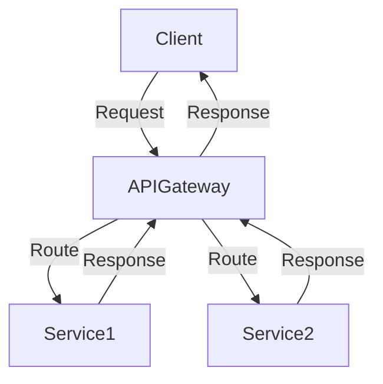

## 14.11 Integration Patterns and Best Practices

In the world of software development, integrating with external systems is a common requirement. Whether it's connecting to a database, interacting with a third-party API, or communicating with another service, integration is a critical aspect of building robust and scalable applications. In this section, we will explore key integration patterns and best practices in Erlang, focusing on ensuring maintainability, reliability, and security.

### Key Integration Patterns

#### 1. API Gateway Pattern

The API Gateway pattern is a design pattern that provides a single entry point for clients to interact with multiple backend services. It acts as a reverse proxy, routing requests to the appropriate service and aggregating responses when necessary. This pattern is particularly useful in microservices architectures, where it simplifies client interactions and centralizes cross-cutting concerns such as authentication, logging, and rate limiting.

**Benefits:**
- Simplifies client interactions by providing a unified API.
- Centralizes cross-cutting concerns, reducing duplication across services.
- Enables load balancing and request routing.

**Implementation in Erlang:**

```erlang
-module(api_gateway).
-export([handle_request/1]).

handle_request(Request) ->
    case Request of
        {get, "/service1"} -> service1:handle_get();
        {post, "/service2"} -> service2:handle_post();
        _ -> {error, "Unknown endpoint"}
    end.
```

In this example, the `api_gateway` module routes requests to different services based on the request path. This is a simplified version, and in a real-world scenario, you would include additional logic for authentication, logging, and error handling.

#### 2. Façade Pattern

The Façade pattern provides a simplified interface to a complex subsystem, making it easier for clients to interact with the system. This pattern is useful when you need to integrate with a complex API or system and want to hide the complexity from the client.

**Benefits:**
- Simplifies the client interface, reducing the learning curve.
- Decouples the client from the underlying subsystem, increasing flexibility.
- Facilitates subsystem evolution without affecting clients.

**Implementation in Erlang:**

```erlang
-module(facade).
-export([perform_operation/1]).

perform_operation(Params) ->
    Result1 = complex_system:operation1(Params),
    Result2 = complex_system:operation2(Result1),
    {ok, Result2}.
```

Here, the `facade` module provides a single function `perform_operation/1` that internally calls multiple operations on a complex system. The client only needs to interact with the `facade` module, simplifying the integration.

#### 3. Anti-Corruption Layer Pattern

The Anti-Corruption Layer (ACL) pattern is used to prevent a system from being affected by changes in an external system. It acts as a translator or adapter between the two systems, ensuring that changes in the external system do not propagate into the internal system.

**Benefits:**
- Protects the internal system from changes in external systems.
- Provides a clear boundary between systems, improving maintainability.
- Facilitates integration with legacy systems.

**Implementation in Erlang:**

```erlang
-module(anti_corruption_layer).
-export([translate/1]).

translate(ExternalData) ->
    % Convert external data format to internal format
    InternalData = convert_to_internal(ExternalData),
    process_internal_data(InternalData).

convert_to_internal(ExternalData) ->
    % Conversion logic here
    InternalData.
```

In this example, the `anti_corruption_layer` module translates data from an external format to an internal format, ensuring that changes in the external system do not affect the internal system.

### Importance of Abstraction and Encapsulation

When integrating with external systems, it's crucial to use abstraction and encapsulation to hide the complexity and details of the integration. This approach provides several benefits:

- **Maintainability:** By encapsulating integration logic, you can change the implementation without affecting the rest of the system.
- **Flexibility:** Abstraction allows you to switch between different external systems or APIs with minimal changes.
- **Testability:** Encapsulated integration logic can be easily mocked or stubbed in tests, improving test coverage and reliability.

### Guidelines for Error Handling, Retries, and Timeouts

Error handling is a critical aspect of integration, as external systems can be unreliable or unavailable. Here are some guidelines for handling errors effectively:

- **Use Timeouts:** Always set timeouts for external calls to prevent your system from hanging indefinitely.
- **Implement Retries:** Use exponential backoff strategies for retries to avoid overwhelming the external system.
- **Graceful Degradation:** Design your system to degrade gracefully in case of failures, providing fallback mechanisms or default responses.
- **Log Errors:** Log integration errors for monitoring and troubleshooting purposes.

**Example of Error Handling in Erlang:**

```erlang
-module(integration).
-export([call_external_service/1]).

call_external_service(Params) ->
    try
        % Simulate external service call
        external_service:call(Params)
    catch
        error:Reason ->
            io:format("Error calling external service: ~p~n", [Reason]),
            {error, Reason}
    end.
```

### Security Considerations

Security is paramount when integrating with external systems. Here are some best practices to ensure secure integrations:

- **Input Validation:** Always validate and sanitize inputs from external systems to prevent injection attacks.
- **Authentication and Authorization:** Use secure authentication mechanisms (e.g., OAuth, JWT) to authenticate external systems.
- **Encrypt Data:** Use encryption for data in transit and at rest to protect sensitive information.
- **Audit and Monitor:** Implement logging and monitoring to detect and respond to security incidents.

### Documentation and Consistent Practices

Consistent documentation and practices are essential for maintaining integrations over time. Here are some tips:

- **Document APIs:** Provide clear documentation for any APIs you expose or consume, including request/response formats and error codes.
- **Standardize Practices:** Use consistent naming conventions, error handling strategies, and logging formats across integrations.
- **Version Control:** Use version control for integration code and configuration to track changes and facilitate rollbacks.

### Try It Yourself

To solidify your understanding of integration patterns and best practices, try modifying the provided code examples. For instance, you can:

- Add authentication logic to the API Gateway example.
- Implement a retry mechanism in the error handling example.
- Extend the Façade pattern to include additional operations.

### Visualizing Integration Patterns

Below is a Mermaid.js diagram illustrating the API Gateway pattern, showing how requests are routed to different services.



This diagram shows the flow of requests and responses through the API Gateway, highlighting its role as a central point of interaction.

### Knowledge Check

- What are the benefits of using the API Gateway pattern?
- How does the Façade pattern simplify client interactions?
- Why is the Anti-Corruption Layer pattern important in integrations?
- What are some best practices for error handling in integrations?
- How can you ensure secure integrations with external systems?

### Embrace the Journey

Remember, integrating with external systems is an ongoing journey. As you gain experience, you'll develop a deeper understanding of the challenges and opportunities in this area. Keep experimenting, stay curious, and enjoy the process of building robust and maintainable integrations.

## Quiz: Integration Patterns and Best Practices



### What is the primary role of an API Gateway in a microservices architecture?

- [x] To provide a single entry point for clients to interact with multiple backend services
- [ ] To directly connect clients to backend services without any intermediaries
- [ ] To store data for backend services
- [ ] To replace all backend services with a single service

> **Explanation:** An API Gateway acts as a single entry point for clients, routing requests to the appropriate backend services and centralizing cross-cutting concerns.

### Which pattern provides a simplified interface to a complex subsystem?

- [ ] API Gateway
- [x] Façade
- [ ] Anti-Corruption Layer
- [ ] Singleton

> **Explanation:** The Façade pattern provides a simplified interface to a complex subsystem, making it easier for clients to interact with the system.

### What is the purpose of the Anti-Corruption Layer pattern?

- [ ] To increase the complexity of the system
- [x] To prevent a system from being affected by changes in an external system
- [ ] To simplify the client interface
- [ ] To directly expose internal system details to external systems

> **Explanation:** The Anti-Corruption Layer pattern acts as a translator between systems, preventing changes in an external system from affecting the internal system.

### Why is abstraction important in integrations?

- [x] It hides complexity and details of the integration
- [ ] It exposes all internal details to clients
- [ ] It makes the system more complex
- [ ] It reduces flexibility

> **Explanation:** Abstraction hides the complexity and details of the integration, improving maintainability and flexibility.

### What is a recommended strategy for handling errors in integrations?

- [x] Implement retries with exponential backoff
- [ ] Ignore errors and continue processing
- [ ] Always retry immediately without delay
- [ ] Log errors without taking any action

> **Explanation:** Implementing retries with exponential backoff helps avoid overwhelming the external system and provides a strategy for handling transient errors.

### How can you ensure secure integrations with external systems?

- [x] Use encryption for data in transit and at rest
- [ ] Allow unrestricted access to all external systems
- [ ] Disable authentication for faster access
- [ ] Ignore input validation

> **Explanation:** Using encryption for data in transit and at rest protects sensitive information and ensures secure integrations.

### What should be included in API documentation?

- [x] Request/response formats and error codes
- [ ] Only the API name
- [ ] Internal implementation details
- [ ] Nothing, as documentation is unnecessary

> **Explanation:** API documentation should include request/response formats and error codes to provide clear guidance for clients.

### What is a benefit of using the Façade pattern?

- [x] It simplifies the client interface
- [ ] It increases the complexity of the client interface
- [ ] It exposes all internal details to clients
- [ ] It directly connects clients to the subsystem

> **Explanation:** The Façade pattern simplifies the client interface by providing a unified and simplified way to interact with a complex subsystem.

### What is a key consideration when using the Anti-Corruption Layer pattern?

- [x] It should translate data between external and internal formats
- [ ] It should expose internal system details to external systems
- [ ] It should increase the complexity of the integration
- [ ] It should directly connect external systems to internal systems

> **Explanation:** The Anti-Corruption Layer pattern should translate data between external and internal formats to protect the internal system from changes in the external system.

### True or False: Consistent documentation and practices are essential for maintaining integrations over time.

- [x] True
- [ ] False

> **Explanation:** Consistent documentation and practices are essential for maintaining integrations over time, ensuring clarity and ease of maintenance.


