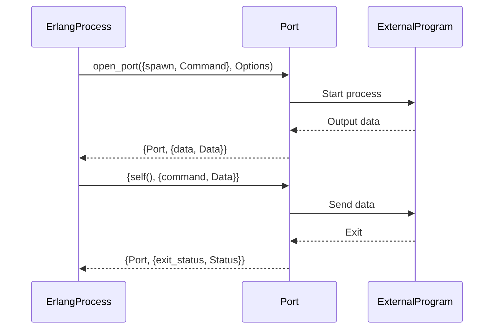

## 14.2 Using Ports, NIFs, and C Nodes for Native Integration

In the world of software development, there are times when we need to extend the capabilities of a language to interact with external systems or to perform operations that require native execution speed. Erlang, with its robust concurrency and fault-tolerance features, provides several mechanisms for integrating with native code: Ports, Native Implemented Functions (NIFs), and C nodes. Each of these methods has its own use cases, advantages, and challenges. In this section, we will explore these integration techniques in detail, providing you with the knowledge to effectively leverage them in your Erlang applications.

### Understanding Ports, NIFs, and C Nodes

Before diving into the specifics, let's briefly define what Ports, NIFs, and C nodes are and their primary purposes:

- **Ports**: Ports are a mechanism in Erlang for communicating with external programs. They allow Erlang processes to interact with operating system processes, enabling the execution of native code in a separate OS process. This ensures that if the external program crashes, it does not affect the Erlang VM.

- **Native Implemented Functions (NIFs)**: NIFs are functions written in C (or other languages) that are loaded into the Erlang VM. They are used for performance-critical operations where the overhead of inter-process communication (as with Ports) is too high. However, NIFs run in the same memory space as the Erlang VM, so errors in NIFs can crash the VM.

- **C Nodes**: C nodes are standalone programs written in C that communicate with Erlang nodes using the Erlang distribution protocol. They are used for distributed computing needs, allowing the integration of C programs into an Erlang distributed system.

### Communicating with External Programs via Ports

Ports are the most straightforward way to interact with external programs. They provide a safe way to execute native code by running it in a separate OS process. Let's explore how to set up and use Ports in Erlang.

#### Setting Up a Port

To create a Port, you use the `open_port/2` function, which takes two arguments: a tuple specifying the command to run and a list of options. Here's a simple example of opening a Port to interact with a Unix command:

```erlang
-module(port_example).
-export([start/0]).

start() ->
    Command = "echo 'Hello from native code!'",
    Port = open_port({spawn, Command}, [binary, exit_status]),
    loop(Port).

loop(Port) ->
    receive
        {Port, {data, Data}} ->
            io:format("Received from port: ~p~n", [Data]),
            loop(Port);
        {Port, {exit_status, Status}} ->
            io:format("Port exited with status: ~p~n", [Status])
    end.
```

In this example, we spawn a Unix `echo` command and set up a loop to receive data from the Port. The `binary` option specifies that data should be received as binaries, and `exit_status` allows us to capture the exit status of the external program.

#### Handling Port Communication

Ports communicate using Erlang's message-passing system. You can send and receive messages to and from the Port, allowing for bidirectional communication. Here's how you can send data to a Port:

```erlang
send_data(Port, Data) ->
    Port ! {self(), {command, Data}}.
```

In this function, we send a message to the Port with the data we want to transmit. The Port will then process this data and potentially send a response back.

#### Visualizing Port Communication

To better understand how Ports facilitate communication between Erlang and external programs, let's visualize the process using a sequence diagram:



This diagram illustrates the flow of communication between an Erlang process, a Port, and an external program. The Erlang process opens a Port, which spawns the external program. Data is exchanged between the Erlang process and the external program through the Port.

### Writing NIFs for Performance-Critical Operations

While Ports are great for isolating native code execution, they can introduce latency due to inter-process communication. For performance-critical operations, NIFs provide a more efficient alternative by allowing native code to run directly within the Erlang VM.

#### Creating a Simple NIF

To create a NIF, you need to write a C function and load it into the Erlang VM. Let's create a simple NIF that adds two integers:

1. **Write the C Code**: Create a C file with the NIF implementation.

```c
#include "erl_nif.h"

static ERL_NIF_TERM add(ErlNifEnv* env, int argc, const ERL_NIF_TERM argv[]) {
    int a, b;
    if (!enif_get_int(env, argv[0], &a) || !enif_get_int(env, argv[1], &b)) {
        return enif_make_badarg(env);
    }
    return enif_make_int(env, a + b);
}

static ErlNifFunc nif_funcs[] = {
    {"add", 2, add}
};

ERL_NIF_INIT(nif_example, nif_funcs, NULL, NULL, NULL, NULL)
```

2. **Compile the C Code**: Compile the C code into a shared library.

```bash
gcc -o nif_example.so -fPIC -shared nif_example.c -I/usr/lib/erlang/erts-*/include
```

3. **Load the NIF in Erlang**: Use the `erlang:load_nif/2` function to load the NIF.

```erlang
-module(nif_example).
-export([add/2]).

-on_load(init/0).

init() ->
    erlang:load_nif("./nif_example", 0).

add(_, _) ->
    erlang:nif_error("NIF library not loaded").
```

4. **Use the NIF**: Call the NIF function from Erlang.

```erlang
1> nif_example:add(3, 5).
8
```

#### Risks and Considerations of NIFs

While NIFs offer performance benefits, they come with significant risks:

- **Stability**: Since NIFs run in the same memory space as the Erlang VM, any errors or crashes in the NIF can crash the entire VM.
- **Blocking**: NIFs should not perform long-running operations, as they can block the Erlang scheduler, affecting the responsiveness of the entire system.
- **Complexity**: Writing and maintaining NIFs can be complex, especially when dealing with memory management and concurrency.

#### When to Use NIFs

Use NIFs when you need to perform operations that are too slow when implemented in pure Erlang and where the overhead of Ports is unacceptable. Common use cases include:

- Mathematical computations
- Cryptographic operations
- Image processing

### Leveraging C Nodes for Distributed Computing

C nodes are standalone programs that act as Erlang nodes, allowing them to participate in an Erlang distributed system. They are useful when you need to integrate C programs into your Erlang architecture, especially for distributed computing tasks.

#### Setting Up a C Node

To set up a C node, you need to implement the Erlang distribution protocol in your C program. This involves using the Erlang C interface library (`ei`) to handle communication with Erlang nodes.

Here's a basic outline of setting up a C node:

1. **Initialize the C Node**: Use the `ei` library to initialize the C node and connect to the Erlang network.

```c
#include <ei.h>
#include <erl_interface.h>
#include <erl_connect.h>

int main(int argc, char **argv) {
    erl_init(NULL, 0);
    if (erl_connect_init(1, "secretcookie", 0) == -1) {
        erl_err_quit("erl_connect_init failed");
    }

    int fd = erl_connect("my_erlang_node@localhost");
    if (fd < 0) {
        erl_err_quit("erl_connect failed");
    }

    // Main loop for handling messages
    while (1) {
        // Handle incoming messages
    }

    return 0;
}
```

2. **Handle Messages**: Implement a loop to handle messages from Erlang nodes.

```c
ErlMessage emsg;
while (erl_receive_msg(fd, buf, BUFSIZE, &emsg) != ERL_TICK) {
    if (emsg.type == ERL_REG_SEND) {
        // Process the message
    }
}
```

3. **Send and Receive Data**: Use the `ei` library functions to send and receive data between the C node and Erlang nodes.

#### When to Use C Nodes

C nodes are ideal for scenarios where you need to:

- Integrate legacy C code into an Erlang system.
- Perform distributed computing tasks that require C-level performance.
- Maintain separation between Erlang and C codebases while enabling communication.

### Summary and Best Practices

Integrating Erlang with native code can significantly enhance the performance and capabilities of your applications. However, it's crucial to choose the right integration method based on your specific needs:

- **Use Ports** for safe interaction with external programs, especially when stability is a priority.
- **Use NIFs** for performance-critical operations where the overhead of Ports is too high, but be mindful of the risks.
- **Use C Nodes** for distributed computing needs and when integrating C programs into an Erlang distributed system.

### Try It Yourself

Experiment with the examples provided in this section. Try modifying the Port example to interact with different external programs, or create a more complex NIF that performs a specific computation. Remember to test thoroughly and handle errors gracefully to ensure the stability of your Erlang applications.

## Quiz: Using Ports, NIFs, and C Nodes for Native Integration



### What is the primary purpose of using Ports in Erlang?

- [x] To safely communicate with external programs
- [ ] To execute performance-critical operations within the VM
- [ ] To integrate C programs into a distributed system
- [ ] To handle large data sets efficiently

> **Explanation:** Ports are used to safely communicate with external programs by running them in separate OS processes.

### Which of the following is a risk associated with NIFs?

- [x] Crashing the Erlang VM
- [ ] High latency due to inter-process communication
- [ ] Inability to handle distributed computing tasks
- [ ] Limited to mathematical computations only

> **Explanation:** NIFs run in the same memory space as the Erlang VM, so errors can crash the entire VM.

### When should you consider using C Nodes?

- [x] When integrating legacy C code into an Erlang system
- [ ] When performing simple mathematical computations
- [ ] When needing to execute short-lived operations
- [ ] When handling HTTP requests

> **Explanation:** C Nodes are ideal for integrating legacy C code and performing distributed computing tasks.

### What library is used to implement the Erlang distribution protocol in C Nodes?

- [x] `ei`
- [ ] `enif`
- [ ] `erl_nif`
- [ ] `erlang`

> **Explanation:** The `ei` library is used to implement the Erlang distribution protocol in C Nodes.

### Which option is NOT a benefit of using Ports?

- [x] Direct execution within the Erlang VM
- [ ] Isolation from the Erlang VM
- [ ] Safe communication with external programs
- [ ] Ability to handle crashes without affecting the VM

> **Explanation:** Ports run external programs in separate OS processes, not within the Erlang VM.

### What is a common use case for NIFs?

- [x] Cryptographic operations
- [ ] Handling HTTP requests
- [ ] Managing distributed databases
- [ ] Logging and monitoring

> **Explanation:** NIFs are commonly used for cryptographic operations due to their performance requirements.

### How do Ports communicate with Erlang processes?

- [x] Through message-passing
- [ ] By direct function calls
- [ ] Using shared memory
- [ ] Via HTTP requests

> **Explanation:** Ports communicate with Erlang processes using Erlang's message-passing system.

### What is the role of the `open_port/2` function?

- [x] To create a Port for communication with external programs
- [ ] To load a NIF into the Erlang VM
- [ ] To initialize a C Node
- [ ] To compile C code into a shared library

> **Explanation:** The `open_port/2` function is used to create a Port for communication with external programs.

### True or False: NIFs can block the Erlang scheduler if they perform long-running operations.

- [x] True
- [ ] False

> **Explanation:** NIFs can block the Erlang scheduler if they perform long-running operations, affecting system responsiveness.

### Which integration method is best for maintaining separation between Erlang and C codebases?

- [x] C Nodes
- [ ] Ports
- [ ] NIFs
- [ ] Erlang processes

> **Explanation:** C Nodes are best for maintaining separation between Erlang and C codebases while enabling communication.



Remember, integrating native code with Erlang is a powerful tool, but it requires careful consideration and testing to ensure stability and performance. Keep experimenting, stay curious, and enjoy the journey of mastering Erlang's native integration capabilities!
